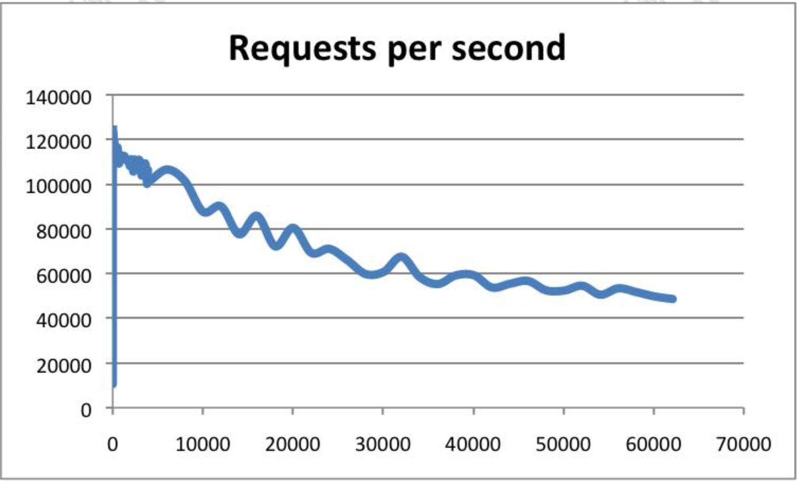
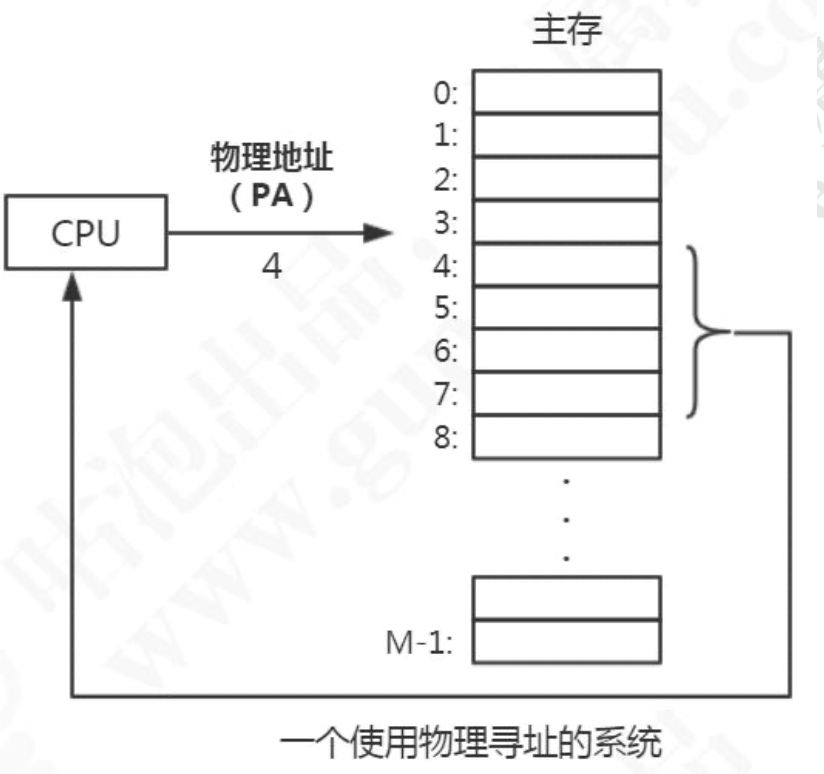
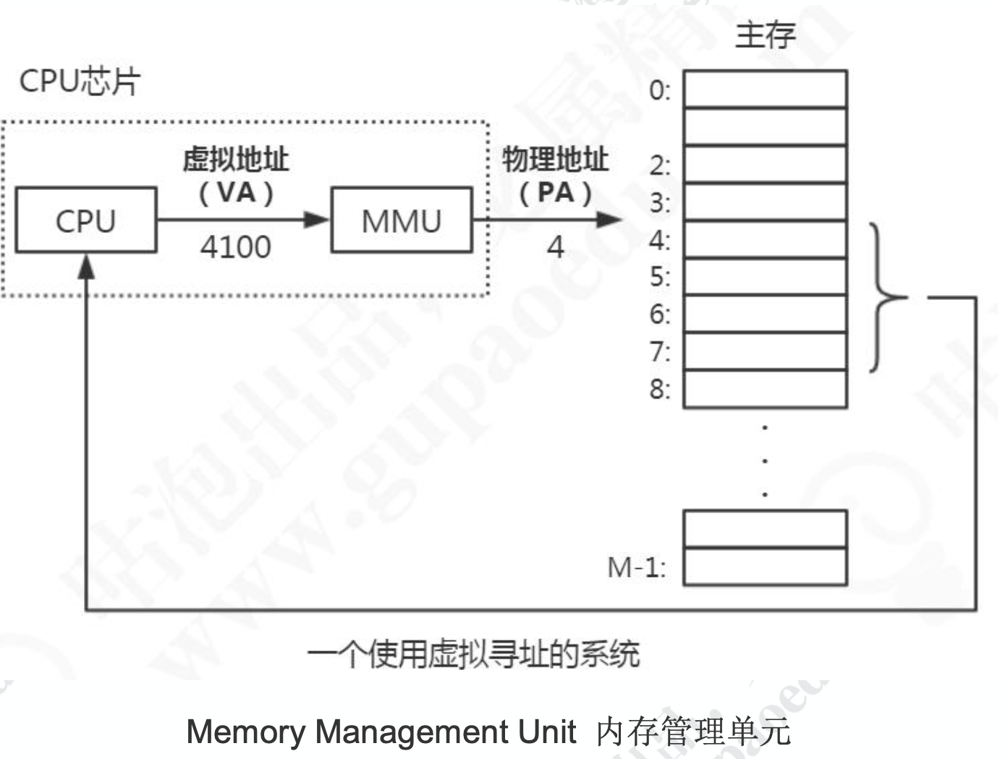
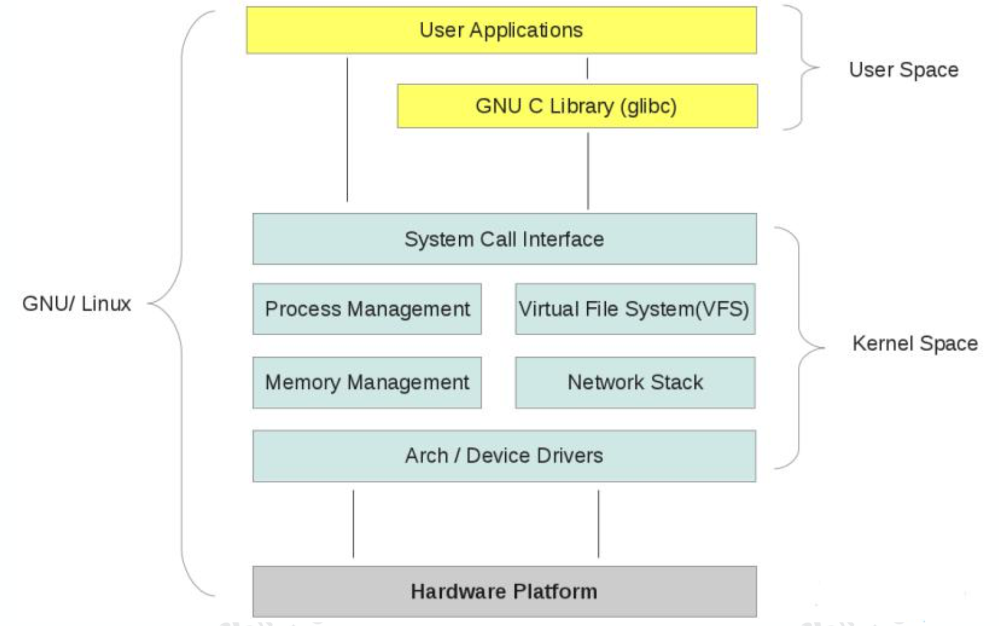
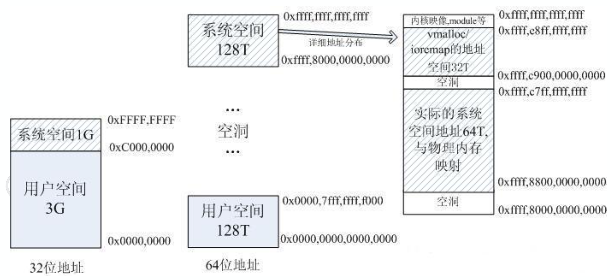
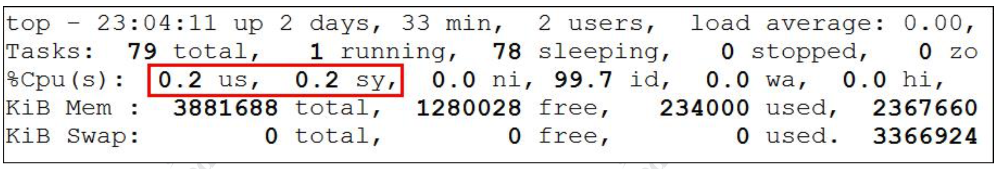
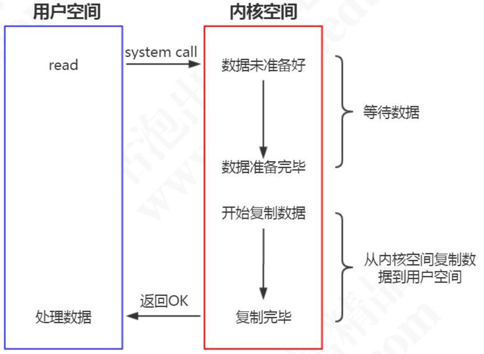
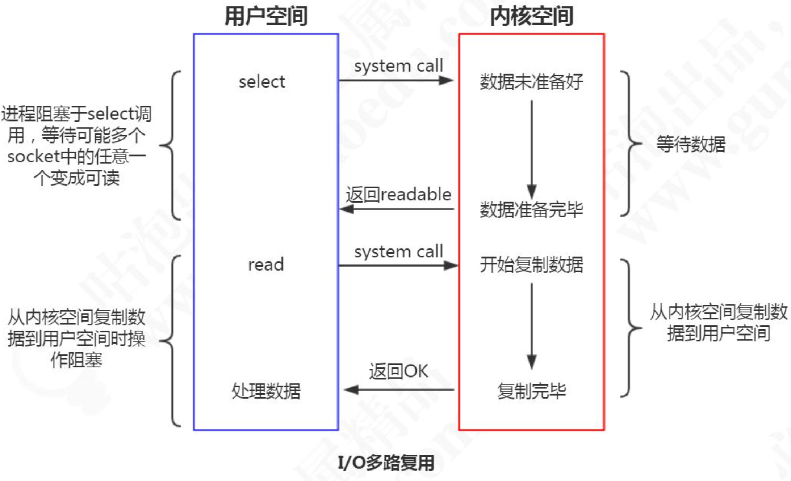
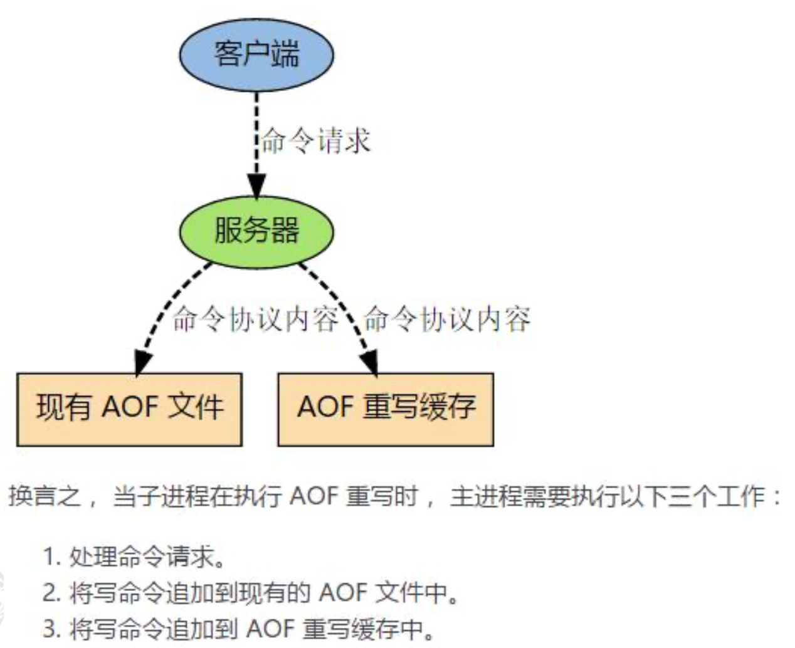

# Redis进阶

## 发布订阅模式

### 列表的局限

前面我们说通过队列的 rpush 和 lpop 可以实现消息队列(队尾进队头出)，但是消费者需要不停地调用lpop查看List中是否有等待处理的消息(比如写一个while循环)。 为了减少通信的消耗，可以sleep()一段时间再消费，但是会有两个问题:

1. 如果生产者生产消息的速度远大于消费者消费消息的速度，List会占用大量的内存。
2. 消息的实时性降低。

list 还提供了一个阻塞的命令:blpop，没有任何元素可以弹出的时候，连接会被阻塞。

```
blpop queue 5
```

基于list实现的消息队列，不支持一对多的消息分发。

### 发布订阅模式

除了通过 list 实现消息队列之外，Redis 还提供了一组命令实现发布/订阅模式。

这种方式，发送者和接收者没有直接关联(实现了解耦)，接收者也不需要持续尝试获取消息。

#### 订阅频道

首先，我们有很多的频道(channel)，我们也可以把这个频道理解成queue。订阅者可以订阅一个或者多个频道。消息的发布者(生产者)可以给指定的频道发布消息。 只要有消息到达了频道，所有订阅了这个频道的订阅者都会收到这条消息。

需要注意的注意是，发出去的消息不会被持久化，因为它已经从队列里面移除了， 所以消费者只能收到它开始订阅这个频道之后发布的消息。

下面我们来看一下发布订阅命令的使用方法。

订阅者订阅频道:可以一次订阅多个，比如这个客户端订阅了 3 个频道。

```
subscribe channel-1 channel-2 channel-3
```

发布者可以向指定频道发布消息(并不支持一次向多个频道发送消息):

```
publish channel-1 2673
```

#### 按规则(Pattern)订阅频道

支持?和`*`占位符。?代表一个字符，*代表0个或者多个字符。

消费端 1，关注运动信息:

```
psubscribe *sport
```

## Redis 事务

https://redis.io/topics/transactions/

http://redisdoc.com/topic/transaction.html

### 为什么要用事务

我们知道 Redis 的单个命令是原子性的(比如 get set mget mset)，如果涉及到多个命令的时候，需要把多个命令作为一个不可分割的处理序列，就需要用到事务。

例如我们之前说的用 setnx 实现分布式锁，我们先 set，然后设置对 key 设置 expire， 防止 del 发生异常的时候锁不会被释放，业务处理完了以后再 del，这三个动作我们就希望它们作为一组命令执行。

Redis 的事务有两个特点: 

1. 按进入队列的顺序执行。 
2. 不会受到其他客户端的请求的影响。

Redis 的事务涉及到四个命令:multi(开启事务)，exec(执行事务)，discard (取消事务)，watch(监视)

### 事务的用法

案例场景:tom 和 mic 各有 1000 元，tom 需要向 mic 转账 100 元。 tom 的账户余额减少 100 元，mic 的账户余额增加 100 元。

```
127.0.0.1:6379> set tom 1000 
OK
127.0.0.1:6379> set mic 1000 
OK
127.0.0.1:6379> multi
OK
127.0.0.1:6379> decrby tom 100 
QUEUED
127.0.0.1:6379> incrby mic 100 
QUEUED
127.0.0.1:6379> exec
1) (integer) 900
2) (integer) 1100
127.0.0.1:6379> get tom 
"900"
127.0.0.1:6379> get mic 
"1100"
```

通过 multi 的命令开启事务。事务不能嵌套，多个 multi 命令效果一样。

multi 执行后，客户端可以继续向服务器发送任意多条命令， 这些命令不会立即被 执行， 而是被放到一个队列中， 当 exec 命令被调用时， 所有队列中的命令才会被执行。

通过 exec 的命令执行事务。如果没有执行 exec，所有的命令都不会被执行。

如果中途不想执行事务了，怎么办?

可以调用 discard 可以清空事务队列，放弃执行。

```shell
multi 
set k1 1 
set k2 2 
set k3 3 
discard
```

### watch命令

在Redis中还提供了一个watch命令。

它可以为 Redis 事务提供 CAS 乐观锁行为(Check and Set / Compare and Swap)，也就是多个线程更新变量的时候，会跟原值做比较，只有它没有被其他线程修改的情况下，才更新成新的值。

我们可以用 watch 监视一个或者多个 key，如果开启事务之后，至少有一个被监视 key 键在 exec 执行之前被修改了， 那么整个事务都会被取消(key 提前过期除外)。可以用 unwatch 取消。

| Client 1                                                     | Client 2                                              |
| ------------------------------------------------------------ | ----------------------------------------------------- |
| 127.0.0.1:6379> set balance 1000 <br/>OK<br/>127.0.0.1:6379> watch balance <br/>OK<br/>127.0.0.1:6379> multi<br/>OK<br/>127.0.0.1:6379> incrby balance 100 <br/>QUEUED |                                                       |
|                                                              | 127.0.0.1:6379> decrby balance 100 <br/>(integer) 900 |
| 127.0.0.1:6379> exec<br/>(nil)<br/>127.0.0.1:6379> get balance <br/>"900" |                                                       |

### 事务可能遇到的问题

我们把事务执行遇到的问题分成两种，一种是在执行 exec 之前发生错误，一种是在 执行 exec 之后发生错误。

#### 在执行 exec 之前发生错误

比如:入队的命令存在语法错误，包括参数数量，参数名等等(编译器错误)。

在这种情况下事务会被拒绝执行，也就是队列中所有的命令都不会得到执行。

#### 在执行 exec 之后发生错误

比如，类型错误，比如对 String 使用了 Hash 的命令，这是一种运行时错误。

```shell
127.0.0.1:6379> flushall 
OK
127.0.0.1:6379> multi 
OK
127.0.0.1:6379> set k1 1 
QUEUED
127.0.0.1:6379> hset k1 a b 
QUEUED
127.0.0.1:6379> exec
1) OK
2) (error) WRONGTYPE Operation against a key holding the wrong kind of value 127.0.0.1:6379> get k1
"1"
```

最后我们发现 set k1 1 的命令是成功的，也就是在这种发生了运行时异常的情况下， 只有错误的命令没有被执行，但是其他命令没有受到影响。

这个显然不符合我们对原子性的定义，也就是我们**没办法用 Redis 的这种事务机制来实现原子性，保证数据的一致。**

## Lua脚本

Lua/ˈluə/是一种轻量级脚本语言，它是用 C 语言编写的，跟数据的存储过程有点类似。 使用 Lua 脚本来执行 Redis 命令的好处:

1. 一次发送多个命令，减少网络开销。
2. Redis会将整个脚本作为一个整体执行，不会被其他请求打断，保持原子性。
3. 对于复杂的组合命令，我们可以放在文件中，可以实现程序之间的命令集复用。

### 在Redis中调用Lua脚本

使用 eval方法，语法格式:

```
redis> eval lua-script key-num [key1 key2 key3 ....] [value1 value2 value3 ....]
```

- eval代表执行Lua语言的命令。
- lua-script代表Lua语言脚本内容。
- key-num表示参数中有多少个key，需要注意的是Redis中key是从1开始的，如果没有key的参数，那么写0。
- [key1 key2 key3...]是key作为参数传递给Lua语言，也可以不填，但是需要和key-num的个数对应起来。
- [value1 value2 value3 ....]这些参数传递给 Lua 语言，它们是可填可不填的。

示例，返回一个字符串，0 个参数:

```shell
redis> eval "return 'Hello World'" 0
```

### 在Lua脚本中调用Redis命令

使用 redis.call(command, key [param1, param2...])进行操作。语法格式:

```shell
redis> eval "redis.call('set',KEYS[1],ARGV[1])" 1 lua-key lua-value
```

- command是命令，包括set、get、del等。 
- key是被操作的键。

- param1,param2...代表给key的参数。

注意跟 Java 不一样，定义只有形参，调用只有实参。

Lua 是在调用时用 key 表示形参，argv 表示参数值(实参)。

#### 设置键值对

在 Redis 中调用 Lua 脚本执行 Redis 命令

```shell
redis> eval "return redis.call('set',KEYS[1],ARGV[1])" 1 wenbin9 6666 
redis> get wenbin9
```

以上命令等价于 set wenbin9 6666。

在 redis-cli 中直接写 Lua 脚本不够方便，也不能实现编辑和复用，通常我们会把脚本放在文件里面，然后执行这个文件。

#### 在 Redis 中调用 Lua 脚本文件

创建 Lua 脚本文件:

```shell
cd /usr/local/soft/redis5.0.5/src 
vim wenbin.lua
```

Lua 脚本内容，先设置，再取值:

```lua
redis.call('set','wenbin10','lua666') 
return redis.call('get','wenbin10')
```

在 Redis 客户端中调用 Lua 脚本

```shell
cd /usr/local/soft/redis5.0.5/src 
redis-cli --eval gupao.lua 0
```

#### 缓存 Lua 脚本

##### 为什么要缓存

在脚本比较长的情况下，如果每次调用脚本都需要把整个脚本传给 Redis 服务端， 会产生比较大的网络开销。为了解决这个问题，Redis 提供了 EVALSHA 命令，允许开发者通过脚本内容的 SHA1 摘要来执行脚本。

##### 如何缓存

Redis 在执行 script load 命令时会计算脚本的 SHA1 摘要并记录在脚本缓存中，执行 EVALSHA 命令时 Redis 会根据提供的摘要从脚本缓存中查找对应的脚本内容，如果找到了则执行脚本，否则会返回错误:"NOSCRIPT No matching script. Please use EVAL."

```
127.0.0.1:6379> script load "return 'Hello World'" "470877a599ac74fbfda41caa908de682c5fc7d4b"
127.0.0.1:6379> evalsha "470877a599ac74fbfda41caa908de682c5fc7d4b" 0 
"Hello World"
```

#### 脚本超时

Redis 的指令执行本身是单线程的，这个线程还要执行客户端的 Lua 脚本，如果 Lua 脚本执行超时或者陷入了死循环，是不是没有办法为客户端提供服务了呢?

```
eval 'while(true) do end' 0
```

为了防止某个脚本执行时间过长导致 Redis 无法提供服务，Redis 提供了 lua-time-limit 参数限制脚本的最长运行时间，默认为 5 秒钟。

lua-time-limit 5000(redis.conf 配置文件中)

当脚本运行时间超过这一限制后，Redis 将开始接受其他命令但不会执行(以确保脚 本的原子性，因为此时脚本并没有被终止)，而是会返回“BUSY”错误。

Redis 提供了一个 script kill 的命令来中止脚本的执行。新开一个客户端:

```
script kill
```

如果当前执行的 Lua 脚本对 Redis 的数据进行了修改(SET、DEL 等)，那么通过 script kill 命令是不能终止脚本运行的。

因为要保证脚本运行的原子性，如果脚本执行了一部分终止，那就违背了脚本原子 性的要求。最终要保证脚本要么都执行，要么都不执行。

```
127.0.0.1:6379> script kill
(error) UNKILLABLE Sorry the script already executed write commands against the dataset. You can either wait the script termination or kill the server in a hard way using the SHUTDOWN NOSAVE command.
```

遇到这种情况，只能通过 shutdown nosave 命令来强行终止 redis。

shutdown nosave 和 shutdown 的区别在于 shutdown nosave 不会进行持久化操作，意味着发生在上一次快照后的数据库修改都会丢失。

## Redis 为什么这么快?

### Redis到底有多快?

https://redis.io/topics/benchmarks

```shell
[root@bogon src]# pwd
/usr/local/soft/redis-5.0.5/src
[root@bogon src]# ./redis-benchmark -t set,lpush -n 100000 -q	
```

结果(本地虚拟机):

SET: 87260.03 requests per second				—— 每秒钟处理8万多次 set 请求

LPUSH: 89525.52 requests per second			—— 每秒钟处理8万多次 lpush 请求

```
[root@bogon src]# ./redis-benchmark -n 100000 -q script load "redis.call('set','foo','bar')"
script load redis.call('set','foo','bar'): 90991.81 requests per second
```

结果(本地虚拟机):

script load redis.call('set','foo','bar'): 90991.81 requests per second   —— 每秒钟 9万次 lua 脚本调用



根据官方的数据，Redis 的 QPS 可以达到 10 万左右(每秒请求数)。

### Redis为什么这么快?

总结:1)纯内存结构、2)单线程、3)多路复用

#### 内存

KV 结构的内存数据库，时间复杂度 O(1)。

==第二个，要实现这么高的并发性能，是不是要创建非常多的线程?恰恰相反，Redis 是单线程的。==

#### 单线程

单线程有什么好处呢?

1. 没有创建线程、销毁线程带来的消耗
2. 避免了上线文切换导致的 CPU 消耗
3. 避免了线程之间带来的竞争问题，例如加锁释放锁死锁等等

#### 异步非阻塞

异步非阻塞 I/O，多路复用处理并发连接。

### Redis为什么是单线程的?

不是白白浪费了 CPU 的资源吗?

https://redis.io/topics/faq#redis-is-single-threaded-how-can-i-exploit-multiple-cpu--cores

因为单线程已经够用了，CPU 不是 redis 的瓶颈。Redis 的瓶颈最有可能是机器内存或者网络带宽。既然单线程容易实现，而且 CPU 不会成为瓶颈，那就顺理成章地采用单线程的方案了。

### 单线程为什么这么快?

因为 Redis 是基于内存的操作，我们先从内存开始说起。

#### 虚拟存储器(虚拟内存 Vitual Memory)

名词解释:主存:内存;辅存:磁盘(硬盘)

计算机主存(内存)可看作一个由M个连续的字节大小的单元组成的数组，每个字节有一个唯一的地址，这个地址叫做物理地址(PA)。早期的计算机中，如果CPU需要内存，使用物理寻址，直接访问主存储器。



这种方式有几个弊端:

1. 在多用户多任务操作系统中，所有的进程共享主存，如果每个进程都独占一块物理地址空间，主存很快就会被用完。我们**希望在不同的时刻，不同的进程可以共用同一块物理地址空间。**
2. 如果所有进程都是直接访问物理内存，那么一个进程就可以修改其他进程的内存数据，导致物理地址空间被破坏，程序运行就会出现异常。

为了解决这些问题，我们就想了一个办法，在 CPU 和主存之间增加一个中间层。CPU 不再使用物理地址访问，而是访问一个虚拟地址，由这个中间层把地址转换成物理地址， 最终获得数据。这个中间层就叫做虚拟存储器(Virtual Memory)。

具体的操作如下所示:



在每一个进程开始创建的时候，都会分配一段虚拟地址，然后通过虚拟地址和物理地址的映射来获取真实数据，这样进程就不会直接接触到物理地址，甚至不知道自己调用的哪块物理地址的数据。

目前，大多数操作系统都使用了虚拟内存，如Windows系统的虚拟内存、**Linux 系统的交换空间**等等。Windows的虚拟内存(pagefile.sys)是磁盘空间的一部分。

**在 32 位的系统上，虚拟地址空间大小是 2^32bit=4G。**在 64 位系统上，最大虚拟地址空间大小是多少?是不是 2^64bit=1024*1014TB=1024PB=16EB?实际上没有用到 64 位，因为用不到这么大的空间，而且会造成很大的系统开销。**Linux 一般用低 48 位来表示虚拟地址空间，也就是 2^48bit=256T。**

```
cat /proc/cpuinfo
```

address sizes : 40 bits physical, 48 bits virtual

实际的物理内存可能远远小于虚拟内存的大小。

**总结**:引入虚拟内存，可以提供更大的地址空间，并且地址空间是连续的，使得程序编写、链接更加简单。并且可以对物理内存进行隔离，不同的进程操作互不影响。还可以通过把同一块物理内存映射到不同的虚拟地址空间实现内存共享。

#### 用户空间和内核空间

为了避免用户进程直接操作内核，保证内核安全，操作系统将虚拟内存划分为两部分，一部分是内核空间(Kernel-space)，一部分是用户空间(User-space)。



内核是操作系统的核心，独立于普通的应用程序，可以访问受保护的内存空间，也 有访问底层硬件设备的权限。

内核空间中存放的是内核代码和数据，而进程的用户空间中存放的是用户程序的代码和数据。不管是内核空间还是用户空间，它们都处于虚拟空间中，都是对物理地址的映射。

在 Linux 系统中, 内核进程和用户进程所占的虚拟内存比例是 1:3。



当进程运行在内核空间时就处于内核态，而进程运行在用户空间时则处于用户态。

进程在内核空间以执行任意命令，调用系统的一切资源;在用户空间只能执行简单的运算，不能直接调用系统资源，必须通过系统接口(又称 system call)，才能向内核发出指令。

top 命令:



us 代表 CPU 消耗在 User space 的时间百分比; sy 代表 CPU 消耗在 Kernel space 的时间百分比。

#### 进程切换(上下文切换)

多任务操作系统是怎么实现运行远大于 CPU 数量的任务个数的?当然，这些任务实际上并不是真的在同时运行，而是因为系统通过时间片分片算法，在很短的时间内，将 CPU 轮流分配给它们，造成多任务同时运行的错觉。

为了控制进程的执行，内核必须有能力挂起正在 CPU 上运行的进程，并恢复以前挂起的某个进程的执行。这种行为被称为进程切换。

什么叫上下文?

在每个任务运行前，CPU 都需要知道任务从哪里加载、又从哪里开始运行，也就是说，需要系统事先帮它设置好 CPU 寄存器和程序计数器(ProgramCounter)，这个叫做 CPU 的上下文。

而这些保存下来的上下文，会存储在系统内核中，并在任务重新调度执行时再次加载进来。这样就能保证任务原来的状态不受影响，让任务看起来还是连续运行。

在切换上下文的时候，需要完成一系列的工作，这是一个很消耗资源的操作。

#### 进程的阻塞

正在运行的进程由于提出系统服务请求(如 I/O 操作)，但因为某种原因未得到操作系统的立即响应，该进程只能把自己变成阻塞状态，等待相应的事件出现后才被唤醒。 进程在阻塞状态不占用 CPU 资源。

#### 文件描述符 FD

Linux 系统将所有设备都当作文件来处理，而 Linux 用文件描述符来标识每个文件对象。

文件描述符(File Descriptor)是内核为了高效管理已被打开的文件所创建的索引， 用于指向被打开的文件，所有执行 I/O 操作的系统调用都通过文件描述符;文件描述符是一个简单的非负整数，用以表明每个被进程打开的文件。

Linux 系统里面有三个标准文件描述符。

0:标准输入(键盘);1:标准输出(显示器);2:标准错误输出(显示器)。

#### 传统 I/O 数据拷贝

以读操作为例:

当应用程序执行 read 系统调用读取文件描述符(FD)的时候，如果这块数据已经存在于用户进程的页内存中，就直接从内存中读取数据。如果数据不存在，则先将数据从磁盘加载数据到内核缓冲区中，再从内核缓冲区拷贝到用户进程的页内存中。(两次拷贝，两次 user 和 kernel 的上下文切换)。



I/O 的阻塞到底阻塞在哪里?

#### Blocking I/O

当使用 read 或 write 对某个**文件描述符**进行过读写时，如果当前 FD 不可读，系统就不会对其他的操作做出响应。从设备复制数据到内核缓冲区是阻塞的，从内核缓冲区拷贝到用户空间，也是阻塞的，直到 copy complete，内核返回结果，用户进程才解除 block 的状态。


为了解决阻塞的问题，我们有几个思路。

1. 在服务端创建多个线程或者使用线程池，但是在高并发的情况下需要的线程会很多，系统无法承受，而且创建和释放线程都需要消耗资源。
2. 由请求方定期轮询，在数据准备完毕后再从内核缓存缓冲区复制数据到用户空间 (非阻塞式 I/O)，这种方式会存在一定的延迟。

#### I/O 多路复用(I/O Multiplexing)

I/O 指的是网络 I/O。

多路指的是多个 TCP 连接(Socket 或 Channel)。

复用指的是复用一个或多个线程。

它的基本原理就是不再由应用程序自己监视连接，而是由内核替应用程序监视文件描述符。

客户端在操作的时候，会产生具有不同事件类型的 socket。在服务端，I/O 多路复用程序(I/O Multiplexing Module)会把消息放入队列中，然后通过文件事件分派器(File event Dispatcher)，转发到不同的事件处理器中。


多路复用有很多的实现，以 select 为例，当用户进程调用了多路复用器，进程会被阻塞。内核会监视多路复用器负责的所有 socket，当任何一个 socket 的数据准备好了， 多路复用器就会返回。这时候用户进程再调用 read 操作，把数据从内核缓冲区拷贝到用户空间。



所以，I/O 多路复用的特点是通过一种机制一个进程能同时等待多个文件描述符， 而这些文件描述符(套接字描述符)其中的任意一个进入读就绪(readable)状态，select() 函数就可以返回。

Redis 的多路复用， 提供了 select, epoll, evport, kqueue 几种选择，在编译的时 候来选择一种。源码 ae.c


evport 是 Solaris 系统内核提供支持的;

epoll 是 LINUX 系统内核提供支持的;

kqueue 是 Mac 系统提供支持的;

select 是 POSIX 提供的，一般的操作系统都有支撑(保底方案); 源码 ae_epoll.c、ae_select.c、ae_kqueue.c、ae_evport.c

## 内存回收

Reids 所有的数据都是存储在内存中的，在某些情况下需要对占用的内存空间进行回收。内存回收主要分为两类，**一类是 key 过期，一类是内存使用达到上限(max_memory) 触发内存淘汰。**

### 过期策略

要实现 key 过期，我们有几种思路。

#### 定时过期(主动淘汰)

每个设置过期时间的 key 都需要创建一个定时器，到过期时间就会立即清除。该策略可以立即清除过期的数据，对内存很友好;但是会占用大量的 CPU 资源去处理过期的数据，从而影响缓存的响应时间和吞吐量。

#### 惰性过期(被动淘汰)

只有当访问一个 key 时，才会判断该 key 是否已过期，过期则清除。该策略可以最大化地节省 CPU 资源，却对内存非常不友好。极端情况可能出现大量的过期 key 没有再次被访问，从而不会被清除，占用大量内存。

例如 String，在 getCommand 里面会调用 expireIfNeeded

```
server.c expireIfNeeded(redisDb *db, robj *key)
```

第二种情况，每次写入 key 时，发现内存不够，调用 activeExpireCycle 释放一部分 内存。

```
expire.c activeExpireCycle(int type)
```

#### 定期过期

每隔一定的时间，会扫描一定数量的数据库的 expires 字典中一定数量的 key，并清除其中已过期的 key。该策略是前两者的一个折中方案。通过调整定时扫描的时间间隔和每次扫描的限定耗时，可以在不同情况下使得 CPU 和内存资源达到最优的平衡效果。

**Redis 中同时使用了惰性过期和定期过期两种过期策略。**

### 淘汰策略

Redis 的内存淘汰策略，是指当内存使用达到最大内存极限时，需要使用淘汰算法来决定清理掉哪些数据，以保证新数据的存入。

#### 最大内存设置

redis.conf 参数配置:

```
# maxmemory <bytes>
```

如果不设置 maxmemory 或者设置为 0，64 位系统不限制内存，32 位系统最多使 用 3GB 内存。

动态修改:

```
redis> config set maxmemory 2GB
```

#### 淘汰策略

https://redis.io/topics/lru-cache

redis.conf

```
# maxmemory-policy noeviction
```

```
# volatile-lru -> Evict using approximated LRU among the keys with an expire set. 
# allkeys-lru -> Evict any key using approximated LRU.
# volatile-lfu -> Evict using approximated LFU among the keys with an expire set. 
# allkeys-lfu -> Evict any key using approximated LFU.
# volatile-random -> Remove a random key among the ones with an expire set. 
# allkeys-random -> Remove a random key, any key.
# volatile-ttl -> Remove the key with the nearest expire time (minor TTL)
# noeviction -> Don't evict anything, just return an error on write operations.
```

先从算法来看:

LRU，Least Recently Used:最近最少使用。判断最近被使用的时间，目前最远的数据优先被淘汰。

LFU，Least Frequently Used，最不常用，4.0 版本新增。

random，随机删除。

| 策略            | 含义                                                         |
| --------------- | ------------------------------------------------------------ |
| volatile-lru    | 根据 LRU 算法删除设置了超时属性(expire)的键，直到腾出足够内存为止。如果没有可删除的键对象，回退到 noeviction 策略。 |
| allkeys-lru     | 根据 LRU 算法删除键，不管数据有没有设置超时属性，直到腾出足够内存为止。 |
| volatile-lfu    | 在带有过期时间的键中选择最不常用的。                         |
| allkeys-lfu     | 在所有的键中选择最不常用的，不管数据有没有设置超时属性。     |
| volatile-random | 在带有过期时间的键中随机选择。                               |
| allkeys-random  | 随机删除所有键，直到腾出足够内存为止。                       |
| volatile-ttl    | 根据键值对象的 ttl 属性，删除最近将要过期数据。如果没有，回退到 noeviction 策略。 |
| noeviction      | 默认策略，不会删除任何数据，拒绝所有写入操作并返回客户端错误信息(error)OOM command not allowed when used memory，此时 Redis 只响应读操作。 |

**如果没有符合前提条件的 key 被淘汰，那么 volatile-lru、volatile-random 、 volatile-ttl 相当于 noeviction(不做内存回收)。**

动态修改淘汰策略:

```
redis> config set maxmemory-policy volatile-lru
```

建议使用 volatile-lru，在保证正常服务的情况下，优先删除最近最少使用的 key。

#### LRU 淘汰原理

需要额外的数据结构存储，消耗内存。

Redis LRU 对传统的 LRU 算法进行了改良，通过随机采样来调整算法的精度。

如果淘汰策略是 LRU，则根据配置的采样值 maxmemory_samples(默认是 5 个),随机从数据库中选择 m 个 key, 淘汰其中热度最低的 key 对应的缓存数据。所以采样参数m配置的数值越大, 就越能精确的查找到待淘汰的缓存数据,但是也消耗更多的CPU计算,执行效率降低。

##### 如何找出热度最低的数据?

Redis 中所有对象结构都有一个 lru 字段, 且使用了 unsigned 的低 24 位，这个字段用来记录对象的热度。对象被创建时会记录 lru 值。在被访问的时候也会更新 lru 的值。 但是不是获取系统当前的时间戳，而是设置为全局变量 server.lruclock 的值。

server.lruclock 的值怎么来的?

Redis 中有个定时处理的函数 serverCron，默认每 100 毫秒调用函数 updateCachedTime 更新一次全局变量的 server.lruclock 的值，它记录的是当前 unix 时间戳。

为什么不获取精确的时间而是放在全局变量中?不会有延迟的问题吗?

这样函数 lookupKey 中更新数据的 lru 热度值时,就不用每次调用系统函数 time，可以提高执行效率。

当对象里面已经有了 LRU 字段的值，就可以评估对象的热度了。

函数 estimateObjectIdleTime 评估指定对象的 lru 热度，思想就是对象的 lru 值和全局的 server.lruclock 的差值越大(越久没有得到更新)， 该对象热度越低。

## 持久化机制

https://redis.io/topics/persistence

Redis 速度快，很大一部分原因是因为它所有的数据都存储在内存中。如果断电或者宕机，都会导致内存中的数据丢失。为了实现重启后数据不丢失，**Redis 提供了两种持久化的方案，一种是 RDB 快照(Redis DataBase)，一种是 AOF(Append Only File)。**

### RDB

RDB 是 Redis 默认的持久化方案。当满足一定条件的时候，会把当前内存中的数据写入磁盘，生成一个快照文件 dump.rdb。Redis 重启会通过加载 dump.rdb 文件恢复数据。

#### RDB 触发

1. 配置规则触发。

   redis.conf， SNAPSHOTTING，其中定义了触发把数据保存到磁盘的触发频率。 如果不需要 RDB 方案，注释 save 或者配置成空字符串""。

   ```shell
   save 900 1 # 900 秒内至少有一个 key 被修改(包括添加) 
   save 300 10 # 400 秒内至少有 10 个 key 被修改
   save 60 10000 # 60 秒内至少有 10000 个 key 被修改
   ```

   注意上面的配置是不冲突的，只要满足任意一个都会触发。

   RDB 文件位置和目录:

   ```
   # 文件路径，
   dir ./
   # 文件名称
   dbfilename dump.rdb
   # 是否是LZF压缩rdb文件 
   rdbcompression yes
   # 开启数据校验 rdbchecksum yes
   ```

   | 参数           | 说明                                                         |
   | -------------- | ------------------------------------------------------------ |
   | dir            | rdb文件默认在启动目录下（相对路径）                          |
   | dbfilename     | 文件名称                                                     |
   | rdbcompression | 开启压缩可以节省存储空间，但是会消耗一些 CPU 的计算时间，默认开启 |
   | rdbchecksum    | 使用 CRC64 算法来进行数据校验，但是这样做会增加大约 10%的性能消耗，如果希望获取到最 大的性能提升，可以关闭此功能。 |

   **为什么停止 Redis 服务的时候没有 save，重启数据还在?**

   RDB 还有两种触发方式:


   
   

2. shutdown 触发，保证服务器正常关闭。

3. flushall，RDB 文件是空的，没什么意义(删掉 dump.rdb 演示一下)。

#### **手动触发**

如果我们需要重启服务或者迁移数据，这个时候就需要手动触 RDB 快照保存。Redis 提供了两条命令:

1. save

   save 在生成快照的时候会阻塞当前 Redis 服务器， Redis 不能处理其他命令。如果内存中的数据比较多，会造成 Redis 长时间的阻塞。生产环境不建议使用这个命令。

2. bgsave

   执行 bgsave 时，Redis 会在后台异步进行快照操作，快照同时还可以响应客户端请求。

   具体操作是 Redis 进程执行 fork 操作创建子进程(copy-on-write)，RDB 持久化过程由子进程负责，完成后自动结束。它不会记录 fork 之后后续的命令。阻塞只发生在 fork 阶段，一般时间很短。

   用 lastsave 命令可以查看最近一次成功生成快照的时间。

   

#### RDB 数据的恢复

##### 添加键值

```shell
redis> set k1 1 
redis> set k2 2 
redis> set k3 3 
redis> set k4 4 
redis> set k5 5
```

##### 停服务器，触发 save

```shell
redis> shutdown
```

##### 备份 dump.rdb 文件

```shell
cp dump.rdb dump.rdb.bak
```

##### 启动服务器

```
/usr/local/soft/redis-5.0.5/src/redis-server /usr/local/soft/redis-5.0.5/redis.conf
```

##### 数据都在

```shell
redis> keys *
```

#### RDB 文件的优势和劣势

##### 优势

1. RDB 是一个非常紧凑(compact)的文件，它保存了 redis 在某个时间点上的数据集。这种文件非常适合用于进行备份和灾难恢复。
2. 生成 RDB 文件的时候，redis 主进程会 fork()一个子进程来处理所有保存工作，主进程不需要进行任何磁盘 IO 操作。
3. RDB 在恢复大数据集时的速度比 AOF 的恢复速度要快。

##### 劣势

1. RDB 方式数据没办法做到实时持久化/秒级持久化。因为 bgsave 每次运行都要执行 fork 操作创建子进程，频繁执行成本过高。 
2. 在一定间隔时间做一次备份，所以如果 redis 意外 down 掉的话，就会丢失最后

一次快照之后的所有修改(数据有丢失)。 如果数据相对来说比较重要，希望将损失降到最小，则可以使用 AOF 方式进行持久化。

### AOF

Append Only File

AOF:Redis 默认不开启。AOF 采用日志的形式来记录每个写操作，并**追加**到文件中。开启后，执行更改 Redis 数据的命令时，就会把命令写入到 AOF 文件中。

Redis 重启时会根据日志文件的内容把写指令从前到后执行一次以完成数据的恢复工作。

#### AOF 配置

配置文件 redis.conf

```shell
# 开关
appendonly no
# 文件名
appendfilename "appendonly.aof"
```

| 参数                            | 说明                                                 |
| ------------------------------- | ---------------------------------------------------- |
| appendonly                      | Redis 默认只开启 RDB 持久化，开启 AOF 需要修改为 yes |
| appendfilename "appendonly.aof" | 路径也是通过 dir 参数配置 config get dir             |

##### 数据都是实时持久化到磁盘吗?

由于操作系统的缓存机制，AOF 数据并没有真正地写入硬盘，而是进入了系统的硬盘缓存。什么时候把缓冲区的内容写入到 AOF 文件?

| 参数                 | 说明                                                         |
| -------------------- | ------------------------------------------------------------ |
| appendfsync everysec | AOF 持久化策略(硬盘缓存到磁盘)，默认 everysec<br/>1，no表示不执行fsync，由操作系统保证数据同步到磁盘，速度最快，但是不太安全; <br/>2，always表示每次写入都执行fsync，以保证数据同步到磁盘，效率很低;<br/>3，everysec 表示每秒执行一次 fsync，可能会导致丢失这 1s 数据。通常选择 everysec，兼顾安全性和效率。 |

##### 文件越来越大，怎么办?

由于 AOF 持久化是 Redis 不断将写命令记录到 AOF 文件中，随着 Redis 不断的进 行，AOF 的文件会越来越大，文件越大，占用服务器内存越大以及 AOF 恢复要求时间 越长。

例如 set wenbin 666，执行 1000 次，结果都是 wenbin=666。

为了解决这个问题，Redis 新增了重写机制，当 AOF 文件的大小超过所设定的阈值时，Redis 就会启动 AOF 文件的内容压缩，只保留可以恢复数据的最小指令集。

**可以使用命令 bgrewriteaof 来重写。**

AOF 文件重写并不是对原文件进行重新整理，而是直接读取服务器现有的键值对， 然后用一条命令去代替之前记录这个键值对的多条命令，生成一个新的文件后去替换原来的 AOF 文件。

```shell
# 重写触发机制 
auto-aof-rewrite-percentage 100 
auto-aof-rewrite-min-size 64mb
```

| 参数                         | 说明                                                         |
| ---------------------------- | ------------------------------------------------------------ |
| auto-aof-rewrite-percentag e | 默认值为 100。aof 自动重写配置，当目前 aof 文件大小超过上一次重写的 aof 文件大小的百分之多少进行重写，即当 aof 文件增长到一定大小的时候，Redis 能够调用 bgrewriteaof 对日志文件进行重写。当前 AOF 文件大小是上次日志重写得到 AOF 文件大小的二倍(设置为 100)时，自动启动新的日志重写过程。 |
| auto-aof-rewrite-min-size    | 默认 64M。设置允许重写的最小 aof 文件大小，避免了达到约定百分比但尺寸仍然很小的情况还要重写。 |

##### 重写过程中，AOF 文件被更改了怎么办?



另外有两个与 AOF 相关的参数:

| 参数                      | 说明                                                         |
| ------------------------- | ------------------------------------------------------------ |
| no-appendfsync-on-rewrite | 在 aof 重写或者写入 rdb 文件的时候，会执行大量 IO，此时对于 everysec 和 always 的 aof 模式来说，执行 fsync 会造成阻塞过长时间，no-appendfsync-on-rewrite 字段设置为默认设置为 no。如果对延迟要求很高的应用，这个字段可以设置为 yes，否则还是设置为 no，这样对持久化特性来说这是更安全的选择。设置为 yes 表示 rewrite 期间对新写操作不 fsync, 暂时存在内存中,等 rewrite 完成后再写入，默认为 no，建议修改为 yes。Linux 的默认 fsync 策略是 30 秒。可能丢失 30 秒数据。 |
| aof-load-truncated        | aof 文件可能在尾部是不完整的，当 redis 启动的时候，aof 文件的数据被载入内存。重启 可能发生在 redis 所在的主机操作系统宕机后，尤其在 ext4 文件系统没有加上 data=ordered 选项，出现这种现象。redis 宕机或者异常终止不会造成尾部不完整现象，可以选择让 redis 退出，或者导入尽可能多的数据。如果选择的是 yes，当截断的 aof 文件被导入的时候， 会自动发布一个 log 给客户端然后 load。如果是 no，用户必须手动 redis-check-aof 修复 AOF 文件才可以。默认值为 yes。 |

#### AOF 数据恢复

重启 Redis 之后就会进行 AOF 文件的恢复。

#### AOF 优势与劣势

##### 优点

AOF 持久化的方法提供了多种的同步频率，即使使用默认的同步频率每秒同步一次，Redis 最多也就丢失 1 秒的数据而已。

##### 缺点

1. 对于具有相同数据的的 Redis，AOF 文件通常会比 RDF 文件体积更大(RDB 存的是数据快照)。
2. 虽然 AOF 提供了多种同步的频率，默认情况下，每秒同步一次的频率也具有较高的性能。在高并发的情况下，RDB 比 AOF 具好更好的性能保证。

### 两种方案比较

那么对于 AOF 和 RDB 两种持久化方式，我们应该如何选择呢?

如果可以忍受一小段时间内数据的丢失，毫无疑问使用 RDB 是最好的，定时生成 RDB 快照(snapshot)非常便于进行数据库备份， 并且 RDB 恢复数据集的速度也要比 AOF 恢复的速度要快。

否则就使用 AOF 重写。但是一般情况下建议不要单独使用某一种持久化机制，而是应该两种一起用，在这种情况下,当 redis 重启的时候会优先载入 AOF 文件来恢复原始的数据，因为在通常情况下 AOF 文件保存的数据集要比 RDB 文件保存的数据集要完整。