# Redis集群

## 为什么需要Redis集群

### 性能

Redis 本身的 QPS 已经很高了，但是如果在一些并发量非常高的情况下，性能还是会受到影响。这个时候我们希望有更多的 Redis 服务来完成工作。

### 扩展

第二个是出于存储的考虑。因为Redis所有的数据都放在内存中，如果数据量大，很容易受到硬件的限制。升级硬件收效和成本比太低，所以我们需要有一种横向扩展的方法。

### 可用性

第三个是可用性和安全的问题。如果只有一个 Redis 服务，一旦服务宕机，那么所有的客户端都无法访问，会对业务造成很大的影响。另一个，如果硬件发生故障，而单机的数据无法恢复的话，带来的影响也是灾难性的。


可用性、数据安全、性能都可以通过搭建多个 Reids 服务实现。其中有一个是主节 点(master)，可以有多个从节点(slave)。主从之间通过数据同步，存储完全相同的数 据。如果主节点发生故障，则把某个从节点改成主节点，访问新的主节点。

## Redis主从复制(replication)

### 主从复制配置

例如一主多从,203 是主节点，在每个 slave 节点的 redis.conf 配置文件增加一行

```
slaveof 192.168.8.203 6379
```

// 在主从切换的时候，这个配置会被重写成:

```
# Generated by CONFIG REWRITE
replicaof 192.168.8.203 6379
```

或在客户端直接执行 slaveof xx xx，使该 Redis 实例成为从节点。

启动后，查看集群状态:

```
redis> info replication
```

从节点不能写入数据(只读)，只能从 master 节点同步数据。

主节点写入后，slave 会自动从 master 同步数据。

断开复制:

```
redis> slaveof no one
```

此时从节点会变成自己的主节点，不再复制数据。

### 主从复制原理

#### 连接阶段

1. slave node 启动时(执行 slaveof 命令)，会在自己本地保存 master node 的 信息，包括 master node 的 host 和 ip。
2. slave node 内部有个定时任务 replicationCron(源码 replication.c)，每隔 1 秒钟检查是否有新的 master node 要连接和复制，如果发现，就跟 master node 建立 socket 网络连接，如果连接成功，从节点为该 socket 建立一个专门处理复制工作的文件 事件处理器，负责后续的复制工作，如接收 RDB 文件、接收命令传播等。

当从节点变成了主节点的一个客户端之后，会给主节点发送 ping 请求。

#### 数据同步阶段

master node第一次执行全量复制，通过 bgsave 命令在本地生成一份 RDB 快照，将 RDB 快照文件发给slave node(如果超时会重连，可以调大 repl-timeout 的值)。 slave node 首先清除自己的旧数据，然后用 RDB 文件加载数据。

**问题:生成 RDB 期间，master 接收到的命令怎么处理?**

开始生成 RDB 文件时，master 会把所有新的写命令缓存在内存中。在 slave node保存了 RDB 之后，再将新的写命令复制给 slave node。

#### 命令传播阶段

master node 持续将写命令，异步复制给 slave node。

延迟是不可避免的，只能通过优化网络。

```
repl-disable-tcp-nodelay no
```

当设置为 yes 时，TCP 会对包进行合并从而减少带宽，但是发送的频率会降低，从节点数据延迟增加，一致性变差;具体发送频率与 Linux 内核的配置有关，默认配置为 40ms。当设置为 no 时，TCP 会立马将主节点的数据发送给从节点，带宽增加但延迟变小。

一般来说，只有当应用对 Redis 数据不一致的容忍度较高，且主从节点之间网络状况不好时，才会设置为 yes;多数情况使用默认值 no。


==问题:如果从节点有一段时间断开了与主节点的连接是不是要重新全量复制一遍? 如果可以增量复制，怎么知道上次复制到哪里?==

通过 master_repl_offset 记录的偏移量

```
redis> info replication
```

### 主从复制的不足

主从模式解决了数据备份和性能(通过读写分离)的问题，但是还是存在一些不足:

1. RDB 文件过大的情况下，同步非常耗时。
2. 在一主一从或者一主多从的情况下，如果主服务器挂了，对外提供的服务就不可用了，单点问题没有得到解决。如果每次都是手动把之前的从服务器切换成主服务器， 这个比较费时费力，还会造成一定时间的服务不可用。

## 可用性保证之Sentinel

### Sentinel原理

如何实现主从的自动切换?

Redis 的 Sentinel 就是通过运行监控服务器来保证服务的可用性。

[官网链接](https://redis.io/topics/sentinel)

从 Redis2.8 版本起，提供了一个稳定版本的 Sentinel(哨兵)，用来解决高可用的问题。它是一个特殊状态的 redis 实例。

我们会启动一个或者多个 Sentinel 的服务(通过 src/redis-sentinel)，它本质上只是一个运行在特殊模式之下的 Redis，Sentinel 通过 info 命令得到被监听 Redis 机器的 master，slave 等信息。

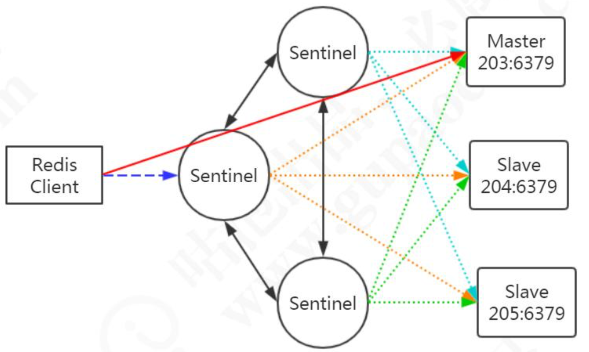

为了保证监控服务器的可用性，我们会对 Sentinel 做集群的部署。Sentinel 既监控所有的 Redis 服务，Sentinel 之间也相互监控。

注意:Sentinel 本身没有主从之分，只有 Redis 服务节点有主从之分。

概念梳理:master，slave(redis group)，sentinel，sentinel 集合

#### 服务下线

Sentinel 默认以每秒钟 1 次的频率向 Redis 服务节点发送 PING 命令。如果在 down-after-milliseconds 内都没有收到有效回复，Sentinel 会将该服务器标记为下线 (==主观下线==)。

```shell
# sentinel.conf
sentinel down-after-milliseconds <master-name> <milliseconds>
```

这个时候 Sentinel 节点会继续询问其他的 Sentinel 节点，确认这个节点是否下线， 如果多数 Sentinel 节点都认为 master 下线，master 才真正确认被下线(==客观下线==)， 这个时候就需要重新选举 master。

#### 故障转移

如果 master 被标记为下线，就会开始故障转移流程。

既然有这么多的 Sentinel 节点，由谁来做故障转移的事情呢?

故障转移流程的第一步就是在 Sentinel 集群选择一个 Leader，由 Leader 完成故障转移流程。==Sentinle 通过 Raft 算法，实现 Sentinel 选举。==

##### Ratf 算法

在分布式存储系统中，通常通过维护多个副本来提高系统的可用性，那么多个节点之间必须要面对数据一致性的问题。Raft 的目的就是通过复制的方式，使所有节点达成一致，但是这么多节点，以哪个节点的数据为准呢?所以必须选出一个 Leader。

大体上有两个步骤:领导选举，数据复制。

Raft 是一个共识算法(consensus algorithm)。比如比特币之类的加密货币，就需要共识算法。Spring Cloud 的注册中心解决方案 Consul 也用到了 Raft 协议。

==Raft 的核心思想:先到先得，少数服从多数。==

Raft [算法演示](http://thesecretlivesofdata.com/raft/)

总结:

Sentinle 的 Raft 算法和 Raft 论文略有不同。

1. master 客观下线触发选举，而不是过了 election timeout 时间开始选举。
2. Leader 并不会把自己成为 Leader 的消息发给其他 Sentinel。其他 Sentinel 等待 Leader 从 slave 选出 master 后，检测到新的 master 正常工作后，就会去掉客观下线的标识，从而不需要进入故障转移流程。

##### 故障转移

==问题:怎么让一个原来的 slave 节点成为主节点?==

1. 选出 Sentinel Leader 之后，由 Sentinel Leader 向某个节点发送 slaveof no one 命令，让它成为独立节点。
2. 然后向其他节点发送 slaveof x.x.x.x xxxx(本机服务)，让它们成为这个节点的子节点，故障转移完成。

==问题:这么多从节点，选谁成为主节点?==

关于从节点选举，一共有四个因素影响选举的结果，分别是断开连接时长、优先级排序、复制数量、进程 id。

如果与哨兵连接断开的比较久，超过了某个阈值，就直接失去了选举权。如果拥有选举权，那就看谁的优先级高，这个在配置文件里可以设置(replica-priority 100)， 数值越小优先级越高。

如果优先级相同，就看谁从 master 中复制的数据最多(复制偏移量最大)，选最多的那个，如果复制数量也相同，就选择进程 id 最小的那个。

#### Sentinel的功能总结

- Monitoring. Sentinel constantly checks if your master and slave instances are working as expected.

- Notification. Sentinel can notify the system administrator, another computer programs, via an API, that something is

  wrong with one of the monitored Redis instances.

- Automatic failover. If a master is not working as expected, Sentinel can start a failover process where a slave is promoted to master, the other additional slaves are reconfigured to use the new master, and the applications using the Redis server informed about the new address to use when connecting.

- Configuration provider. Sentinel acts as a source of authority for clients service discovery: clients connect to Sentinels in order to ask for the address of the current Redis master responsible for a given service. If a failover occurs, Sentinels will report the new address.

1. 监控:Sentinel 会不断检查主服务器和从服务器是否正常运行。
2. 通知:如果某一个被监控的实例出现问题，Sentinel 可以通过 API 发出通知。
3. 自动故障转移(failover):如果主服务器发生故障，Sentinel 可以启动故障转移过程。把某台服务器升级为主服务器，并发出通知。
4. 配置管理:客户端连接到 Sentinel，获取当前的 Redis 主服务器的地址。

#### 哨兵机制的不足

主从切换的过程中会丢失数据，因为只有一个 master。

只能单点写，没有解决水平扩容的问题。

如果数据量非常大，这个时候我们需要多个 master-slave 的 group，把数据分布到不同的 group 中。

问题来了，数据怎么分片?分片之后，怎么实现路由?

## **Redis** 分布式方案

如果要实现 Redis 数据的分片，我们有三种方案。

第一种是在客户端实现相关的逻辑，例如用取模或者一致性哈希对 key 进行分片，查询和修改都先判断 key 的路由。

第二种是把做分片处理的逻辑抽取出来，运行一个独立的代理服务，客户端连接到这个代理服务，代理服务做请求的转发。

第三种就是基于服务端实现。

### 客户端 Sharding

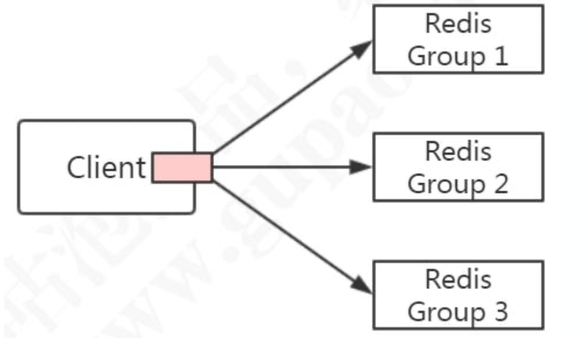

Jedis 客户端提供了 Redis Sharding 的方案，并且支持连接池。 

#### ShardedJedis

```java
public class ShardingTest {
    public static void main(String[] args) {
        JedisPoolConfig poolConfig = new JedisPoolConfig();

        // Redis服务器
        JedisShardInfo shardInfo1 = new JedisShardInfo("127.0.0.1", 6379);
        JedisShardInfo shardInfo2 = new JedisShardInfo("192.168.8.205", 6379);

        // 连接池
        List<JedisShardInfo> infoList = Arrays.asList(shardInfo1, shardInfo2);
        ShardedJedisPool jedisPool = new ShardedJedisPool(poolConfig, infoList);

        ShardedJedis jedis = null;
        try{
            jedis = jedisPool.getResource();
            for(int i=0; i<100; i++){
                jedis.set("k"+i, ""+i);
            }
            for(int i=0; i<100; i++){
                // 根据key决定使用哪个客户端存放。
                Client client = jedis.getShard("k"+i).getClient();
                System.out.println("取到值："+jedis.get("k"+i)+"，"+"当前key位于：" + client.getHost() + ":" + client.getPort());
            }

        }finally{
            if(jedis!=null) {
                jedis.close();
            }
        }
    }
}
```

使用 ShardedJedis 之类的客户端分片代码的优势是配置简单，不依赖于其他中间 件，分区的逻辑可以自定义，比较灵活。但是**基于客户端的方案，不能实现动态的服务增减，每个客户端需要自行维护分片策略，存在重复代码。**

第二种思路就是把分片的代码抽取出来，做成一个公共服务，所有的客户端都连接到这个代理层。由代理层来实现请求和转发。

### 代理 Proxy

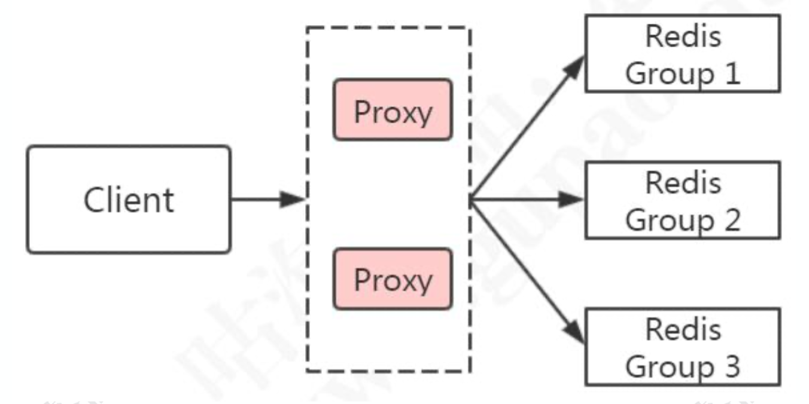

典型的代理分区方案有 Twitter 开源的 Twemproxy 和国内的豌豆荚开源的 Codis。

#### Twemproxy

twe-em-proxy

https://github.com/twitter/twemproxy

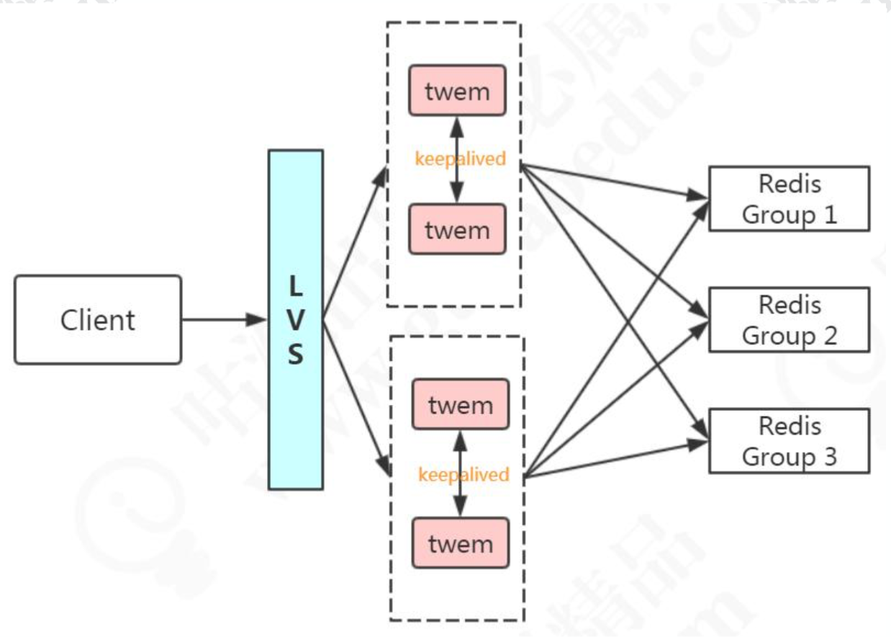

Twemproxy 的优点:比较稳定，可用性高。

不足:

1. 出现故障不能自动转移，架构复杂，需要借助其他组件(LVS/HAProxy + Keepalived)实现 HA
2. 扩缩容需要修改配置，不能实现平滑地扩缩容(需要重新分布数据)

#### Codis

https://github.com/CodisLabs/codis

Codis 是一个代理中间件，用 Go 语言开发的。

功能:客户端连接 Codis 跟连接 Redis 没有区别。

|                            | Codis | Tewmproxy | Redis Cluser              |
| -------------------------- | ----- | --------- | ------------------------- |
| 重新分片不需要重启         | Yes   | No        | Yes                       |
| pipeline                   | Yes   | Yes       |                           |
| 多 key 操作的 hash tags {} | Yes   | Yes       | Yes                       |
| 重新分片时的多 key 操作    | Yes   | -         | No                        |
| 客户端支持                 | 所有  | 所有      | 支持 cluster 协议的客户端 |

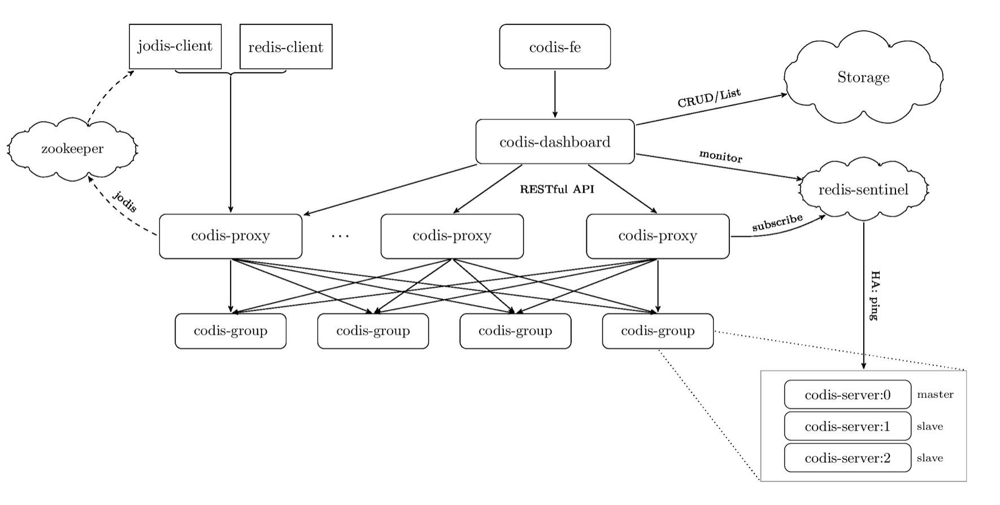

##### 分片原理

Codis 把所有的 key 分成了 N 个槽(例如 1024)，每个槽对应一个分组， 一个分组对应于一个或者一组 Redis 实例。Codis 对 key 进行 CRC32 运算，得到一个 32 位的数字，然后模以 N(槽的个数)，得到余数，这个就是 key 对应的槽，槽后面就 是 Redis 的实例。比如 4 个槽:

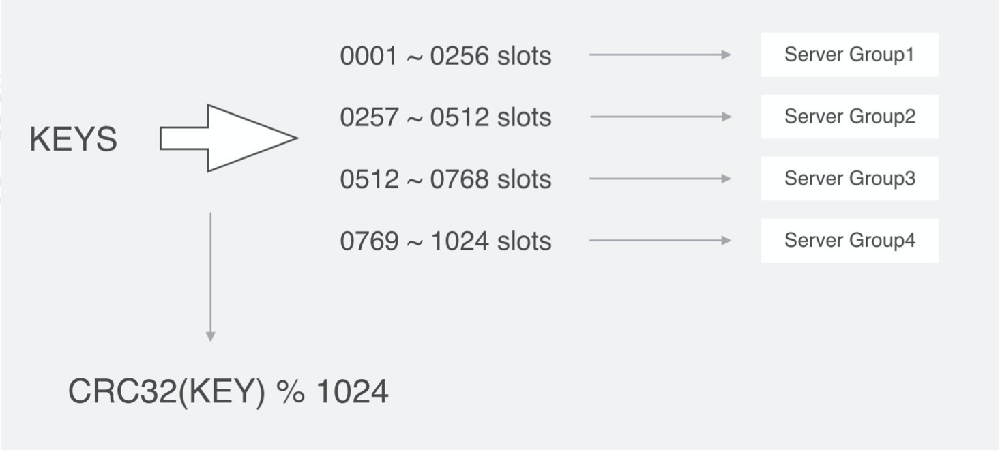

Codis 的槽位映射关系是保存在 Proxy 中的，如果要解决单点的问题，Codis 也要做集群部署，多个Codis节点怎么同步槽和实例的关系呢?需要运行一个Zookeeper( 或者 etcd/本地文件)。

在新增节点的时候，可以为节点指定特定的槽位。Codis 也提供了自动均衡策略。

==Codis 不支持事务，其他的一些命令也不支持。==

[不支持的命令](https://github.com/CodisLabs/codis/blob/release3.2/doc/unsupported_cmds.md)

**获取数据原理(mget):在 Redis 中的各个实例里获取到符合的 key，然后再汇总到 Codis 中。**

Codis 是第三方提供的分布式解决方案，在官方的集群功能稳定之前，Codis 也得到了大量的应用。

## Redis Cluster

https://redis.io/topics/cluster-tutorial/

Redis Cluster 是在 Redis 3.0 的版本正式推出的，用来解决分布式的需求，同时也可以实现高可用。跟 Codis 不一样，它是去中心化的，客户端可以连接到任意一个可用节点。

数据分片有几个关键的问题需要解决:

1. 数据怎么相对均匀地分片
2. 客户端怎么访问到相应的节点和数据
3. 重新分片的过程，怎么保证正常服务

### 架构

Redis Cluster 可以看成是由多个 Redis 实例组成的数据集合。客户端不需要关注数据的子集到底存储在哪个节点，只需要关注这个集合整体。

以 3 主 3 从为例，节点之间两两交互，共享数据分片、节点状态等信息。

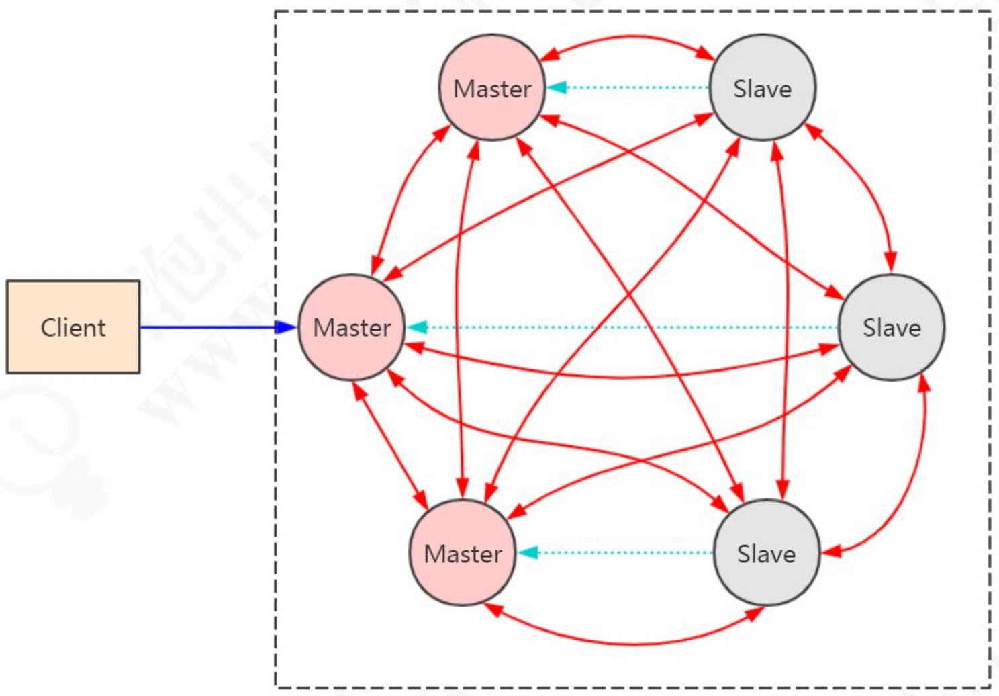

### 搭建

[01-Redis安装与启动](https://github.com/wenbin8/doc/blob/master/分布式/缓存/01-Redis安装与启动.md)

### 数据分布

如果是希望数据分布相对均匀的话，我们首先可以考虑哈希后取模。

#### 哈希后取模

例如，hash(key)%N，根据余数，决定映射到那一个节点。这种方式比较简单，属于静态的分片规则。但是一旦节点数量变化，新增或者减少，由于取模的 N 发生变化， 数据需要重新分布。

为了解决这个问题，我们又有了一致性哈希算法。

#### 一致性哈希

一致性哈希的原理:

把所有的哈希值空间组织成一个虚拟的圆环(哈希环)，整个空间按顺时针方向组织。因为是环形空间，0 和 2^32-1 是重叠的。

假设我们有四台机器要哈希环来实现映射(分布数据)，我们先根据机器的名称或 者 IP 计算哈希值，然后分布到哈希环中(红色圆圈)。

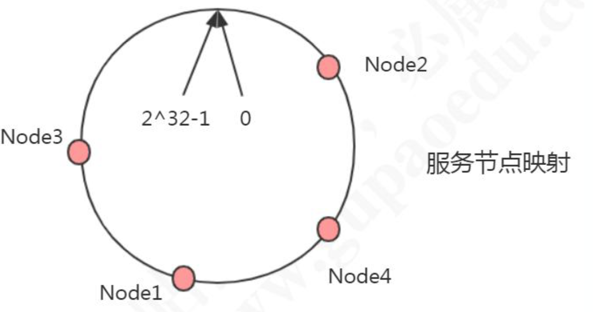

现在有 4 条数据或者 4 个访问请求，对 key 计算后，得到哈希环中的位置(绿色圆圈)。沿哈希环顺时针找到的第一个 Node，就是数据存储的节点。

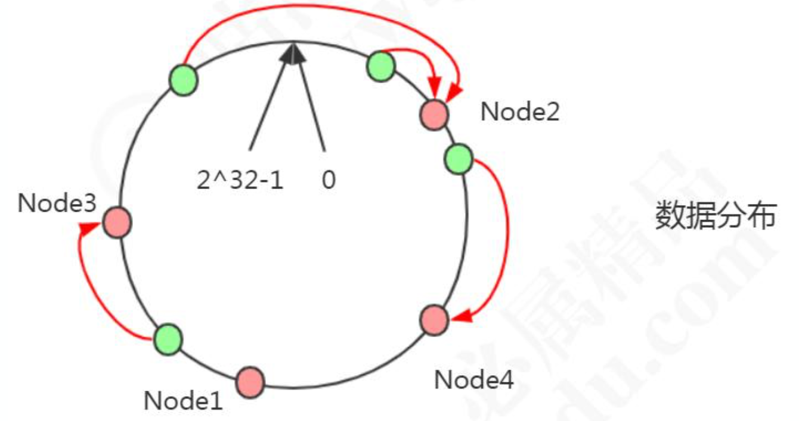

在这种情况下，新增了一个 Node5 节点，不影响数据的分布。只需要迁移Node1的部分节点

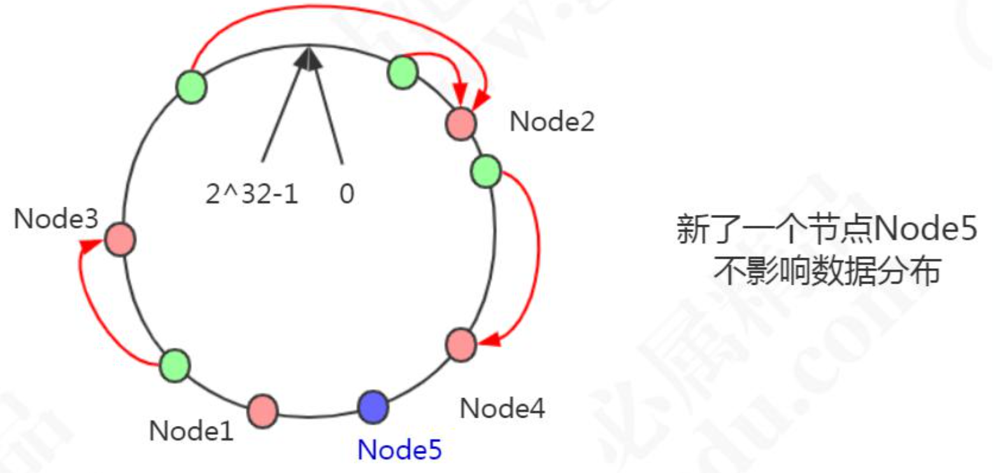

删除了一个节点 Node4，只影响相邻的一个节点。

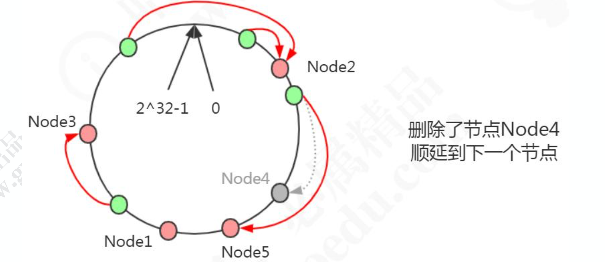

谷歌的 MurmurHash 就是一致性哈希算法。在分布式系统中，负载均衡、分库分表等场景中都有应用。

一致性哈希解决了动态增减节点时，所有数据都需要重新分布的问题，它只会影响到下一个相邻的节点，对其他节点没有影响。

**但是这样的一致性哈希算法有一个缺点，因为节点不一定是均匀地分布的，特别是在==节点数比较少==的情况下，所以数据不能得到均匀分布。解决这个问题的办法是引入==虚拟节点(Virtual Node)==。**

比如:2 个节点，5 条数据，只有 1 条分布到 Node2，4 条分布到 Node1，不均匀。

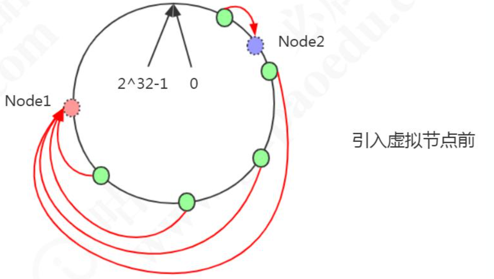

Node1 设置了两个虚拟节点，Node2 也设置了两个虚拟节点(虚线圆圈)。

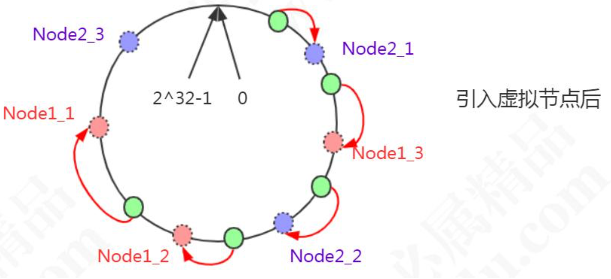

#### Redis虚拟槽分区

Redis 既没有用哈希取模，也没有用一致性哈希，而是用虚拟槽来实现的。

Redis 创建了 16384 个槽(slot)，每个节点负责一定区间的 slot。比如 Node1 负责 0-5460，Node2 负责 5461-10922，Node3 负责 10923-16383。

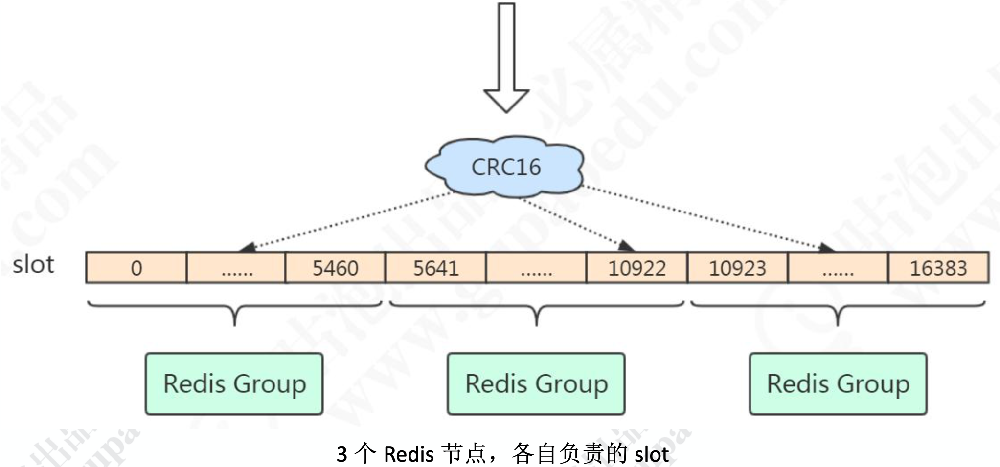

Redis 的每个 master 节点维护一个 16384 位(2048bytes=2KB)的位序列，比如:序列的第 0 位是 1，就代表第一个 slot 是它负责;序列的第 1 位是 0，代表第二个 slot 不归它负责。

对象分布到 Redis 节点上时，**对 key 用 CRC16 算法计算再%16384，得到一个 slot 的值，数据落到负责这个 slot 的 Redis 节点上。**

查看 key 属于哪个 slot:

```shell
redis> cluster keyslot wenbin
```

注意:key 与 slot 的关系是永远不会变的，会变的只有 slot 和 Redis 节点的关系。

==问题:怎么让相关的数据落到同一个节点上?==

比如有些 multi key 操作是不能跨节点的，如果要让某些数据分布到一个节点上，例如用户 2673 的基本信息和金融信息，怎么办?

在 key 里面加入{hash tag}即可。**Redis 在计算槽编号的时候只会获取{}之间的字符串进行槽编号计算，这样由于上面两个不同的键，{}里面的字符串是相同的，因此他们可以被计算出相同的槽。**

### 客户端重定向

比如在 7291 端口的 Redis 的 redis-cli 客户端操作:

```shell
127.0.0.1:7291> set qs 1
(error) MOVED 13724 127.0.0.1:7293
```

服务端返回 MOVED，也就是根据 key 计算出来的 slot 不归 7191 端口管理，而是归 7293 端口管理，服务端返回 MOVED 告诉客户端去 7293 端口操作。

这个时候更换端口，用 redis-cli –p 7293 操作，才会返回 OK。`或者用./redis-cli -c -p port 的命令(c 代表 cluster)`。这样客户端需要连接两次。

Jedis 等客户端会在本地维护一份 slot——node 的映射关系，大部分时候不需要重定向，所以叫做 smart jedis(需要客户端支持)。

### 数据迁移

因为 key 和 slot 的关系是永远不会变的，当新增了节点的时候，需要把原有的 slot 分配给新的节点负责，并且把相关的数据迁移过来。

添加新节点(新增一个 7297):

```shell
redis-cli --cluster add-node 127.0.0.1:7291 127.0.0.1:7297
```

新增的节点没有哈希槽，不能分布数据，在原来的任意一个节点上执行:

```shell
redis-cli --cluster reshard 127.0.0.1:7291
```

输入需要分配的哈希槽的数量(比如 500)，和哈希槽的来源节点(可以输入 all 或者 id)。

### 高可用和主从切换原理

当 slave 发现自己的 master 变为 FAIL 状态时，便尝试进行 Failover，以期成为新的 master。由于挂掉的 master 可能会有多个 slave，从而存在多个 slave 竞争成为 master 节点的过程， 其过程如下:

1. slave 发现自己的 master 变为 FAIL
2. 将自己记录的集群currentEpoch加 1，并广播 FAILOVER_AUTH_REQUEST 信息
3. 其他节点收到该信息，只有 master 响应，判断请求者的合法性，并发送FAILOVER_AUTH_ACK，对每一个 epoch 只发送一次 ack
4. 尝试 failover 的 slave 收集 FAILOVER_AUTH_ACK
5. 超过半数后变成新 Master
6. 广播 Pong 通知其他集群节点。

Redis Cluster 既能够实现主从的角色分配，又能够实现主从切换，相当于集成了 Replication 和 Sentinal 的功能。

### 总结

#### 优势

1. 无中心架构。
2. 数据按照 slot 存储分布在多个节点，节点间数据共享，可动态调整数据分布。
3. 可扩展性，可线性扩展到 1000 个节点(官方推荐不超过 1000 个)，节点可动态添加或删除。
4. 高可用性，部分节点不可用时，集群仍可用。通过增加 Slave 做 standby 数据副本，能够实现故障自动 failover，节点之间通过 gossip 协议交换状态信息，用投票机制完成 Slave 到 Master 的角色提升。
5. 降低运维成本，提高系统的扩展性和可用性。

#### 不足

1. Client 实现复杂，驱动要求实现 Smart Client，缓存 slots mapping 信息并及时更新，提高了开发难度，客户端的不成熟影响业务的稳定性。
2. 节点会因为某些原因发生阻塞(阻塞时间大于 clutser-node-timeout)，被判断下线，这种 failover 是没有必要的。
3. 数据通过异步复制，不保证数据的强一致性。
4. 多个业务使用同一套集群时，无法根据统计区分冷热数据，资源隔离性较差，容易出现相互影响的情况。


