# Redis实战

## Redis客户端

### 客户端通信原理

客户端和服务器通过 TCP 连接来进行数据交互， 服务器默认的端口号为 6379 。

客户端和服务器发送的命令或数据一律以 \r\n (CRLF 回车+换行)结尾。

如果使用 wireshark 对 jedis 抓包:

环境:Jedis 连接到虚拟机 202，运行 main，对 VMnet8 抓包。

过滤条件:ip.dst==192.168.8.202 and tcp.port in {6379}

set qingshan 抓包:

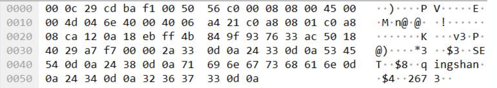

可以看到实际发出的数据包是:

```
*3\r\n$3\r\nSET\r\n$8\r\nqingshan\r\n$4\r\n2673\r\n
```

get qingshan 抓包:

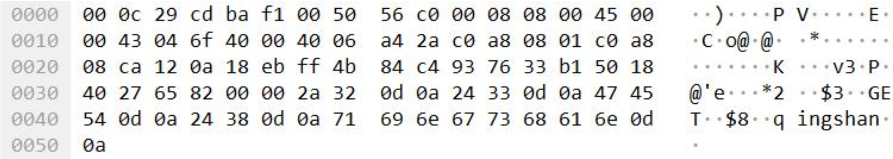

```
*2\r\n$3\r\nGET\r\n$8\r\nqingshan\r\n
```

客户端跟 Redis 之间使用一种特殊的编码格式(在 AOF 文件里面我们看到了)，叫做 Redis Serialization Protocol (Redis 序列化协议)。特点:容易实现、解析快、可读性强。客户端发给服务端的消息需要经过编码，服务端收到之后会按约定进行解码，反之亦然。

基于此，我们可以自己实现一个 Redis 客户端。

```java
public class MyClient {
    private Socket socket;
    private OutputStream write;
    private InputStream read;

    public MyClient(String host, int port) throws IOException {
        socket = new Socket(host, port);
        write = socket.getOutputStream();
        read = socket.getInputStream();
    }

    public void set(String key, String val) throws IOException {
        StringBuffer sb = new StringBuffer();
        // 代表3个参数
        sb.append("*3").append("\r\n");
        // 第一个参数（get）的长度
        sb.append("$3").append("\r\n");
        // 第一个参数的内容
        sb.append("SET").append("\r\n");

        // 第二个参数key的长度
        sb.append("$").append(key.getBytes().length).append("\r\n");
        // 第二个参数key的内容
        sb.append(key).append("\r\n");
        // 第三个参数value的长度
        sb.append("$").append(val.getBytes().length).append("\r\n");
        // 第三个参数value的内容
        sb.append(val).append("\r\n");

        write.write(sb.toString().getBytes());
        byte[] bytes = new byte[1024];
        read.read(bytes);
        System.out.println("-------------set-------------");
        System.out.println(new String(bytes));
    }

    public void get(String key) throws IOException {
        StringBuffer sb = new StringBuffer();
        // 代表2个参数
        sb.append("*2").append("\r\n");
        // 第一个参数(get)的长度
        sb.append("$3").append("\r\n");
        // 第一个参数的内容
        sb.append("GET").append("\r\n");

        // 第二个参数长度
        sb.append("$").append(key.getBytes().length).append("\r\n");
        // 第二个参数内容
        sb.append(key).append("\r\n");

        write.write(sb.toString().getBytes());
        byte[] bytes = new byte[1024];
        read.read(bytes);
        System.out.println("-------------get-------------");
        System.out.println(new String(bytes));
    }

    public static void main(String[] args) throws IOException {
        MyClient client = new MyClient("192.168.8.202", 6379);
        client.set("qingshan", "2673");
        client.get("qingshan");
    }

}
```

1. 建立 Socket 连接
2. OutputStream 写入数据(发送到服务端)
3. InputStream 读取数据(从服务端接口)

基于这种协议，我们可以用 Java 实现所有的 Redis 操作命令。当然，我们不需要这么做，因为已经有很多比较成熟的 Java 客户端，实现了完整的功能和高级特性，并且提供了良好的性能。

[参考链接](https://redis.io/clients#java)

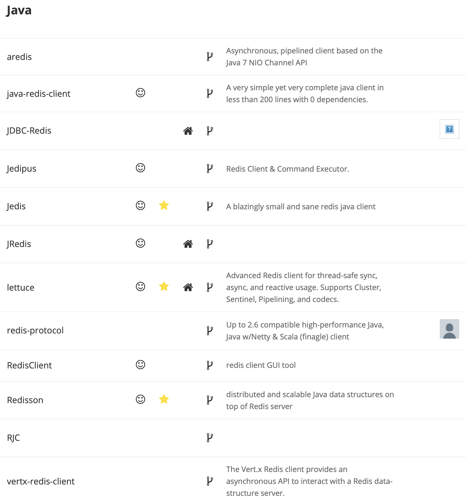

官网推荐的 Java 客户端有 3 个 Jedis，Redisson 和 Luttuce。

| 客户端   | 描述                                                         |
| -------- | ------------------------------------------------------------ |
| Jedis    | A blazingly small and sane redis java client                 |
| lettuce  | Advanced Redis client for thread-safe sync, async, and reactive usage. Supports Cluster, Sentinel, Pipelining, and codecs. |
| Redisson | distributed and scalable Java data structures on top of Redis server |

Spring 连接 Redis 用的是什么?RedisConnectionFactory 接口支持多种实现。

例如 : JedisConnectionFactory 、 JredisConnectionFactory 、LettuceConnectionFactory、SrpConnectionFactory。

## Jedis

[官网链接](https://github.com/xetorthio/jedis)

### 特点

Jedis 是我们最熟悉和最常用的客户端。轻量，简洁，便于集成和改造。

```java
public class BasicTest {
    public static void main(String[] args) {
        Jedis jedis = new Jedis("127.0.0.1", 6379);
        jedis.set("qingshan", "2673");
        System.out.println(jedis.get("qingshan"));
        jedis.close();
    }
}
```

**Jedis 多个线程使用一个连接的时候线程不安全。**可以使用连接池，为每个请求创建不同的连接，基于 Apache common pool 实现。跟数据库一样，可以设置最大连接数等参数。Jedis 中有多种连接池的子类。

例如

```java
public class ShardingTest {
    public static void main(String[] args) {
        JedisPoolConfig poolConfig = new JedisPoolConfig();

        // Redis服务器
        JedisShardInfo shardInfo1 = new JedisShardInfo("127.0.0.1", 6379);
        JedisShardInfo shardInfo2 = new JedisShardInfo("192.168.8.205", 6379);

        // 连接池
        List<JedisShardInfo> infoList = Arrays.asList(shardInfo1, shardInfo2);
        ShardedJedisPool jedisPool = new ShardedJedisPool(poolConfig, infoList);

        ShardedJedis jedis = null;
        try{
            jedis = jedisPool.getResource();
            for(int i=0; i<100; i++){
                jedis.set("k"+i, ""+i);
            }
            for(int i=0; i<100; i++){
                // 根据key决定使用哪个客户端存放。
                Client client = jedis.getShard("k"+i).getClient();
                System.out.println("取到值："+jedis.get("k"+i)+"，"+"当前key位于：" + client.getHost() + ":" + client.getPort());
            }

        }finally{
            if(jedis!=null) {
                jedis.close();
            }
        }
    }
}
```

Jedis 有 4 种工作模式:单节点、分片、哨兵、集群。

3 种请求模式:Client、Pipeline、事务。

- Client 模式就是客户端发送一个命令，阻塞等待服务端执行，然后读取 返回结果。
- Pipeline 模式是一次性发送多个命令，最后一次取回所有的返回结果，这种模式通过减少网络的往返时间和 io 读写次数，大幅度提高通信性能。
- 第三种是事务模式。Transaction 模式即开启 Redis 的事务管理，事务模式开启后，所有的命令(除了 exec，discard，multi 和 watch)到达服务端以后不会立即执行，会进入一个等待队列。

### Sentinel 获取连接原理

问题:Jedis 连接 Sentinel 的时候，我们配置的是全部哨兵的地址。Sentinel 是如何返回可用的 master 地址的呢?

例如：

```java
private static JedisSentinelPool createJedisPool() {
    // master的名字是sentinel.conf配置文件里面的名称
    String masterName = "redis-master";
    Set<String> sentinels = new HashSet<String>();
    sentinels.add("192.168.8.203:26379");
    sentinels.add("192.168.8.204:26379");
    sentinels.add("192.168.8.205:26379");
    pool = new JedisSentinelPool(masterName, sentinels);
    return pool;
}
```

在构造方法`JedisSentinelPool(masterName, sentinels);`调用了`HostAndPort master = this.initSentinels(sentinels, masterName);`

查看`initSentinels(sentinels, masterName)`:

```java
private HostAndPort initSentinels(Set<String> sentinels, final String masterName) {

  HostAndPort master = null;
  boolean sentinelAvailable = false;

  log.info("Trying to find master from available Sentinels...");

  // 有多个 sentinels,遍历这些个 sentinels
  for (String sentinel : sentinels) {
    // host:port 表示的 sentinel 地址转化为一个 HostAndPort 对象。
    final HostAndPort hap = HostAndPort.parseString(sentinel);

    log.fine("Connecting to Sentinel " + hap);

    Jedis jedis = null;
    try {
      // 连接到 sentinel
      jedis = new Jedis(hap.getHost(), hap.getPort());

      // 根据masterName得到master的地址，返回一个list，host= list[0], port =// list[1]
      List<String> masterAddr = jedis.sentinelGetMasterAddrByName(masterName);

      // connected to sentinel...
      sentinelAvailable = true;

      if (masterAddr == null || masterAddr.size() != 2) {
        log.warning("Can not get master addr, master name: " + masterName + ". Sentinel: " + hap
            + ".");
        continue;
      }

      // 如果在任何一个 sentinel 中找到了 master，不再遍历 sentinels
      master = toHostAndPort(masterAddr);
      log.fine("Found Redis master at " + master);
      break;
    } catch (JedisException e) {
      // resolves #1036, it should handle JedisException there's another chance
      // of raising JedisDataException
      log.warning("Cannot get master address from sentinel running @ " + hap + ". Reason: " + e
          + ". Trying next one.");
    } finally {
      if (jedis != null) {
        jedis.close();
      }
    }
  }

  // 到这里，如果master为null，则说明有两种情况，一种是所有的sentinels节点都down掉了，一种是 master节点没有被存活的sentinels监控到
  if (master == null) {
    if (sentinelAvailable) {
      // can connect to sentinel, but master name seems to not
      // monitored
      throw new JedisException("Can connect to sentinel, but " + masterName
          + " seems to be not monitored...");
    } else {
      throw new JedisConnectionException("All sentinels down, cannot determine where is "
          + masterName + " master is running...");
    }
  }

  // 如果走到这里，说明找到了 master 的地址
  log.info("Redis master running at " + master + ", starting Sentinel listeners...");

  // 启动对每个sentinels的监听为每个sentinel都启动了一个监听者MasterListener。MasterListener 本身是一个线程，它会去订阅sentinel上关于master节点地址改变的消息。
  for (String sentinel : sentinels) {
    final HostAndPort hap = HostAndPort.parseString(sentinel);
    MasterListener masterListener = new MasterListener(masterName, hap.getHost(), hap.getPort());
    // whether MasterListener threads are alive or not, process can be stopped
    masterListener.setDaemon(true);
    masterListeners.add(masterListener);
    masterListener.start();
  }

  return master;
}
```

### Cluster获取连接原理

```java
    public static void main(String[] args) throws IOException {
        // 不管是连主备，还是连几台机器都是一样的效果
        HostAndPort hp4 = new HostAndPort("192.168.8.207",7294);
        HostAndPort hp5 = new HostAndPort("192.168.8.207",7295);
        HostAndPort hp6 = new HostAndPort("192.168.8.207",7296);

        Set nodes = new HashSet<HostAndPort>();
        nodes.add(hp4);
        nodes.add(hp5);
        nodes.add(hp6);

        JedisCluster cluster = new JedisCluster(nodes);
        cluster.set("cluster", "qingshan2673");
        System.out.println(cluster.get("cluster"));;
        cluster.close();
    }
```

问题:使用 Jedis 连接 Cluster 的时候，我们只需要连接到任意一个或者多个 redis group 中的实例地址，那我们是怎么获取到需要操作的 Redis Master 实例的?

关键问题:在于如何存储 slot 和 Redis 连接池的关系。

1. 程序启动初始化集群环境，读取配置文件中的节点配置，无论是主从，无论多少个，只拿第一个，获取 redis 连接实例(后面有个 break)。从`JedisCluster(nodes)`构造函数中可以找到`initializeSlotsCache`。

   ```java
   //redis.clients.jedis.JedisClusterConnectionHandler#initializeSlotsCache
   private void initializeSlotsCache(Set<HostAndPort> startNodes, GenericObjectPoolConfig poolConfig, String password) {
     for (HostAndPort hostAndPort : startNodes) {
       // 获取一个 Jedis 实例
       Jedis jedis = new Jedis(hostAndPort.getHost(), hostAndPort.getPort());
       if (password != null) {
         jedis.auth(password);
       }
       try {
         // 获取 Redis 节点和 Slot 虚拟槽
         cache.discoverClusterNodesAndSlots(jedis);
         // 直接跳出循环
         break;
       } catch (JedisConnectionException e) {
         // try next nodes
       } finally {
         if (jedis != null) {
           jedis.close();
         }
       }
     }
   }
   ```

2. 用获取的 redis 连接实例执行 clusterSlots ()方法，实际执行 redis 服务端 cluster slots 命令，获取虚拟槽信息。

   该集合的基本信息为[long, long, List, List], 第一，二个元素是该节点负责槽点的起始位置，第三个元素是主节点信息，第四个元素为主节点对应的从节点信息。该 list 的基本信息为[string,int,string],第一个为 host 信息，第二个为 port 信息，第三个为唯一 id。

   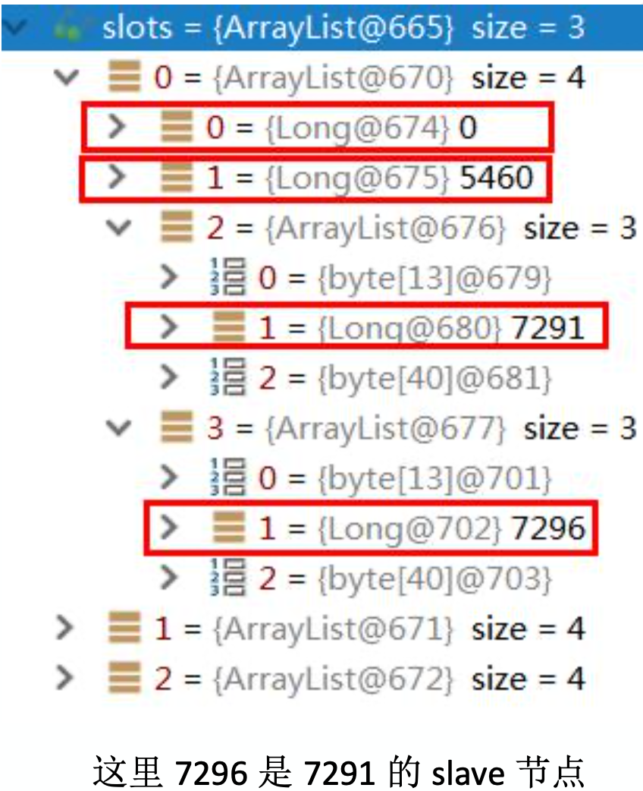

3. 获取有关节点的槽点信息后，调用 getAssignedSlotArray(slotinfo)来获取所有的槽点值。

4. 再获取主节点的地址信息，调用 generateHostAndPort(hostInfo)方法，生成一个 ostAndPort 对象。

5. 再根据节点地址信息来设置节点对应的 JedisPool，即设置 Map<String,JedisPool> nodes 的值。

接下来判断若此时节点信息为主节点信息时，则调用 assignSlotsToNodes 方法，设置每个槽点值对应的连接池，即设置 Map<Integer, JedisPool> slots 的值。

```java
// redis.clients.jedis.JedisClusterInfoCache#discoverClusterNodesAndSlots
public void discoverClusterNodesAndSlots(Jedis jedis) {
  w.lock();

  try {
    reset();
    // 获取节点集合
    List<Object> slots = jedis.clusterSlots();

    // 遍历3个master节点
    for (Object slotInfoObj : slots) {
      // slotInfo 槽开始，槽结束，主，从
      // {[0,5460,7291,7294],[5461,10922,7292,7295],[10923,16383,7293,7296]}
      List<Object> slotInfo = (List<Object>) slotInfoObj;

      // 如果<=2，代表没有分配 slot
      if (slotInfo.size() <= MASTER_NODE_INDEX) {
        continue;
      }

      // 获取分配到当前 master 节点的数据槽，例如 7291 节点的{0,1,2,3......5460}
      List<Integer> slotNums = getAssignedSlotArray(slotInfo);

      // hostInfos
      // size 是 4，槽最小最大，主，从
      int size = slotInfo.size();
      // 第 3 位和第 4 位是主从端口的信息
      for (int i = MASTER_NODE_INDEX; i < size; i++) {
        List<Object> hostInfos = (List<Object>) slotInfo.get(i);
        if (hostInfos.size() <= 0) {
          continue;
        }

        // 根据 IP 端口生成 HostAndPort 实例
        HostAndPort targetNode = generateHostAndPort(hostInfos);
        // 据HostAndPort解析出ip:port的key值，再根据key从缓存中查询对应的jedisPool实例。如果没有jedisPool实例，就创建JedisPool实例，最后放入缓存中。nodeKey 和 nodePool 的关系
        setupNodeIfNotExist(targetNode);
        // 把slot和jedisPool缓存起来(16384 个)，key是slot下标，value是连接池
        if (i == MASTER_NODE_INDEX) {
          assignSlotsToNode(slotNums, targetNode);
        }
      }
    }
  } finally {
    w.unlock();
  }
}
```

从集群环境存取值:

1. 把 key 作为参数，执行 CRC16 算法，获取 key 对应的 slot 值。
2. 通过该 slot 值，去 slots 的 map 集合中获取 jedisPool 实例。
3. 通过 jedisPool 实例获取 jedis 实例，最终完成 redis 数据存取工作。

### pipeline

单个命令的执行到底慢在哪里?

Redis 使用的是客户端/服务器(C/S)模型和请求/响应协议的 TCP 服务器。这意味着通常情况下一个请求会遵循以下步骤:

- 客户端向服务端发送一个查询请求，并监听 Socket 返回，通常是以阻塞模式，等待服务端响应。
- 服务端处理命令，并将结果返回给客户端。

Redis 客户端与 Redis 服务器之间使用 TCP 协议进行连接，一个客户端可以通过一个 socket 连接发起多个请求命令。每个请求命令发出后 client 通常会阻塞并等待 redis 服务器处理，redis 处理完请求命令后会将结果通过响应报文返回给 client，因此当执行多条命令的时候都需要等待上一条命令执行完毕才能执行。执行过程如图:


Redis 本身提供了一些批量操作命令，比如 mget，mset，可以减少通信的时间，但是大部分命令是不支持 multi 操作的，例如 hash 就没有。

由于通信会有网络延迟，假如 client 和 server 之间的包传输时间需要 10 毫秒，一次交互就是 20 毫秒(RTT:Round Trip Time)。这样的话，client 1 秒钟也只能也只能发送 50 个命令。这显然没有充分利用 Redis 的处理能力。另外一个，Redis 服务端执行 I/O 的次数过多。

#### Pipeline管道

https://redis.io/topics/pipelining

那我们能不能像数据库的 batch 操作一样，把一组命令组装在一起发送给 Redis 服 务端执行，然后一次性获得返回结果呢?这个就是 Pipeline 的作用。Pipeline 通过一个队列把所有的命令缓存起来，然后把多个命令在一次连接中发送给服务器。

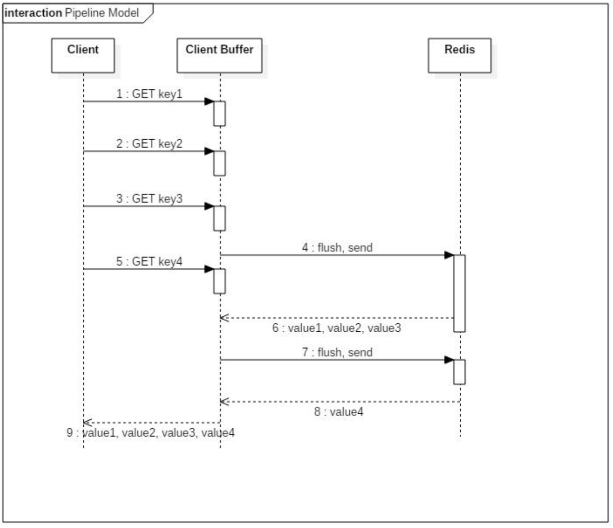

示例代码:

set代码：

```java
public class PipelineSet {
    public static void main(String[] args) {
        Jedis jedis = new Jedis("127.0.0.1", 6379);
        Pipeline pipelined = jedis.pipelined();
        long t1 = System.currentTimeMillis();
        for (int i=0; i < 100000; i++) {
            pipelined.set("batch"+i,""+i);
        }
        pipelined.syncAndReturnAll();
        long t2 = System.currentTimeMillis();
        System.out.println("耗时："+(t2-t1)+"ms");
    }
}
```

get代码：

```java
public class PipelineGet {
    public static void main(String[] args) {
        new Thread(){
            public void run(){
                Jedis jedis = new Jedis("127.0.0.1", 6379);
                Set<String> keys = jedis.keys("batch*");
                List<String> result = new ArrayList();
                long t1 = System.currentTimeMillis();
                for (String key : keys) {
                    result.add(jedis.get(key));
                }
                for (String src : result) {
                    // System.out.println(src);
                }
                System.out.println("直接get耗时："+(System.currentTimeMillis() - t1));
            }
        }.start();

        new Thread(){
            public void run(){
                Jedis jedis = new Jedis("127.0.0.1", 6379);
                
                Set<String> keys = jedis.keys("batch*");
                List<Object> result = new ArrayList();
                Pipeline pipelined = jedis.pipelined();
                long t1 = System.currentTimeMillis();
                for (String key : keys) {
                    pipelined.get(key);
                }
                result = pipelined.syncAndReturnAll();
                for (Object src : result) {
                    // System.out.println(src);
                }
                System.out.println("Pipeline get耗时："+(System.currentTimeMillis() - t1));
            }
        }.start();
    }
}
```

要实现 Pipeline，既要服务端的支持，也要客户端的支持。对于服务端来说，需要能够处理客户端通过一个 TCP 连接发来的多个命令，并且逐个地执行命令一起返回 。

对于客户端来说，要把多个命令缓存起来，达到一定的条件就发送出去，最后才处理 Redis 的应答(这里也要注意对客户端内存的消耗)。

jedis-pipeline 的 client-buffer 限制:8192bytes，客户端堆积的命令超过 8192bytes 时，会发送给服务端。

源码:redis.clients.util.RedisOutputStream.java

```java
public RedisOutputStream(final OutputStream out) {
  this(out, 8192);
}
```

pipeline 对于命令条数没有限制，但是命令可能会受限于 TCP 包大小。

如果 Jedis 发送了一组命令，而发送请求还没有结束，Redis 响应的结果会放在接收缓冲区。如果接收缓冲区满了，jedis 会通知 redis win=0，此时 redis 不会再发送结果给 jedis 端，转而把响应结果保存在 Redis 服务端的输出缓冲区中。

输出缓冲区的配置:redis.conf

`client-output-buffer-limit <class> <hard limit> <soft limit> <soft seconds>`

```
client-output-buffer-limit normal 0 0 0 
client-output-buffer-limit replica 256mb 64mb 60 
client-output-buffer-limit pubsub 32mb 8mb 60
```

| 配置                    | 作用                                                         |
| ----------------------- | ------------------------------------------------------------ |
| class                   | 客户端类型，分为三种。<br>a)normal:普通客户端;<br/>b)slave:slave 客户端，用于复制;<br/>c) pubsub:发布订阅客户端 |
| hard limit              | 如果客户端使用的输出缓冲区大于`<hard limit>`，客户端会被立即关闭，0 代表不限制 |
| soft limit soft seconds | 如果客户端使用的输出缓冲区超过了`<soft limit>`并且持续了`<soft limit>`秒，客户端会被立即 关闭 |

每个客户端使用的输出缓冲区的大小可以用 client list 命令查看:

```
redis> client list
```

id=5 addr=192.168.8.1:10859 fd=8 name= age=5 idle=0 flags=N db=0 sub=0 psub=0 multi=-1 qbuf=5 qbuf-free=32763 ==obl=16380 oll=227 omem=4654408== events=rw cmd=set

- obl : 输出缓冲区的长度(字节为单位， 0 表示没有分配输出缓冲区)
- oll : 输出列表包含的对象数量(当输出缓冲区没有剩余空间时，命令回复会以字符串对象的形式被入队到这个队列里)
- omem : 输出缓冲区和输出列表占用的内存总量

#### 使用场景

如果某些操作需要马上得到 Redis 操作是否成功的结果，这种场景就不适合。

有些场景，例如批量写入数据，对于结果的实时性和成功性要求不高，就可以用Pipeline。

### Jedis 实现分布式锁

原文地址:https://redis.io/topics/distlock

中文地址:http://redis.cn/topics/distlock.html

分布式锁的基本特性或者要求:

1. 互斥性:只有一个客户端能够持有锁。
2. 不会产生死锁:即使持有锁的客户端崩溃，也能保证后续其他客户端可以获取锁。
3. 只有持有这把锁的客户端才能解锁。

```java
public class DistLock {
    private static final String LOCK_SUCCESS = "OK";
    private static final String SET_IF_NOT_EXIST = "NX";
    private static final String SET_WITH_EXPIRE_TIME = "PX";
    private static final Long RELEASE_SUCCESS = 1L;

    /**
     * 尝试获取分布式锁
     * @param jedis Redis客户端
     * @param lockKey 锁
     * @param requestId 请求标识
     * @param expireTime 超期时间
     * @return 是否获取成功
     */
    public static boolean tryGetDistributedLock(Jedis jedis, String lockKey, String requestId, int expireTime) {
        // set支持多个参数 NX（not exist） XX（exist） EX（seconds） PX（million seconds）
        String result = jedis.set(lockKey, requestId, SET_IF_NOT_EXIST, SET_WITH_EXPIRE_TIME, expireTime);
        if (LOCK_SUCCESS.equals(result)) {
            return true;
        }
        return false;
    }

    /**
     * 释放分布式锁
     * @param jedis Redis客户端
     * @param lockKey 锁
     * @param requestId 请求标识
     * @return 是否释放成功
     */
    public static boolean releaseDistributedLock(Jedis jedis, String lockKey, String requestId) {
        String script = "if redis.call('get', KEYS[1]) == ARGV[1] then return redis.call('del', KEYS[1]) else return 0 end";
        Object result = jedis.eval(script, Collections.singletonList(lockKey), Collections.singletonList(requestId));

        if (RELEASE_SUCCESS.equals(result)) {
            return true;
        }
        return false;
    }
}
```

尝试获取分布式锁参数解读：

1. lockKey 是 Redis key 的名称，也就是谁添加成功这个 key 代表谁获取锁成功。
2. requestId 是客户端的 ID(设置成 value)，如果我们要保证只有加锁的客户端才能释放锁，就必须获得客户端的 ID(保证第 3 点)。
3. SET_IF_NOT_EXIST 是我们的命令里面加上 NX(保证第 1 点)。
4. SET_WITH_EXPIRE_TIME，PX 代表以毫秒为单位设置 key 的过期时间(保证第 2 点)。expireTime 是自动释放锁的时间，比如 5000 代表 5 秒。

释放分布式锁：

1. 对客户端 requestId 进行判断，因为可能会释放其他客户端持有的锁。
2. 判断客户端是否相等和删除 key 的操作放在 Lua 脚本里面执行。

这个是 Jedis 里面分布式锁的实现。

## Luttece

https://lettuce.io/

### 特点

与 Jedis 相比，Lettuce 则完全克服了其线程不安全的缺点:**Lettuce 是一个可伸缩的线程安全的 Redis 客户端，支持同步、异步和响应式模式(Reactive)。**多个线程可以共享一个连接实例，而不必担心多线程并发问题。

同步调用:

```java
public class LettuceSyncTest {
    public static void main(String[] args) {
        // 创建客户端
        RedisClient client = RedisClient.create("redis://127.0.0.1:6379");
        // 线程安全的长连接，连接丢失时会自动重连
        StatefulRedisConnection<String, String> connection = client.connect();
        // 获取同步执行命令，默认超时时间为 60s
        RedisCommands<String, String> sync = connection.sync();
        // 发送get请求，获取值
        sync.set("wenbin","lettuce-sync-666" );
        String value = sync.get("wenbin");
        System.out.println("------"+value);
        //关闭连接
        connection.close();
        //关掉客户端
        client.shutdown();
    }
}
```

异步的结果使用 RedisFuture 包装，提供了大量回调的方法。

异步调用:

```java
public class LettuceASyncTest {
    public static void main(String[] args) {
        RedisClient client = RedisClient.create("redis://127.0.0.1:6379");
        // 线程安全的长连接，连接丢失时会自动重连
        StatefulRedisConnection<String, String> connection = client.connect();
        // 获取异步执行命令api
        RedisAsyncCommands<String, String> commands = connection.async();
        // 获取RedisFuture<T>
        commands.set("wenbin:async","lettuce-async-666");
        RedisFuture<String> future = commands.get("wenbin:async");
        try {
            String value = future.get(60, TimeUnit.SECONDS);
            System.out.println("------"+value);
        } catch (InterruptedException | ExecutionException | TimeoutException e) {
            e.printStackTrace();
        }

    }
}
```

它基于 Netty 框架构建，支持 Redis 的高级功能，如 Pipeline、发布订阅，事务、 Sentinel，集群，支持连接池。

==Lettuce 是 Spring Boot 2.x 默认的客户端，替换了 Jedis。集成之后我们不需要单独使用它，直接调用 Spring 的 RedisTemplate 操作，连接和创建和关闭也不需要我们操心。==

```xml
<dependency> 
    <groupId>org.springframework.boot</groupId> 
    <artifactId>spring-boot-starter-data-redis</artifactId>
</dependency>
```

## Redisson

https://redisson.org/

https://github.com/redisson/redisson/wiki/目录

### 本质

Redisson 是一个在 Redis 的基础上实现的 Java 驻内存数据网格(In-Memory Data Grid)，提供了分布式和可扩展的 Java 数据结构。

### 特点

基于 Netty 实现，采用非阻塞 IO，性能高

支持异步请求

支持连接池、pipeline、LUA Scripting、Redis Sentinel、Redis Cluster 不支持事务，官方建议以 LUA Scripting 代替事务、主从、哨兵、集群都支持。Spring 也可以配置和注入 RedissonClient。

### 实现分布式锁

在 Redisson 里面提供了更加简单的分布式锁的实现。

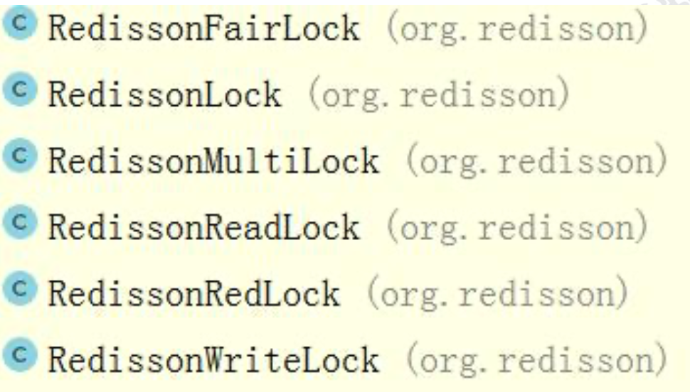

加锁:

```java
public static void main(String[] args) throws InterruptedException { 
    RLock rLock=redissonClient.getLock("updateAccount");
    // 最多等待 100 秒、上锁 10s 以后自动解锁 
    if(rLock.tryLock(100,10, TimeUnit.SECONDS)){
    	System.out.println("获取锁成功"); 
    }
    
	// do something
    
	rLock.unlock(); 
}
```

在获得 RLock 之后，只需要一个 tryLock 方法，里面有 3 个参数:

1. watiTime:获取锁的最大等待时间，超过这个时间不再尝试获取锁
2. leaseTime:如果没有调用 unlock，超过了这个时间会自动释放锁
3. TimeUnit:释放时间的单位

Redisson 的分布式锁是怎么实现的呢?

在加锁的时候，在 Redis 写入了一个 HASH，key 是锁名称，field 是线程名称，value 是 1(表示锁的重入次数)。

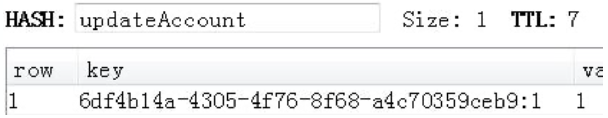

源码:

tryLock()——tryAcquire()——tryAcquireAsync()——tryLockInnerAsync()

最终也是调用了一段 Lua 脚本。里面有一个参数，两个参数的值。

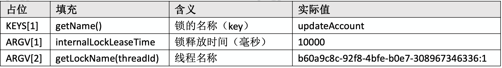

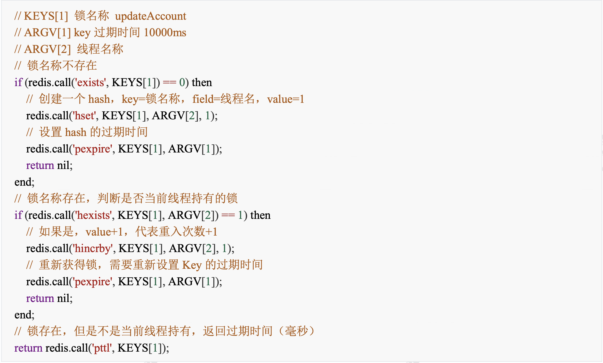

释放锁，源码:

unlock——unlockInnerAsync

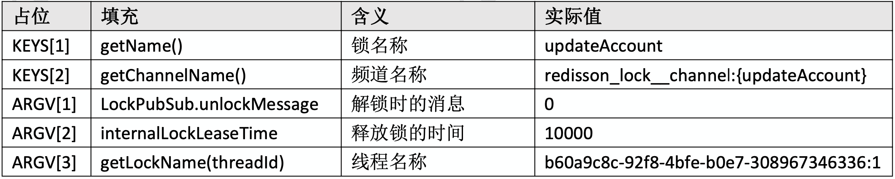

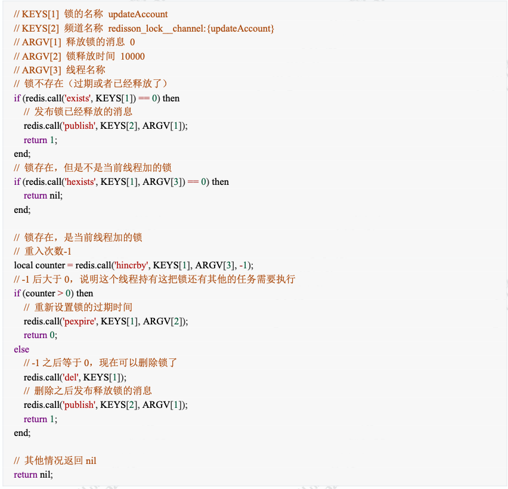

这个是 Redisson 里面分布式锁的实现，我们在调用的时候非常简单。

Redisson 跟 Jedis 定位不同，它不是一个单纯的 Redis 客户端，而是基于 Redis 实现的分布式的服务，如果有需要用到一些分布式的数据结构，比如我们还可以基于 Redisson 的分布式队列实现分布式事务，就可以引入 Redisson 的依赖实现。

## 数据一致性

### 缓存使用场景

针对读多写少的高并发场景，我们可以使用缓存来提升查询速度。

当我们使用 Redis 作为缓存的时候，一般流程是这样的:

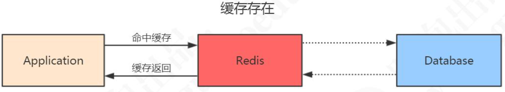

如果 Redis 里面没有，先到数据库查询，然后写入到 Redis，再返回给应用。

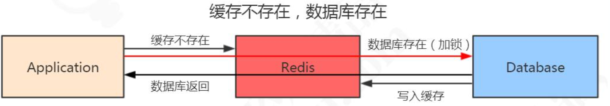

### 一致性问题的定义

因为这些数据是很少修改的，所以在绝大部分的情况下可以命中缓存。但是，一旦被缓存的数据发生变化的时候，我们既要操作数据库的数据，也要操作 Redis 的数据， 所以问题来了。现在我们有两种选择:

1. 先操作 Redis 的数据再操作数据库的数据
2. 先操作数据库的数据再操作 Redis 的数据

到底选哪一种?

首先需要明确的是，不管选择哪一种方案， 我们肯定是希望两个操作要么都成功，要么都一个都不成功。不然就会发生 Redis 跟数据库的数据不一致的问题。

但是，Redis 的数据和数据库的数据是不可能通过事务达到统一的，我们只能根据相应的场景和所需要付出的代价来采取一些措施降低数据不一致的问题出现的概率，在数据一致性和性能之间取得一个权衡。

对于数据库的实时性一致性要求不是特别高的场合，比如 T+1 的报表，可以采用定时任务查询数据库数据同步到 Redis 的方案。

由于我们是以数据库的数据为准的，所以给缓存设置一个过期时间，是保证最终一致性的解决方案。

### 方案选择

#### Redis:删除还是更新?

这里我们先要补充一点，当存储的数据发生变化，Redis 的数据也要更新的时候，我们有两种方案，一种就是直接更新，调用 set;还有一种是直接删除缓存，让应用在下次查询的时候重新写入。

这两种方案怎么选择呢?这里我们主要考虑更新缓存的代价。

更新缓存之前，是不是要经过其他表的查询、接口调用、计算才能得到最新的数据， 而不是直接从数据库拿到的值。如果是的话，建议直接删除缓存，这种方案更加简单， 而且避免了数据库的数据和缓存不一致的情况。在一般情况下，我们也推荐使用删除的方案。

这一点明确之后，现在我们就剩一个问题:

- 到底是先更新数据库，再删除缓存
- 还是先删除缓存，再更新数据库

我们先看第一种方案。

#### 先更新数据库，再删除缓存

正常情况:

- 更新数据库，成功。 
- 删除缓存，成功。

异常情况:

- 更新数据库失败，程序捕获异常，不会走到下一步，所以数据不会出现不一致。
- 更新数据库成功，删除缓存失败。数据库是新数据，缓存是旧数据，发生了不一致的情况。

这种问题怎么解决呢?我们可以提供一个重试的机制。

比如:如果删除缓存失败，我们捕获这个异常，把需要删除的 key 发送到消息队列。 让后自己创建一个消费者消费，尝试再次删除这个 key。

这种方式有个缺点，会对业务代码造成入侵。


所以我们又有了第二种方案(异步更新缓存):

因为更新数据库时会往 binlog 写入日志，所以我们可以通过一个服务来监听 binlog 的变化(比如阿里的 canal)，然后在客户端完成删除 key 的操作。如果删除失败的话， 再发送到消息队列。

总之，对于后删除缓存失败的情况，我们的做法是不断地重试删除，直到成功。

无论是重试还是异步删除，都是最终一致性的思想。

#### 先删除缓存，再更新数据库

正常情况:

- 更新数据库，成功。 
- 删除缓存，成功。

异常情况:

1. 删除缓存，程序捕获异常，不会走到下一步，所以数据不会出现不一致。
2. 删除缓存成功，更新数据库失败。 因为以数据库的数据为准，所以不存在数据不一致的情况。

看起来好像没问题，但是如果有程序并发操作的情况下:

1. 线程 A 需要更新数据，首先删除了 Redis 缓存
2. 线程 B 查询数据，发现缓存不存在，到数据库查询旧值，写入 Redis，返回
3. 线程 A 更新了数据库

这个时候，Redis 是旧的值，数据库是新的值，发生了数据不一致的情况。

那问题就变成了:能不能让对同一条数据的访问串行化呢?代码肯定保证不了，因为有多个线程，即使做了任务队列也可能有多个服务实例。数据库也保证不了，因为会有多个数据库的连接。只有一个数据库只提供一个连接的情况下，才能保证读写的操作是串行的，或者我们把所有的读写请求放到同一个内存队列当中，但是这种情况吞吐量太低了。

所以我们有一种延时双删的策略，在写入数据之后，再删除一次缓存。

A 线程:

1. 删除缓存
2. 更新数据库
3. 休眠500ms（这个时间，依据读取数据的耗时而定）
4. 再次删除缓存

伪代码:

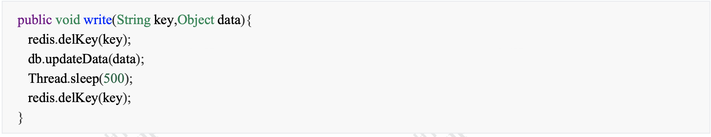

## 高并发问题

在 Redis 存储的所有数据中，有一部分是被频繁访问的。有两种情况可能会导致热点问题的产生，一个是用户集中访问的数据，比如抢购的商品，明星结婚和明星出轨的微博。还有一种就是在数据进行分片的情况下，负载不均衡，超过了单个服务器的承受能力。热点问题可能引起缓存服务的不可用，最终造成压力堆积到数据库。

出于存储和流量优化的角度，我们必须要找到这些热点数据。

### 热点数据发现

除了自动的缓存淘汰机制之外，怎么找出那些访问频率高的 key 呢?或者说，我们可以在哪里记录 key 被访问的情况呢?

#### 客户端

第一个当然是在客户端了，比如我们可不可以在所有调用了 get、set 方法的地方，加上 key 的计数。但是这样的话，每一个地方都要修改，重复的代码也多。如果我们用 的是 Jedis 的客户端，我们可以在 Jedis 的 Connection 类的 sendCommand()里面，用 一个 HashMap 进行 key 的计数。

但是这种方式有几个问题:

1. 不知道要存多少个 key，可能会发生内存泄露的问题。
2. 会对客户端的代码造成入侵。
3. 只能统计当前客户端的热点 key。

#### 代理层

第二种方式就是在代理端实现，比如 TwemProxy 或者 Codis，但是不是所有的项目都使用了代理的架构。

#### 服务端

第三种就是在服务端统计，Redis 有一个 monitor 的命令，可以监控到所有 Redis 执行的命令。

代码：

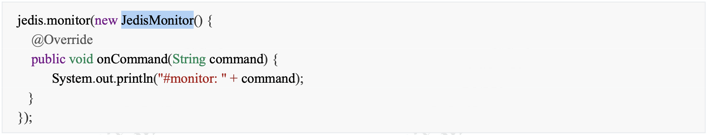

Facebook 的 开 源 项 目 redis-faina (https://github.com/facebookarchive/redis-faina.git)就是基于这个原理实现的。 它是一个 python 脚本，可以分析 monitor 的数据。

```shell
redis-cli -p 6379 monitor | head -n 100000 | ./redis-faina.py
```

这种方法也会有两个问题:

1. monitor 命令在高并发的场景下，会影响性能，所以不适合长时间使用。
2. 只能统计一个 Redis 节点的热点 key。

#### 机器层面

还有一种方法就是机器层面的，通过对 TCP 协议进行抓包，也有一些开源的方案， 比如 ELK 的 packetbeat 插件。

当我们发现了热点 key 之后，我们来看下热点数据在高并发的场景下可能会出现的问题，以及怎么去解决。

### 缓存雪崩

#### 什么是缓存雪崩

缓存雪崩就是 Redis 的大量热点数据同时过期(失效)，因为设置了相同的过期时间，刚好这个时候 Redis 请求的并发量又很大，就会导致所有的请求落到数据库。

#### 缓存雪崩的解决方案

1. 加互斥锁或者使用队列，针对同一个 key 只允许一个线程到数据库查询
2. 缓存定时预先更新，避免同时失效
3. 通过加随机数，使 key 在不同的时间过期
4. 缓存永不过期

### 缓存穿透

#### 缓存穿透何时发生

我们已经知道了 Redis 使用的场景了。在缓存存在和缓存不存在的情况下的什么情况我们都了解了。

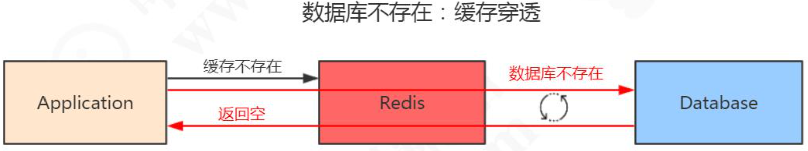

还有一种情况，数据在数据库和 Redis 里面都不存在，可能是一次条件错误的查询。 在这种情况下，因为数据库值不存在，所以肯定不会写入 Redis，那么下一次查询相同的 key 的时候，肯定还是会再到数据库查一次。那么这种循环查询数据库中不存在的值，并且每次使用的是相同的 key 的情况，我们有没有什么办法避免应用到数据库查询呢?

(1)缓存空数据 (2)缓存特殊字符串，比如&&

我们可以在数据库缓存一个空字符串，或者缓存一个特殊的字符串，那么在应用里 面拿到这个特殊字符串的时候，就知道数据库没有值了，也没有必要再到数据库查询了。

但是这里需要设置一个过期时间，不然的话数据库已经新增了这一条记录，应用也还是拿不到值。

这个是应用重复查询同一个不存在的值的情况，如果应用每一次查询的不存在的值是不一样的呢?即使你每次都缓存特殊字符串也没用，因为它的值不一样，比如我们的用户系统登录的场景，如果是恶意的请求，它每次都生成了一个符合 ID 规则的账号，但是这个账号在我们的数据库是不存在的，那 Redis 就完全失去了作用。

这种因为==每次查询的值都不存在导致的 Redis 失效的情况，我们就把它叫做缓存穿透。==这个问题我们应该怎么去解决呢?

#### 经典面试题

其实它也是一个通用的问题，关键就在于我们怎么知道请求的 key 在我们的数据库里面是否存在，如果数据量特别大的话，我们怎么去快速判断。

这也是一个非常经典的面试题:

如何在海量元素中(例如 10 亿无序、不定长、不重复)快速判断一个元素是否存在?

如果是缓存穿透的这个问题，我们要避免到数据库查询不存的数据，肯定要把这 10 亿放在别的地方。这些数据在 Redis 里面也是没有的，为了加快检索速度，我们要把数据放到内存里面来判断，问题来了:

如果我们直接把这些元素的值放到基本的数据结构(List、Map、Tree)里面，比如 一个元素 1 字节的字段，10 亿的数据大概需要 900G 的内存空间，这个对于普通的服务器来说是承受不了的。

所以，我们存储这几十亿个元素，不能直接存值，我们应该找到一种最简单的最节省空间的数据结构，用来标记这个元素有没有出现。

这个东西我们就把它叫做位图，他是一个有序的数组，只有两个值，0 和 1。0 代表不存在，1 代表存在。


那我们怎么用这个数组里面的有序的位置来标记这 10 亿个元素是否存在呢?我们是不是必须要有一个映射方法，把元素映射到一个下标位置上?

对于这个映射方法，我们有几个基本的要求:

1. 因为我们的值长度是不固定的，我希望不同长度的输入，可以得到固定长度的输出。
2. 转换成下标的时候，我希望他在我的这个有序数组里面是分布均匀的，不然的话全部挤到一对去了，我也没法判断到底哪个元素存了，哪个元素没存。

这个就是哈希函数，比如 MD5、SHA-1 等等这些都是常见的哈希算法。

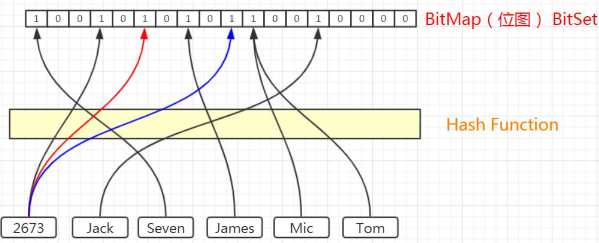

比如，这 6 个元素，我们经过哈希函数和位运算，得到了相应的下标。

#### 哈希碰撞

这个时候，Tom 和 Mic 经过计算得到的哈希值是一样的，那么再经过位运算得到的下标肯定是一样的，我们把这种情况叫做哈希冲突或者哈希碰撞。

如果发生了哈希碰撞，这个时候对于我们的容器存值肯定是有影响的，我们可以通过哪些方式去降低哈希碰撞的概率呢?

第一种就是扩大维数组的长度或者说位图容量。因为我们的函数是分布均匀的，所以，位图容量越大，在同一个位置发生哈希碰撞的概率就越小。

是不是位图容量越大越好呢?不管存多少个元素，都创建一个几万亿大小的位图，可以吗?当然不行，因为越大的位图容量，意味着越多的内存消耗，所以我们要创建一个合适大小的位图容量。

除了扩大位图容量，我们还有什么降低哈希碰撞概率的方法呢?

如果两个元素经过一次哈希计算，得到的相同下标的概率比较高，我可以不可以计算多次呢? 原来我只用一个哈希函数，现在我对于每一个要存储的元素都用多个哈希函数计算，这样每次计算出来的下标都相同的概率就小得多了。

同样的，我们能不能引入很多个哈希函数呢?比如都计算100次，都可以吗?当然也会有问题，第一个就是它会填满位图的更多空间，第二个是计算是需要消耗时间的。

所以总的来说，我们既要节省空间，又要很高的计算效率，就必须在位图容量和函数个数之间找到一个最佳的平衡。

比如说:我们存放100万个元素，到底需要多大的位图容量，需要多少个哈希函数呢?

#### 布隆过滤器原理

当然，这个事情早就有人研究过了，在 1970 年的时候，有一个叫做布隆的前辈对于判断海量元素中元素是否存在的问题进行了研究，也就是到底需要多大的位图容量和多少个哈希函数，它发表了一篇论文，提出的这个容器就叫做布隆过滤器。

我们来看一下布隆过滤器的工作原理。

首先，布隆过滤器的本质就是我们刚才分析的，一个位数组，和若干个哈希函数。

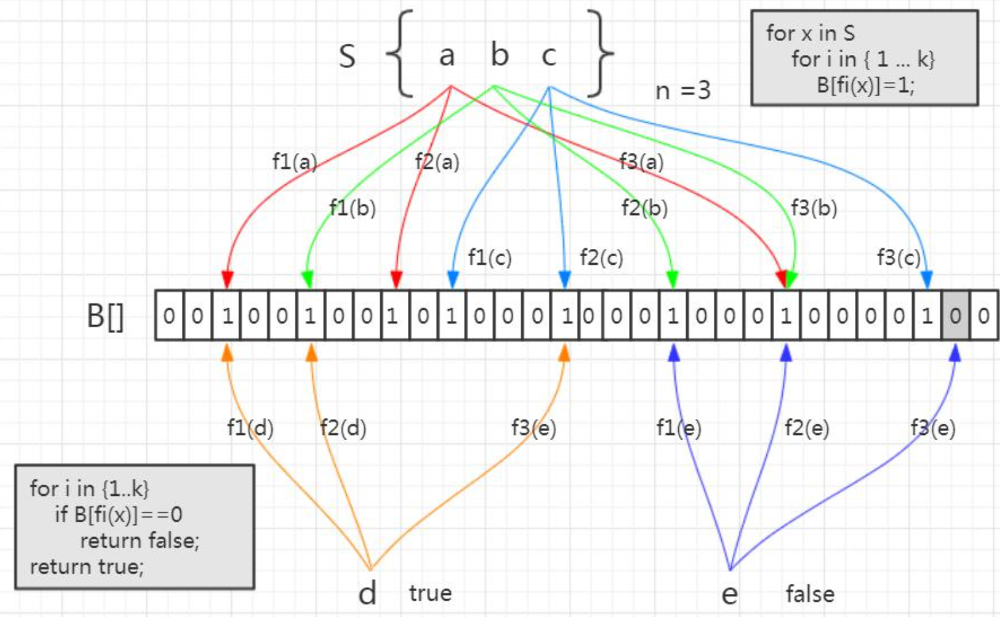

集合里面有 3 个元素，要把它存到布隆过滤器里面去，应该怎么做?首先是 a 元素， 这里我们用 3 次计算。b、c 元素也一样。

元素已经存进去之后，现在我要来判断一个元素在这个容器里面是否存在，就要使用同样的三个函数进行计算。

比如 d 元素，我用第一个函数 f1 计算，发现这个位置上是 1，没问题。第二个位置也是 1，第三个位置也是 1 。

如果经过三次计算得到的下标位置值都是 1，这种情况下，能不能确定 d 元素一定在这个容器里面呢? 实际上是不能的。比如这张图里面，这三个位置分别是把 a,b,c 存进去的时候置成 1 的，所以即使 d 元素之前没有存进去，也会得到三个 1，判断返回 true。

所以，**这个是布隆过滤器的一个很重要的特性，因为哈希碰撞不可避免，所以它会存在一定的误判率。这种把本来不存在布隆过滤器中的元素误判为存在的情况，我们把它叫做假阳性(False Positive Probability，FPP)。**

我们再来看另一个元素，e 元素。我们要判断它在容器里面是否存在，一样地要用这三个函数去计算。第一个位置是 1，第二个位置是 1，第三个位置是 0。

e 元素是不是一定不在这个容器里面呢? 可以确定一定不存在。如果说当时已经把e 元素存到布隆过滤器里面去了，那么这三个位置肯定都是 1，不可能出现 0。

总结:布隆过滤器的特点:

从容器的角度来说:

1. 如果布隆过滤器判断元素在集合中存在，不一定存在
2. 如果布隆过滤器判断不存在，一定不存在

从元素的角度来说:

1. 如果元素实际存在，布隆过滤器一定判断存在
2. 如果元素实际不存在，布隆过滤器可能判断存在

利用，`如果布隆过滤器判断不存在，一定不存在`的特性，我们是不是就能解决持续从数据库查询不存在的值的问题?

##### Guava 的实现

谷歌的 Guava 里面就提供了一个现成的布隆过滤器。

```xml
<dependency> 
    <groupId>com.google.guava</groupId> 
    <artifactId>guava</artifactId>
    <version>21.0</version> 
</dependency>
```

创建布隆过滤器:

```java
BloomFilter<String> bf = BloomFilter.create( Funnels.stringFunnel(Charsets.UTF_8), insertions);
```

布隆过滤器提供的存放元素的方法是 put()。 

布隆过滤器提供的判断元素是否存在的方法是 mightContain()。

```java
if (bf.mightContain(data)) {
    if (sets.contains(data)) {
        // 判断存在实际存在的时候，命中 right++;
        continue;
    }
    // 判断存在却不存在的时候，错误
    wrong++; 
}
```

布隆过滤器把误判率默认设置为 0.03，也可以在创建的时候指定。

```java
public static <T> BloomFilter<T> create(Funnel<? super T> funnel, long expectedInsertions) { 
	return create(funnel, expectedInsertions, 0.03D);
}
```

位图的容量是基于元素个数和误判率计算出来的。

```java
long numBits = optimalNumOfBits(expectedInsertions, fpp);
```

根据位数组的大小，我们进一步计算出了哈希函数的个数。

```java
int numHashFunctions = optimalNumOfHashFunctions(expectedInsertions, numBits);
```

存储 100 万个元素只占用了 0.87M 的内存，生成了 5 个哈希函数。

https://hur.st/bloomfilter/?n=1000000&p=0.03&m=&k=

##### 布隆过滤器在项目中的使用

布隆过滤器的工作位置:

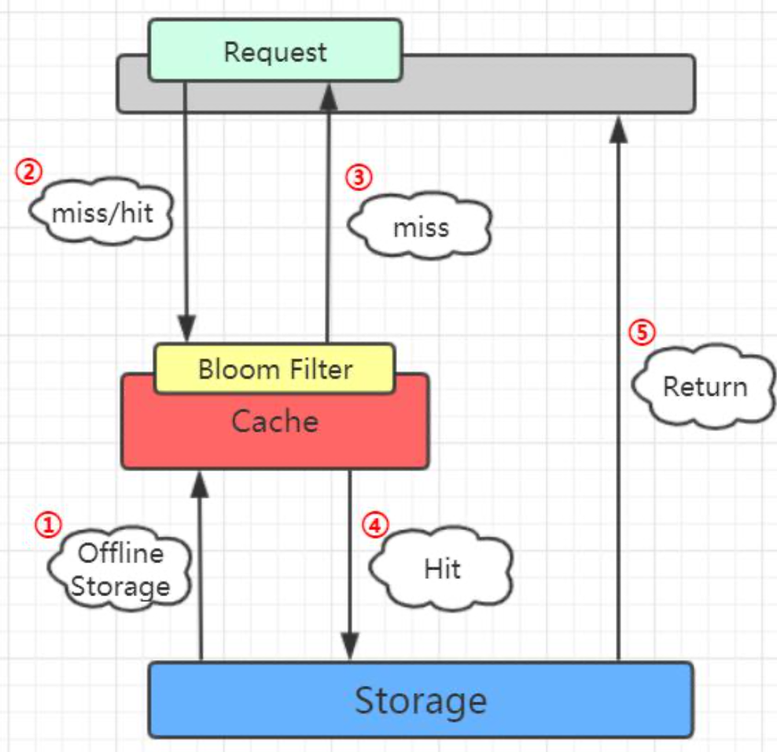

因为要判断数据库的值是否存在，所以==第一步是加载数据库所有的数据==。在去 Redis 查询之前，先在布隆过滤器查询，如果 bf 说没有，那数据库肯定没有，也不用去查了。 如果 bf 说有，才走之前的流程。

代码：

```java
@RunWith(SpringJUnit4ClassRunner.class)
@SpringBootTest
@EnableAutoConfiguration
public class BloomTestsConcurrency {
    @Resource
    private RedisTemplate redisTemplate;

    @Autowired
    private UserService userService;

    private static final int THREAD_NUM = 1000; // 并发线程数量，Windows机器不要设置过大

    static BloomFilter<String> bf;

    static List<User> allUsers;

    @PostConstruct
    public void init() {
        // 从数据库获取数据，加载到布隆过滤器
        long start = System.currentTimeMillis();
        allUsers = userService.getAllUser();
        if (allUsers == null || allUsers.size() == 0) {
            return;
        }
        // 创建布隆过滤器，默认误判率0.03，即3%
        bf = BloomFilter.create(Funnels.stringFunnel(Charsets.UTF_8), allUsers.size());
        // 误判率越低，数组长度越长，需要的哈希函数越多
        // bf = BloomFilter.create(Funnels.stringFunnel(Charsets.UTF_8), allUsers.size(), 0.0001);
        // 将数据存入布隆过滤器
        for (User user : allUsers) {
            bf.put(user.getAccount());
        }
        long end = System.currentTimeMillis();
        System.out.println("查询并加载"+allUsers.size()+"条数据到布隆过滤器完毕，总耗时："+(end -start ) +"毫秒");
    }

    @Test
    public void cacheBreakDownTest() {
        long start = System.currentTimeMillis();
        allUsers = userService.getAllUser();
        CyclicBarrier cyclicBarrier = new CyclicBarrier(THREAD_NUM);
        ExecutorService executorService = Executors.newFixedThreadPool(THREAD_NUM);
        for (int i = 0; i < THREAD_NUM; i++){
            executorService.execute(new BloomTestsConcurrency().new MyThread(cyclicBarrier, redisTemplate, userService));
        }

        executorService.shutdown();
        //判断是否所有的线程已经运行完
        while (!executorService.isTerminated()) {

        }

        long end = System.currentTimeMillis();
        System.out.println("并发数："+THREAD_NUM + "，新建线程以及过滤总耗时："+(end -start ) +"毫秒，演示结束");
    }

    public class MyThread implements Runnable {
        private CyclicBarrier cyclicBarrier;
        private RedisTemplate redisTemplate;
        private UserService userService;

        public MyThread(CyclicBarrier cyclicBarrier, RedisTemplate redisTemplate, UserService userService) {
            this.cyclicBarrier = cyclicBarrier;
            this.redisTemplate = redisTemplate;
            this.userService = userService;
        }

        @Override
        public void run() {
            //所有子线程等待，当子线程全部创建完成再一起并发执行后面的代码
            try {
                cyclicBarrier.await();
            } catch (InterruptedException e) {
                e.printStackTrace();
            } catch (BrokenBarrierException e) {
                e.printStackTrace();
            }

            // 1.1 （测试：布隆过滤器判断不存在，拦截——如果没有布隆过滤器，将造成缓存穿透）
            // 随机产生一个字符串，在布隆过滤器中不存在
            String randomUser = UUID.randomUUID().toString();
            // 1.2 （测试：布隆过滤器判断存在，从Redis缓存取值，如果Redis为空则查询数据库并写入Redis）
            // 从List中获取一个存在的用户
            // String randomUser = allUsers.get(new Random().nextInt(allUsers.size())).getAccount();
            String key = "Key:" + randomUser;

            Date date1 = new Date();
            SimpleDateFormat sdf = new SimpleDateFormat("yyyy-MM-dd HH:mm:ss");

            // 如果布隆过滤器中不存在这个用户直接返回，将流量挡掉
/*            if (!bf.mightContain(randomUser)) {
                System.out.println(sdf.format(date1)+" 布隆过滤器中不存在，非法请求");
                return;
            }*/

            // 查询缓存，如果缓存中存在直接返回缓存数据
            ValueOperations<String, String> operation =
                    (ValueOperations<String, String>) redisTemplate.opsForValue();
            Object cacheUser = operation.get(key);
            if (cacheUser != null) {
                Date date2 = new Date();
                System.out.println(sdf.format(date2)+" 命中redis缓存");
                return;
            }

            // TODO 防止并发重复写缓存，加锁
            synchronized (randomUser) {
                // 如果缓存不存在查询数据库
                List<User> user = userService.getUserByAccount(randomUser);
                if (user == null || user.size() == 0) {
                    // 很容易发生连接池不够用的情况 HikariPool-1 - Connection is not available, request timed out after
                    System.out.println(" Redis缓存不存在，查询数据库也不存在，发生缓存穿透！！！");
                    return;
                }
                // 将mysql数据库查询到的数据写入到redis中
                Date date3 = new Date();
                System.out.println(sdf.format(date3)+" 从数据库查询并写入Reids");
                operation.set("Key:" + user.get(0).getAccount(), user.get(0).getAccount());
            }
        }

    }


}
```

##### 布隆过滤器的其他应用场景

布隆过滤器解决的问题是什么?如何在海量元素中快速判断一个元素是否存在。所以除了解决缓存穿透的问题之外，我们还有很多其他的用途。

比如爬数据的爬虫，爬过的 url 我们不需要重复爬，那么在几十亿的 url 里面，怎么判断一个 url 是不是已经爬过了?

还有我们的邮箱服务器，发送垃圾邮件的账号我们把它们叫做 spamer，在这么多的邮箱账号里面，怎么判断一个账号是不是 spamer 等等一些场景，我们都可以用到布隆过滤器。