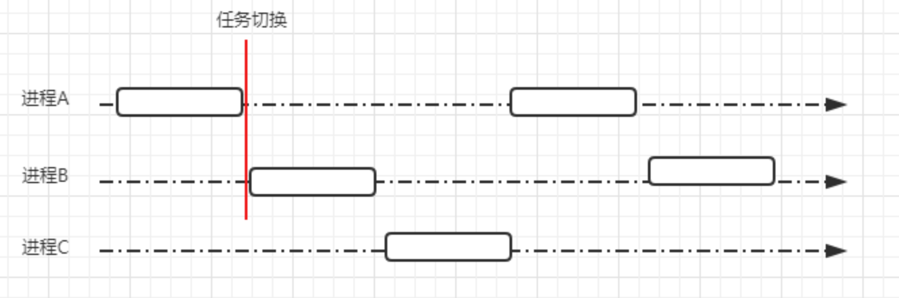
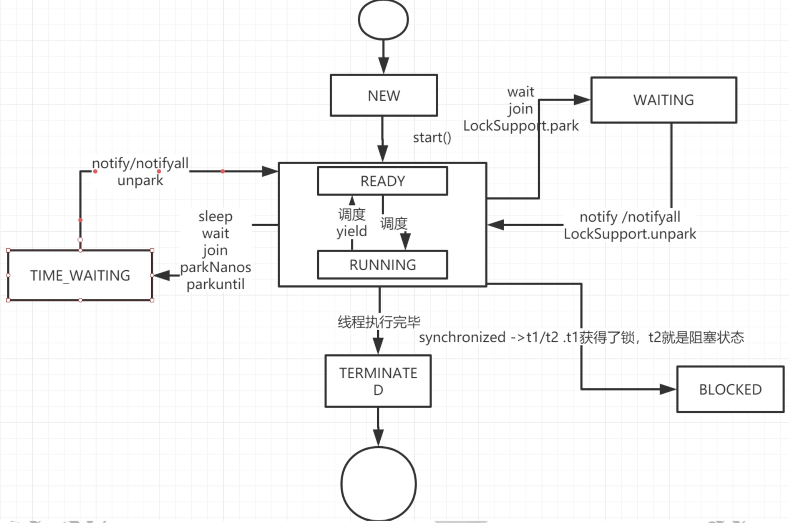
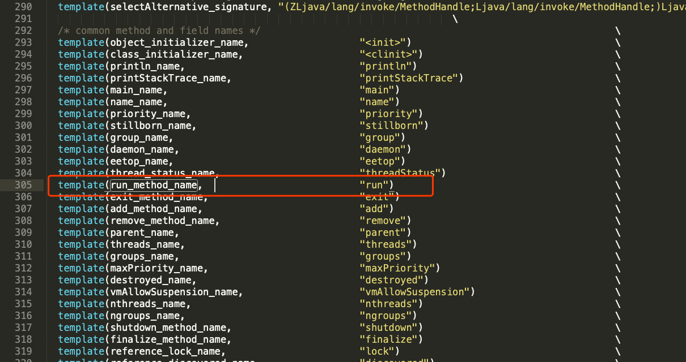

# 并发编程的基础

## 进程

进程的本质是一个正在执行的程序，程序运行时系统会创建一个进程，并且给每个进程分配独立的内存地址空间保证每个进程地址不会相互干扰。同时，在CPU对进程做时间片切换时，保证进程切换过程中仍然要从进程切换之前运行的位置开始执行。所以进程通常还会包括程序计数器、堆栈指针。



有了进程以后，可以让操作系统从宏观层面实现多应用并发。而**并发的实现是通过CPU时间片不断切换执行的。对于单核CPU来说，在任意一个时刻只会有一个进程在被CPU调度。**

## 线程

有了进程以后，为什么还要发明线程呢？

1. 在多核CPU中，利用多线程可以实现真正意义上的并行执行
2. 在一个应用进程中，会存在多个同时执行的任务，如果其中一个任务被阻塞，将会引起不依赖该任务的其他任务也被阻塞。通过对不同任务创建不同的线程去处理，可以提成程序处理的实时性。
3. 线程可以认为是轻量级进程，所以线程的创建、销毁比进程更快。

### 线程的应用

在Java中，有多种方式来实现多线程。继承Thread类、实现Runnable接口、使用ExecutorService、Callable、Future实现带返回结果的多线程。

#### 继承Thread类创建线程

Thread类本质上是实现了Runnable接口的一个实例，代表一个线程的实例。启动线程的唯一方法就是通过Thread类的start()实例方法。start()方法是一个native方法，它会启动一个新线程，并执行run()方法。这种方式实现多线程很简单，通过自己的类直接extend Thread，并复写run()方法，就可以启动新线程并执行自己定义的run()方法。

```java
package create.thread;

public class MyThread extends Thread {
    @Override
    public void run() {
        System.out.println(Thread.currentThread().getName());
    }

    public static void main(String[] args) {
        System.out.println(Thread.currentThread().getName());
        MyThread myThread0 = new MyThread();
        MyThread myThread1 = new MyThread();

        myThread0.start();
        myThread1.start();
    }
}
```

执行结果：

```
main
Thread-0
Thread-1
```

#### 实现Runnable接口创建线程

如果自己的类已经extends另一个类，就无法直接extends Thread，此时可以实现一个Runnable接口.

```java
package create.thread;

import java.util.ArrayList;

public class MyRunnable extends ArrayList implements Runnable {
    public void run() {
        System.out.println(Thread.currentThread().getName());
    }

    public static void main(String[] args) {
        System.out.println(Thread.currentThread().getName());

        Thread thread0 = new Thread(new MyRunnable());
        Thread thread1 = new Thread(new MyRunnable());

        thread0.start();
        thread1.start();
    }
}
```

执行结果：

```
main
Thread-0
Thread-1
```

#### 实现Callable接口创建线程

有的时候，我们可以需要让执行的线程在执行完成以后，提供一个返回值给到当前线程，主线程需要依赖这个值进行后续的逻辑处理，那么这个时候就需要用到带返回值的线程了。Java中提供了这样的实现方法。

```java
package create.thread;

import java.util.concurrent.*;

public class MyCallableDemo implements Callable<String> {
    public String call() throws Exception {
        int a = 1;
        int b = 2;

        return "执行结果：" + (a + b);
    }

    public static void main(String[] args) throws ExecutionException, InterruptedException {

        ExecutorService executorService = Executors.newFixedThreadPool(1);

        MyCallableDemo callableDemo = new MyCallableDemo();

        Future<String> future = executorService.submit(callableDemo);
        System.out.println(future.get());
        
        executorService.shutdown();

    }
}
```

执行结果：

```
执行结果：3
```

### 线程的生命周期

**Java线程既然能够创建，那么也势必会被销毁，所以线程是存在生命周期的。线程一共有6种状态（NEW、RUNNABLE、BLOCKED、WAITING、TIME_WAITING、TERMINATED）。**

#### NEW

初始化状态，线程被构建，但是还没有调用start方法。

#### RUNNABLE

运行状态，Java线程把操作系统中的就绪和运行两种状态统一称为“运行中”。

#### BLOCKED

阻塞状态，标识线程进入等待状态，也就是线程因为某种原因放弃了CPU使用权，阻塞也分为几种情况：

1. 等待阻塞：运行的线程执行wait方法，jvm会把当前线程放入到等待队列。
2. 同步阻塞：运行的线程在获取对象的同步锁时，若该同步锁被其他线程锁占用了，那么jvm会把当前的线程放入的锁池中。
3. 其他阻塞：运行的线程执行Thread.sleep或者t.join方法，或者发出了I/O请求时，JVM会把当前线程设置为阻塞状态，当sleep结束、join线程终止、io处理完毕则线程恢复。

#### WAITING

等待其他线程做出通知或中断

#### TIME_WAITING

超时等待状态，超时以后自动返回。

#### TERMINATED

终止状态，标识当前线程执行完毕



#### 通过代码演示线程的状态

##### 实例代码

```java
package create.thread;

import java.util.concurrent.TimeUnit;

public class ThreadStatus {

    public static void main(String[] args) {
        // TIME_WAITING
        new Thread(() -> {
            while (true) {
                try {
                    TimeUnit.SECONDS.sleep(100);
                } catch (InterruptedException e) {
                    e.printStackTrace();
                }
            }
        }, "timeWaiting").start();
        // WAITING，线程在ThreadStatus类锁上通过wait进行等待
        new Thread(() -> {
            while (true) {
                synchronized (ThreadStatus.class) {
                    try {
                        ThreadStatus.class.wait();
                    } catch (InterruptedException e) {
                        e.printStackTrace();
                    }
                }
            }
        }, "Waiting").start();
        //线程在TrheadStatus加锁后，不会释放锁
        new Thread(new BlockedDemo(), "BlockDemo-01").start();
        new Thread(new BlockedDemo(), "BlockDemo-02").start();

    }

    static class BlockedDemo extends Thread {
        public void run(){
            synchronized (BlockedDemo.class) {
                while (true) {
                    try {
                        TimeUnit.SECONDS.sleep(100);
                    } catch (InterruptedException e) {
                        e.printStackTrace();
                    }
                }
            }
        }
    }
}
```

启动一个线程前，最好为这个线程设置线程名称，因为这样在使用jstack分析程序或者进行问题排查时，就会给开发人员提供一些提示。

现实线程状态：

- 运行该示例，打开终端或者命令提示符，键入“jps”（JDK1.5提供的一个现实当前所有java进程pid的命令）。
- 根据上一步获得的pId，继续输入jstack pid (jstack是java虚拟机自带的一种堆栈跟踪工具，jstack用于打印出给定的Java进程ID或core file或远程调试服务的Java堆栈信息)


得到的结果如下：

```verilog
Full thread dump Java HotSpot(TM) 64-Bit Server VM (25.111-b14 mixed mode):

"Attach Listener" #18 daemon prio=9 os_prio=31 tid=0x00007fed200a9000 nid=0x5903 waiting on condition [0x0000000000000000]
   java.lang.Thread.State: RUNNABLE

"DestroyJavaVM" #17 prio=5 os_prio=31 tid=0x00007fed20825000 nid=0x1803 waiting on condition [0x0000000000000000]
   java.lang.Thread.State: RUNNABLE

"BlockDemo-02" #16 prio=5 os_prio=31 tid=0x00007fed1e8d0800 nid=0xa103 waiting for monitor entry [0x00007000076c0000]
   java.lang.Thread.State: BLOCKED (on object monitor)
	at create.thread.ThreadStatus$BlockedDemo.run(ThreadStatus.java:41)
	- waiting to lock <0x000000076b0c5bc8> (a java.lang.Class for create.thread.ThreadStatus$BlockedDemo)
	at java.lang.Thread.run(Thread.java:745)

"BlockDemo-01" #14 prio=5 os_prio=31 tid=0x00007fed1e8cf800 nid=0xa303 waiting on condition [0x00007000075bd000]
   java.lang.Thread.State: TIMED_WAITING (sleeping)
	at java.lang.Thread.sleep(Native Method)
	at java.lang.Thread.sleep(Thread.java:340)
	at java.util.concurrent.TimeUnit.sleep(TimeUnit.java:386)
	at create.thread.ThreadStatus$BlockedDemo.run(ThreadStatus.java:41)
	- locked <0x000000076b0c5bc8> (a java.lang.Class for create.thread.ThreadStatus$BlockedDemo)
	at java.lang.Thread.run(Thread.java:745)

"Waiting" #12 prio=5 os_prio=31 tid=0x00007fed1e8cf000 nid=0xa503 in Object.wait() [0x00007000074ba000]
   java.lang.Thread.State: WAITING (on object monitor)
	at java.lang.Object.wait(Native Method)
	- waiting on <0x000000076ada2648> (a java.lang.Class for create.thread.ThreadStatus)
	at java.lang.Object.wait(Object.java:502)
	at create.thread.ThreadStatus.lambda$main$1(ThreadStatus.java:23)
	- locked <0x000000076ada2648> (a java.lang.Class for create.thread.ThreadStatus)
	at create.thread.ThreadStatus$$Lambda$2/668386784.run(Unknown Source)
	at java.lang.Thread.run(Thread.java:745)

"timeWaiting" #11 prio=5 os_prio=31 tid=0x00007fed1e8ce000 nid=0x5703 waiting on condition [0x00007000073b7000]
   java.lang.Thread.State: TIMED_WAITING (sleeping)
	at java.lang.Thread.sleep(Native Method)
	at java.lang.Thread.sleep(Thread.java:340)
	at java.util.concurrent.TimeUnit.sleep(TimeUnit.java:386)
	at create.thread.ThreadStatus.lambda$main$0(ThreadStatus.java:12)
	at create.thread.ThreadStatus$$Lambda$1/764977973.run(Unknown Source)
	at java.lang.Thread.run(Thread.java:745)

"Service Thread" #10 daemon prio=9 os_prio=31 tid=0x00007fed20821800 nid=0xa803 runnable [0x0000000000000000]
   java.lang.Thread.State: RUNNABLE

"C1 CompilerThread3" #9 daemon prio=9 os_prio=31 tid=0x00007fed1e8c3000 nid=0x5503 waiting on condition [0x0000000000000000]
   java.lang.Thread.State: RUNNABLE

"C2 CompilerThread2" #8 daemon prio=9 os_prio=31 tid=0x00007fed22004800 nid=0x3f03 waiting on condition [0x0000000000000000]
   java.lang.Thread.State: RUNNABLE

"C2 CompilerThread1" #7 daemon prio=9 os_prio=31 tid=0x00007fed1e8c2800 nid=0x3e03 waiting on condition [0x0000000000000000]
   java.lang.Thread.State: RUNNABLE

"C2 CompilerThread0" #6 daemon prio=9 os_prio=31 tid=0x00007fed21021000 nid=0x4303 waiting on condition [0x0000000000000000]
   java.lang.Thread.State: RUNNABLE

"Monitor Ctrl-Break" #5 daemon prio=5 os_prio=31 tid=0x00007fed1e8c4000 nid=0x3d03 runnable [0x0000700006ca2000]
   java.lang.Thread.State: RUNNABLE
	at java.net.SocketInputStream.socketRead0(Native Method)
	at java.net.SocketInputStream.socketRead(SocketInputStream.java:116)
	at java.net.SocketInputStream.read(SocketInputStream.java:170)
	at java.net.SocketInputStream.read(SocketInputStream.java:141)
	at sun.nio.cs.StreamDecoder.readBytes(StreamDecoder.java:284)
	at sun.nio.cs.StreamDecoder.implRead(StreamDecoder.java:326)
	at sun.nio.cs.StreamDecoder.read(StreamDecoder.java:178)
	- locked <0x000000076ac831d0> (a java.io.InputStreamReader)
	at java.io.InputStreamReader.read(InputStreamReader.java:184)
	at java.io.BufferedReader.fill(BufferedReader.java:161)
	at java.io.BufferedReader.readLine(BufferedReader.java:324)
	- locked <0x000000076ac831d0> (a java.io.InputStreamReader)
	at java.io.BufferedReader.readLine(BufferedReader.java:389)
	at com.intellij.rt.execution.application.AppMainV2$1.run(AppMainV2.java:64)

"Signal Dispatcher" #4 daemon prio=9 os_prio=31 tid=0x00007fed22802000 nid=0x3b03 runnable [0x0000000000000000]
   java.lang.Thread.State: RUNNABLE

"Finalizer" #3 daemon prio=8 os_prio=31 tid=0x00007fed22003000 nid=0x4b03 in Object.wait() [0x0000700006a9c000]
   java.lang.Thread.State: WAITING (on object monitor)
	at java.lang.Object.wait(Native Method)
	- waiting on <0x000000076ab08e98> (a java.lang.ref.ReferenceQueue$Lock)
	at java.lang.ref.ReferenceQueue.remove(ReferenceQueue.java:143)
	- locked <0x000000076ab08e98> (a java.lang.ref.ReferenceQueue$Lock)
	at java.lang.ref.ReferenceQueue.remove(ReferenceQueue.java:164)
	at java.lang.ref.Finalizer$FinalizerThread.run(Finalizer.java:209)

"Reference Handler" #2 daemon prio=10 os_prio=31 tid=0x00007fed22002000 nid=0x3503 in Object.wait() [0x0000700006999000]
   java.lang.Thread.State: WAITING (on object monitor)
	at java.lang.Object.wait(Native Method)
	- waiting on <0x000000076ab06b40> (a java.lang.ref.Reference$Lock)
	at java.lang.Object.wait(Object.java:502)
	at java.lang.ref.Reference.tryHandlePending(Reference.java:191)
	- locked <0x000000076ab06b40> (a java.lang.ref.Reference$Lock)
	at java.lang.ref.Reference$ReferenceHandler.run(Reference.java:153)

"VM Thread" os_prio=31 tid=0x00007fed20010000 nid=0x3303 runnable

"GC task thread#0 (ParallelGC)" os_prio=31 tid=0x00007fed1e805000 nid=0x1c07 runnable

"GC task thread#1 (ParallelGC)" os_prio=31 tid=0x00007fed20800800 nid=0x2a03 runnable

"GC task thread#2 (ParallelGC)" os_prio=31 tid=0x00007fed20801800 nid=0x2c03 runnable

"GC task thread#3 (ParallelGC)" os_prio=31 tid=0x00007fed20802000 nid=0x5303 runnable

"GC task thread#4 (ParallelGC)" os_prio=31 tid=0x00007fed20802800 nid=0x2e03 runnable

"GC task thread#5 (ParallelGC)" os_prio=31 tid=0x00007fed1e806000 nid=0x3003 runnable

"GC task thread#6 (ParallelGC)" os_prio=31 tid=0x00007fed1e80b000 nid=0x5103 runnable

"GC task thread#7 (ParallelGC)" os_prio=31 tid=0x00007fed1e80c000 nid=0x3203 runnable

"GC task thread#8 (ParallelGC)" os_prio=31 tid=0x00007fed20803000 nid=0x4f03 runnable

"GC task thread#9 (ParallelGC)" os_prio=31 tid=0x00007fed20804000 nid=0x4d03 runnable

"VM Periodic Task Thread" os_prio=31 tid=0x00007fed1e8cd800 nid=0xa603 waiting on condition

JNI global references: 325
```

通过上面的分析，我们学习了线程的生命周期，现在在整个生命周期中并不是固定的处于某个状态，而是随着代码的执行在不同的状态之间进行切换。


### 线程启动

前面我们通过一些案例演示了线程的启动，也就是调用start()方法去启动一个线程，当run()方法中的代码执行完毕以后，线程的生命周期也将终止。调用start()方法的语义是当前线程告诉JVM，启动调用start()方法的线程。

#### 线程的启动原理

启动一个线程为什么是调用start()方法，而不是run()方法，这做一个简单的分析，先简单看一下start方法的定义：

```java
...
public synchronized void start() {
    /**
     * This method is not invoked for the main method thread or "system"
     * group threads created/set up by the VM. Any new functionality added
     * to this method in the future may have to also be added to the VM.
     *
     * A zero status value corresponds to state "NEW".
     */
    if (threadStatus != 0)
        throw new IllegalThreadStateException();

    /* Notify the group that this thread is about to be started
     * so that it can be added to the group's list of threads
     * and the group's unstarted count can be decremented. */
    group.add(this);

    boolean started = false;
    try {
        start0();
        started = true;
    } finally {
        try {
            if (!started) {
                group.threadStartFailed(this);
            }
        } catch (Throwable ignore) {
            /* do nothing. If start0 threw a Throwable then
              it will be passed up the call stack */
        }
    }
}

private native void start0();
....
```

我们看到调用start()方法实际上是调用一个native方法start0()来启动一个线程，首先start0()这个方法是在Thread的静态块中来注册的，代码如下：

```java
public class Thread implements Runnable {
    /* Make sure registerNatives is the first thing <clinit> does. */
    private static native void registerNatives();
    static {
        registerNatives();
    }
```

registerNatives()的本地方法的定义在文件Thread.c，Thread.c定义了各个操作系统平台要用的关于线程的公共数据和操作，以下是Thread.c的内容：

```c
#include "jni.h"
#include "jvm.h"

#include "java_lang_Thread.h"

#define THD "Ljava/lang/Thread;"
#define OBJ "Ljava/lang/Object;"
#define STE "Ljava/lang/StackTraceElement;"

#define ARRAY_LENGTH(a) (sizeof(a)/sizeof(a[0]))

static JNINativeMethod methods[] = {
    {"start0",           "()V",        (void *)&JVM_StartThread},
    {"stop0",            "(" OBJ ")V", (void *)&JVM_StopThread},
    {"isAlive",          "()Z",        (void *)&JVM_IsThreadAlive},
    {"suspend0",         "()V",        (void *)&JVM_SuspendThread},
    {"resume0",          "()V",        (void *)&JVM_ResumeThread},
    {"setPriority0",     "(I)V",       (void *)&JVM_SetThreadPriority},
    {"yield",            "()V",        (void *)&JVM_Yield},
    {"sleep",            "(J)V",       (void *)&JVM_Sleep},
    {"currentThread",    "()" THD,     (void *)&JVM_CurrentThread},
    {"countStackFrames", "()I",        (void *)&JVM_CountStackFrames},
    {"interrupt0",       "()V",        (void *)&JVM_Interrupt},
    {"isInterrupted",    "(Z)Z",       (void *)&JVM_IsInterrupted},
    {"holdsLock",        "(" OBJ ")Z", (void *)&JVM_HoldsLock},
    {"getThreads",        "()[" THD,   (void *)&JVM_GetAllThreads},
    {"dumpThreads",      "([" THD ")[[" STE, (void *)&JVM_DumpThreads},
};

#undef THD
#undef OBJ
#undef STE

JNIEXPORT void JNICALL
Java_java_lang_Thread_registerNatives(JNIEnv *env, jclass cls)
{
    (*env)->RegisterNatives(env, cls, methods, ARRAY_LENGTH(methods));
}
```

从这段代码可以看出，start0()，实际会执行JVM_StatrThread方法，这个方法会调用Java中的run()方法，在JVM层面去启动一个线程。

源码jvm.cpp:

```c
JVM_ENTRY(void, JVM_StartThread(JNIEnv* env, jobject jthread))
  ....
      native_thread = new JavaThread(&thread_entry, sz);

  ....

  Thread::start(native_thread);

JVM_END
```

JVM_ENTRY是用来定义JVM_StartThread函数的，在这个函数里面```native_thread = new JavaThread(&thread_entry, sz);```创建了一个真正和系统平台有关的本地线程。

```Thread::start(native_thread);```启动了该线程。我们继续看```native_thread = new JavaThread(&thread_entry, sz);```都做了什么：

```c
JavaThread::JavaThread(ThreadFunction entry_point, size_t stack_sz) :
  Thread()
#if INCLUDE_ALL_GCS
  , _satb_mark_queue(&_satb_mark_queue_set),
  _dirty_card_queue(&_dirty_card_queue_set)
#endif // INCLUDE_ALL_GCS
{
  if (TraceThreadEvents) {
    tty->print_cr("creating thread %p", this);
  }
  initialize();
  _jni_attach_state = _not_attaching_via_jni;
  set_entry_point(entry_point);
  // Create the native thread itself.
  // %note runtime_23
  os::ThreadType thr_type = os::java_thread;
  thr_type = entry_point == &compiler_thread_entry ? os::compiler_thread :
                                                     os::java_thread;
  os::create_thread(this, thr_type, stack_sz);
  _safepoint_visible = false;
}
```

上面源码里可以看到```JavaThread::JavaThread(ThreadFunction entry_point, size_t stack_sz)```方法使用```os::create_thread(this, thr_type, stack_sz);```创建了一个本地线程。

接下来是线程启动，```Thread::start(native_thread);```方法：

```c
void Thread::start(Thread* thread) {
  trace("start", thread);
  // Start is different from resume in that its safety is guaranteed by context or
  // being called from a Java method synchronized on the Thread object.
  if (!DisableStartThread) {
    if (thread->is_Java_thread()) {
      // Initialize the thread state to RUNNABLE before starting this thread.
      // Can not set it after the thread started because we do not know the
      // exact thread state at that time. It could be in MONITOR_WAIT or
      // in SLEEPING or some other state.
      java_lang_Thread::set_thread_status(((JavaThread*)thread)->threadObj(),
                                          java_lang_Thread::RUNNABLE);
    }
    os::start_thread(thread);
  }
}
```

start()方法中又一个函数调用：```os::start_thread(thread);```，调用系统平台启动线程的方法，最终会调用到Thread.cpp文件中的JavaThread::run()方法：

```c
// The first routine called by a new Java thread
void JavaThread::run() {
  // initialize thread-local alloc buffer related fields
  this->initialize_tlab();

  // used to test validitity of stack trace backs
  this->record_base_of_stack_pointer();

  // Record real stack base and size.
  this->record_stack_base_and_size();

  // Initialize thread local storage; set before calling MutexLocker
  this->initialize_thread_local_storage();

  this->create_stack_guard_pages();

  this->cache_global_variables();

  // Thread is now sufficient initialized to be handled by the safepoint code as being
  // in the VM. Change thread state from _thread_new to _thread_in_vm
  ThreadStateTransition::transition_and_fence(this, _thread_new, _thread_in_vm);

  assert(JavaThread::current() == this, "sanity check");
  assert(!Thread::current()->owns_locks(), "sanity check");

  DTRACE_THREAD_PROBE(start, this);

  // This operation might block. We call that after all safepoint checks for a new thread has
  // been completed.
  this->set_active_handles(JNIHandleBlock::allocate_block());

  if (JvmtiExport::should_post_thread_life()) {
    JvmtiExport::post_thread_start(this);
  }

  EventThreadStart event;
  if (event.should_commit()) {
     event.set_javalangthread(java_lang_Thread::thread_id(this->threadObj()));
     event.commit();
  }

  // We call another function to do the rest so we are sure that the stack addresses used
  // from there will be lower than the stack base just computed
  thread_main_inner();

  // Note, thread is no longer valid at this point!
}

```

现在还没有看到Java中的run()方法是何时调用的。我们继续看。```native_thread = new JavaThread(&thread_entry, sz);```这里传入的参数是```thread_entry``` 我们看一下这里是如何定义的：

```c
static void thread_entry(JavaThread* thread, TRAPS) {
  HandleMark hm(THREAD);
  Handle obj(THREAD, thread->threadObj());
  JavaValue result(T_VOID);
  JavaCalls::call_virtual(&result,
                          obj,
                          KlassHandle(THREAD, SystemDictionary::Thread_klass()),
                          vmSymbols::run_method_name(), // 这里定义了调用java代码的方法名
                          vmSymbols::void_method_signature(),
                          THREAD);
}
```

```vmSymbols::run_method_name()```定义这个方法定义了执行java的方法。```vmSymbols.hpp```中的定义如下：



从上图中可以看到这里执行的方法名是run。

### 线程终止

线程的终止，并不是简单的调用stop()方法。虽然API仍然可以调用，但是和其他的线程控制方法如：suspend、resume一样都是过期了的不建议使用，就拿stop()来说，stop方法在结束一个线程时不会保证线程资源正常释放，因此会导致程序可能出现一些不确定的状态。要优雅的去中断一个线程，在线程中提供了一个interrupt（）方法。

#### interrupt()方法

当其他线程通过调用当前线程的interrupt()方法，表示向当前线程打招呼，告诉他可以中断线程的执行了，至于什么时候中断，取决于当前线程自己。

线程通过检查自身是否被中断来进行相应的处理，可以通过isinterrput()来判断是否被中断。

通过下面这个例子，来实现了线程终止逻辑：

```java
package interrput;

import java.util.concurrent.TimeUnit;

public class InterrputDemo {
    private static int i;

    public static void main(String[] args) throws InterruptedException {
        Thread thread = new Thread(() -> {
            // 默认情况下isInterrput()方法返回false、通过thread.interrupt()方法编程了true
            while (!Thread.currentThread().isInterrupted()) {
                i++;
            }
            System.out.println("Num:" + i);
        }, "interruptDemo");

        thread.start();

        TimeUnit.SECONDS.sleep(1);

        thread.interrupt(); // 这里看看加上和不加的效果
    }
}
```

这种通过标识位或者中断操作的方式能够使线程在终止时有机会去清理资源，而不是武断的将线程停止，因此这种终止线程的做法显得更加安全优雅。

#### Thread.interrupted

上面的案例中，通过interrput,设置了一个标识告诉线程可以终止了，线程中还提供了静态方法Thread.interrupted()对设置中断标识的线程复位。比如在上面的案例中，外面的线程调用Thread.interrupt()来设置中断标识，而在线程里面，又通过Thread.interrupted()把线程的标识进行复位。

```java
public class InteruptedDemo {

    public static void main(String[] args) throws InterruptedException {
        Thread thread = new Thread(() -> {
            while (true) {
                if (Thread.currentThread().isInterrupted()) {
                    System.out.println("before:" + Thread.currentThread().isInterrupted());
                    // 对线程进行复位
                    Thread.interrupted();

                    System.out.println("after:" + Thread.currentThread().isInterrupted());
                }
            }
        }, "interruptDemo");

        thread.start();
        TimeUnit.SECONDS.sleep(1);
        thread.interrupt();
        TimeUnit.SECONDS.sleep(1);
        thread.interrupt();
    }
}
```

#### 其他的线程复位

除了通过Thread.interrupted()方法对线程中断标识进行复位以外，还有一种被动复位的场景，就是对抛出InterruptedException异常的方法，在该异常抛出之前，JVM就会先把线程的中断标识清除，然后才会抛出InterruptedExcption,这个时候如果调用isInterrupted方法，将会返回false。

#### 为什么要复位

Thread.interrupted()是属于当前线程，是当前线程对外界中断信号的一个相应，表示自己已经得到中断信号，但不会立刻中断自己，具体什么时候中断由自己决定，让外界知道在自身中断前，他的中断状态仍然是false,这就是复位的原因。