# Synchronized

## 并发带来的问题

线程的合理使用能够提升程序的处理性能，主要有两个方面：

1. 能够利用多核CPU以及超线程技术来实现线程的并行执行
2. 线程的异步化执行相比于同步执行来说，异步执行能够很好的优化程序的处理性能提升并发吞吐量

以上两方面在提高处理性能的同时也带来了很多麻烦，举个简单的例子：多线程对于共享变量访问带来的安全性问题。

一个变量i，假如一个线程去访问这个变量进行修改，这个时候对于数据的修改和访问没有任何问题。但是如果多个线程对于这同一个变量进行修改，就会存在一个数据安全性问题。

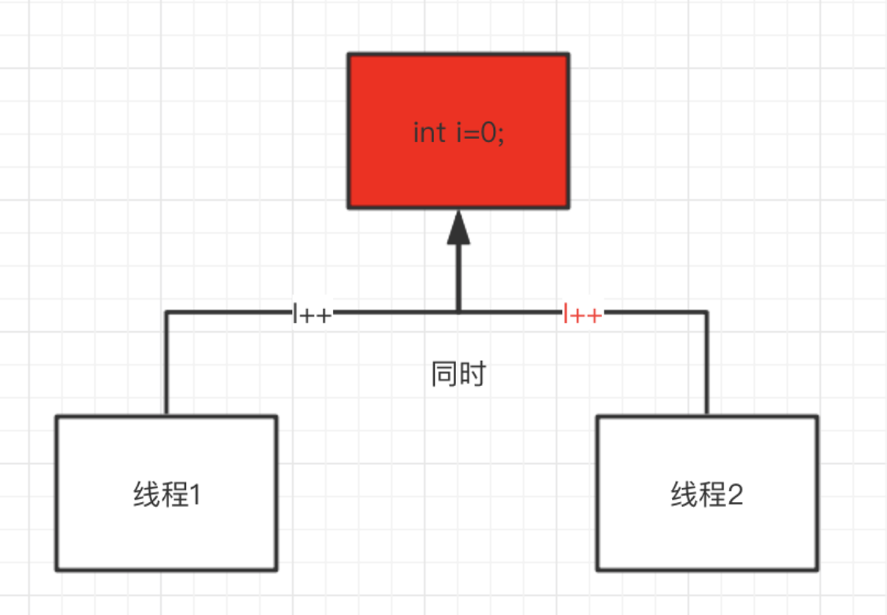

**对于线程安全性，本质上是管理对于数据状态的访问，而且这个状态通常是共享的、可变的。共享，是指这个数据变量可以被多个线程访问；可变，指这个变量的值在它生命周期内是可以改变的。**

一个对象是否线程安全的，取决于它是否会被多个线程访问，以及程序中是如何使用这个对象的。所以，如果多个线程访问同一个对象，在不需额外的同步以及调用端代码不做其他协调的情况下，这个共享对象的状态依然是正确的（正确性意味着这个对象的结果与我们预期规定的结果保持一致），那说明这个对象是线程安全的。

线程不安全的例子

```java
public class Demo {
    private static int count = 0;

    public static void inc() {
        try {
            Thread.sleep(1);
        } catch (InterruptedException e) {
            e.printStackTrace();
        }

        count++;
    }

    public static void main(String[] args) throws InterruptedException {
        for (int i = 0; i < 1000; i++) {
            new Thread(() -> Demo.inc()).start();
        }

        Thread.sleep(3000);

        System.out.println("运行结果：" + count);
    }
}
```

执行结果：

```
运行结果：989
```

## 如何解决

问题的本质在于共享数据存在并发访问。如果我们能够有一种方法使得线程的并行变成串行，那是不是就不存在这个问题了？

大家很多人会想到锁吧。毕竟这个场景并不陌生，我们在和数据库打交道的时候，就了解过悲观锁、乐观锁的概念。什么是锁？它是处理并发的一种同步手段，而如果需要达到前面我们说的目的，那么这个锁一定需要实现互斥性。

**Java 提供的加锁方法就是 Synchroinzed 关键字。**

## synchronized的基本认识

在多线程并发编程中synchronized一直是元老级别，很多人都会称呼它为重量级锁。但是，随着Java SE 1.6对synchronized进行了各种优化之后，有些情况下它就并不那么重了，Java SE 1.6中为了减少获得锁和释放锁带来的性能消耗而引入的偏向锁和轻量级锁。这块在后续展开。

### synchronized的基本语法

synchronized有三种方式来加锁，分别是：

1. 修饰实例方法，作用于当前实例加锁，进入同步代码前要获得当前实例的锁。
2. 静态方法，作用于当前类对象加锁，进入同步代码前要获得当前类对象的锁。
3. 修饰代码块，指定加锁对象，对给指定对象加锁，进入同步代码库前要获得给定对象的锁。

不同的修饰类型，代表锁的控制粒度。

### synchronized的应用

修改前面的案例，使用synchronized关键字后，可以达到数据安全效果。

```java
public class Demo {
    private static int count = 0;

    public static void inc() {
        synchronized (Demo.class) {
            try {
                Thread.sleep(1);
            } catch (InterruptedException e) {
                e.printStackTrace();
            }

            count++;
        }
    }

    public static void main(String[] args) throws InterruptedException {
        for (int i = 0; i < 1000; i++) {
            new Thread(() -> Demo.inc()).start();
        }

        Thread.sleep(3000);

        System.out.println("运行结果：" + count);
    }
}
```

运行结果：

```
运行结果：1000
```


## 锁是如何存储的

可以思考一下，要实现多线程的互斥特性，那这把锁需要哪些因素？

1. 锁需要有一个东西来标识，比如获得锁是什么状态、无锁是什么状态。
2. 这个状态需要对多个线程共享。

synchronized锁是如何存储的呢？观察synchronized的整个语法发现，synchronized(lock)是基于lock这个对象的生命周期来控制锁粒度的，那是不是锁的存储和这个lock对象有关系呢？我们以对象在JVM内存中是如何存储作为切入点，去看看对象里面有什么特性能够实现锁。

### 对象在内存中的布局

在Hotspot虚拟机中，对象在内存中存储布局，可以分为三个区域：对象头（Header）、实例数据（Instance Data）、对齐填充（Padding）

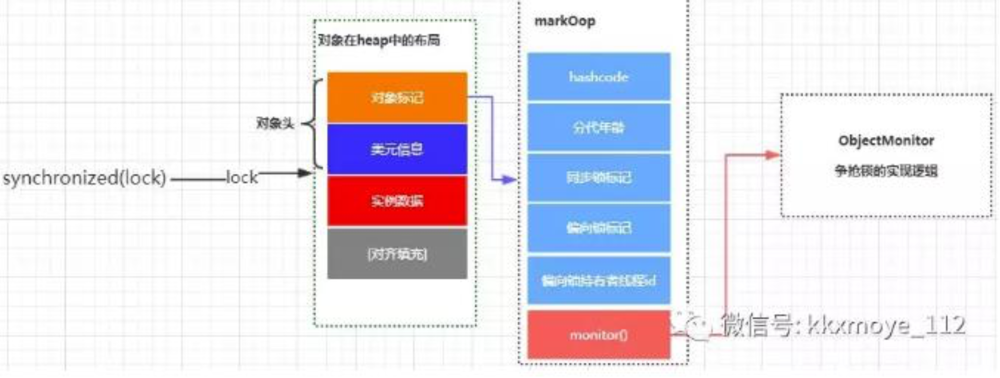

### 探究JVM源码实现

当我们在Java代码中，使用new创建一个对象实例的时候，（hotspot虚拟机）JVM层面实际上会创建一个instanceOopDesc对象。

Hotspot虚拟机采用OOP-Klass模型来描述Java对象实例，OOP（Ordinary Object Point）值的是普通对象指针，Klass用来描述对象实例的具体类型。Hotspot采用instanceOopDesc和arrayOopDesc来描述对象头，arrayOopDesc对象用来描述数组类型。

instanceOopDesc定义在Hotspot源码中的instanceOop.hpp文件中，另外，arrayOopDesc的定义对应arrayOop.hpp

```c++
class instanceOopDesc : public oopDesc {
 public:
  // aligned header size.
  static int header_size() { return sizeof(instanceOopDesc)/HeapWordSize; }

  // If compressed, the offset of the fields of the instance may not be aligned.
  static int base_offset_in_bytes() {
    // offset computation code breaks if UseCompressedClassPointers
    // only is true
    return (UseCompressedOops && UseCompressedClassPointers) ?
             klass_gap_offset_in_bytes() :
             sizeof(instanceOopDesc);
  }

  static bool contains_field_offset(int offset, int nonstatic_field_size) {
    int base_in_bytes = base_offset_in_bytes();
    return (offset >= base_in_bytes &&
            (offset-base_in_bytes) < nonstatic_field_size * heapOopSize);
  }
};

#endif // SHARE_VM_OOPS_INSTANCEOOP_HPP
```

从instanceOopDesc代码中可以看到instanceOopDesc继承自oopDesc，oopDesc的定义在Hotspot源码中的oop.hpp文件中

```c
class oopDesc {
  friend class VMStructs;
 private:
  volatile markOop  _mark;
  union _metadata {
    Klass*      _klass;
    narrowKlass _compressed_klass;
  } _metadata;
  ....
```

从上面源码中可以看到，oopDesc的定义包含两个成员，分别是```_mark```和```_metadata```,

- _mark表示对象标记，属于markOop类型，也就是接下来要讲的Mark Word，它记录了对象和锁有关的信息。
- _metadata表示类元信息，类元信息存储的是对象指向它的类元数据（Klass）的首地址，其中Klass表示普通指针、_compressed_klass表示压缩类指针

### Mark Word

在Hotspot中，markOop的定义在markOop.hpp文件中，代码如下：

```c
lass markOopDesc: public oopDesc {
 private:
  // Conversion
  uintptr_t value() const { return (uintptr_t) this; }

 public:
  // Constants
  enum { age_bits                 = 4,// 分代年龄
         lock_bits                = 2,// 锁标识
         biased_lock_bits         = 1,// 是否为偏向锁
         max_hash_bits            = BitsPerWord - age_bits - lock_bits - biased_lock_bits,
         hash_bits                = max_hash_bits > 31 ? 31 : max_hash_bits,
         cms_bits                 = LP64_ONLY(1) NOT_LP64(0),
         epoch_bits               = 2// 偏向锁的时间戳
  };
  ......
```

Mark Word记录了对象和锁有关的信息，当某个对象被synchronized关键字当成同步锁时，那么围绕这个锁的一系列操作都和Mark word有关系。Mark word在32位虚拟机的长度是32bit、在64位虚拟机的长度是64bit。

Mark Word里面存储的数据会随着锁标志位的变化而变化，Mark Word可能变化为一下5种情况：

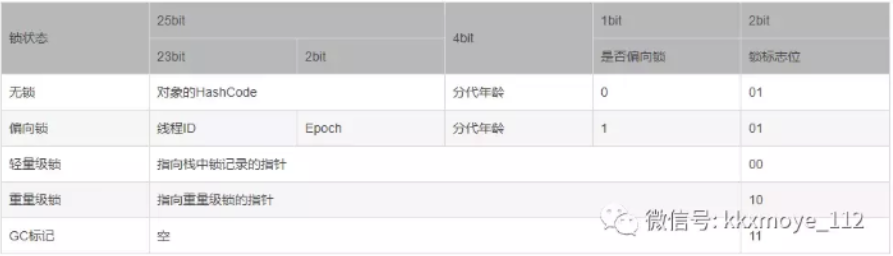

### 为什么任何对象都可以实现锁

1. 首先，java中的每个对象都派生自Object类，而每个Java Object在JVM内部都有一个native的C++对象oop/oopDesc进行对应。
2. 线程在获取锁的时候，实际上就是获得一个监视器对象（monitor），monitor可以认为是一个同步对象，所有的Java对象是天生携带monitor。在hotspot源码的markOOp.hpp文件中，可以看到下面这段代码：

```c
  ObjectMonitor* monitor() const {
    assert(has_monitor(), "check");
    // Use xor instead of &~ to provide one extra tag-bit check.
    return (ObjectMonitor*) (value() ^ monitor_value);
  }
```

多个线程访问同步代码块时，相当于去争抢对象监视器修改对象中的锁标识，上面的代码中ObjectMonitor这个对象和线程争抢锁的逻辑有密切的关系。

## synchronized锁的升级

在分析Mark Word时，提到了偏向锁、轻量级锁、重量级锁。在分析这几种锁的区别时，我们来思考一个问题，使用锁能实现数据的安全性，但是会带来性能的下降。不使用锁能够基于线程并行提升程序性能，但是却不能保证线程安全性。这两者之间似乎是没有办法达到既能满足性能也能满足安全性的要求。

Hotspot虚拟机的作者经过调查发现，大部分情况下，加锁的代码不仅不存在多线程竞争，而且总是由同一个线程多次获得。所以基于这样一个概率，使得synchronized在JDK1.6之后做了一些优化，为了减少获得锁和释放锁带来的性能开销，引入了偏向锁、轻量级锁的概念。因此大家会发现在**synchronized中，锁存在四种状态，分别是：无锁、偏向锁、轻量级锁、重量级锁；锁的状态根据竞争激烈程度从低到高不断升级。**

### 偏向锁的基本原理

前面说过，大部分情况下，锁不仅仅不存在多线程竞争，而且总是由同一个线程多次获得，为了让线程获取锁的代价更低就引入了偏向锁的概念。

当一个线程访问加了同步锁的代码块时，会在对象头中存储当前线程的ID，后续这个线程进入和退出这段加了同步锁的代码块时，不需要再次加锁和释放锁。而是直接比较对象头里面是否存储了指向当前线程的偏向锁。如果相等标识偏向锁是偏向于当前线程的，就不需要在尝试获得锁了。

#### 偏向锁的获取和撤销逻辑

1. 首先获取锁对象的Markword，判断是否处于可偏向状态。（biased_lock、且ThreadId为空）
2. 如果是可偏向状态，则通过CAS操作，把当前线程的ID写入到MarkWord
   1. 如果CAS成功，那么markword就会变成下图红框的形式：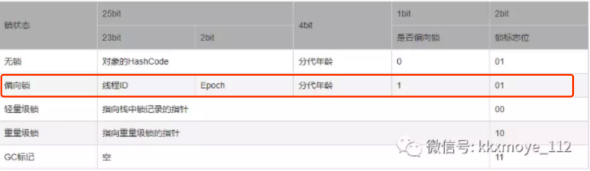表示已经获得了锁对象的偏向锁，接着执行同步代码块。
   2. 如果CAS失败，说明有其他线程已经获得了偏向锁，这种情况说明当前锁存在竞争，需要撤销已获得偏向锁的线程，并且把它持有的锁升级为轻量级锁（这个操作需要等到全局安全点，也就是没有线程在执行字节码才能执行）。
3. 如果是已偏向状态，需要检查markword中存储的ThreadID是否等于当前线程的ThreadID.
   1. 如果相等，不需要再次获得锁了，可直接执行同步代码块。
   2. 如果不相等，说明当前锁偏向于其他线程，需要撤销偏向锁并升级到轻量级锁。

#### 偏向锁的撤销逻辑

偏向锁的撤销并不是把对象恢复到无锁可偏向状态（因为偏向锁并不存在锁释放的概念），而是在获取偏向锁的过程中，发现CAS失败也就是存在线程竞争时，直接把偏向的锁对象升级到轻量级锁的状态。

对原持有偏向锁的线程进行撤销时，原获得偏向锁的线程有两种情况：

1. 原获得偏向锁的线程如果已经退出了临界区，也就是同步代码块执行完了，那么这个时候会把对象头设置成无锁状态并且争抢锁的线程可以基于CAS重新偏向当前线程。
2. 如果原获得偏向锁的线程同步代码块还没执行完，处于临界区之内，这个时候会把原获得偏向锁的线程升级为轻量级锁后继续执行同步代码块。

在我们的应用开发中，绝大部分情况下一定会存在2个以上的线程竞争，那么如果开启偏向锁，反而会提升获取锁的资源消耗。所以**可以通过JVM参数UseBiasedLocking来设置或关闭偏向锁。**

#### 流程图分析

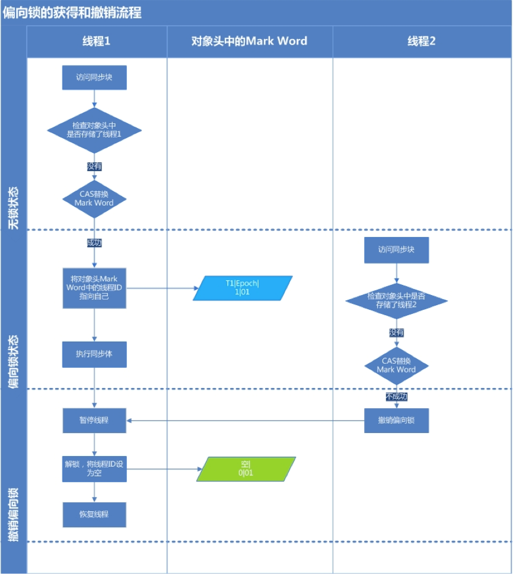


### 轻量级锁的基本原理

#### 轻量级锁的加锁和解锁逻辑

锁升级为轻量级锁之后，对象的Markword也会进行相应的变化。

升级为轻量级锁的过程：

1. 线程在自己的栈帧中创建锁记录LockRecord。
2. 将锁对象的对象头中的MarkWord复制到线程刚刚创建的锁记录中。
3. 将锁记录中的Owner指针指向锁对象。
4. 将锁对象的对象头的MarkWord替换为指向锁记录的指针。

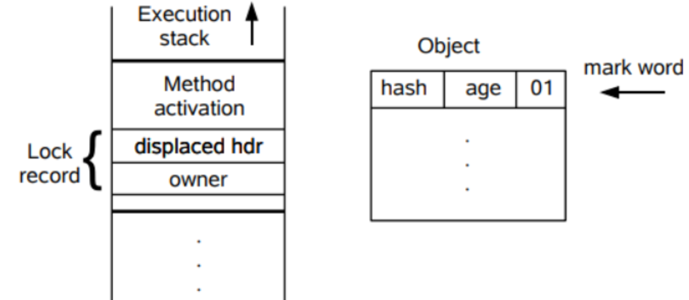


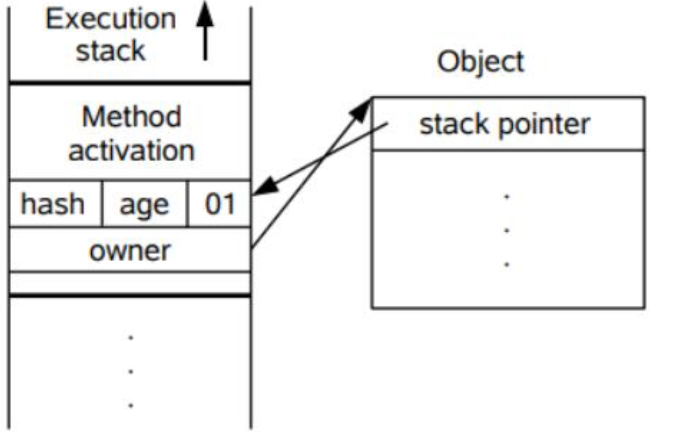

#### 自旋锁

轻量级锁在加锁的过程中，用到了自旋锁。

**所谓自旋，就是指当有另外一个线程来竞争锁时，这个线程会在原地循环等待，而不是把该线程给阻塞，知道那个获得锁的线程释放锁之后，这个线程就可以马上获得锁了。**注意，锁在原地循环的时候，是会消耗CPU的，就相当于在执行一个啥也没有的for循环。

所以，轻量级锁适用于那些同步代码块执行很快的场景，这样线程原地等待很短的时候就能获得锁了。

自旋锁的使用，其实也是有一定的概率，在大部分同步代码块执行的时间都是很短的。所以通过看似无意义的循环反而能提升锁的性能。

**但是自旋必须要有一定的条件控制，否则如果一个线程执行同步代码块的时候很长，那么这个线程不断的循环反而会消耗CPU资源。默认情况下自旋的次数是10次，可以通过preBlockSpin来修改。**


在JDK1.6之后，引入了自适应自旋锁，自适应意味着自旋的次数不是固定不变得，而是根据前一次在同一个锁上自旋的事件已经锁的拥有者的状态来决定。

如果在同一个锁对象上，自旋等待刚刚成功获得过锁，并且持有锁的线程正在运行中，那么虚拟机就会认为这次自旋也是很有可能再次成功，进而它将允许自旋等待相对更长时间。如果对于某个锁，自旋很少成功获得过，那在以后尝试获取这个锁时将可能省略掉自旋的过程，直接阻塞线程，避免浪费处理器资源。

#### 轻量级锁的解锁

轻量级锁的锁释放逻辑其实就是获得锁的逆向逻辑，通过CAS操作吧线程栈帧中的LockRecord替换回到锁对象的MarkWord中，如果成功表示没有竞争。如果失败，表示当前锁存在竞争，那么轻量级锁就会膨胀称为重量级锁。

#### 流程图分析

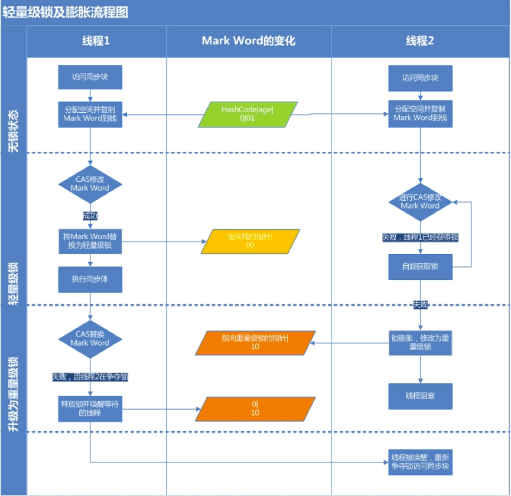

### 重量级锁的基本原理

当轻量级锁膨胀到重量级锁之后，意味着线程只能被挂起阻塞来等待被唤醒了。

#### 重量级锁的monitor

创建一个类源码如下：

```java
//
// Source code recreated from a .class file by IntelliJ IDEA
// (powered by Fernflower decompiler)
//

package jvm;

public class Demo {
    private static int count = 0;

    public Demo() {
    }

    public static void inc() {
        Class var0 = Demo.class;
        synchronized(Demo.class) {
            try {
                Thread.sleep(1L);
            } catch (InterruptedException var3) {
                var3.printStackTrace();
            }

            ++count;
        }
    }

    public static void main(String[] args) throws InterruptedException {
        for(int i = 0; i < 1000; ++i) {
            (new Thread(() -> {
                inc();
            })).start();
        }

        Thread.sleep(3000L);
        System.out.println("运行结果：" + count);
    }
}
```

运行以后通过javap工具查看生成的class文件信息分析synchronize关键字的实现细节。javap -v app.class

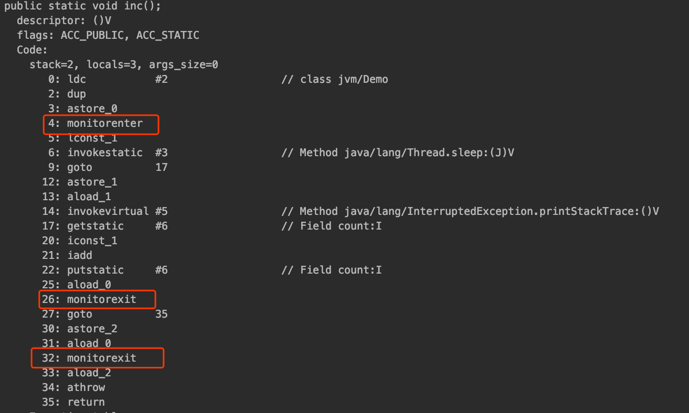

加了同步代码块以后，在字节码中会看到一个monitorenter和monitorexit。

每一个Java对象都会与一个监视器monitor关联，我们可以把它理解成为一把锁，当一个线程想要执行一段被synchronized修饰的同步方法或者代码块时，该线程得先获取到synchronized修饰的对对应的monitor。

monitorenter标识去获得一个对象监视器。monitorexit标识释放monitor监视器的所有权，使得其他被阻塞的线程可以尝试去获得这个监视器。

monitor依赖操作系统的MutexLock（互斥锁）来实现的，线程被阻塞后便进入内核（Linux）调度状态，这个会导致系统在用户态与内核态之间来回切换，严重影响锁的性能

#### 重量级锁的加锁的基本流程

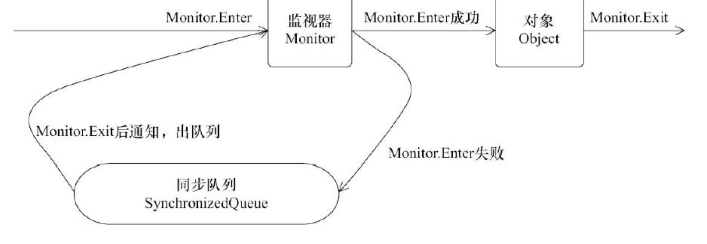

任意线程对Object(Object由synchronized保护)的访问，首先要获得Object的监视器。如果获取失败，线程进入同步队列，线程状态变为BLOCKED。当访问Object的前驱（获得了锁的线程）释放了锁，则该释放操作唤醒阻塞在同步队列中的线程，使其重新尝试对监视器的获取。

### 回顾线程的竞争机制

在来回顾一下线程的竞争机制对于锁升级这块的一些基本流程。方便理解。

加入有这样一个同步的代码块，存在Thread#1、Thread#2等多个线程：

```java
synchronized (lock) { 
	// do something
}
```

情况一：只有Thread#1会进入临界区；

情况二：Thread#1和Thread#2交替进入临界区（竞争不激烈）

情况三：Thread#1/Thread#2/Thread#3，同时进入临界区（竞争激烈）

#### 偏向锁

此时当Thread#1进入临界区时，JVM会将lock Object的对象头Mark Word的锁标志位设置为”01“，同时会用CAS操作Thread#1的线程ID记录到Mard Word中，此时进入偏向锁模式。所谓”偏向“，指的是这个锁会偏向于Thread#1，若接下来没有其他线程进入临界区，则Thread#1再出入临界区无需在执行任何同步操作。也就是说，若只有Thread#1会进入临界区，实际上只有Thread#1初次进入临界区时需要执行CAS操作，以后在出入临界区都不会有同步操作带来的开销。

#### 轻量级锁

偏向锁的场景太过于理想化，更多的时候是Thread#2也会尝试进入临界区，如果Thread#2也进入临界区但是Thread#1还没有执行完同步代码块时，会暂停Thread#1并且升级到轻量级锁。Thread#2通过自旋再次尝试以轻量级锁的方式来获取锁。

#### 重量级锁

如果Thread#1和Thread#2正常交替执行，那么轻量级锁基本能够满足锁的需求。但是如果Thread#1和Thread#2同时进入临界区，并且临界区执行比较耗时，那么锁就会膨胀为重量级锁，意味着Thread#1线程获得了重量级锁的情况下，Thread#2就会被阻塞。

### wait,notify,notifyAll

前面我们在将synchronized的时候，发现被阻塞的线程什么时候被唤醒，取决用户获得锁的线程什么时候执行完同步代码块并且释放锁。那么怎么做到显示控制呢？我们就需要借助一个信号机制：在Object对象中，提供了wait/notify/notifyAll，可以用于控制线程的状态。

#### wait/notify/notifyAll基本概念

##### wait

表示持有对象锁的线程A准备释放对象锁权限，释放CPU资源并进入等待状态。

##### notify

表示持有对象锁的线程A准备释放对象锁权限，通知JVM唤醒某个竞争该对象锁的线程X。线程A的synchronized代码执行结束并且释放了锁之后，线程X直接获得对象锁权限，其他竞争线程继续等待（即使线程X同步完毕，释放对象锁，其他竞争线程仍然等待，直至有新的notify/notifyAll被调用。）

##### notifyAll

notifyAll和notify的区别在于，notifyAll会唤醒所有竞争同一个对象锁的所有线程，当已经获得锁的线程A释放锁之后，所有被唤醒的线程都有可能获得锁权限。

需要注意的是：三个方法都必须在synchronized同步关键字锁限定的作用域中调用，否则会报错```java.lang.IllegalMonitorStateException```,意思是因为没有同步，所以线程对对象锁的状态是不确定的，不能调用这些方法

另外，通过同步机制来确保线程从wait方法返回时能够感知到notify线程对共享变量做出的修改。

##### wait/notify 的基本使用

```java
public class ThreadA extends Thread{

    private Object lock;

    public ThreadA(Object lock) {
        this.lock = lock;
    }

    @Override
    public void run() {
        synchronized (lock){
            System.out.println("start ThreadA");
            try {
                lock.wait(); //实现线程的阻塞
            } catch (InterruptedException e) {
                e.printStackTrace();
            }
            System.out.println("end ThreadA");
        }
    }
}
```


```java
public class ThreadB extends Thread{
    private Object lock=new Object();


    public ThreadB(Object lock) {
        this.lock = lock;
    }
    @Override
    public void run() {
        synchronized (lock){
            System.out.println("start ThreadB");
            lock.notify(); //唤醒被阻塞的线程
            System.out.println("end ThreadB");
        }
    }
}
```

```java
public class WaitNotifyDemo {

    public static void main(String[] args) {
        Object lock=new Object();
        ThreadA threadA=new ThreadA(lock);
        threadA.start();
        ThreadB threadB=new ThreadB(lock);
        threadB.start();
    }
}
```

##### wait/notify的基本原理

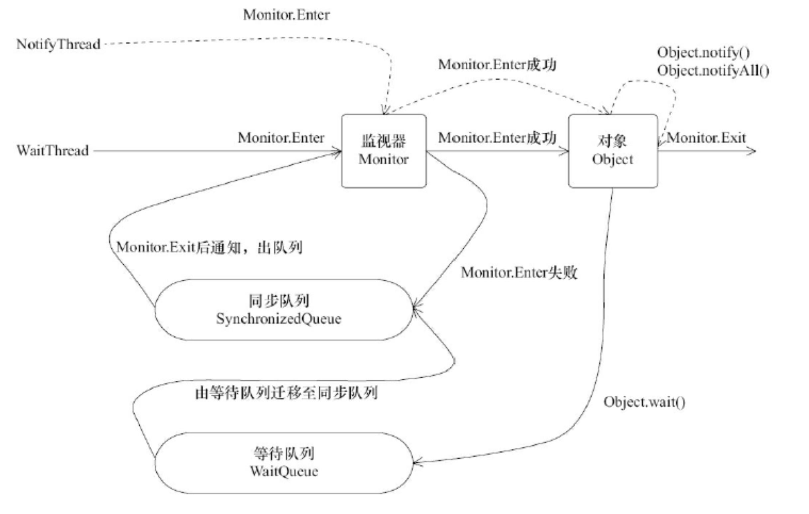