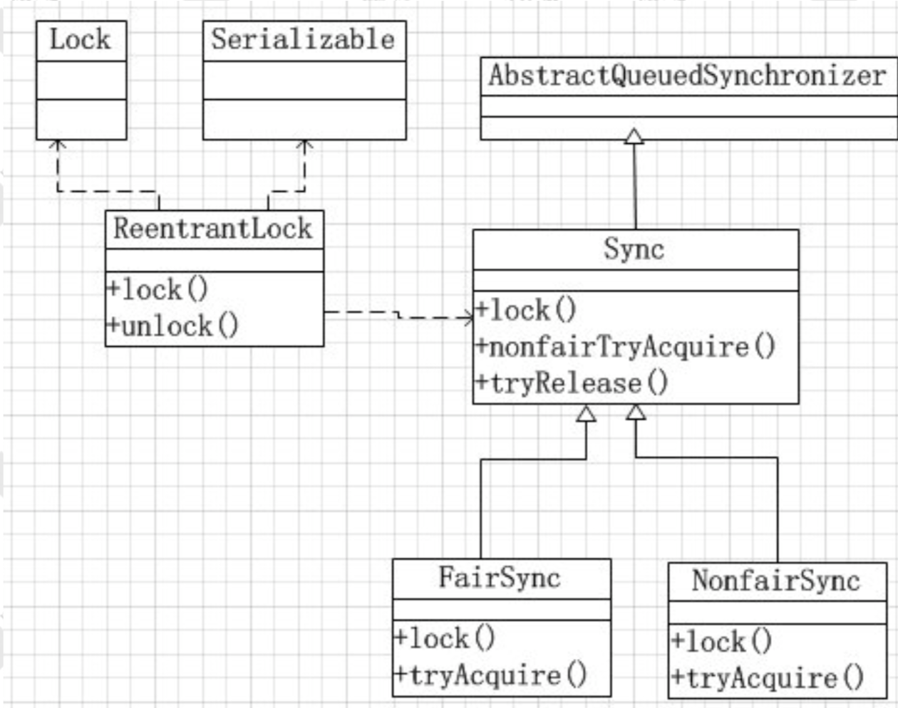
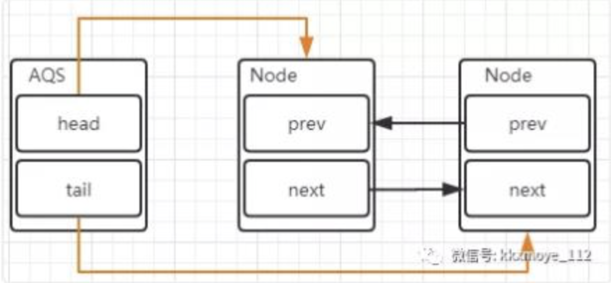
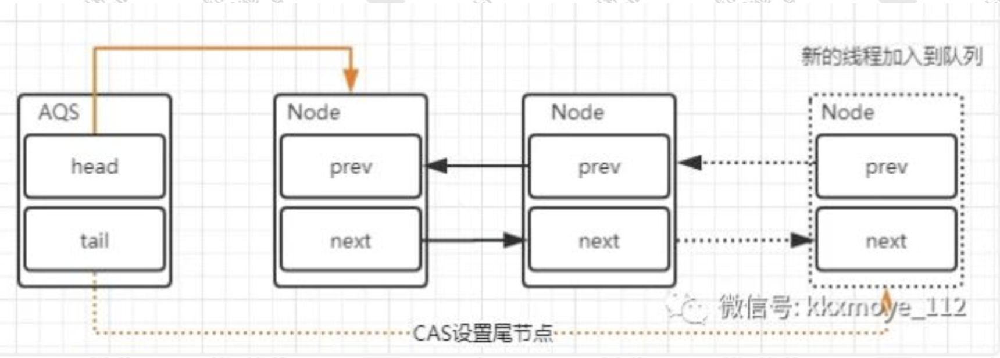
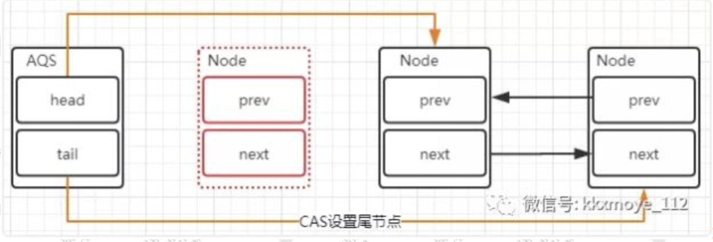
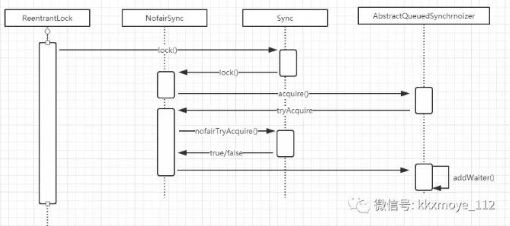
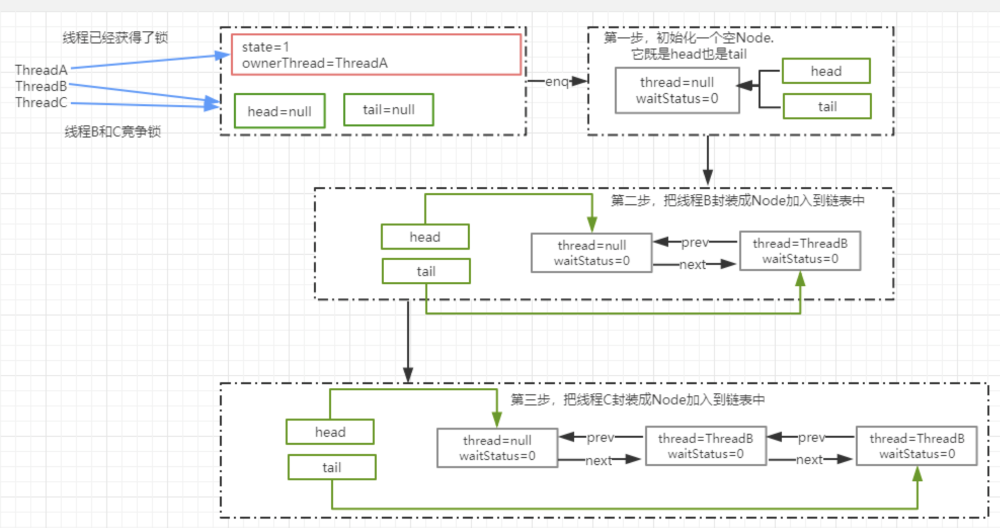
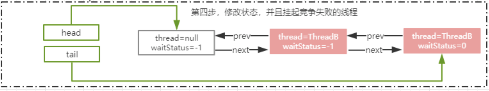
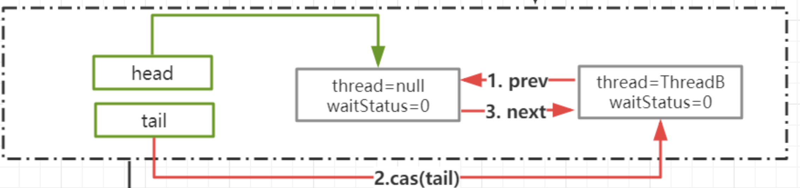
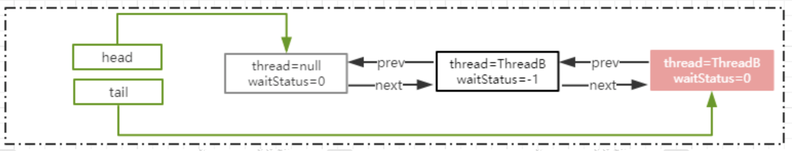
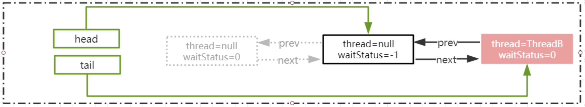

# AQS底层原理分析

## J.U.C简介

java.util.concurrent是在并发编程中比较常用的工具类，里面包含很多用来在并发场景中使用的组件。比如线程池、阻塞队列、计时器、同步器、并发集合等等。并发包的作者是大名鼎鼎的Doug Lea。我们在接下来的课程中，会去剖析一些经典的比较常用的组件的设计思想。

## Lock

Lock在J.U.C中是最核心的组件，前面我们将synchronized的时候说过，锁最重要的特性就是解决并发安全问题。为什么要以Lock作为切入点呢？如果看过J.U.C包中的所有组件，一定会发现绝大部分的组件都有用到Lock。所以通过Lock作为切入点使得在后续的学习过程中会更加轻松。

### Lock简介

在Lock接口出现之前，Java中的应用程序对于多线程的并发安全处理只能基于synchronized关键字来解决。但是synchronized在有些场景中会存在一些短板，也就是它并不适合于所有的并发场景。但是在Java5以后，Lock的出现可以解决synchronized在某些场景中的短板，它比synchronized更加灵活。

### Lock的实现

Lock本质上是一个接口，它定义了释放锁和获得锁的抽象方法，定义成接口就意味着它定义了锁的一个标准规范，也同时意味着锁的不同实现。实现Lock接口的类有很多，以下为几个常见的锁实现：

- ReentrantLock：表示重入锁，它是唯一一个直接实现了Lock接口的类。重入锁指的是线程在获得锁之后，再次获取该锁不需要阻塞，而是直接关联一次计数器增加重入次数。
- ReentrantReadWriteLock：重入读写锁，它实现了ReadWriteLock接口，在这个类中维护了两个锁，一个是ReadLock，一个WriteLock，它们都分别实现了Lock接口。读写锁是一种适合都多写少的场景下解决线程安全问题的工具，基本原则是：读和读不互斥、读和写互斥、写和写互斥。也就是说涉及到影响数据变化的操作都会存在互斥。
- StampedLock：stampedLock是JDK8引入的新的锁机制，可以简单认为是读写锁的一个改进版本，读写锁虽然通过分离读和写的功能使得读和读之间可以完成并发，但是读和写是有冲突的，如果大量的读线程存在，能会引起写线程的饥饿。stampedLock是一种乐观的读策略，使得乐观锁完全不会阻塞写线程。

### Lock的类关系图

Lock有很多的锁实现，但是直观的实现是ReentrantLock重入锁



Lock接口的方法：

```java
public interface Lock {
		// 如果锁可用就获得锁，如果锁不可用就阻塞知道锁释放
    void lock();
		// 和lock()方法相似，但阻塞的线程可中断，抛出InterruptedException
    void lockInterruptibly() throws InterruptedException;
		// 非阻塞获取锁，尝试获取锁，如果成功返回true
    boolean tryLock();
		// 带有超时时间的获取锁方法
    boolean tryLock(long time, TimeUnit unit) throws InterruptedException;
		// 释放锁
    void unlock();

    Condition newCondition();
}
```

## ReentrantLock重入锁

重入锁，表示支持重新进入的锁，也就是说，如果当前线程t1通过调用lock方法获取了锁之后，再次调用lock，是不会在阻塞去获取锁的，直接增加重试次数就行了。synchronized和ReentrantLock都是可重入锁。

### 重入锁的设计目的

比如下面的场景。调用demo方法获得了当前的对象锁，然后这个方法中再去调用demo2，demo2中存在同一个实例锁，这个时候当前线程会因为无法获得demo2的对象锁而阻塞，就会产生死锁。重入锁的设计目的就是避免线程的死锁。

```java
public class ReentrantDemo {
    public synchronized void demo() {
        System.out.println("begin: demo");
        demo2();
    }

    public void demo2() {
        System.out.println("begin: demo2");
        synchronized (this) {
            
        }
    }

    public static void main(String[] args) {
        ReentrantDemo rd = new ReentrantDemo();

        new Thread(rd::demo).start();
    }
}
```

### ReentrantLock的使用案例

```java
package juc;

import java.util.concurrent.locks.Lock;
import java.util.concurrent.locks.ReentrantLock;

public class ReentrantDemo2 {
    private static int count = 0;
    static Lock lock = new ReentrantLock();

    public static void inc() {
        lock.lock();

        try {
            Thread.sleep(1);
        } catch (InterruptedException e) {
            e.printStackTrace();
        }

        count++;

        lock.unlock();
    }

    public static void main(String[] args) throws InterruptedException {
        for (int i = 0; i < 1000; i++) {
            new Thread(() -> ReentrantDemo2.inc()).start();
        }
        Thread.sleep(3000);

        System.out.println("result" + count);
    }
}
```

### ReentrantReadWriteLock

我们以前理解的锁都是排他锁，也就是这些锁在同一时刻只允许一个线程进行访问，而读写锁在同一时刻可以允许多个读线程访问，但是在写线程访问时，所有的读线程和其他写线程都会被阻塞。读写锁维护了一对锁，一个读锁，一个写锁。一般情况下，读写锁的性能都会比排他锁好，因为大多数场景读是多于写的。在读多余写的情况下，读写锁能够提供比排他锁更好的并发性和吞吐量。

```java
public class ReadWriteLockDemo {
    static Map<String, Object> cache = new HashMap<>();
    static ReentrantReadWriteLock rwl = new ReentrantReadWriteLock();

    static Lock read = rwl.readLock();
    static Lock write = rwl.writeLock();

    public static final Object get(String key) {
        read.lock();
        
        System.out.println("开始读取数据");\
        try {
            return cache.get(key);
        } finally {
            read.unlock();
        }
    }

    public static final Object put(String key, Object value) {
        write.lock();
        
        System.out.println("开始写数据");
        try {
            return cache.put(key, value);
        } finally {
            write.unlock();
        }
    }
}
```

在这个案例中，通过hashMap来模拟了一个内存缓存，然后使用读写锁保证这个内存缓存的线程安全性。当执行读操作的时候，需要获得读锁，在并发访问的时候，读锁不会被阻塞，因为读操作不会影响执行结果。

在执行写操作时，线程必须要获取写锁，当已经有线程持有写锁的情况下，当前线程会被阻塞，只有当写锁释放以后，其他读写操作才能继续执行。使用读写锁提升读操作的并发性，也保证每次写操作对所有读写操作的可见性。

读写锁的共享和互斥性：

- **读锁**与**读锁**可以共享
- **读锁**与**写锁**不可以共享（排他）
- **写锁**与**写锁**不可以共享（排他）

## ReentrantLock的实现原理

**我们知道锁的基本原理是，基于将多线程并行任务通过某一种机制实现线程的串行执行，从而达到线程安全性的目的。**在synchronized中，我们分析了偏向锁、轻量级锁、重量级锁、乐观锁。基于乐观锁以及自旋来优化了synchronized的加锁开销，同时在重量级锁阶段，通过线程的阻塞以及或唤醒来达到线程竞争和同步的目的。那么在ReentrantLock中，也一定会存在这样需要去解决的问题。就是多线程竞争重入锁时，竞争失败的线程是如何实现阻塞已经被唤醒的呢？

### AQS是什么

在Lock中，用到了一个同步队列AQS，全称AbstractQueueSynchronizer，它是一个同步工具也是Lock用来实现线程同步的核心组件。如果你搞懂了AQS，那么J.U.C中绝大部分的工具都能轻松掌握。

### AQS的两种功能

**从使用层面来说，AQS的功能分为两种：独占和共享。**

独占锁，每次只能有一个线程持有锁，比如前面给大家演示的ReentrantLock就是一独占方式实现的互斥锁.

共享锁，允许多个线程同时获取锁，并发方位共享资源，比如ReentrantReadWriteLock

### AQS的内部实现

AQS队列内部维护的是一个FIFO的双向链表，这种结构的特点是每个数据结构都有两个指针，分别指向直接后继节点和直接前驱节点。所以双向链表可以在从任意一个节点开始很方便的访问前驱和后继节点。每个Node其实是由线程封装，当线程争抢锁失败后会封装成Node加入到AQS队列中去。当获取锁的线程释放锁以后，会从队列中唤醒一个阻塞的节点（线程）。



### Node 的组成

```java
static final class Node {
    static final Node SHARED = new Node();
    static final Node EXCLUSIVE = null;
    static final int CANCELLED =  1;
    static final int SIGNAL    = -1;
    static final int CONDITION = -2;
    static final int PROPAGATE = -3;
    volatile int waitStatus;	
    volatile Node prev;	// 前驱节点
    volatile Node next;	// 后继节点
    volatile Thread thread;// 当前线程（被阻塞的线程）
    Node nextWaiter;// 存储在condition队列中的后继节点
		// 是否为共享锁
    final boolean isShared() {
        return nextWaiter == SHARED;
    }

   
    final Node predecessor() throws NullPointerException {
        Node p = prev;
        if (p == null)
            throw new NullPointerException();
        else
            return p;
    }

    Node() {    // Used to establish initial head or SHARED marker
    }
		// 将线程构造成一个Node，添加到等待队列
    Node(Thread thread, Node mode) {     // Used by addWaiter
        this.nextWaiter = mode;
        this.thread = thread;
    }
		// 这个方法会在Condition队列使用，后续会分析condition.
    Node(Thread thread, int waitStatus) { // Used by Condition
        this.waitStatus = waitStatus;
        this.thread = thread;
    }
}
```

### 释放锁以及添加线程对于队列的变化

当出现锁竞争以及释放锁的时候，AQS同步队列中的节点会发生变化，首先看一下添加节点的场景。



这里会涉及到两个变化：

1. 新的线程封装成Node节点追加到同步队列中，设置prev节点以及修改当前节点的前置节点的next节点指向自己。
2. 通过CAS将tail重新指向新的尾部节点。


head节点标识获取锁成功的节点，当头节点在释放同步状态时，会唤醒后继节点，如果后继节点获得锁成功，会把自己设置为头结点，节点的变化过程如下：



这个过程也是设计到两个变化：

1. 修改head节点指向下一个获得锁的节点。
2. 新的获得锁的几点，将prev的指针指向null

**设置head节点不需要用CAS，原因是设置head的节点是有获得锁的线程来完成的，而同步锁只能由一个线程获得，所以不需要CAS保证，只需要把head节点设置为首节点的后继节点，并且断开原head节点的next引用即可。**

## ReentrantLock的源码分析

以ReentrantLock作为切入点，来看看这个场景中是如何使用AQS来实现线程的同步的。

### ReentrantLock的时序图

调用ReentrantLock中的lock()方法，源码的调用过程时序图如下：




### ReentrantLock.lock()

这个是ReentrantLock获取锁的入口：

```java
public void lock() {
    sync.lock();
}
```

sync实际上是一个抽象的静态内部类，它继承了AQS来实现重入锁的逻辑，我们前面说过AQS是一个同步队列，它能够实现线程的阻塞以及唤醒，但它并不具备业务功能，所以在不同的同步场景中，会继承AQS来实现对应场景的功能Sync有两个具体的实现类，分别是：

1. NofairSync：表示可以存在抢占锁的功能，也就是说不管当前队列上是否存在其他线程等待，新线程都有机会抢占锁。
2. FairSync：表示所有线程严格按照FIFO来获取锁。

### NofairSync.lock

以非公平锁为例，来看看lock()的实现：

1. 非公平锁和公平锁最大的区别在于，在非公平锁中抢占锁的逻辑是，不管有没有线程排队，我先上来CAS去抢占一下（加塞儿）。
2. CAS成功，就表示成功获得了锁
3. CAS失败，调用acquire(1)走锁竞争逻辑

源码如下：

```java
final void lock() {
    if (compareAndSetState(0, 1))
        setExclusiveOwnerThread(Thread.currentThread());
    else
        acquire(1);
}
```

#### CAS的实现原理

```java
protected final boolean compareAndSetState(int expect, int update) {
    // See below for intrinsics setup to support this
    return unsafe.compareAndSwapInt(this, stateOffset, expect, update);
}
```

通过CAS乐观锁的方式来做比较并替换，这段代码的意思是，如果当前内存中的state的值和预期值expet相等，则替换为update。更新成功返回true，否则返回fasle。

这个操作是源自的，不会出现线程安全问题，这里面涉及到Unsafe这个类的操作，以及设计到state这个属性的意义。

state是AQS中的一个属性，它在不同的实现中锁表达含义不一样，对于重入锁的实现来说，表示一个同步状态。它有两个含义表示：

1. 当state=0时，表示无锁状态
2. 当state>0时，表示已经有线程获得了锁，也就是state=1，但是因为ReentrantLock允许冲入，所以同一个线程多次获得同步锁的时候，state会递增，比如重入5次，那么state=5.而在释放锁的时候，同样需要释放5次直到state=0其他线程才有资格获得锁。


#### Unsafe类

Unsafe类是在sun.misc包下，不属于Java标准。但是很多Java的基础类库，包括一些被广泛使用的高性能开发库都是基于Unsafe类开发的，比如Netty、Hadoop、Kafka等；

Unsafe可以认为是Java中留下的后门，提供了一些低层次操作，如直接内存访问、线程的挂起和恢复、CAS、线程同步、内存屏障。

而CAS就是Unsafe类中提供的一个原子操作，第一个参数为需要改变的对象，第二个为偏移量（即之前求出来的headOffset值），第三个参数为期待的值，第四个为更新后的值。整个方法的作用是如果当前时刻的值等于预期值，则更新为新的期望值，如果更新成功返回true,否则返回false。

#### stateOffset

一个Java对象可以看成是一段内存，每个字段都得按照一定的顺序放在这段内存里，通过这个方法可以准确地告诉你某个字段相对于对象的起始内存地址的字节便宜。用于在后面的compareAndSwapInt中，去根据偏移量找到对象在内存中的具体位置。

所以stateOffset表示state这个字段在AQS类的内存中先对于该类首地址的偏移量。

#### compareAndSwapInt

在unsafe.cpp文件中，可以找到conpareAndSwapInt的实现：

```c++
UNSAFE_ENTRY(jboolean, Unsafe_CompareAndSwapInt(JNIEnv *env, jobject unsafe, jobject obj, jlong offset, jint e, jint x))
  UnsafeWrapper("Unsafe_CompareAndSwapInt");
  oop p = JNIHandles::resolve(obj); //将 Java 对象解析成 JVM 的 oop(普通对象指针),
  jint* addr = (jint *) index_oop_from_field_offset_long(p, offset); //根据对象 p和地址偏移量找到地址
  return (jint)(Atomic::cmpxchg(x, addr, e)) == e; //基于 cas 比较并替换， x 表示需要更新的值，addr 表示 state 在内存中的地址，e 表示预期值
UNSAFE_END
```

### AQS.acquire

acquire是AQS中的方法，如果CAS操作未能成功，说明state已经不为0，此时继续acquire(1)操作。

这个方法的主要逻辑是：

1. 通过tryAcquire尝试获取独占锁，如果成功返回true,失败放回false。
2. 如果tryAcquire失败，则会通过addWaiter方法将当前线程封装成Node添加到AQS队列尾部。
3. acquireQueued，将Node作为参数，通过自旋去尝试获取锁。

源码如下：

```java
public final void acquire(int arg) {
    if (!tryAcquire(arg) &&
        acquireQueued(addWaiter(Node.EXCLUSIVE), arg))
        selfInterrupt();
}
```

#### NonfairSync.tryAcquire

这个方法的作用是尝试获取锁，如果成功返回true,不成功返回false。它是重写AQS类中的tryAcquire方法，并且大家仔细看一下AQS中tryAcquire方法的定义，并没有实现，而是抛出异常，按照一般的思维模式，既然是一个不实现的模板方法，那应该定义成abstract，让子类来实现呀？这是为什么呢？

```Java
protected boolean tryAcquire(int arg) {
    throw new UnsupportedOperationException();
}
```

从这个方法的描述可以看到：尝试以独占模式获取。该方法应该查询对象的状态是否允许以独占模式获取它，如果允许，则应该获取它。我们前面说过AQS有两种功能：独占和共享。也就是抛出的这个异常是一个默认实现独占的时候需要子类去实现。而共享的时候则可以不用理会。

#### ReentrantLock.nofairTryAcquire

1. 获取当前线程，判断当前的锁的状态
2. 如果state=0表示当前是无锁状态，通过CAS更新state状态的值
3. 当前线程是属于重入，则增加重入次数

```java
final boolean nonfairTryAcquire(int acquires) {
    final Thread current = Thread.currentThread(); // 获取当前执行的线程
    int c = getState(); // 获得state的值
    if (c == 0) { // 表示无锁状态
        if (compareAndSetState(0, acquires)) {//CAS替换state的值，CAS成功表示获取锁成功
            setExclusiveOwnerThread(current); //保存当前获得锁的线程，下次再来不在竞争锁
            return true;
        }
    }
    else if (current == getExclusiveOwnerThread()) { // 如果同一个线程来获得锁，直接增加重入次数
        int nextc = c + acquires;
        if (nextc < 0) // overflow
            throw new Error("Maximum lock count exceeded");
        setState(nextc);
        return true;
    }
    return false;
}
```

### AQS.AddWaiter

当tryAcquire方法获取锁失败以后，则会先调用addWaiter将当前线程封装成Node。

入参mode表示当前节点的状态，传递的参数是Node.EXCLUSIVE，表示独占状态。意味着重入锁用到了AQS的独占锁功能。

1. 将当前线程封装成Node.
2. 当前链表中的tail节点是否为空，如果不为空，则通过cas操作把当前线程的node添加到AQS队列
3. 如果为空或者CAS失败，调用enq将节点添加到AQS队列

源码如下：

```java
private Node addWaiter(Node mode) {
    // 把当前线程封装为Node
    Node node = new Node(Thread.currentThread(), mode);
    // Try the fast path of enq; backup to full enq on failure
    // tail是AQS中表示队列对位的属性，默认是null
    Node pred = tail;
    // tail不为空的情况下，说明队里中存在节点
    if (pred != null) {
        // 把当前线程的Node的prev指向tail
        node.prev = pred;
        // 通过CAS吧node加入到AQS队列，也就是设置为tail
        if (compareAndSetTail(pred, node)) {
            // 设置成功以后，把原tail节点的next指向当前node
            pred.next = node;
            return node;
        }
    }
    // tail=null，把node添加到同步队列
    enq(node);
    return node;
}
```

#### enq方法

enq就是通过自旋操作把当前节点加入到队列中

```java
private Node enq(final Node node) {
    for (;;) {
        Node t = tail;
        if (t == null) { // Must initialize
            if (compareAndSetHead(new Node()))
                tail = head;
        } else {
            node.prev = t;
            if (compareAndSetTail(t, node)) {
                t.next = node;
                return t;
            }
        }
    }
}
```

#### 图解分析

假设3个线程来争抢锁，那么截止到enq方法运行结束后，或者调用addWaiter方法结束后，AQS中的链表结构图：

### AQS.acquireQueued

```java
final boolean acquireQueued(final Node node, int arg) {
    boolean failed = true;
    try {
        boolean interrupted = false;
        for (;;) {
            // 获取当前节点的prev节点
            final Node p = node.predecessor();
            // 如果是head节点，说明有资格去争抢锁
            if (p == head && tryAcquire(arg)) {
                //获取锁成功，也就是ThreadA已经释放了锁，然后设置head为ThreadB获得执行权限
                setHead(node);
                // 把原head节点从链表中移除
                p.next = null; // help GC
                failed = false;
                // 获得锁后将中断标记返回出去
                return interrupted;
            }
            // ThreadA可能还没释放锁，使得ThreadB在执行tryAcquire时会返回fasle
            if (shouldParkAfterFailedAcquire(p, node) &&
                parkAndCheckInterrupt())
                // 返回当前线程在等待过程中有没有中断过。
                interrupted = true;
        }
    } finally {
        if (failed)
            cancelAcquire(node);
    }
}
```

通过addWaiter方法把线程添加到链表后，会接着把Node作为参数传递给acquireQueued方法，去竞争锁

#### NofairSync.tryAcquire

这个方法在前面分析过，就是通过state的状态来判断是否处于无锁状态，然后在通过CAS进行竞争锁操作。成功表示获得锁，失败表示获得锁失败。

#### shouldParkAfterFailedAcquire

如果ThreadA的锁还没有释放的情况下，ThreadB和ThreadC来争抢锁肯定会失败，那么失败以后会调用shouldParkAfterFailedAcquire方法。

Node有5种状态，分别是:CANCELLED(1)、SIGNAL(-1)、CONDITION(-2)、PROPAGATE(-3)、默认状态(0):

**CANCELLED：**在同步队列中等待的线程等待超时或被中断，需要从同步队列中取消该Node的节点，其节点的waitStatus为CANCELLED，即结束状态，进入该状态后的节点将不会在变化。

**SIGNAL：**只要前置节点释放锁，就会通知标识为SIGNAL状态的后续节点的线程。

**CONDITION：**和Condition有关系，后续分析。

**PROPAGATE：**共享模式下，PROPAGATE状态的线程处于可运行状态。

**0：**初始状态

这个方法的主要作用是，通过Node的状态来判断，ThreadA竞争锁失败以后是否应该被挂起。

1. 如果ThreadA的pred节点状态为SIGNAL，那就表示可以放心挂起当前线程
2. 通过循环扫描表把CANCELLED状态的节点移除
3. 修改pred节点的状态为SIGNAL，返回false

返回false时，也就是不需要挂起，返回true，则需要调用parkAndCheckInterrupt方法挂起当前线程

```java
private static boolean shouldParkAfterFailedAcquire(Node pred, Node node) {
    // 获取前置节点的waitStatus
    int ws = pred.waitStatus;
    // 如果前置节点为SIGNAL，意味着只需要等待其他前置节点的线程被释放
    if (ws == Node.SIGNAL)
        // 返回true，意味着可以直接放心的挂起了
        return true;
    // ws大于0，意味着prev节点去掉了排队，直接移除这个节点就行
    if (ws > 0) {
        do {
            // 相当于：pred=pred.prev; node.prev=pred;
            node.prev = pred = pred.prev;
        } while (pred.waitStatus > 0); // 这里采用循环，从双向列表中移除CANCELLED的节点
        pred.next = node;
    } else {
        // 利用CAS设置prev节点的状态为SIGNAL(-1)
        compareAndSetWaitStatus(pred, ws, Node.SIGNAL);
    }
    return false;
}
```

#### parkAndCheckInterrupt

```java
private final boolean parkAndCheckInterrupt() {
    // 线程阻塞在这里，唤醒后（unpark）线程从这里开始执行
    LockSupport.park(this);
    // 复位中断状态
    return Thread.interrupted();
}
```

使用LockSupport.park方法挂起当前线程变成WAITING状态。

Thread.interrupted，返回当前线程是否被其他线程发送过中断请求，也就是thread.interrput();如果有触发过中断请求，那么这个方法会返回当前的中断标识true。并且对中断标识进行复位标识已经相应过了中断请求。如果返回true，意味着在acquire方法中会执行selfInterrupt()。

Selfinterrput:标识如果当前线程在acquireQueued中被中断过，则需要产生一个中断请求，原因是线程在调用acquireQueued方法的时候是不会响应中断请求的。

```java
static void selfInterrupt() {
    Thread.currentThread().interrupt();
}
```

#### 图解分析

通过acquireQueued方法来竞争锁，如果ThreadA还在执行中没有释放锁的话，意味着ThreadB和ThreadC只能挂起了。



#### LockSupport

LockSupport类是Java6引入一个类，提供了基本的线程同步原语。LockSupport实际上是调用了Unsafe类里的函数，归结到Unsafe里，只有两个函数：

```java
public native void unpark(Object var1);

public native void park(boolean var1, long var2);
```

- **park是等待一个许可，unpark是为某线程提供一个许可。**
  如果某线程A调用park，那么除非另外一个线程调用unpark(A)给A一个许可，否则线程A将阻塞在park操作上。
- **有一点比较难理解的，是unpark操作可以再park操作之前。**
  也就是说，先提供许可。当某线程调用park时，已经有许可了，它就消费这个许可，然后可以继续运行。这其实是必须的。考虑最简单的生产者(Producer)消费者(Consumer)模型：Consumer需要消费一个资源，于是调用park操作等待；Producer则生产资源，然后调用unpark给予Consumer使用的许可。非常有可能的一种情况是，Producer先生产，这时候Consumer可能还没有构造好（比如线程还没启动，或者还没切换到该线程）。那么等Consumer准备好要消费时，显然这时候资源已经生产好了，可以直接用，那么park操作当然可以直接运行下去。如果没有这个语义，那将非常难以操作。
- **但是这个“许可”是不能叠加的，“许可”是一次性的。**
  比如线程B连续调用了三次unpark函数，当线程A调用park函数就使用掉这个“许可”，如果线程A再次调用park，则进入等待状态。

### 锁的释放流程

如果是这个时候ThreadA释放锁了，那么我们来看锁释放后会产生什么效果。

#### ReentrantLock.unLock

在unlock中，会调用release方法来释放锁：

```java
public void unlock() {
    sync.release(1);
}
```

```java
public final boolean release(int arg) {
    if (tryRelease(arg)) {// 释放锁成功
        // 得到aqs中的head节点
        Node h = head;
        // 如果head节点不为空并且状态！=0。调用unparkSucessor(h)唤醒后续节点
        if (h != null && h.waitStatus != 0)
            unparkSuccessor(h);
        return true;
    }
    return false;
}
```

#### ReentrantLock.tryRelease

这个方法可以认为是一个设置状态的操作，通过将state状态减掉传入的参数值（参数是1），如果结果状态为0，就将排它锁的Owner设置为null，以及使得其它的线程有机会进行执行。

在排它锁中，加锁的时候状态会增加1（当然可以自己修改这个值），在解锁的时候减掉1，同一个锁，在可以重入后，可能或叠加为2、3、4这些值，只有unlock()的次数与lock()的次数对应才会将Owner线程设置为空，而且也只有这种情况下才会返回true。

```java
protected final boolean tryRelease(int releases) {
    int c = getState() - releases;
    if (Thread.currentThread() != getExclusiveOwnerThread())
        throw new IllegalMonitorStateException();
    boolean free = false;
    if (c == 0) {
        free = true;
        setExclusiveOwnerThread(null);
    }
    setState(c);
    return free;
}
```

#### unparkSuccessor

```java
private void unparkSuccessor(Node node) {
    // 获得head节点的状态
    int ws = node.waitStatus;
    if (ws < 0)
        // 设置head节点状态为0
        compareAndSetWaitStatus(node, ws, 0);

    // 得到head节点的下一个节点
    Node s = node.next;
    if (s == null || s.waitStatus > 0) {
        // 如果下一个节点为null或者status>0表示CANCELLED状态。
        // 通过从尾部节点开始扫描，找到距离head最近的一个waitStatus<=0的节点
        s = null;
        for (Node t = tail; t != null && t != node; t = t.prev)
            if (t.waitStatus <= 0)
                s = t;
    }
    // next节点不为空，直接唤醒这个线程即可
    if (s != null)
        LockSupport.unpark(s.thread);
}
```

#### 为什么释放锁的时候是从tail进行扫描

我们回到enq那个方法。else代码块的代码来看一个新的节点是如何加入到链表中的：

1. 将新节点的prev指向tail
2. 通过CAS将tail设置为新的节点，因为CAS是源自操作所以能够保证线程安全性
3. t.next=node；设置原tail的next节点指向新的节点

```java
private Node enq(final Node node) {
    for (;;) {
        Node t = tail;
        if (t == null) { // Must initialize
            if (compareAndSetHead(new Node()))
                tail = head;
        } else {
            node.prev = t;
            if (compareAndSetTail(t, node)) {
                t.next = node;
                return t;
            }
        }
    }
}
```



如果从head开始，在CAS操作之后，t.next=node操作之前。存在其他线程调用unlock方法从head开始往后遍历，由于t.next=node还没执行意味着链表的关系还没有建立完整。就会导致遍历到t节点的时候因为t.next=null而中断。所以从后往前遍历，因为enq的时候使用compareAndSetTail(t, node)（CAS），一定不会存在这个问题。

#### 图解分析

通过锁的释放，原本的结构就发生了一些变化。head节点的waitStatus变成了0，ThreadB被唤醒：




#### 原本挂起的线程继续执行

通过ReentrantLock.unlock，原本挂起的线程被唤醒以后继续执行，应该从哪里执行大家还有印象吧。原来被挂起的线程是在acquireQueued方法中，所以被唤醒以后继续从这个方法开始执行。

#### AQS.acquireQueued

```java
final boolean acquireQueued(final Node node, int arg) {
    boolean failed = true;
    try {
        boolean interrupted = false;
        for (;;) {
            // 获取当前节点的prev节点
            final Node p = node.predecessor();
            // 如果是head节点，说明有资格去争抢锁
            if (p == head && tryAcquire(arg)) {
                //获取锁成功，也就是ThreadA已经释放了锁，然后设置head为ThreadB获得执行权限
                setHead(node);
                // 把原head节点从链表中移除
                p.next = null; // help GC
                failed = false;
                // 获得锁后将中断标记返回出去
                return interrupted;
            }
            // ThreadA可能还没释放锁，使得ThreadB在执行tryAcquire时会返回fasle
            if (shouldParkAfterFailedAcquire(p, node) &&
                parkAndCheckInterrupt())
                // 返回当前线程在等待过程中有没有中断过。
                interrupted = true;
        }
    } finally {
        if (failed)
            cancelAcquire(node);
    }
}
```

这个方法前面已经完整分析过了，我们只关注一下ThreadB被唤醒后的执行流程。

由于ThreadB的prev节点指向的是head，并且ThreadA已经释放了锁。所以这个时候调用tryAcquite方法时，可以顺利的获取到锁：

1. 把ThreadB节点节点设置为head
2. 把源head节点的next节点指向为null(GC 回收).

#### 图解分析

1. 设置新head节点的prev=null
2. 设置原head节点的next节点为null



### 公平锁和非公平锁的区别

锁的公平性是相对于获取锁的顺序而言的，如果是一个公平锁，那么锁的获取顺序就应该符合请求的绝对时间顺序，也就是FIFO。在上面分析的例子来说，只要CAS设置同步状态成功，则表示当前线程获取了锁，而公平锁则不一样，差异点有两个

#### FairSync.lock

公平锁的lock方法：

```java
final void lock() {
    acquire(1);
}
```

非公平锁的lock方法：

```java
final void lock() {
    if (compareAndSetState(0, 1))
        setExclusiveOwnerThread(Thread.currentThread());
    else
        acquire(1);
}
```

对比源码可以发现，非公平锁在获取锁的时候，会先通过CAS进行抢占（compareAndSetState方法），而公平锁不会。

#### FairSync.tryAcquire

公平锁的tryAcquire方法：

```java
protected final boolean tryAcquire(int acquires) {
    final Thread current = Thread.currentThread();
    int c = getState();
    if (c == 0) {
        if (!hasQueuedPredecessors() &&
            compareAndSetState(0, acquires)) {
            setExclusiveOwnerThread(current);
            return true;
        }
    }
    else if (current == getExclusiveOwnerThread()) {
        int nextc = c + acquires;
        if (nextc < 0)
            throw new Error("Maximum lock count exceeded");
        setState(nextc);
        return true;
    }
    return false;
}
```

非公平锁的nonfairTryAcquire方法：

```java
final boolean nonfairTryAcquire(int acquires) {
    final Thread current = Thread.currentThread();
    int c = getState();
    if (c == 0) {
        if (compareAndSetState(0, acquires)) {
            setExclusiveOwnerThread(current);
            return true;
        }
    }
    else if (current == getExclusiveOwnerThread()) {
        int nextc = c + acquires;
        if (nextc < 0) // overflow
            throw new Error("Maximum lock count exceeded");
        setState(nextc);
        return true;
    }
    return false;
}
```

通过对比代码，不同的只有判断条件多了hasQueuedPredcessors()方法，也就是加入了**【同步队列中当前是否有前驱节点】**的判断，如果该方法返回true，则表示有线程比当前线程更早的获取锁，因此需要等待前驱线程获取并释放锁之后才能继续获取锁。