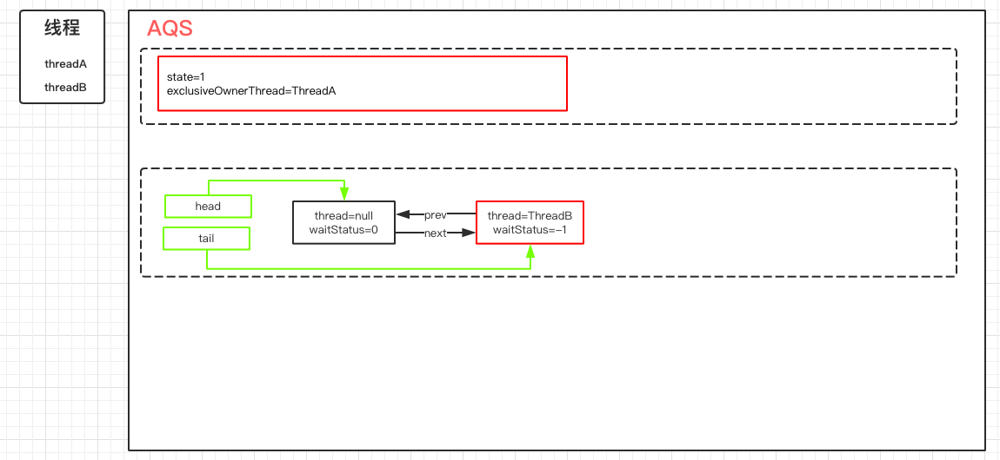
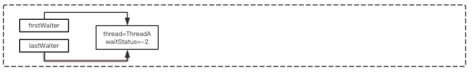
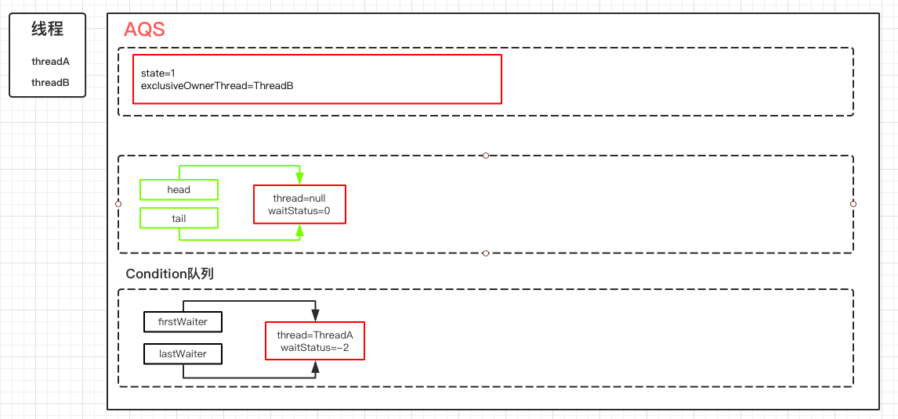
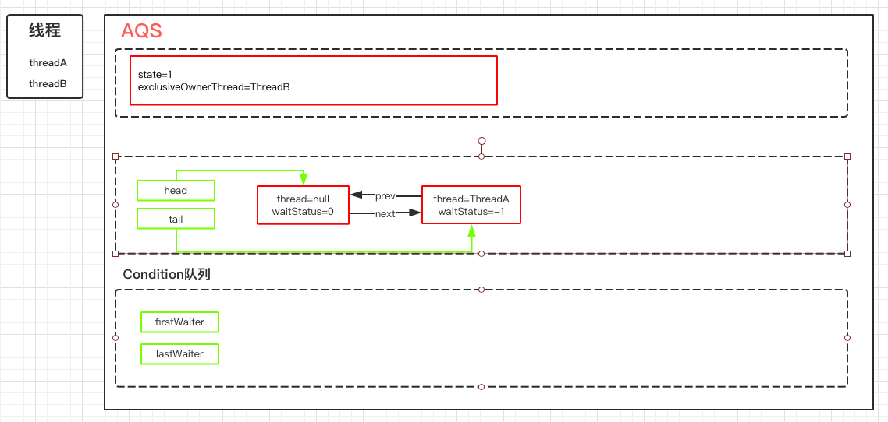
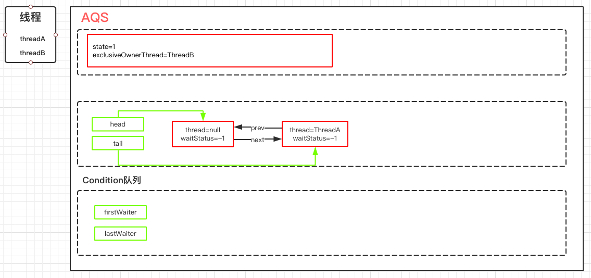

# Condition及源码分析

前面学习synchronized的时候，有讲到wait/notify的基本使用，结合synchronized可以实现对线程的通信。那么这个时候我就思考了，既然J.U.C里面提供了锁的实现机制，那J.U.C里面有没有提供类似的线程通讯工具呢？

**Condition就是这样的一个多线程协调的工具类，可以让某些线程一起等待某个条件（condition），只有满足条件时，线程才会被唤醒。**

## Condition的基本使用

### ConditionWait

```java
public class ConditionDemoWait implements Runnable{

    private Lock lock;
    private Condition condition;

    public ConditionDemoWait(Lock lock, Condition condition) {
        this.lock = lock;
        this.condition = condition;
    }

    @Override
    public void run() {
        System.out.println("begin - ConditionDemoWait");

        try {
            lock.lock();
            condition.await();
            System.out.println("end - ConditionDemoWait");
        } catch (InterruptedException e) {
            e.printStackTrace();
        } finally {
            lock.unlock();
        }
    }
}
```

### ConditionSignal

```java
public class ConditionDemoSignal implements Runnable {

    private Lock lock;
    private Condition condition;

    public ConditionDemoSignal(Lock lock, Condition condition) {
        this.lock = lock;
        this.condition = condition;
    }

    @Override
    public void run() {
        System.out.println("begin - ConditionDemoSignal");

        try {
            lock.lock();
            condition.signal();
        } finally {
            lock.unlock();
        }
    }
}
```

通过这个案例简单实现了wait和notify的功能，当调用await方法后，当前线程会释放锁并等待，而其他线程调用condition对象的signal或者signalAll方法通知被阻塞的线程，然后自己执行unlock释放锁，被唤醒的线程获得之前的锁继续执行，最后释放锁。

所以，Condition中两个最重要的方法，一个是await，一个是signal

- await：把当前线程阻塞挂起
- Signal：唤醒阻塞的线程

## Condition源码分析

调用Condition，需要获得Lock锁，所以意味着会存在一个AQS同步队列，在上面那个案例中，加入两个线程同时运行的话，那么AQS的队列可能是下面这种情况：



那么这个时候ThreadA调用了condition.await方法，它做了什么事情呢？

### condition.await

调用Condition的await()方法（或者以await开头的方法）,会使当前线程进入等待队列并释放锁，同时线程状态变为等待状态。当从await()方法返回时，当前线程一定获取了Condition相关联的锁。

await方法源码如下：

```java
public final void await() throws InterruptedException {
    // 表示await()方法允许被中断
    if (Thread.interrupted())
        throw new InterruptedException();
    // 创建一个新的节点，节点状态为condition，采用的数据结仍然是链表（单向）
    Node node = addConditionWaiter();
    // 释放当前的锁，得到锁的状态，并唤醒AQS队列中的一个线程
    int savedState = fullyRelease(node);
    int interruptMode = 0;
    // 如果当前节点没有在同步队列(AQS)上，即还没有被signal，则将当前线程阻塞
    // 第一次判断的是false，因为前面已经释放锁了
    while (!isOnSyncQueue(node)) {
        // 通过park挂起当前线程
        LockSupport.park(this);
        if ((interruptMode = checkInterruptWhileWaiting(node)) != 0)
            break;
    }
    // 当这个线程醒来，会尝试拿锁，当acquirQueued返回false就是拿到锁了
    // interruptMode != THROW_IE ->表示这个线程没有成功将node入队，但signal执行了enq方法让其入队了
    if (acquireQueued(node, savedState) && interruptMode != THROW_IE)
        interruptMode = REINTERRUPT;
    // 如果 node 的下一个等待者不是 null, 则进行清理, 清理 Condition 队列上的节点.
    // 如果是 null ,就没有什么好清理的了.
    if (node.nextWaiter != null) // clean up if cancelled
        unlinkCancelledWaiters();
    // 如果线程被中断了,需要抛出异常.或者什么都不做
    if (interruptMode != 0)
        reportInterruptAfterWait(interruptMode);
}
```

#### addConditionWaiter

这个方法的主要作用是把当前线程封装成node，添加到等待队列。这里的队列不在是双向链表，而是单向链表：

```java
private Node addConditionWaiter() {
    Node t = lastWaiter;
    // If lastWaiter is cancelled, clean out.
    // 如果lastWaiter是中断的，就清理出去。
    if (t != null && t.waitStatus != Node.CONDITION) {
        unlinkCancelledWaiters();
        t = lastWaiter;
    }
    // 构建一个Node,waitStatus=CONDITION。这里的链表是一个单向的，所以相比AQS来说会简单很多
    Node node = new Node(Thread.currentThread(), Node.CONDITION);
    if (t == null)
        firstWaiter = node;
    else
        t.nextWaiter = node;
    lastWaiter = node;
    return node;
}
```

#### 图解分析

执行完addConditionWaiter这个方法之后就会产生一个这样的condition队列



#### fullyRelease

fullyRelease，就是彻底释放锁，什么叫彻底呢？就是如果当前锁存在多次重入，那么这个方法中只需要释放一次就会把所有的重入次数归零。

```java
final int fullyRelease(Node node) {
    boolean failed = true;
    try {
        int savedState = getState();
        if (release(savedState)) {
            failed = false;
            return savedState;
        } else {
            throw new IllegalMonitorStateException();
        }
    } finally {
        if (failed)
            node.waitStatus = Node.CANCELLED;
    }
}
```

#### 图解分析

此时，同步队列会触发锁的释放和重新竞争。ThreadB获得锁。



#### isOnSyncQueue

判断当前节点是否在同步队列（AQS）中,返回fasle表示不在，返回true表示在。

如果不在AQS同步队列，说明当前节点没有唤醒去争抢同步锁，所以需要把当前线程阻塞起来，知道其他线程调用signal唤醒。

如果在AQS同步队里，意味着它需要去竞争同步锁去获得程序执行权限。

为什么要做这个判断？ 原因是在condition队列中的节点会重新加入到AQS队列去竞争锁。也就是当调用signal的时候，会把当前节点从condition队列转移到AQS队列。

可以通过4个方面去判断ThreadA这个节点是否存在于AQS队列：

1. 如果ThreadA的waitStatus的状态为CONDITION，说明它存在于condition队列中，不在AQS队列。因为AQS队列的状态一定不可能有CONDITION.
2. 如果node.prev为空，说明也不在于AQS队列，原因是prev=null，在AQS队列中只有一种可能，就是它是head节点，head节点意味着它是获得锁的节点。
3. 如果node.next不等于空，说明一定存在于AQS队列，因为只有AQS队列才会存在next和prev的关系。
4. findNodeFromTail，表示从tail节点往前扫描AQS队列，一旦发现AQS队列的节点和当前节点相等说明一定存在于AQS队列中。

```java
final boolean isOnSyncQueue(Node node) {
    if (node.waitStatus == Node.CONDITION || node.prev == null)
        return false;
    if (node.next != null) // If has successor, it must be on queue
        return true;

    return findNodeFromTail(node);
}
```

```java
private boolean findNodeFromTail(Node node) {
    Node t = tail;
    for (;;) {
        if (t == node)
            return true;
        if (t == null)
            return false;
        t = t.prev;
    }
}
```

### Condition.signal

await方法会阻塞ThreadA，然后ThreadB抢占到了锁得到了执行权限，这个时候在ThreadB中调用了Condition的signal()方法，将会唤醒在等待队列中的节点

```java
public final void signal() {
    // 先判断当前线程是否获得了锁，这个判断比较简单，直接用获得锁的线程和当前线程相比即可
    if (!isHeldExclusively())
        throw new IllegalMonitorStateException();
    // 拿到Condition队列上第一个节点
    Node first = firstWaiter;
    if (first != null)
        doSignal(first);
}
```

#### Condition.doSignal

对condition队列中从首部开始的第一个condition状态的节点，执行transferForSignal操作，同时修改AQS队列中原先尾节点的状态。

```java
private void doSignal(Node first) {
    do {
        if ( (firstWaiter = first.nextWaiter) == null)
            // 将next节点设置成null
            lastWaiter = null;
        first.nextWaiter = null;
    } while (!transferForSignal(first) &&
             (first = firstWaiter) != null); 
}
```

#### AQS.transferForSignal

该方法先是CAS修改了节点状态，如果成功，就将这个节点放到AQS队列中，然后唤醒这个节点上的线程，此时，那个节点就会在await方法中苏醒。

```java
final boolean transferForSignal(Node node) {
    // 更新节点的状态为0，如果更新失败，只有一种可能就是节点被CANCELLED了
    if (!compareAndSetWaitStatus(node, Node.CONDITION, 0))
        return false;

    // 调用enq，把当前节点添加到AQS队列。并且返回当前节点的上一个节点，也就是原tail节点
    Node p = enq(node);
    int ws = p.waitStatus;
    // 如果上一个节点的状态被取消了，或者尝试设置上一个节点的状态为SIGNAL失败了
    // SIGNAL表示：他的next节点需要停止阻塞
    if (ws > 0 || !compareAndSetWaitStatus(p, ws, Node.SIGNAL))
        // 唤醒节点上的线程
        LockSupport.unpark(node.thread);
    // 如果node的prev节点已经是signal状态，那么被阻塞的ThreadA的唤醒工作有AQS队列来完成
    return true;
}
```

#### 图解分析

执行完doSignal以后，会把condition队列中的节点转移到aqs队列上，逻辑结构图如下：

这个时候会判断ThreadA的prev节点也就是head节点的waitStatus，如果大于0或者设置SIGNAL失败，表示节点被设置成了CANCELLED状态，这个时候回唤醒Thread这个线程。否则就基于AQS队列的机制来唤醒，也就是等到ThreadB释放锁之后来唤醒ThreadA。



### 被阻塞的线程唤醒后的逻辑

前面在分析await方法时，线程会被阻塞。而通过signal被唤醒之后又继续回到上次执行注释为```// this```的代码。

```java
public final void await() throws InterruptedException {
    if (Thread.interrupted())
        throw new InterruptedException();
    Node node = addConditionWaiter();
    int savedState = fullyRelease(node);
    int interruptMode = 0;
    while (!isOnSyncQueue(node)) {
        LockSupport.park(this);
        // this
        if ((interruptMode = checkInterruptWhileWaiting(node)) != 0)
            break;
    }
    if (acquireQueued(node, savedState) && interruptMode != THROW_IE)
        interruptMode = REINTERRUPT;
    if (node.nextWaiter != null) // clean up if cancelled
        unlinkCancelledWaiters();
    if (interruptMode != 0)
        reportInterruptAfterWait(interruptMode);
}
```

checkInterruptWhileWaiting这个方法是干嘛的呢？其实从名字就可以看出来，就是ThreadA在condition队列被阻塞的过程中，有没有被其他线程触发过中断请求。

#### checkInterruptWhileWaiting

如果当前线程被中断，则调用transferAfterCancelledWait方法判断后续的处理应该是抛出InterruptException还是重新中断。

```java
private int checkInterruptWhileWaiting(Node node) {
    return Thread.interrupted() ?
        (transferAfterCancelledWait(node) ? THROW_IE : REINTERRUPT) :
        0;
}
```

```java
final boolean transferAfterCancelledWait(Node node) {
    // 使用CAS修改节点状态，如果还能修改成功，说明线程被中断时，signal还没有调用。
    // 这里有一个知识点，就是线程被唤醒，并不一定是在java层面执行，lockSupport.unpard，这个方法会更新一个中断标识，并且会唤醒处于阻塞状态下的线程。
    if (compareAndSetWaitStatus(node, Node.CONDITION, 0)) {
        enq(node);
        // 如果CAS成功，则把node添加AQS队列
        return true;
    }
    // 如果CAS失败，则判断当前node是否已经在AQS队列上，如果不在，则让其他线程执行
    // 当node被触发了signal方法时，node就会被加到AQS队列上
    while (!isOnSyncQueue(node)) // 循环检测node是否已经成功添加到了AQS队列中。如果没有，则通过yield让出CPU时间片，等其他线程执行。
        Thread.yield();
    return false;
}
```

这里需要注意的地方是，如果第一次CAS失败了，则不能判断当前线程是先进行了中断还是先进行了signal方法的调用，可能是先执行了signal然后中断，也可能是先执行了中断，后执行了signal。当然，这两个操作肯定是发生在CAS之前。这时候需要做的就是等待当前线程的node被添加到AQS队列后，也就是enq方法返回后，返回false告诉checkInterrputWhileWaiting方法返回REINTERRUPT(1)，后续进行重新中断。

简单来说，该方法的返回值代表当前线程是否在pard的时候被中断唤醒，如果为true表示中断在signai调用之前，signal还未执行，那么这个时候根据await的语义，在await时遇到中断需要抛出InterrputException，返回true就是告诉checkInterputWhileWaiting返回THROW_IE(-1)。如果返回false，否则表示signal已经执行过了，只需要重新相应中断即可。

#### acquireQueued

这个方法在讲AQS的时候说过，使得当前被唤醒的节点ThreadA去抢占同步锁。并且要恢复到原本的重入次数状态。调用完这个方法之后，AQS队列的状态如下将head节点的waitStatus设置为-1，Signal状态。



#### reportInterruptAfterWait

根据checkInterruptWhileWaiting方法返回的中断标识来进行中断上报。

如果是THROW_IE，则抛出中断异常

如果是REINTERPUT，则重新相应中断

```java
private void reportInterruptAfterWait(int interruptMode)
    throws InterruptedException {
    if (interruptMode == THROW_IE)
        throw new InterruptedException();
    else if (interruptMode == REINTERRUPT)
        selfInterrupt();
}
```

### Condition总结

#### await和signal的总结

线程 awaitThread 先通过 lock.lock()方法获取锁成功后调用了condition.await 方法进入等待队列，而另一个 线程 signalThread 通过 lock.lock()方法获取锁成功后调用 了condition.signal 或者 signalAll 方法，使得线程 awaitThread 能够有机会移入到同步队列中，当其他线程释放 lock 后使得线程 awaitThread 能够有机会获取 lock，从而使得线程 awaitThread 能够从 await 方法中退出执行后续操作。如果 awaitThread 获取 lock 失败会直 接进入到同步队列。 


