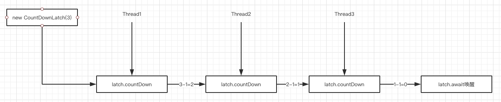
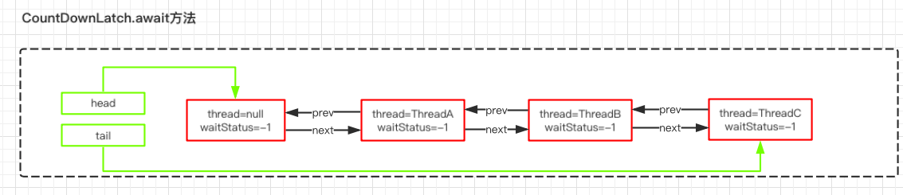
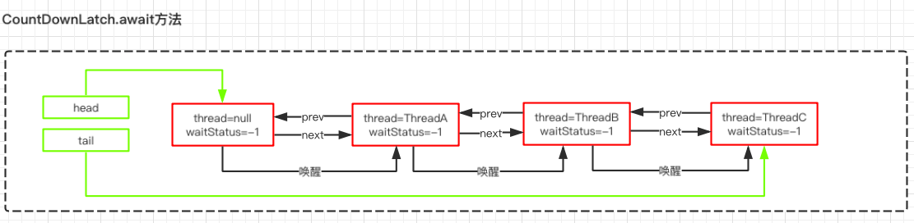

# CountDwonLatch及源码分析

countDownLatch是一个同步工具类，它允许一个或多个线程一直等待，直到其他线程的操作执行完毕在执行。从命名可以解读到countDown是倒数的意思，类似我们的倒计时的概念。

CountDownLatch提供了两个方法，一个是countDown，一个是await，CountDownLatch初始化的时候需要传入一个整数，在这个整数倒数到0之前，调用了await方法的程序都必须要等待，然后通过countDown来倒数。

## 使用案例

```java
public class CountDownLatchDemo {
    public static void main(String[] args) throws InterruptedException {
        CountDownLatch countDownLatch = new CountDownLatch(3);

        new Thread(() -> {
            System.out.println("" + Thread.currentThread().getName() + "-执行中");
            countDownLatch.countDown();
            System.out.println("" + Thread.currentThread().getName() + "-执行完毕");

        }, "t1").start();

        new Thread(()->{
            System.out.println("" + Thread.currentThread().getName() + "-执行中");
            countDownLatch.countDown();
            System.out.println("" + Thread.currentThread().getName() + "-执行完毕");
        }, "t2").start();

        new Thread(() -> {
            System.out.println("" + Thread.currentThread().getName() + "-执行中");
            countDownLatch.countDown();
            System.out.println("" + Thread.currentThread().getName() + "-执行完毕");
        }, "t3").start();

        countDownLatch.await();
        System.out.println("所有线程执行完毕");
    }
}
```


从代码的实现来看，优点类似join的功能，但是比jion更加灵活。CountDownLatch构造函数会接收一个int类型的参数作为计数器的初始值，当调用CountDownLatch的countDown方法时，这个计数器就会减一。

通过await方法去阻塞主流程。



## 模拟高并发

在1000个线程都启动以后同步并发。代码如下：

```java
public class CountDownLatchDemo2 extends Thread {
    static CountDownLatch countDownLatch = new CountDownLatch(1);

    @Override
    public void run() {
        try {
            countDownLatch.await();
        } catch (InterruptedException e) {
            e.printStackTrace();
        }

        System.out.println("ThreadName:" + Thread.currentThread().getName());
    }

    public static void main(String[] args) {
        for (int i = 0; i < 1000; i++) {
            new CountDownLatchDemo2().start();
        }

        countDownLatch.countDown();
    }

}
```

总的来说，**凡是涉及到需要指定某个任务在执行之前，要等到前置任务执行完毕之后才执行的场景，都可以使用CountDownLatch。**

## CountDownLatch源码分析


对于CountDownLatch，我们仅仅需要关心两个方法，一个是countDown()方法，另一个是await()方法。

countDown()方法每次调用都会将state减1，直到state的值为0；

而await是一个阻塞方法，当state减为0的时候，await方法才会返回。await可以被多个线程调用，大家在这个时候脑子里要有个图：所有调用了await方法的线程阻塞在AQS的阻塞队列中，等待条件满足（state==0）。将线程从队列中一个个唤醒过来。

### acquireSharedInterputibly

countDownLatch也用到了AQS，在CountDownLatch内部写了一个Sync并且继承了AQS这个抽象类重写了AQS中的共享锁方法。首先看到下面这个代码，这块代码主要是判断当前线程是否获取到了共享锁。（**在CountDownLatch中，使用的共享锁机制，因为CountDownLatch并不需要实现互斥特性**）

```java
public void await() throws InterruptedException {
    sync.acquireSharedInterruptibly(1);
}
```

```java
public final void acquireSharedInterruptibly(int arg)
        throws InterruptedException {
    if (Thread.interrupted())
        throw new InterruptedException();
    // state如果不等于0，说明当前线程需要加入到共享锁阻塞队列中
    if (tryAcquireShared(arg) < 0)
        doAcquireSharedInterruptibly(arg);
}
```

### doAcquireSharedInterruptibly

1. addWaiter设置为shared模式。
2. tryAcquire和tryAcquireShared的返回值不同，因此会多出一个判断过程。
3. 在判断前驱节点是头节点后，调用了setHeadAndPropagate方法，而不是简单的更新一下头节点。

```java
private void doAcquireSharedInterruptibly(int arg)
    throws InterruptedException {
    // 创建一个共享模式的节点添加到队列中
    final Node node = addWaiter(Node.SHARED);
    boolean failed = true;
    try {
        for (;;) {
            final Node p = node.predecessor();
            if (p == head) {
                // 判断尝试获取锁
                int r = tryAcquireShared(arg);
                // r>=0表示获取到了执行权限，这个时候因为state!=0,所以不会执行这段代码
                if (r >= 0) {
                    setHeadAndPropagate(node, r);
                    p.next = null; // help GC
                    failed = false;
                    return;
                }
            }
            // 阻塞线程
            if (shouldParkAfterFailedAcquire(p, node) &&
                parkAndCheckInterrupt())
                throw new InterruptedException();
        }
    } finally {
        if (failed)
            cancelAcquire(node);
    }
}
```

### 图解分析

假如这个时候有3个线程调用了await方法，由于这个时候state的值还不为0，所以这三个线程都会加入到AQS队列中，并且三个线程都处于阻塞状态。



### CountDownLatch.countDown

由于线程被await方法阻塞了，所以只有等到countDown方法使得state=0的时候才会被唤醒，我们来看看countDown方法做了什么

```java
public void countDown() {
    sync.releaseShared(1);
}
```

```java
public final boolean releaseShared(int arg) {
    if (tryReleaseShared(arg)) {
        doReleaseShared();
        return true;
    }
    return false;
}
```

```java
// 用自旋的方式实现state减1
protected boolean tryReleaseShared(int releases) {
    // Decrement count; signal when transition to zero
    for (;;) {
        int c = getState();
        // 如果获取到的state就是0则证明已经被别的线程释放锁
        if (c == 0)
            return false;
        int nextc = c-1;
        // CAS操作如果成功
        if (compareAndSetState(c, nextc))
            // 判断state是否0，如果是0返回true
            return nextc == 0;
    }
}
```

1. 只有当state为0的时候，tryReleaseShared才返回true，否则只是简单的state=state-1
2. 如果state=0，则调用doReleaseShared唤醒处于await状态下的线程

### AQS.doReleaseShared

共享锁的释放和独占锁的释放有一定的差别，前面唤醒锁的逻辑和独占锁是一样，先判断头节点是不是SIGNAL状态，如果是，则修改为0，并且唤醒头节点的下一个节点

```java
// PROPAGATE：标识位PROPAGATE状态的节点，是共享锁模式下的节点状态，处于这个状态下的节点，会对线程的唤醒进行传播
private void doReleaseShared() {
    for (;;) {
        Node h = head;
        if (h != null && h != tail) {
            int ws = h.waitStatus;
            if (ws == Node.SIGNAL) {
                if (!compareAndSetWaitStatus(h, Node.SIGNAL, 0))
                    continue;            // loop to recheck cases
                unparkSuccessor(h);
            }
            // 这个CAS失败的场景是：执行到这里的时候，刚好有一个节点入队，入队会将这个ws设置为-1
            else if (ws == 0 &&
                     !compareAndSetWaitStatus(h, 0, Node.PROPAGATE))
                continue;                // loop on failed CAS
        }
        // 如果到这里的时候，前面唤醒的线程已经修改了head那么这时候h!=head，这时候在当前线程就可以继续执行。
        // 如果到这里的时候，前面唤醒的线程还没修改head。那么这里的自旋将不能继续执行，因为unparkSuccessor(h)方法唤醒的是h.next节点，在上一次已经唤醒过了。前面唤醒的线程将会继续唤醒下一个线程
        if (h == head)                   // loop if head changed
            break;
    }
}
```

h==head：说明头节点还没有被刚刚unparkSuccessor唤醒的线程占有，此时break退出循环。

h!=head：头节点被刚刚唤醒的线程(这里可以理解为 ThreadB)占有，那么这里重新进入下一轮循环，唤醒下 一个节点(这里是 ThreadB的下一个节点 ThreadC)。

### doAcquireShareInterruptibly

一旦ThreadA被唤醒，代码又会继续回到doAcquireShareInterruptibly中来执行。如果当前state满足=0的条件，则会执行setHeadAndPropagate方法

```java
private void doAcquireSharedInterruptibly(int arg)
    throws InterruptedException {
    final Node node = addWaiter(Node.SHARED);
    boolean failed = true;
    try {
        // 被唤醒的线程进入下一次循环继续判断
        for (;;) {
            final Node p = node.predecessor();
            if (p == head) {
                int r = tryAcquireShared(arg);
                if (r >= 0) {
                    // 这个方法的主要作用是把被唤醒的节点，设置成 head 节 点。 然后继续唤醒队列中的其他线程。
                    setHeadAndPropagate(node, r);
                    p.next = null; // help GC
                    failed = false;
                    return;
                }
            }
            // 线程被挂起在这里
            if (shouldParkAfterFailedAcquire(p, node) &&
                parkAndCheckInterrupt())
                throw new InterruptedException();
        }
    } finally {
        if (failed)
            cancelAcquire(node);
    }
}
```

### setHeadAndPropagate

这个方法的主要作用是把被唤醒的节点，设置成head节点。然后继续唤醒队列中的其他线程。

由于现在队列中又3个线程处于阻塞状态，一旦ThreadA被唤醒，并且设置为head之后，会继续唤醒后续的ThreadB。

```java
private void setHeadAndPropagate(Node node, int propagate) {
    Node h = head; // Record old head for check below
    setHead(node);
 
    if (propagate > 0 || h == null || h.waitStatus < 0 ||
        (h = head) == null || h.waitStatus < 0) {
        Node s = node.next;
        if (s == null || s.isShared())
            doReleaseShared();
    }
}
```

图解分析

