# ConcurrentHashMap源码分析

## ConcurrentHashMap的初步使用及场景

### ConcurrentHashMap的使用

ConcurrentHashMap是J.U.C包里面提供的一个线程安全并且高效的HashMap，所以ConcurrentHashMap在并发编程的场景中使用的频率比较高，这里我们就从ConcurentHashMap的使用上以及源码层面来分析ConcurrentHashMap到底是如何实现安全性的。

### ConcurrentHashMap的api使用

ConcurrentHashMap是Map的派生类，所以api基本和HashMap是类似的，主要就是put、get这些方法，接下来基于ConcurrentHashMap的put和get这两个方法作为切入点来分析ConcurrentHashMap的源码实现。

## ConcurrentHashMap的源码分析

这里分析的ConcurrendHashMap是基于JDK1.8的版本

### JDK1.7和JDK1.8版本的变化

ConcurrentHashMap和HashMap的实现原理是差不多的，但是因为ConcurrentHashMap需要支持并发操作，所以在实现上要比HashMap稍微复杂一些。

在JDK1.7的实现上，ConcurrentHashMap由一个个Segment组成，简单来说，ConcurrentHashMap是一个Segment数组，它通过集成ReentrantLock来进行加锁，通过每次锁住一个Segment来保证每个Segment内的操作的线程安全性从而实现全局线程安全。

整个结构图如下：

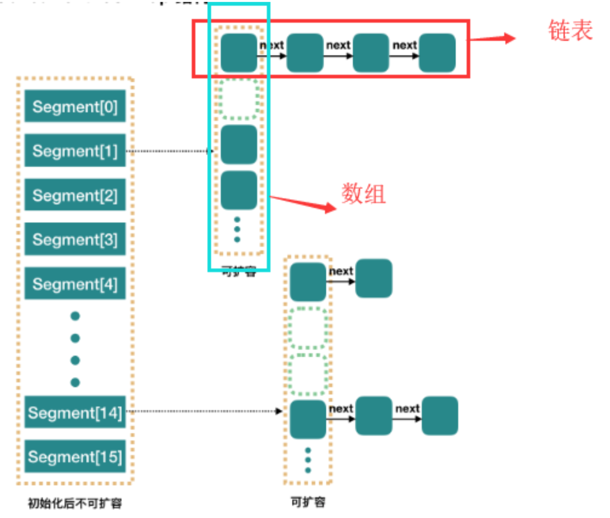

当每个操作分布在不同的Segment上的时候，默认情况下，理论上可以同时支持16个线程并发写入。

**1.8相比于1.7版本，做了两个改进：**

1. 取消了getment分段设计，直接使用Node数组来保存数据，并且采用Node数组元素作为锁来实现每一行数据进行加锁来进一步减少并发冲突的概率。
2. 将原本数组+单向链表的数据结构变更为数组+单向链表+红黑树的结构。为什么要引入红黑树呢？在正常情况下，key hash之后如果能够很均匀的分散在数组中，那么table数组中的node队列长度主要为0或者1。但是实际情况下，还是会存在一些队列长度过长的情况。如果来采用单向链表方式，那么查询某个节点的时间复杂度就变为O(n)。因此对于队列长度超过8的列表，JDK1.8采用了红黑树的结构，那么查询的时间复杂度就会降低到O(logN)，可以提升查找的性能。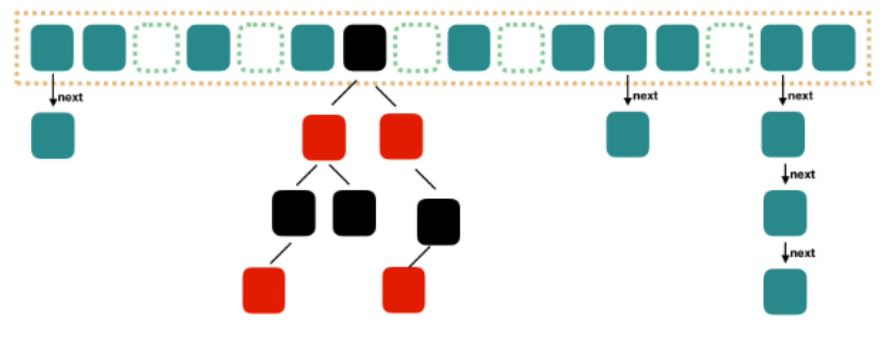这个结构和JDK1.8版本中的HashMap的实现结构基本一致，但是为了保证线程安全性，ConcurrentHashMap的实现会稍微复杂一些。

接下来我们从源码层面了解一下它的原理。我们基于put和get方法来分析它的实现即可。

### put方法第一阶段

```java
public V put(K key, V value) {
    return putVal(key, value, false);
}
```

```java
final V putVal(K key, V value, boolean onlyIfAbsent) {
    if (key == null || value == null) throw new NullPointerException();
    // 计算hash值
    int hash = spread(key.hashCode());
    // 用来记录链表长度
    int binCount = 0;
    // 这里其实就是自旋操作，当出现线程竞争时不断自旋
    for (Node<K,V>[] tab = table;;) {
        Node<K,V> f; int n, i, fh;
        if (tab == null || (n = tab.length) == 0) // 如果数组为空，则进行数组初始化
            // 初始化数组
            tab = initTable();
        // tabAt方法通过hash值对应的数组下标得到第一个节点。以volatile读的方式来读取table数组中的元素，保证每次拿到的数据都是最新的
        else if ((f = tabAt(tab, i = (n - 1) & hash)) == null) {
            // 如果该下标返回的节点为空，则直接通过CAS将新的值封装成node插入即可，如果CAS失败，说明存在竞争，则进入下一次循环。
            if (casTabAt(tab, i, null,
                         new Node<K,V>(hash, key, value, null)))
                break;                   // no lock when adding to empty bin
        }
        ......
}
```

假如在上面这段代码中存在两个线程，在不加锁的情况下：线程A成功执行casTabAt操作后，随后的线程B可以通过tabAt方法立刻看到table[i]的改变。原因如下：线程A的casTabAt操作，具有volatile读写相同的内存语义，根据volatile的happen-before规则：线程A的casTabAt操作，一定对线程B的tabAt操作可见。

#### initTable

数组初始化方法，这个方法比较简单，就是初始化一个合适大小的数组。

sizeCtl这个属性要单独说一下，如果没搞懂这个属性的意思，可能会被搞晕。这个标志是在Node数组初始化或者扩容的时候一个控制位标识，负数代表正在进行初始化或者扩容操作。

-1代表正在初始化

-N代表有N-1个线程正在进行扩容操作，这里不是简单的理解成n个线程，sizeCtl就是-N，这块后续在将扩容的时候会说明。

0标识Node数组还没有被初始化，整数代表初始化或者下一次扩容的大小

```java
private final Node<K,V>[] initTable() {
    Node<K,V>[] tab; int sc;
    while ((tab = table) == null || tab.length == 0) {
        // 被其他线程抢占了初始化的操作，则直接让出自己的CPU时间片
        if ((sc = sizeCtl) < 0)
            Thread.yield(); // lost initialization race; just spin
        // 通过CAS操作，将sizeCtl替换为-1，表示当前线程抢占到了初始化资格
        else if (U.compareAndSwapInt(this, SIZECTL, sc, -1)) {
            try {
                if ((tab = table) == null || tab.length == 0) {
                    // 默认初始容量为16
                    int n = (sc > 0) ? sc : DEFAULT_CAPACITY;
                    @SuppressWarnings("unchecked")
                    // 初始化数组，长度为16，或者初始化在构造ConcurrentHashMap的时候传入的长度
                    Node<K,V>[] nt = (Node<K,V>[])new Node<?,?>[n];
                    table = tab = nt; // 将这个数组赋值给table
                    // 计算容器容量多少的时候触发扩容，实际就是当前容量的0.75倍，这里使用了右移来计算
                    sc = n - (n >>> 2);  
                }
            } finally {
                // 设置sizeCtl为sc，如果默认是16的话，那么这个时候sc=16*0.75=12
                sizeCtl = sc;
            }
            break;
        }
    }
```

#### tabAt

该方法获取对象中的offset偏移地址对应的对象field的值。实际上这段代码的含义等价于tab[i]，但是为什么不直接使用tab[i]来计算呢？

getObjectVolatile，一旦看到volatile关键字，就表示可见性。因为对volatile写操作happen-before于volatile读操作，因此其他线程对table的修改均对get读取可见。

虽然table数组本身是增加了volatile属性，但是**”volatile的数组只针对数组引用具有volatile的语义，而不是它的元素“。**所以如果有其他线程对这个数组的元素进行写操作，那么当前线程来读的时候不一定能读到最新的值。

处于性能考虑。Doug Lea直接通过Unsafe类来对table进行操作。

```java
static final <K,V> Node<K,V> tabAt(Node<K,V>[] tab, int i) {
    return (Node<K,V>)U.getObjectVolatile(tab, ((long)i << ASHIFT) + ABASE);
}
```

#### 图解分析

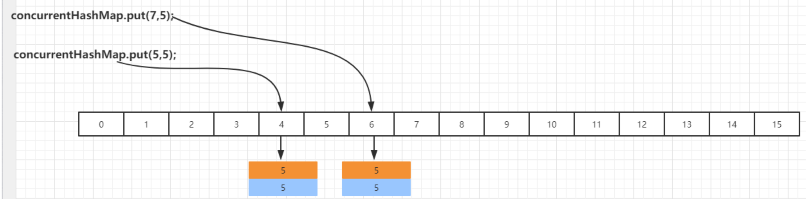

### put方法第二阶段

在putVal方法执行完成以后，会通过addCount来增加ConcurrentHashMap中的元素个数，并且还有可能触发扩容操作。这里会有两个经典的设计：

1. 高并发下的扩容
2. 如何保证addCount的数据安全性以及性能。

```java
final V putVal(K key, V value, boolean onlyIfAbsent) {
    .....
    // 将当前ConcurrentHashMap的元素数量加1，有可能触发transfer操作（扩容）
    addCount(1L, binCount);
    return null;
}
```


#### addCount

在putVal最后调用addCount的时候，传递了两个参数，分别是1和binCount（链表长度），看看addCount方法里面做了什么操作。

```java
// x表示这次需要在表中增加的元素个数，check参数表示是否需要进行扩容检查，大于等于0都需要进行检查
private final void addCount(long x, int check) {
    CounterCell[] as; long b, s;
    // 判断counterCells是否为空
    // 1,如果为空，就通过CAS操作尝试修改baseCount变量，对这个变量进行原子累加操作
    //（做这个操作的意义是：如果在没有竞争的情况下，仍然采用baseCount来记录元素个数）
    // 2,如果CAS失败说明存在竞争，这个时候不能在采用baseCount来累加，而是通过counterCell来记录。
    if ((as = counterCells) != null ||
        !U.compareAndSwapLong(this, BASECOUNT, b = baseCount, s = b + x)) {
        CounterCell a; long v; int m;
        // 是否冲突表示，默认为没有冲突
        boolean uncontended = true;
        // 这里有几个判断：
        // 1.计数表为空则直接调用fullAddCount
        // 2.从计数表中随机取出一个数组的位置为空，直接调用fullAddCount
        // 3.通过CAS修改CounterCell随机位置的值，如果修改失败说明出现并发情况（这里又用到了
        // 一种巧妙的方法），调用fullAndCount
        if (as == null || (m = as.length - 1) < 0 ||
            // Random 在线程并发的时候会有性能问题以及可能会产生相同的随机 数,ThreadLocalRandom.getProbe 可以解决这个问题，并且性能要比 Random 高
            (a = as[ThreadLocalRandom.getProbe() & m]) == null ||
            !(uncontended =
              U.compareAndSwapLong(a, CELLVALUE, v = a.value, v + x))) {
            // 执行fullAddCount方法
            fullAddCount(x, uncontended);
            return;
        }
        // 链表长度小于等于1，不需要考虑扩容
        if (check <= 1)
            return;
        s = sumCount();
    }
    // .....
}
```

#### CounterCells解释

**ConCurrentHashMap是采用CounterCell数组来记录元素个数的，一般的集合记录集合大小，直接定义一个size的成员变量即可，当出现改变的时候只要更新这个变量就行。但是ConcurrentHashMap不行。ConCurrentHashMap是并发集合，如果用一个成员变量来统计元素个数的话，为了保证并发情况下共享变量的安全性，势必会需要通过加锁或者自旋来实现，如果竞争比较激烈的情况下，size的设置上会出现比较大的冲突反而影响性能，所以在ConcurrentHashMap采用了分片的方法来记录大小**，具体什么意思，我们来分析下。

```java
    /**
     * Spinlock (locked via CAS) used when resizing and/or creating CounterCells.
     */
	// 表示当前cell数组是否在初始化或扩容中的CAS标志位
    private transient volatile int cellsBusy;

    /**
     * Table of counter cells. When non-null, size is a power of 2.
     */
	// counterCells数组，总数值的分值分别存在每个cell中
    private transient volatile CounterCell[] counterCells;

    /**
     * A padded cell for distributing counts.  Adapted from LongAdder
     * and Striped64.  See their internal docs for explanation.
     */
    @sun.misc.Contended static final class CounterCell {
        volatile long value;
        CounterCell(long x) { value = x; }
    }

	// 看到这段代码就能够明白了，CounterCell数组的每个元素，都存储一个元素个数，而实际我们调用size方法就是通过这个循环累加来得到的
	// 有了这个前提，在回过去看addCount这个方法，就容易理解一些了。
    final long sumCount() {
        CounterCell[] as = counterCells; CounterCell a;
        long sum = baseCount;
        if (as != null) {
            for (int i = 0; i < as.length; ++i) {
                if ((a = as[i]) != null)
                    sum += a.value;
            }
        }
        return sum;
    }
```

#### fullAddCount源码分析

fullAddCount主要是用来初始化CounterCell，来记录元素个数，里面包含扩容，初始化等操作：

```java
private final void fullAddCount(long x, boolean wasUncontended) {
    int h;
    // 获取当前线程的probe的值，如果值为0，则初始化当前线程的probe的值，probe就是随机数
    if ((h = ThreadLocalRandom.getProbe()) == 0) {
        ThreadLocalRandom.localInit();      // force initialization
        h = ThreadLocalRandom.getProbe();
        wasUncontended = true; // 由于重新生成了probe，为冲突标志位设置为true
    }
    boolean collide = false;                // True if last slot nonempty
    for (;;) { // 自旋
        CounterCell[] as; CounterCell a; int n; long v;
        //说明 counterCells 已经被初始化过了，这里可以先不看先看初始化。回头在来看这里
        if ((as = counterCells) != null && (n = as.length) > 0) {
            // 通过该值于当前线程probe求与，获得cells的下标元素，和hash表获取索引是一样的
            if ((a = as[(n - 1) & h]) == null) {
                // cellsBusy=0表示counterCells不再初始化或者扩容状态下
                if (cellsBusy == 0) {            // Try to attach new Cell
                    // 构造一个CounterCell的值，传入元素个数
                    CounterCell r = new CounterCell(x); // Optimistic create
                    if (cellsBusy == 0 &&
                        // 通过CAS设置cellsBusy标识，防止其他线程来都counterCells并发处理
                        U.compareAndSwapInt(this, CELLSBUSY, 0, 1)) {
                        boolean created = false;
                        try {               // Recheck under lock
                            CounterCell[] rs; int m, j;
                            //将初始化的 r 对象的元素个数放在对应下标的位置
                            if ((rs = counterCells) != null &&
                                (m = rs.length) > 0 &&
                                rs[j = (m - 1) & h] == null) {
                                rs[j] = r;
                                created = true;
                            }
                        } finally { // 恢复标志位
                            cellsBusy = 0;
                        }
                        if (created) // 创建成功，退出循环
                            break;
                        // 说明指定cells下标位置的数据不为空，则进行下一次循环
                        continue;           // Slot is now non-empty
                    }
                }
                collide = false;
            }
            // 说明在addCount方法中CAS失败了，并且或probe的值不为空
            else if (!wasUncontended)       // CAS already known to fail
                // 设置为未冲突标识，进入下一次自旋
                wasUncontended = true;      // Continue after rehash
            // 由于指定下标位置的cell值不为空，则直接通过CAS进行原子累加，如果成功，则直接退出
            else if (U.compareAndSwapLong(a, CELLVALUE, v = a.value, v + x))
                break;
            // 如果已经有其他线程建立了新的counterCells或者CounterCells大于CPU核心数
            // 很巧妙，线程的并发数不会超过CPU核心数
            else if (counterCells != as || n >= NCPU)
                // 设置当前线程的循环失败不进行扩容
                collide = false;            // At max size or stale
            // 恢复collide状态，表示下次循环会进行扩容
            else if (!collide)
                collide = true;
            // CounterCell数组容量不够，线程竞争较大，所以先设置一个标识表示正在扩容
            else if (cellsBusy == 0 &&
                     U.compareAndSwapInt(this, CELLSBUSY, 0, 1)) {
                try {
                    if (counterCells == as) {// Expand table unless stale
                        // 扩容一倍2变成4，这个扩容比较简单
                        CounterCell[] rs = new CounterCell[n << 1];
                        for (int i = 0; i < n; ++i)
                            rs[i] = as[i];
                        counterCells = rs;
                    }
                } finally {
                    cellsBusy = 0; // 恢复标识
                }
                collide = false;
                // 继续下一次自旋
                continue;                   // Retry with expanded table
            }
            //更新随机数的值
            h = ThreadLocalRandom.advanceProbe(h);
        }
        // 初始化CounterCells数组
        // cellsBusy=0表示没有在做初始化，通过CAS更新cellsBusy的值标注当前线程正在做初始化
        else if (cellsBusy == 0 && counterCells == as &&
                 U.compareAndSwapInt(this, CELLSBUSY, 0, 1)) {
            boolean init = false;
            try {                           // Initialize table
                if (counterCells == as) {
                    CounterCell[] rs = new CounterCell[2]; // 初始化容量为2
                    // 将x也就是元素的个数放在指定的数组线标位置
                    rs[h & 1] = new CounterCell(x); 
                    counterCells = rs; // 赋值给counterCells
                    init = true; // 设置初始化完成标识
                }
            } finally {
                cellsBusy = 0; // 恢复标识
            }
            if (init)
                break;
        }
        // 竞争激烈，其他线程占据cell数组，直接累加在base变量中
        else if (U.compareAndSwapLong(this, BASECOUNT, v = baseCount, v + x))
            break;                          // Fall back on using base
    }
}
```

#### CounterCells初始化图解

初始化长度为2的数组，然后随机得到指定的一个数组下标，将需要新增的值加入对应下标位置处

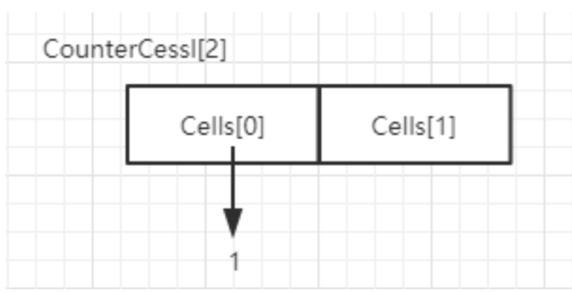

### transfer扩容阶段

判断是否需要扩容，也就是当更新的键值对总数baseCount>=阈值sizeCtl时，进行reHash，这里会有两个逻辑：

1. 如果当前正在处于扩容阶段，则当前线程会加入并且协助扩容。
2. 如果当前没有在扩容，则直接触发扩容操作。

```java
private final void addCount(long x, int check) {

    .....

    // 如果binCount>=0，表示需要检查扩容
    if (check >= 0) {
        Node<K,V>[] tab, nt; int n, sc;
        // s标识集合大小，如果集合大小大于或等于扩容阈值（默认值的0.75）
        // 并且table不为空并且table的长度下雨最大容量
        while (s >= (long)(sc = sizeCtl) && (tab = table) != null &&
               (n = tab.length) < MAXIMUM_CAPACITY) {
            int rs = resizeStamp(n); // 生成一个唯一的扩容戳。这里有些复杂，后续会分析
            if (sc < 0) {
                // sc<0，也就是sizeCtl<0，说明已经有别的线程在扩容了
                // 这5个条件只要有一个条件为true，说明当前线程不能帮助进行此次扩容，直接跳出循环
                // sc>>>RESIZE_STAMP_SHIFT!=rs表示比较高RESIZE_STAMP_BITS 位生成戳和rs是否相等，相同
                // sc=rs+1表示扩容结束
                // sc==rs+MAX_RESIZERS表示帮助线程已经达到最大值了
                // nt=nextTable -> 表示扩容已经结束
                // transferIndex<=0表示所有的tranfer任务都被领完了，没有生育的hash桶来给当前线程做
                if ((sc >>> RESIZE_STAMP_SHIFT) != rs || sc == rs + 1 ||
                    sc == rs + MAX_RESIZERS || (nt = nextTable) == null ||
                    transferIndex <= 0)
                    break;
                // 当前线程尝试帮助此次扩容，如果成功，则调用transfer
                if (U.compareAndSwapInt(this, SIZECTL, sc, sc + 1))
                    transfer(tab, nt);
            }
            // 如果当前没有在扩容，那么rs坑定是一个正数，通过rs<<RESIZE_STAMP_SHIFT将sc设置为一个负数，+2表示有一个线程在执行扩容
            else if (U.compareAndSwapInt(this, SIZECTL, sc,
                                         (rs << RESIZE_STAMP_SHIFT) + 2))
                transfer(tab, null); // 重新计数，判断是否需要开启下一轮扩容
            s = sumCount();
        }
    }
}
```

#### resizeStamp

这块逻辑要理解起来，也有一点复杂。

resizeStamp用来生成一个和扩容有关的扩容戳，具体有什么作用呢？我们基于它的实现来做一个分析

```java
static final int resizeStamp(int n) {
    return Integer.numberOfLeadingZeros(n) | (1 << (RESIZE_STAMP_BITS - 1));
}
```

Integer.numberOfLeadingZeros这个方法是返回无符号整数n最高位非0位前面的0的个数，比如10的二进制是0000 0000 0000 0000 0000 0000 0000 1010 那么这方法返回的值就是28。

根据resizeStamp的运算逻辑，我们来推演一下，假如n=16，那么resizeStamp(16)=32796转化为二进制是[0000 0000 0000 0000 1000 0000 0001 1100] 接着再来看，当第一个线程尝试进行扩容的时候，会执行下面这段代码：

```java
U.compareAndSwapInt(this, SIZECTL, sc, (rs << RESIZE_STAMP_SHIFT) + 2)
```

rs 左移 16 位，相当于原本的二进制低位变成了高位 ==**1000 0000 0001 1100**== 0000 0000 0000 0000

然后再+2 ===**1000 0000 0001 1100**== 0000 0000 0000 0000+10=**==1000 0000 0001 1100==** 0000 0000 0000 0010 

高16位代表扩容的标记、低16位代表并行扩容的线程数

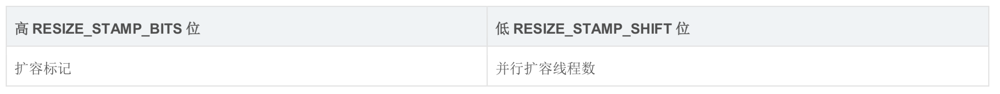

这样来存储有什么好处呢？

1. 首先在CHM中是支持并发扩容的，也就是说如果当前的数组需要进行扩容操作，可以由多个线程来共同负责。
2. 可以保证每次扩容都生成唯一的生成戳，每次新的扩容，都有一个不同的n，这个生成戳就是根据n来计算出来的一个数字，n不同，这个数字也不同。

第一个线程尝试扩容的时候，为什么是+2

因为1表示初始化，2表示一个线程在执行扩容，而且对sizeCtl的操作都是基于位运算的，不会关心它本身的数值是多少，只关心它在二进制上的数值，而sc+1会在低16位上加1。

#### transfer

扩容是ConcurrentHashMap的精华之一，扩容操作的核心在于数据的转移，在单线程环境下数据的转移很简单，无非就是把旧数据中的数据迁移到新的数组。但是在多线程环境下，在扩容的时候其他线程也可能正在添加元素，这时又触发了扩容怎么办？可能大家想到的第一个解决方案是互斥锁，把转移的过程锁住，虽然是可行的解决方案，但是会带来较大的性能开销。因为互斥锁会导致所有访问临界区的线程陷入到阻塞状态，持有锁的线程耗时越长，其他竞争的线程就会一直被阻塞，导致吞吐量较低。而且还可能导致死锁。

而ConcurrentHashMap并没有直接加锁，而是采用CAS实现无锁的并发不同策略，最精华的部分是它可以利用多线程来进行协同扩容。

简单来说，它把Node数组当做多个线程之间共享的任务队列，然后通过维护一个指针来划分每个线程锁负责的区间，每个线程通过区间逆向遍历来实现扩容，一个已经迁移完的bucket会被替换成一个ForwardingNode节点，标记当前bucket已经被其他线程迁移完了。

接下来分析它的源码实现：

1. fwd：这个类是表示类，用于指向新表用的，其他线程遇到这个类会主动跳过这个类，因为这个类要么就是扩容迁移正在进行，要么就是已经完成扩容迁移，也就是这个类要保证线程安全，在进行操作。
2. advance:这个变量是用于提示代码是否进行推进处理，也就是当前桶处理完，处理下一个桶的标识。
3. finishing：这个变量用于提示扩容是否结束用的

```java
private final void transfer(Node<K,V>[] tab, Node<K,V>[] nextTab) {
    int n = tab.length, stride;
    // 将（n>>>3相当于n/8）然后除以CPU核心数。如果得到的结果小于16，那么就使用16
    // 这里的目的是让每个CPU处理的桶一样多，避免出现转移任务不均匀的现象，如果桶较少的话，默认一个CPU（一个线程）处理16个桶，也就是长度为16的时候，扩容的首只会有一个线程来扩容
    if ((stride = (NCPU > 1) ? (n >>> 3) / NCPU : n) < MIN_TRANSFER_STRIDE)
        stride = MIN_TRANSFER_STRIDE; // subdivide range
    if (nextTab == null) {            // initiating
        try {
            @SuppressWarnings("unchecked")
            // 新建一个n<<1原始table大小的nextTab，也就是32
            Node<K,V>[] nt = (Node<K,V>[])new Node<?,?>[n << 1];
            nextTab = nt; // 赋值给nextTab
        } catch (Throwable ex) {      // try to cope with OOME
            // 扩容失败，sizeCtl使用int的最大值
            sizeCtl = Integer.MAX_VALUE; 
            return;
        }
        nextTable = nextTab; // 更新成员变量
        transferIndex = n; // 更新转移下标，表示转移时的下标
    }
    // 新的tab长度
    int nextn = nextTab.length;
    // 创建一个fwd节点，表示一个正在被迁移的Node，并且它的hash值为-1（MOVED），也就是前面我们在讲putval方法的时候，会有一个判断MOVED的逻辑。它的作用是用来占位，表示原数组中位置i处的节点完成迁移以后，就会在i位置设置一个fwd来告诉其他线程这个位置已经处理过了。
    ForwardingNode<K,V> fwd = new ForwardingNode<K,V>(nextTab);
    // 首次推进为true，如果等于true，说明需要再次推进一个下标（i--），反之，如果是false，那么就不能推进下标，需要将当前的下标处理完毕才能继续推进
    boolean advance = true;
     // 判断是否已经扩容完成，完成了就return，退出循环
    boolean finishing = false; // to ensure sweep before committing nextTab
    // 通过自循环处理每个槽位中的链表元素，默认advace为真，通过CAS设置transferIndex属性值，并初始化i和bound值，i指当前处理的槽位序号，bound指需要处理的槽位边界，先处理槽位15的节点。
    for (int i = 0, bound = 0;;) {
        // 这个循环使用CAS不断尝试为当前线程分配任务
        // 直到分配成功或任务队列已经被全部分配完毕
        // 如果当前线程已经被分配过bucket区域
        // 那么会通过--i指向下一个待处理bucket然后退出该循环
        Node<K,V> f; int fh;
        while (advance) {
            int nextIndex, nextBound;
            // --i表示下一个待处理bucket，如果它>=bound，表示当前线程已经分配过bucket区域
            if (--i >= bound || finishing)
                advance = false;
            // 表示所有bucket已经分配完毕
            else if ((nextIndex = transferIndex) <= 0) {
                i = -1;
                advance = false;
            }
            // 通过CAS来修改TRANSFERINDEX，为当前线程分配任务，处理的节点区间为（nextBound,nextIndex） -> (0,15)
            else if (U.compareAndSwapInt
                     (this, TRANSFERINDEX, nextIndex,
                      nextBound = (nextIndex > stride ?
                                   nextIndex - stride : 0))) {
                bound = nextBound; // 0
                i = nextIndex - 1; // 15
                advance = false;
            }
        }
        // i<0说明已经遍历完整的数组，也就是当前线程已经处理完所有负责的bucket
        if (i < 0 || i >= n || i + n >= nextn) {
            int sc;
            if (finishing) { // 如果完成了扩容
                nextTable = null; // 删除成员变量
                table = nextTab; // 更新table数组
                sizeCtl = (n << 1) - (n >>> 1); // 更新阈值（32*0.75=24）
                return;
            }
            // sizeCtl在迁移前会设置为（rs << RESIZE_STAMP_SHIFT）+2
            // 然后，每增加一个线程参与迁移就会将sizeCtl加1
            // 这里使用CAS操作对sizeCtl的低16位进行减1，代表偶昨晚了属于自己的任务
            if (U.compareAndSwapInt(this, SIZECTL, sc = sizeCtl, sc - 1)) {
                // 第一个扩容的线程，执行transfer方法之前，会设置sizeCtl=(resizeStamp(n)<<RESIZE_STAMP_SHIFT)+2,后续帮其扩容的线程，执行transfer方法之前，会这只sizeCtl=sizeCtl+1每一个退出transfer的方法的线程，退出之前，会这只sizeCtl=sizeCtl-1那么最后一个线程退出时，必然有sc == (resizeStamp(n) << RESIZE_STAMP_SHIFT) + 2)，即 (sc - 2)== resizeStamp(n) << RESIZE_STAMP_SHIFT
                // 如果sc-2不等于表示符左移16位。如果他们相等了，说明没有线程在帮助他们扩容了。也就是说扩容结束了。
                if ((sc - 2) != resizeStamp(n) << RESIZE_STAMP_SHIFT)
                    return;
                // 如果氙灯，扩容结束了，更新finising变量
                finishing = advance = true;
                // 再次循环检查一下整张表
                i = n; // recheck before commit
            }
        }
        // 如果位置i处是空的，没有任何节点，那么放入刚刚初始化的ForwardingNode”空节点“
        else if ((f = tabAt(tab, i)) == null)
            advance = casTabAt(tab, i, null, fwd);
        // 表示该位置已经完成了迁移，也就是如果线程A已经处理过这个节点，那么线程B处理这个节点时，hash值一定为MOVED
        else if ((fh = f.hash) == MOVED)
            advance = true; // already processed
        else {
            synchronized (f) {
                if (tabAt(tab, i) == f) {
                    Node<K,V> ln, hn;
                    if (fh >= 0) {
                        int runBit = fh & n;
                        Node<K,V> lastRun = f;
                        for (Node<K,V> p = f.next; p != null; p = p.next) {
                            int b = p.hash & n;
                            if (b != runBit) {
                                runBit = b;
                                lastRun = p;
                            }
                        }
                        if (runBit == 0) {
                            ln = lastRun;
                            hn = null;
                        }
                        else {
                            hn = lastRun;
                            ln = null;
                        }
                        for (Node<K,V> p = f; p != lastRun; p = p.next) {
                            int ph = p.hash; K pk = p.key; V pv = p.val;
                            if ((ph & n) == 0)
                                ln = new Node<K,V>(ph, pk, pv, ln);
                            else
                                hn = new Node<K,V>(ph, pk, pv, hn);
                        }
                        setTabAt(nextTab, i, ln);
                        setTabAt(nextTab, i + n, hn);
                        setTabAt(tab, i, fwd);
                        advance = true;
                    }
                    else if (f instanceof TreeBin) {
                        TreeBin<K,V> t = (TreeBin<K,V>)f;
                        TreeNode<K,V> lo = null, loTail = null;
                        TreeNode<K,V> hi = null, hiTail = null;
                        int lc = 0, hc = 0;
                        for (Node<K,V> e = t.first; e != null; e = e.next) {
                            int h = e.hash;
                            TreeNode<K,V> p = new TreeNode<K,V>
                                (h, e.key, e.val, null, null);
                            if ((h & n) == 0) {
                                if ((p.prev = loTail) == null)
                                    lo = p;
                                else
                                    loTail.next = p;
                                loTail = p;
                                ++lc;
                            }
                            else {
                                if ((p.prev = hiTail) == null)
                                    hi = p;
                                else
                                    hiTail.next = p;
                                hiTail = p;
                                ++hc;
                            }
                        }
                        ln = (lc <= UNTREEIFY_THRESHOLD) ? untreeify(lo) :
                            (hc != 0) ? new TreeBin<K,V>(lo) : t;
                        hn = (hc <= UNTREEIFY_THRESHOLD) ? untreeify(hi) :
                            (lc != 0) ? new TreeBin<K,V>(hi) : t;
                        setTabAt(nextTab, i, ln);
                        setTabAt(nextTab, i + n, hn);
                        setTabAt(tab, i, fwd);
                        advance = true;
                    }
                }
            }
        }
    }
}
```

#### 扩容图解

ConcurrentHashMap支持并发扩容，实现方式是，把Node数组进行拆分，让每个线程处理自己的区域，假设table数组总长度是64，默认情况下，那么每个线程可以分到16个bucket。然后每个线程处理的范围，按照倒序来做迁移。

通过for自循环处理每个槽位中的链表元素，默认advace为真，通过CAS设置transferIndex属性值，并初始化i和bound值，i指当前处理的槽位序号，bound指需要处理的槽位边界，先处理槽位31的节点；(bound,i) =(16,31)从31的位置往前推动。

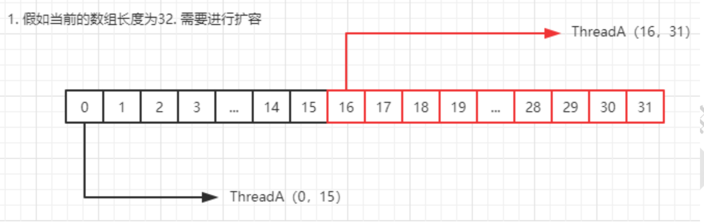

假设这个时候ThreadA在进行transfer，那么逻辑图表示如下：

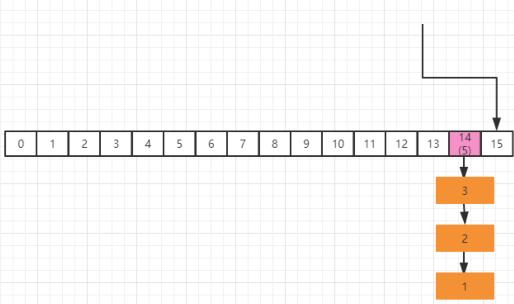

在当前假设条件下，槽位15中没有节点，则通过CAS插入在第二步中初始化的ForwardingNode节点，用于告诉其他线程该槽位已经处理过了

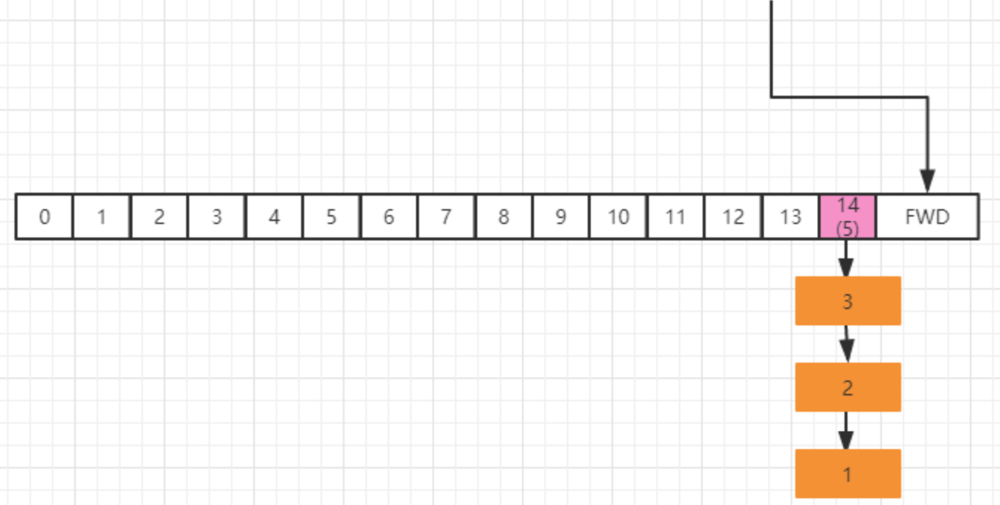

#### sizeCtl扩容退出机制

在扩容操作transfer的第2414行，代码如下：

```java
if (U.compareAndSwapInt(this, SIZECTL, sc = sizeCtl, sc - 1)) {
    if ((sc - 2) != resizeStamp(n) << RESIZE_STAMP_SHIFT)
        return;
    finishing = advance = true;
    i = n; // recheck before commit
}
```

没存在一个线程执行完扩容操作，就通过CAS执行sc-1。接着判断（sc-2）!=resizeStamp(n) << RESIZE_STAMP_SHIFT；如果相等，表示当前为整个扩容操作的最后一个线程，那么意味着整个扩容操作就结束了，如果不相等，说明还得继续。

这么做的目的，一方面是防止不同扩容之间出现相同的sizeCtl，另外一方面，还可以避免sizeCtl的ABA问题导致扩容重叠的情况。

### 数据迁移阶段的实现分析

通过分配好迁移的区间之后，开始对数据进行迁移。先了解一下原理在看源码,下面的源码可以先跳过。

```java
// 对数组该节点位置加锁，开始处理数组该位置的迁移工作
synchronized (f) {
    if (tabAt(tab, i) == f) { // 在做一次校验
        Node<K,V> ln, hn; // ln表示低位，hn表示高位；
        // 接下来这段代码的作用是把链表拆分成两个部分，0在低位，1在高位
        if (fh >= 0) {
            int runBit = fh & n;
            Node<K,V> lastRun = f;
            // 遍历当前bucket的链表，目的是尽量重用Node链表尾部的一部分
            for (Node<K,V> p = f.next; p != null; p = p.next) {
                int b = p.hash & n;
                if (b != runBit) {
                    runBit = b;
                    lastRun = p;
                }
            }
            // 如果最后更新的runBit是0，设置低位节点
            if (runBit == 0) {
                ln = lastRun;
                hn = null;
            }
            else { // 否则设置高位节点
                hn = lastRun;
                ln = null;
            }
            // 构造高位以及低位的链表
            for (Node<K,V> p = f; p != lastRun; p = p.next) {
                int ph = p.hash; K pk = p.key; V pv = p.val;
                if ((ph & n) == 0)
                    ln = new Node<K,V>(ph, pk, pv, ln);
                else
                    hn = new Node<K,V>(ph, pk, pv, hn);
            }
            // 将低位的链表放在i位置也就是不动
            setTabAt(nextTab, i, ln);
            // 将高位链表放在i+n位置
            setTabAt(nextTab, i + n, hn);
            // 把旧的hash桶中放置转发节点（fwd），表明此hash桶已经处理
            setTabAt(tab, i, fwd);
            advance = true;
        }
        else if (f instanceof TreeBin) { // 红黑树的扩容部分
            ... 
        }
    }
}
```

#### 高低位原理分析

ConcurrentHashMap在做链表迁移时，会用高低位来实现。

假如我们有这样一个队列

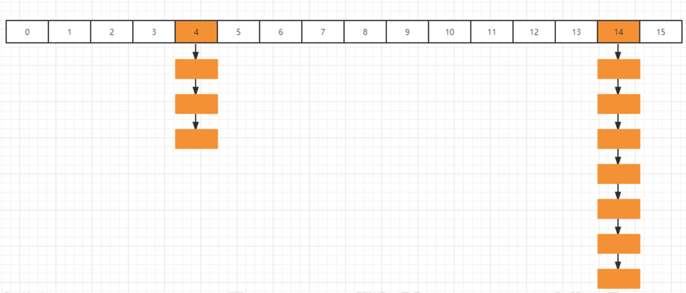

第14个槽位插入新节点之后，链表元素个数已经达到了8，并且数组长度为16，有限通过扩容来缓解链表过长的问题，扩容这块的图解稍后在分析，先分析高低位扩容的原理。

假如当前线程正在处理槽位14的节点，它是一个链表结构，在代码中，首先定义两个变量节点ln和hn，实际就是lowNode和HighNode，分别保存hash至的第x位为0和不等0的节点。

通过fn&n可以把这个链表中的元素分为两类，A类是hash值的第X位为0，B类是hash值的第X位不等于0（为什么这么区分稍后分析），并且通过lastRun记录最后要处理的节点。最终要达到的目的是，A类的链表保持位置不动，B类的链表为14+16(扩容增加的长度)=30。

我们把14槽位的链表单独拎出来，我们用蓝色表示fn&n=0的节点，键入量表分类是这样：

```java
for (Node<K,V> p = f.next; p != null; p = p.next) {
    int b = p.hash & n;
    if (b != runBit) {
        runBit = b;
        lastRun = p;
    }
}
```

通过上面这段代码遍历，会记录runBit以及lastRun，按照上面这个结构，那么runBit应该是蓝色节点，lastRun应该是第6个节点。

接着，在通过这段代码进行遍历，生成ln链以及hn链

```java
for (Node<K,V> p = f; p != lastRun; p = p.next) {
    int ph = p.hash; K pk = p.key; V pv = p.val;
    if ((ph & n) == 0)
        ln = new Node<K,V>(ph, pk, pv, ln);
    else
        hn = new Node<K,V>(ph, pk, pv, hn);
}
```

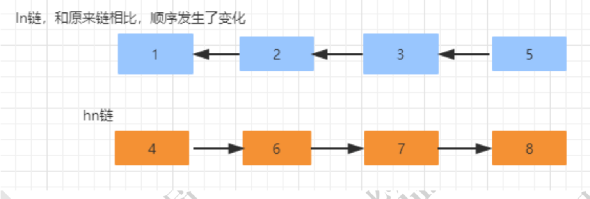

接着，通过 CAS 操作，把 hn 链放在 i+n 也就是 14+16 的位置，ln 链保持原来的位置不动。 并且设置当前节点为 fwd，表示已经被当前线程迁移完了 

```java
// 将低位的链表放在i位置也就是不动
setTabAt(nextTab, i, ln);
// 将高位链表放在i+n位置
setTabAt(nextTab, i + n, hn);
// 把旧的hash桶中放置转发节点（fwd），表明此hash桶已经处理
setTabAt(tab, i, fwd);
```

迁移完成以后的数据分布如下：

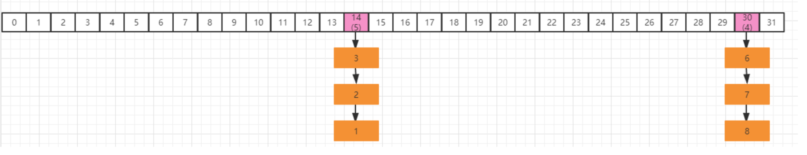

#### 为什么要做高低位划分

要想了解这么设计的目的，我们需要从ConcurrentHashMap的根据下标获取对象的算法来看，在putVal方法中1018行。

```java
(f = tabAt(tab, i = (n - 1) & hash)) == null
```

通过(n-1)&hash来获得在table中的数组下标来获取节点数据，【&运算是二进制运算符，1&1=1，其他都为0】

> 假设我们的table长度是16，二进制是【0001 0000】，减一以后的二进制是【0000 1111】假如某个key的hash值=9，对应的二进制是【0000 1001】，那么按照(n-1)&hash的算法```0000 1111&0000 1001=0000 1001```，运算结果是9。
>
> 当我们扩容以后，16变成了2，那么(n-1)的二进制是【0001 1111】，仍然以hash值=9的二进制计算为例```0001 1111 & 0000 1001 =0000 1001 ```，运算结果仍然是9.
>
> 我们换一个数字，假如某个 key 的 hash 值是 20，对应的二进制是【0001 0100】，仍然按照(n-1) & hash 算法，分别在 16 为长度和 32 位长度下的计算结果
>  16 位: ```0000 1111 & 0001 0100 =0000 0100```
>  32 位: ```0001 1111 & 0001 0100 =0001 0100 ```
>
> 从结果来看，同样一个 hash 值，在扩容前和扩容之后，得到的下标位置是不一样的，这种情况当然是 不允许出现的，所以在扩容的时候就需要考虑，而使用高低位的迁移方式，就是解决这个问题。
>
> 16 位的结果到 32 位的结果，正好增加了 16. 
>
> 比如 20&15=4 、20&31=20 ; 4-20=16
>  比如 60 & 15=12 、60 & 31=28; 12-28=16
>  所以对于高位，直接增加扩容的长度，当下次 hash 获取数组位置的时候，可以直接定位到对应的位置这个地方又是一个很巧妙的设计，直接通过高低位分类以后，就使得不需要在每次扩容的时候来重新计算 hash。极大的提升了效率 

#### 扩容结束以后的退出机制

如果线程扩容结束，那么需要退出，就会执行transfer方法如下代码：

```java
// i < 0说明已经遍历完旧的数组，也就是当前线程已经处理完所有负责的bucket
if (i < 0 || i >= n || i + n >= nextn) {
    int sc;
    if (finishing) { // 如果完成了扩容
        nextTable = null; // 删除成员变量
        table = nextTab;// 更新table数组
        sizeCtl = (n << 1) - (n >>> 1); // 更新阈值(32*0.75=24)
        return;
    }
    // sizeCtl在迁移前会设置为(rs << RESIZE_STAMP_SHIFT) + 2
    // 然后，每增加一个线程参与迁移就会将sizeCtl加1.
    // 这里使用CAS操作对sizeCtl的低16位进行减1,代码做了属于自己的任务
    if (U.compareAndSwapInt(this, SIZECTL, sc = sizeCtl, sc - 1)) {
        // 第一个扩容的线程，执行 transfer 方法之前，会设置 sizeCtl = (resizeStamp(n) << RESIZE_STAMP_SHIFT) + 2)后续帮其扩容的线程，执行 transfer 方法之前，会设置 sizeCtl = sizeCtl+1每一个退出 transfer 的方法的线程，退出之前，会设置 sizeCtl = sizeCtl-1 那么最后一个线程退出时:必然有sc == (resizeStamp(n) << RESIZE_STAMP_SHIFT) + 2)，即 (sc - 2)== resizeStamp(n) << RESIZE_STAMP_SHIFT
		// 如果 sc - 2 不等于标识符左移 16 位。如果他们相等了，说明没有线程在帮助他们扩容了。也就是说，扩容结束了。
        if ((sc - 2) != resizeStamp(n) << RESIZE_STAMP_SHIFT)
            return;
        // 如果相等，扩容结束了，更新 finising 变量
        finishing = advance = true;
        // 再次循环检查一下整张表
        i = n; // recheck before commit
    }
}
```

### put 方法第三阶段 

如果对应的节点存在，判断这个节点的 hash 是不是等于 MOVED(-1)，说明当前节点是 ForwardingNode 节点， 

意味着有其他线程正在进行扩容，那么当前现在直接帮助它进行扩容，因此调用 helpTransfer 方法:

```java
else if ((fh = f.hash) == MOVED)
    tab = helpTransfer(tab, f);
```

#### helpTransfer

从名字上来看，代表当前是去协助扩容

```java
final Node<K,V>[] helpTransfer(Node<K,V>[] tab, Node<K,V> f) {
    Node<K,V>[] nextTab; int sc;
    // 判断此时是否仍然在执行扩容,nextTab=null 的时候说明扩容已经结束了
    if (tab != null && (f instanceof ForwardingNode) &&
        (nextTab = ((ForwardingNode<K,V>)f).nextTable) != null) {
        int rs = resizeStamp(tab.length);
        // 说明扩容还未完成的情况下不断循环来尝试将当前线程加入到扩容操作中
        while (nextTab == nextTable && table == tab &&
               (sc = sizeCtl) < 0) {
            // 下面部分的整个代码表示扩容结束，直接退出循环
            // transferIndex<=0 表示所有的 Node 都已经分配了线程
            // sc=rs+MAX_RESIZERS 表示扩容线程数达到最大扩容线程数
            // sc >>> RESIZE_STAMP_SHIFT !=rs， 如果在同一轮扩容中，那么 sc 无符号右移比较高位和 rs 的值，那么应该是相等的。如果不相等，说明扩容结束了
            // sc==rs+1 表示扩容结束
            if ((sc >>> RESIZE_STAMP_SHIFT) != rs || sc == rs + 1 ||
                sc == rs + MAX_RESIZERS || transferIndex <= 0)
                break;
            //在低16位 上增加扩容线程数
            if (U.compareAndSwapInt(this, SIZECTL, sc, sc + 1)) {
                //帮助扩容
                transfer(tab, nextTab);
                break;
            }
        }
        return nextTab;
    }
    //返回新的数组
    return table;
}
```

### put方法第四阶段

这个方法的主要作用是，如果被添加的节点的位置已经存在节点的时候，需要以链表的方式加入到节点中 。

如果当前节点已经是一颗红黑树，那么就会按照红黑树的规则将当前节点加入到红黑树中：

```java
else {// 进入到这个分支，说明f是当前nodes数组对应位置节点的头节点，并且不为空
    V oldVal = null;
    // 给对应的头结点加锁 
    synchronized (f) {
        // 再次判断对应下标位置是否为f节点
        if (tabAt(tab, i) == f) {
            // 头结点的hash值大于0，说明是链表
            if (fh >= 0) {
                // 用来记录链表的长度
                binCount = 1;
                // 遍历链表
                for (Node<K,V> e = f;; ++binCount) {
                    K ek;
                    // 如果发现相同的key，则判断是否需要进行值的覆盖
                    if (e.hash == hash &&
                        ((ek = e.key) == key ||
                         (ek != null && key.equals(ek)))) {
                        oldVal = e.val;
                        // 默认情况下，直接覆盖旧的值
                        if (!onlyIfAbsent)
                            e.val = value;
                        break;
                    }
                    // 一直遍历到链表的最末端，直接把新的值加入到链表的最后面
                    Node<K,V> pred = e;
                    if ((e = e.next) == null) {
                        pred.next = new Node<K,V>(hash, key,
                                                  value, null);
                        break;
                    }
                }
            }
            // 如果当前的f节点是一颗红黑树
            else if (f instanceof TreeBin) {
                Node<K,V> p;
                binCount = 2;
                // 调用红黑树的插入方法插入新的值
                if ((p = ((TreeBin<K,V>)f).putTreeVal(hash, key,
                                               value)) != null) {
                    oldVal = p.val;
                    // 同样，如果值已经存在，则直接替换
                    if (!onlyIfAbsent)
                        p.val = value;
                }
            }
        }
    }
    // 说明上面在做链表操作
    if (binCount != 0) {
        // 如果链表长度已经达到临界值8就需要把链表转换为树结构
        if (binCount >= TREEIFY_THRESHOLD)
            treeifyBin(tab, i);
        // 如果val是被替换的，则返回替换之前的值
        if (oldVal != null)
            return oldVal;
        break;
    }
}
```

#### treeifyBin

**判断链表的长度是否已经达到临界值8。 如果达到了临界值，这个时候会根据当前数组的长度来决定是扩容还是将链表转化为红黑树。也就是说如果当前数组的长度小于 64，就会先扩容。 否则，会把当前链表转化为红黑树。** 

```java
// 说明上面在做链表操作
if (binCount != 0) {
    // 如果链表长度已经达到临界值8就需要把链表转换为树结构
    if (binCount >= TREEIFY_THRESHOLD)
        treeifyBin(tab, i);
    // 如果val是被替换的，则返回替换之前的值
    if (oldVal != null)
        return oldVal;
    break;
}	
```
在 putVal 的最后部分，有一个判断，如果链表长度大于 8，那么就会触发扩容或者红黑树的 转化操作。 

```java
private final void treeifyBin(Node<K,V>[] tab, int index) {
    Node<K,V> b; int n, sc;
    if (tab != null) {
        // tab的长度是不是小于64，如果是，则执行扩容
        if ((n = tab.length) < MIN_TREEIFY_CAPACITY)
            tryPresize(n << 1);
        //否则，将当前链表转化为红黑树结构存储
        else if ((b = tabAt(tab, index)) != null && b.hash >= 0) {
            // 将链表转换成红黑树
            synchronized (b) {
                if (tabAt(tab, index) == b) {
                    TreeNode<K,V> hd = null, tl = null;
                    for (Node<K,V> e = b; e != null; e = e.next) {
                        TreeNode<K,V> p =
                            new TreeNode<K,V>(e.hash, e.key, e.val,
                                              null, null);
                        if ((p.prev = tl) == null)
                            hd = p;
                        else
                            tl.next = p;
                        tl = p;
                    }
                    setTabAt(tab, index, new TreeBin<K,V>(hd));
                }
            }
        }
    }
}
```

#### tryPresize

tryPresize 里面部分代码和 addCount 的部分代码类似，看起来会稍微简单一些 

```java
private final void tryPresize(int size) {
    // 对size进行修复,主要目的是防止传入的值不是一个2次幂的整数，然后通过tableSizeFor来将入参转化为离该整数最近的2次幂
    int c = (size >= (MAXIMUM_CAPACITY >>> 1)) ? MAXIMUM_CAPACITY :
        tableSizeFor(size + (size >>> 1) + 1);
    int sc;
    while ((sc = sizeCtl) >= 0) {
        Node<K,V>[] tab = table; int n;
        // 下面这段代码和initTable是一样的，如果table没有初始化，则开始初始化
        if (tab == null || (n = tab.length) == 0) {
            n = (sc > c) ? sc : c;
            if (U.compareAndSwapInt(this, SIZECTL, sc, -1)) {
                try {
                    if (table == tab) {
                        @SuppressWarnings("unchecked")
                        Node<K,V>[] nt = (Node<K,V>[])new Node<?,?>[n];
                        table = nt;
                        sc = n - (n >>> 2);
                    }
                } finally {
                    sizeCtl = sc;
                }
            }
        }
        else if (c <= sc || n >= MAXIMUM_CAPACITY)
            break;
        //这段代码和addCount后部分代码是一样的，做辅助扩容操作
        else if (tab == table) {
            int rs = resizeStamp(n);
            if (sc < 0) {
                Node<K,V>[] nt;
                if ((sc >>> RESIZE_STAMP_SHIFT) != rs || sc == rs + 1 ||
                    sc == rs + MAX_RESIZERS || (nt = nextTable) == null ||
                    transferIndex <= 0)
                    break;
                if (U.compareAndSwapInt(this, SIZECTL, sc, sc + 1))
                    transfer(tab, nt);
            }
            else if (U.compareAndSwapInt(this, SIZECTL, sc,
                                         (rs << RESIZE_STAMP_SHIFT) + 2))
                transfer(tab, null);
        }
    }
}
```