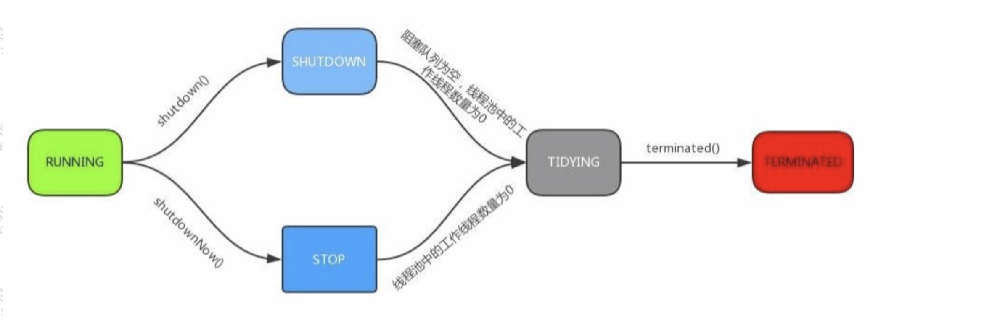

# 线程池、forkjoin的原理分析

## 什么是线程池

在Java中，如果每个请求到达就创建一个新线程，创建和销毁线程花费的时间和消耗的系统资源都相当大，甚至可能要比在处理实际的用户请求的时间和资源要多的多。

如果在一个JVM里面创建太多线程，可能会使系统由于过度消耗内存或”切换过度“而导致系统资源步子

为了解决这个问题，就有了线程池的概念，线程池的核心逻辑是提前创建好若干个线程放在一个容器中。如果有任务需要处理，则将任务直接分配给线程池中的线程来执行就行，任务处理完以后这个线程不会被销毁，而是等待后续分配任务，同时通过线程池来重复管理线程还可以避免创建大量线程增加开销。

## 线程池的优势

合理的使用线程池，可以带来一些好处：

1. 减低创建线程和销毁线程的性能开销
2. 提高响应速度，当有新任务需要执行是不需要等待线程创建就可以立马执行
3. 合理的设置线程池大小可以避免因为线程数超过硬件资源瓶颈带来的问题。

## Java中提供的线程池API

要想合理的使用线程池，那么势必要对线程池的原理有比较深的理解。

### 线程池的使用

JDK为我们提供了几种不同的线程池实现。我们先来通过一个简单的案例来引入线程池的基本使用。

在Java中怎么创建线程池呢？下面这段代码演示了创建三个固定线程数的线程池：

```java
public class ThreadPoolTest implements Runnable {

    @Override
    public void run() {
        try {
            Thread.sleep(10);
        } catch (InterruptedException e) {
            e.printStackTrace();
        }
        System.out.println(Thread.currentThread().getName());
    }

    static ExecutorService service = Executors.newFixedThreadPool(3);

    public static void main(String[] args) {
        for (int i = 0; i < 100; i++) {
            service.execute(new ThreadPoolTest());
        }

        service.shutdown();
    }
}
```

### 线程池API

为了方便大家对于线程池的使用，在Executors里面提供了几个线程池的工厂方法，这样，很多新手就不需要了解太多关于ThreadPoolExecutor的只是了，它们值需要直接使用Executors的工厂方法，就可以使用线程池。

Executors提供的工厂方法：

- newFixedThreadPool：该方法返回一个固定数量的线程池，线程数不变，当有一个任务提交时，若线程池中空闲，则立即执行，若没有，则会被暂缓在一个任务队列中，等待有空闲的线程去执行。
- newSingleThreadExecutor：创建一个线程的线程池，若空闲则执行，若没有空闲线程则暂缓在任务队列中。
- newCachedThreadPool：返回一个可根据实际情况调整线程个数的线程池，不限制最大线程数量，若用空闲的线程则执行任务，若无任务则不创建线程。并且每一个空闲线程会在60秒后自动回收。
- newScheduledThreadPool:创建一个可以执行线程的数量的线程池，但是这个线程池还带有延迟和周期性执行任务的功能，类似定时器。

### ThreadPoolExecutor

上面提到的四种线程池的构建，都是基于ThreadPoolExecutor来构建的，接下来将一起了解一下面试官最喜欢问道的一道面试题”请简单说下你知道的线程池和ThreadPoolThread有哪些构造参数“。

ThreadPoolExecutor有多个重载的构造方法，我们可以基于它最完整的狗仔方法来分析，先来解释一下每个参数的作用，稍后我们再发恩熙源码的过程中再来详细了解参数的意义。

```java
public ThreadPoolExecutor(int corePoolSize,// 核心线程数
                          int maximumPoolSize,// 最大线程数
                          long keepAliveTime,// 超时时间，超出核心线程数量以外的线程空余存活时间
                          TimeUnit unit,// 存活时间单位
                          BlockingQueue<Runnable> workQueue,// 保存执行任务的队列
                          ThreadFactory threadFactory,// 创建新线程使用的工厂
                          RejectedExecutionHandler handler)// 当任务无法执行的时候的处理方式
```

线程池初始化以后做了什么事情？线程池初始化时是没有创建线程的，线程池的线程的初始化与其他线程一样，但是在完成任务以后，该线程不会自行销毁，而是以挂起的状态返回到线程池。知道应用程序再次向线程池发出请求时，线程池里挂起的线程就会再度激活执行任务。这样既节省了建立线程锁造成的性能损耗，也可以让多个任务反复重用同一个线程，从而在应用程序生存期内节约大量开销。

#### newFixedThreadPool

```java
public static ExecutorService newFixedThreadPool(int nThreads) {
    return new ThreadPoolExecutor(nThreads, nThreads,
                                  0L, TimeUnit.MILLISECONDS,
                                  new LinkedBlockingQueue<Runnable>());
}
```

FixedThreadPool的核心线程数和最大线程数都是指定值，也就是说当线程池中的线程数超过核心线程数后，任务都会被放到阻塞队列中。另外keepAliveTime为0，也就是超出核心线程数量以外的线程空余存活时间。而这里选用的阻塞队列是LinkedBlockingQueue，使用的是默认容量Integer.MAX_VALUE,相当于没有上限。

这个线程池执行任务的流程如下：

1. 线程数少于核心线程数，也就是设置的线程数时，新建线程执行任务。
2. 线程数等于核心线程数后，将任务加入阻塞队里。
3. 由于对量容量非常大，可以一直添加
4. 执行完任务的线程反复去队列中去任务执行

用途：FixedThreadPool用于负载比较大的服务器，为了资源的合理利用，需要限制当前线程数量。

#### newCacheThreadPool

```java
public static ExecutorService newCachedThreadPool() {
    return new ThreadPoolExecutor(0, Integer.MAX_VALUE,
                                  60L, TimeUnit.SECONDS,
                                  new SynchronousQueue<Runnable>());
}
```

CachedThreadPool创建一个可缓存线程池，如果线程池长度超过处理需要，可灵活回收空闲线程，若无可回收，则新建线程。并且没有核心线程，非核心线程数无上限，但是每个空闲的事件只有60秒，超过后就会被回收。

它的执行流程如下：

1. 没有核心线程，直接向SynchronousQueue中提交任务。
2. 如果有空闲线程，就去取出任务执行。如果没有空闲线程，就新建一个。
3. 执行完任务的线程有60秒生存事件，如果在这个时间内可以接到新的任务，就可以继续活下去，否则就被回收。

#### newSingleThreadExecutor

创建一个单线程化的线程池，它只会用唯一的工作线程来执行，保证所有任务按照执行顺序（FIFO,LIFO,优先级）执行。

```java
public static ExecutorService newSingleThreadExecutor() {
    return new FinalizableDelegatedExecutorService
        (new ThreadPoolExecutor(1, 1,
                                0L, TimeUnit.MILLISECONDS,
                                new LinkedBlockingQueue<Runnable>()));
}
```

## 线程池的实现原理分析

线程池的基本使用我们都清楚了，接下来我们了解一下线程池的实现原理。

ThreadPoolExecutor是线程池的核心，提供了线程池的实现。

ScheduledThreadPollExeutor继承了ThreadPoolExecutor，并另外提供一些调度方法以支持定时和周期任务。Executors是工具类，主要用来创建线程池对象。

我们把一个任务提交给线程池去处理的时候，线程池的处理过程是什么样的呢？首先直接来看定义

#### 线程池的原理分析（FixedThreadPool）


## 源码分析

### execute

基于元am入口进行分析，先看execute方法：

```java
public void execute(Runnable command) {
    if (command == null)
        throw new NullPointerException();

    int c = ctl.get();
    // 1.当前池中线程比核心数少，新建一个线程执行任务
    if (workerCountOf(c) < corePoolSize) {
        if (addWorker(command, true))
            return;
        c = ctl.get();
    }
    // 2.核心池已经满了，但任务队列未满，添加到队列中
    if (isRunning(c) && workQueue.offer(command)) {
        int recheck = ctl.get();
        // 任务成功添加到队列以后，再次检查是否需要添加新的线程，因为已存在的线程可能被销毁了
        if (! isRunning(recheck) && remove(command))
            // 如果线程池处于非运行状态，并且把当前的任务从任务队列中移除成功，则拒绝该任务
            reject(command);
        // 如果之前的线程已被销毁完，新建一个线程
        else if (workerCountOf(recheck) == 0)
            addWorker(null, false);
    }
    // 3.核心池已满，队列已满，试着创建一个新线程
    else if (!addWorker(command, false))
        // 如果创建新线程失败了，说明线程池被关闭或者线程池完全满了，拒绝任务
        reject(command);
}
```

#### ctl的作用

在线程池中，clt贯穿在线程池的整个生命周期中。

ctl:

```java
private final AtomicInteger ctl = new AtomicInteger(ctlOf(RUNNING, 0));
```

它是一个原子类，主要作用是用来保存线程数量和线程池的状态。我们来分析一下这段代码，其实比较有意思，他用到了位运算。

一个int数值是32个bit位,这里采用高3位来保存运行状态，低29位来保存线程数量。

我们来分析默认情况下，也就是ctlOf(RUNNING)运行状态，调用了ctlOf(int rs, int wc)方法。

```java
private static int ctlOf(int rs, int wc) { return rs | wc; }
```

其中RUNNING=-1 << COUNT_BITS;-1左移动29位。-1的二进制是32个1（1111 1111 1111 1111 1111 1111 1111 1111 ）

> -1 的二进制计算方法
>  原码是 1000...001 . 高位 1 表示符号位。 然后对原码取反，高位不变得到 1111...110 然后对反码进行+1 ，也就是补码操作， 最后得到 1111...1111 

那么-1 <<左移 29 位， 也就是 【111】 表示; rs | wc 。二进制的 111 | 000 。得到的结 果仍然是 111 

那么同理可得其他的状态的 bit 位表示 

```java
private static final int COUNT_BITS = Integer.SIZE - 3;// 32-3
private static final int CAPACITY   = (1 << COUNT_BITS) - 1;// 将1的二进制向右位移29位，在减1表示最大线程容量

// 运行状态保存在int值的高3位（所有数值左移29位）
private static final int RUNNING    = -1 << COUNT_BITS;// 接受新任务，并执行队列中的任务
private static final int SHUTDOWN   =  0 << COUNT_BITS;// 不接收新任务，但是执行队列中的任务
private static final int STOP       =  1 << COUNT_BITS;// 不接收新任务，不执行队列中的任务，中断正在执行中的任务
private static final int TIDYING    =  2 << COUNT_BITS;// 所有的任务都已结束，线程数量为0，处于该状态的线程池即将调用terminated()方法
private static final int TERMINATED =  3 << COUNT_BITS;// terminated()方法执行完成
```

#### 状态转化



### addWorker

如果工作线程数下雨核心线程数的话，会调用addWorker，顾名思义，其实就是要创建一个工作线程。我们来看看源码的实现。

源码比较常，咳起来比较唬人，其实就做了两件事：

1. 自循环CAS操作来将线程数+1。
2. 新建一个线程并启用。

```java
private boolean addWorker(Runnable firstTask, boolean core) {
    retry: // goto语句，避免死循环
    for (;;) {
        int c = ctl.get();
        int rs = runStateOf(c);

        // Check if queue empty only if necessary.
        // 如果线程处于非运行状态，并且rs不等于SHUTDOWN且fristTask不等于空且workQueue为空，直接返回false（表示不可添加work状态）
        // 1.线程池已经shutdown后，还要添加新的任务，拒绝
        // 2.(第二个判断)SHUTDOWN状态接收新任务，但是仍然会执行已经加入任务队列的任务，所以当进入SHUTDOWN状态，而传进来的任务为空，并且任务队列不为空的时候，是允许添加新线程的，如果把这个条件取反，就表示不允许添加worker。
        if (rs >= SHUTDOWN &&
            ! (rs == SHUTDOWN &&
               firstTask == null &&
               ! workQueue.isEmpty()))
            return false;

        // 自旋
        for (;;) {
            // 获得Worker工作线程数
            int wc = workerCountOf(c);
            // 如果工作线程数大于默认容量大小或者大于核心线程数大小，则直接返回false表示不能在添加worker
            if (wc >= CAPACITY ||
                wc >= (core ? corePoolSize : maximumPoolSize))
                return false;
            // 通过CAS来增加工作线程数，如果CAS失败，则直接重试
            if (compareAndIncrementWorkerCount(c))
                break retry;
            // 在此获取clt的值
            c = ctl.get();  // Re-read ctl
            // 这里如果不相等，说明线程的状态发生了变化，继续重试
            if (runStateOf(c) != rs)
                continue retry;
            // else CAS failed due to workerCount change; retry inner loop
        }
    }

    // 上面这段代码主要是对worker数量做原子+1操作,下面的逻辑才是正式构建一个worker
    
    // 工作线程是否启动的标识
    boolean workerStarted = false;
    // 工作线程是否已经添加成功的标识
    boolean workerAdded = false;
    Worker w = null;
    try {
        // 构建一个Worker，这个worker是什么呢？我们可以看到构造方法里面传入了一个Runnable对象
        w = new Worker(firstTask);
        // 从worker对象中取出线程
        final Thread t = w.thread;
        if (t != null) {
            final ReentrantLock mainLock = this.mainLock;
            //这里有个重入锁，避免并发问题
            mainLock.lock();
            try {
                // Recheck while holding lock.
                // Back out on ThreadFactory failure or if
                // shut down before lock acquired.
                int rs = runStateOf(ctl.get());

                // 只有当前线程池是正在运行状态，或是SHUTDOWN且firstTask为空，才能添加到workers集合中
                if (rs < SHUTDOWN ||
                    (rs == SHUTDOWN && firstTask == null)) {
                    // 任务刚封装到work里面，还没start，你封装的线程就是alive，几个意思？肯定要抛异常出去
                    if (t.isAlive()) // precheck that t is startable
                        throw new IllegalThreadStateException();
                    // 将新创建的Worker添加到workers集合中
                    workers.add(w);
                    int s = workers.size();
                    // 如果集合中的工作线程数大于最大线程数，这个最大线程数表示线程池曾经出现过的最大线程数
                    if (s > largestPoolSize)
                        // 更新线程池出现过的最大线程数
                        largestPoolSize = s;
                    // 表示工作线程创建成功了
                    workerAdded = true;
                }
            } finally {
                // 释放锁
                mainLock.unlock();
            }
            // 如果worker添加成功
            if (workerAdded) {
                // 启动线程
                t.start();
                workerStarted = true;
            }
        }
    } finally {
        if (! workerStarted)
            //如果添加失败，就需要做一件事，就是递减实际工作线程数(还记得我们最开始的时候增加了工作线程数吗)
            addWorkerFailed(w);
    }
    // 返回结果
    return workerStarted;
}
```

#### Worker类说明

我们发现addWorker方法只是构造了一个Worker，并且把firstTask封装到worker中，它是做什么的呢？我们来看看：

1. 每个worker，都是一条线程，同时里面包含了一个firstTask，即初始化时要被首先执行的任务。
2. 最终执行任务的是runWorker()方法

Worker类继承了AQS，并实现了Runnable接口，注意其中的firstTask和thread属性：firstTask用它来保存传入的任务。thread是在调用构造方法时通过ThreadFatory来创建的线程，是用来处理任务的线程。

在调用构造方法时，需要传入任务，这里通过getThreadFattory().newThread(this);来新建一个线程，newThread方法传入的参数是this,因为Worker本身继承了Runnable接口，也就是一个线程，所以个Worker对象在启动的时候回调用Worker类中的run方法。

Worker继承了AQS，使用AQS来实现独占锁的功能。为什么不使用ReentrantLock来实现？可以看到tryAcquire方法，它是不允许重入的，而ReentrantLock是允许重入的。

lock方法一旦获取了独占锁，表示当前线程正在执行任务中，那么它会有一下几个作用：

1. 如果正在执行任务，则不应该中断线程。

2. 如果该线程现在不是独占锁的状态，也就是空闲状态，说明它没有在处理任务，这是可以对该线程进行中断。

3. 线程池在执行shutdown方法或者tryTerminate方法时会调用**interruptIdleWorkers**方法来中断空闲的线程，interruptIdleWorkers方法会使用tryLock方法来判断线程池中的线程是否是空闲状态。

4. 之所以这只为不可重入，是因为我们不希望任务在调用像setCorePoolSize这样的线程池控制方法时重新获取锁，这样会中断正在运行的线程。

5. 

6. ```java
   private final class Worker
       extends AbstractQueuedSynchronizer
       implements Runnable
   {
       /**
        * This class will never be serialized, but we provide a
        * serialVersionUID to suppress a javac warning.
        */
       private static final long serialVersionUID = 6138294804551838833L;
   
       /** Thread this worker is running in.  Null if factory fails. */
       // 注意了，这才是真正执行task的线程，从构造函数可知是由ThreadFactury创建的
       final Thread thread;
       /** Initial task to run.  Possibly null. */
       // 这就是需要执行的 task
       Runnable firstTask;
       /** Per-thread task counter */
       // 完成的任务数，用于线程池统计
       volatile long completedTasks;
   
       /**
        * Creates with given first task and thread from ThreadFactory.
        * @param firstTask the first task (null if none)
        */
       Worker(Runnable firstTask) {
           //初始状态 -1,防止在调用 runWorker()，也就是真正执行task前中断thread。
           setState(-1); // inhibit interrupts until runWorker
           this.firstTask = firstTask;
           this.thread = getThreadFactory().newThread(this);
       }
   
       /** Delegates main run loop to outer runWorker  */
       public void run() {
           runWorker(this);
       }
   
       // Lock methods
       //
       // The value 0 represents the unlocked state.
       // The value 1 represents the locked state.
   
       protected boolean isHeldExclusively() {
           return getState() != 0;
       }
   
       protected boolean tryAcquire(int unused) {
           if (compareAndSetState(0, 1)) {
               setExclusiveOwnerThread(Thread.currentThread());
               return true;
           }
           return false;
       }
   
       protected boolean tryRelease(int unused) {
           setExclusiveOwnerThread(null);
           setState(0);
           return true;
       }
   
       public void lock()        { acquire(1); }
       public boolean tryLock()  { return tryAcquire(1); }
       public void unlock()      { release(1); }
       public boolean isLocked() { return isHeldExclusively(); }
   
       void interruptIfStarted() {
           Thread t;
           if (getState() >= 0 && (t = thread) != null && !t.isInterrupted()) {
               try {
                   t.interrupt();
               } catch (SecurityException ignore) {
               }
           }
       }
   }
   ```

#### addWorkerFailed

addWorker方法中，如果添加Worker并且启动线程失败，则会做失败后的处理。

这个方法主要做两件事：

1. 如果worker已经构造好了，则从workers集合中移除这个woker
2. 原子递减核心线程数（因为在addWorker方法中先做了原子增加）
3. 尝试结束线程池

```java
private void addWorkerFailed(Worker w) {
    final ReentrantLock mainLock = this.mainLock;
    mainLock.lock();
    try {
        if (w != null)
            workers.remove(w);
        decrementWorkerCount();
        tryTerminate();
    } finally {
        mainLock.unlock();
    }
}
```

### runWorker方法

前面已经了解了ThreadPoolExecutor的核心方法addWorker，主要作用是增加工作线程，而Worker简单理解其实就是一个线程，里面重写了run方法，这块是线程池中执行任务的真正处理逻辑，也就是runWorker方法。

这个方法主要做几件事：

1. 如果task不为空，则开始执行task
2. 如果task为空，则通过getTask()再去取任务，并复制给task，如果取到的Runnable不为空，则执行该任务
3. 执行完毕后，通过while循环继续getTask()取任务。
4. 如果getTask()渠道的任务依然是空，那么整个runWorker()方法执行完毕。

```java
final void runWorker(Worker w) {
    Thread wt = Thread.currentThread();
    Runnable task = w.firstTask;
    w.firstTask = null;
    // unlock，表示当前worker线程允许中断，因为new Worker默认的state=-1，此处是调用Worker类的tryRelease()方法，将state置为0，而interruptIfStarted()中只有state>=0才允许调用中断。
    w.unlock(); // allow interrupts
    boolean completedAbruptly = true;
    try {
        // 注意这个 while 循环,在这里实现了 [线程复用] 
        // 如果 task 为空，则通过 getTask 来获取任务
        while (task != null || (task = getTask()) != null) {
            // 上锁，不是为了防止并发执行任务，为了在shutdown()时不终止正在运行的worker
            w.lock();
            // If pool is stopping, ensure thread is interrupted;
            // if not, ensure thread is not interrupted.  This
            // requires a recheck in second case to deal with
            // shutdownNow race while clearing interrupt
            // 线程池为stop状态时不接受新任务，不执行已经加入任务队列的任务，还中断正在执行的任务
            // 所以对于 stop 状态以上是要中断线程的
            // (Thread.interrupted() &&runStateAtLeast(ctl.get(), STOP)确保线程中断标志位为true且是stop状态以上，接着清除了中断标志
            //!wt.isInterrupted()则再一次检查保证线程需要设置中断标志位
            if ((runStateAtLeast(ctl.get(), STOP) ||
                 (Thread.interrupted() &&
                  runStateAtLeast(ctl.get(), STOP))) &&
                !wt.isInterrupted())
                wt.interrupt();
            try {
                //这里默认是没有实现的，在一些特定的场景中我们可以自己继承ThreadpoolExecutor自己重写
                beforeExecute(wt, task);
                Throwable thrown = null;
                try {
                    // 执行任务中的run方法
                    task.run();
                } catch (RuntimeException x) {
                    thrown = x; throw x;
                } catch (Error x) {
                    thrown = x; throw x;
                } catch (Throwable x) {
                    thrown = x; throw new Error(x);
                } finally {
                    // 这里默认也是没有实现
                    afterExecute(task, thrown);
                }
            } finally {
                //置空任务(这样下次循环开始时,task依然为null,需要再通过 getTask()取)+记录该 Worker完成任务数量+解锁
                task = null;
                w.completedTasks++;
                w.unlock();
            }
        }
        completedAbruptly = false;
    } finally {
        processWorkerExit(w, completedAbruptly);
        // 1.将入参 worker 从数组 workers 里删除掉;
        // 2.根据布尔值allowCoreThreadTimeOut来决定是否补充新的Worker进数组workers
    }
}
```

#### getTask

worker线程会从阻塞队列中获取需要执行的任务，这个方法不是简单的take数据，我们来分析下它的源码实现：

> 你也许好奇是怎样判断线程有多久没有活动了，是不是以为线程池会启动一个监控线程，专门监控哪个线程正在偷懒?想太多，其实只是在线程从工作队列 poll 任务时，加上了超时限制，如果线程在keepAliveTime的时间内poll不到任务，那我就认为这条线程没事做，可以干掉了，看看这个代码片段你就清楚了 

```java
private Runnable getTask() {
    boolean timedOut = false; // Did the last poll() time out?

    for (;;) {// 自旋
        int c = ctl.get();
        int rs = runStateOf(c);

        // Check if queue empty only if necessary.
        // 对线程池状态的判断，两种情况会workerCount-1,并且返回null。
        // 1. 线程池状态为shutdown，且workQueue为空(反映了shutdown状态的线程池还是要执行 workQueue 中剩余的任务的)
        // 2.线程池状态为stop(shutdownNow()会导致变成STOP)(此时不用考虑workQueue的情况)
        if (rs >= SHUTDOWN && (rs >= STOP || workQueue.isEmpty())) {
            decrementWorkerCount();
            return null;// 返回 null，则当前worker线程会退出
        }

        int wc = workerCountOf(c);

        // Are workers subject to culling?
        // timed变量用于判断是否需要进行超时控制。
        // allowCoreThreadTimeOut默认是false，也就是核心线程不允许进行超时; 
        // wc > corePoolSize，表示当前线程池中的线程数量大于核心线程数量;
        // 对于超过核心线程数量的这些线程，需要进行超时控制
        boolean timed = allowCoreThreadTimeOut || wc > corePoolSize;

        // 1.线程数量超过maximumPoolSize可能是线程池在运行时被调用了setMaximumPoolSize()被改变了大小，否则已经addWorker()成功不会超过maximumPoolSize
        // 2.timed && timedOut如果为true，表示当前操作需要进行超时控制，并且上次从阻塞队列中 获取任务发生了超时.其实就是体现了空闲线程的存活时间
        if ((wc > maximumPoolSize || (timed && timedOut))
            && (wc > 1 || workQueue.isEmpty())) {
            if (compareAndDecrementWorkerCount(c))
                return null;
            continue;
        }

        try {
            // 根据 timed 来判断，如果为true，则通过阻塞队列 poll 方法进行超时控制，如果在 keepaliveTime时间内没有获取到任务，则返回null。否则通过take方法阻塞式获取队列中的任务
            Runnable r = timed ?
                workQueue.poll(keepAliveTime, TimeUnit.NANOSECONDS) :
                workQueue.take();
            // 如果拿到的任务不为空，则直接返回给worker进行处理
            if (r != null)
                return r;
            timedOut = true;
        } catch (InterruptedException retry) {
            // 如果获取任务时当前线程发生了中断，则设置timedOut为false并返回循环重试
            timedOut = false;
        }
    }
}
```

这里z红药的地方是第二个if判断，目的是控制线程池的有效线程数量。由上文中的分析可以知道，在执行execute方法时，如果当前线程池的线程数量超过corePoolSize且小于maximumPoolSize，并且workQueue已满时，则可以增加工作线程，但这时如果超时没有获取到任务，也就是timedOut为true的情况，说明workQueue已经为空了，也就说明了当前线程池中不需要那么多线程来执行任务了，可以把多出corePoolSize数量的线程销毁掉，保持线程数量在corePoolSize即可。

什么时候会销毁？当然是runWorker方法执行完之后，也就是Worker中的run方法执行完，由JVM自动回收。

getTask方法返回null时，在runWorker方法中会跳出while循环，然后会执行processWorkerExit方法。

#### processWorkerExit

runWorker 的 while 循环执行完毕以后，在 finally 中会调用 processWorkerExit，来销毁工作线 程。
 到目前为止，我们已经从 execute 方法中输入了 worker 线程的创建到执行以及最后到销毁 的全部过程。那么我们继续回到 execute 方法.我们只分析完 

addWorker 这段逻辑，继续来看后面的判断 

### execute 后续逻辑分析 

```java
public void execute(Runnable command) {
    if (command == null)
        throw new NullPointerException();

    int c = ctl.get();
    // 1.当前池中线程比核心数少，新建一个线程执行任务
    if (workerCountOf(c) < corePoolSize) {
        if (addWorker(command, true))
            return;
        c = ctl.get();
    }
    // 2.核心池已经满了，但任务队列未满，添加到队列中
    if (isRunning(c) && workQueue.offer(command)) {
        int recheck = ctl.get();
        // 任务成功添加到队列以后，再次检查是否需要添加新的线程，因为已存在的线程可能被销毁了
        if (! isRunning(recheck) && remove(command))
            // 如果线程池处于非运行状态，并且把当前的任务从任务队列中移除成功，则拒绝该任务
            reject(command);
        // 如果之前的线程已被销毁完，新建一个线程
        else if (workerCountOf(recheck) == 0)
            addWorker(null, false);
    }
    // 3.核心池已满，队列已满，试着创建一个新线程
    else if (!addWorker(command, false))
        // 如果创建新线程失败了，说明线程池被关闭或者线程池完全满了，拒绝任务
        reject(command);
}
```

如果核心线程数已满，说明这个时候不能在创建核心线程了，于是走第二个判断。

第二个判断逻辑比较简单，如果线程池处于运行状态，并且任务队列没有满，则将任务添加到队列中

第三个判断，核心线程数满了，队列也满了，那么这个时候创建新的线程也就是【非核心线程】。如果非核心线程数也达到了最大线程数大小，则直接拒绝任务。

### 拒绝策略

1. AbortPolicy：直接抛出异常，默认策略。
2. CallerRunsPolicy：调用者所在的线程来执行任务。
3. DiscardOldestPolicy：丢弃阻塞队列中靠最前的任务，并执行当前任务。
4. DiscardPolicy：直接丢弃任务。
5. 当然也可以根据应用场景实现RejectedExecutionHandler接口，自定义饱和策略，如记录日志或持久化存储不能处理的任务。

## 线程池的注意事项

分析完线程池以后，我们再来了解线程池的注意事项

### 阿里开发手册不建议使用线程池

手册上说：线程池的构建不允许使用Executors去创建，而是通过ThreadPoolExecutor方式。用Execu