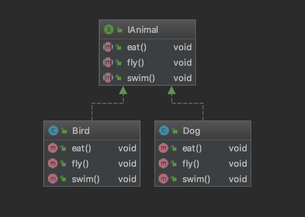
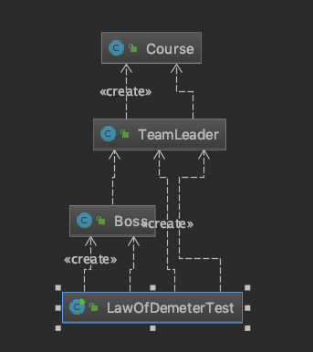

# 软件设计的七大原则

## 开闭原则

​	**开闭原则（Open-Closed Principle, OCP）是指一个软件实体，如类、模块和函数应该对扩展开放，对修改关闭。所谓的开闭，也正是对扩展和修改两个行为的一个原则。强调的是用抽象构建框架，用实现扩展细节。可以提高软件系统的可复用性及可维护性。**开闭原则，是面向对象设计中最基础的设计原则。它指导我们如何建立稳定灵活的系统，例如：我们版本更新，可以尽可能的不修改源代码，但是可以增加新功能。

​	在现实生活中对于开闭原则也有体现。比如，很多互联网公司都实行弹性制作息时间，规定每天工作8小时。意思就是说，对于每天工作8小时这个规定是关闭的，但是你什么时候来，什么时候走是开放的。早来早走，晚来晚走。

​	实现开闭原则的核心思想就是面向抽象编程，接下来看一段代码：

​	以商品为例，首先创建一个商品接口IGoods:

```java
package com.wenbin.design.principles.openandclosed;


public interface IGoods {
    Integer getId();

    String getName();

    Double getPrice();
}
```

​	商品是个比较抽象的东西。很多东西都可以作为商品来售卖。我们举例卖键盘，就创建一个键盘类KeyboardGoods：

```java
package com.wenbin.design.principles.openandclosed;

public class KeyboardGoods implements IGoods {

    private Integer Id;
    private String name;
    private Double price;
    
    public KeyboardGoods(Integer id, String name, Double price) {
        Id = id;
        this.name = name;
        this.price = price;
    }
    
    public Integer getId() {
        return Id;
    }

    public String getName() {
        return name;
    }
    
    public Double getPrice() {
        return price;
    }
}
```

​	现在我们要给键盘做活动，价格优惠。如果修改KeyboardGoods中的getPrice()方法，则会存在一定风险，可能影响其他地方的调用结果。我们如何在不修改原有代码的前提下，实现价格优惠这个功能呢？现在我们在写一个处理优惠逻辑的类，KeyboardDiscountGoods：

```java
package com.wenbin.design.principles.openandclosed;

public class KeyboardDiscountGoods extends KeyboardGoods {

    public KeyboardDiscountGoods(Integer id, String name, Double price) {
        super(id, name, price);
    }

    public Double getOriginPrice() {
        return super.getPrice();
    }

    @Override
    public Double getPrice() {
        return super.getPrice() * 0.50;
    }
}

```

这是一个非常简单的例子来帮助理解开闭原则，看一下类结构图：


## 依赖倒置原则

​	**依赖倒置原则（Dependence Inversion Principle，DIP）是指设计代码结构时，高层模块不应该依赖底层模块，二者都应该依赖其抽象。抽象不应该依赖细节、细节应该依赖抽象。通过依赖倒置，可以减少类与类之间的耦合性，提高系统稳定性，提高代码的可读性和可维护性，并能够降低修改程序所造成的风险。**

接下来看一个案例：

```java
public class Tom1 {
    public void studyJavaCourse() {
        System.out.println("Tom在学习Java课程");
    }

    public void studyPythonCourse() {
        System.out.println("Tom在学习Python的课程");
    }
		// 调用一下
    public static void main(String[] args) {
        Tom1 tom1 = new Tom1();

        tom1.studyJavaCourse();
        tom1.studyPythonCourse();
    }
}

```

Tom热爱学习，目前正在学习Java课程和Python课程。随着学习兴趣的暴涨，现在Tom还想学习AI人工智能的课程。这个时候，业务扩展，我们的代码要从底层（Tom1类）到高层（调用层Main方法）依次修改代码，先在Tom1类中增加StudyAICourse()的方法，然后在Main方法中也要追加该方法的调用。如此一来，系统发布后，实际上是非常不稳定的，在修改代码的同事也会带来意想不到的风险。接下来我们优化代码，按照依赖倒置原则上层调用依赖抽象而不依赖细节，先创建一个课程的抽象ICourse接口：

```java
package com.wenbin.design.principles.dip;

public interface ICourse {
    void study();
}	
```

然后写JavaCourse类和PythonCourse类：

```java
package com.wenbin.design.principles.dip;

public class JavaCourse implements ICourse {

    public void study() {
        System.out.println("Tom在学习Java课程");
    }
}
```

```java
package com.wenbin.design.principles.dip;

public class PythonCourse implements ICourse {
    public void study() {
        System.out.println("Tom在学习Python课程");
    }
}
```

tom类：

```java
package com.wenbin.design.principles.dip;

public class Tom {
    public void study(ICourse course) {
        course.study();
    }
    // 调用
    public static void main(String[] args) {
        Tom tom = new Tom();

        tom.study(new JavaCourse());
        tom.study(new PythonCourse());
    }
}
```

​	我们这个时候在来看代码，Tom的兴趣无论怎暴涨，对于新的课程，我们只要新建一个类，通过传参的方式告诉Tom，而不需要修改底层代码。实际上着是一种大家非常熟悉的方式，叫依赖注入。注入的方式还有构造器方式和setter方式。我们来看构造器注入方式：

```java
package com.wenbin.design.principles.dip;

public class Tom2 {
    private ICourse course;

    public Tom2(ICourse course) {
        this.course = course;
    }
    
    public void study() {
        course.study();
    }
    
    public static void main(String[] args) {
        Tom2 tom2 = new Tom2(new JavaCourse());
        tom2.study();
    }
}
```

​	根据构造器方式注入，在调用时，每次都要创建实例。那么，如果Tom是全局单例，则我们就只能选择用Setter方式来注入：

```java
package com.wenbin.design.principles.dip;

public class Tom3 {
    private ICourse course;

    public void setCourse(ICourse course) {
        this.course = course;
    }

    public void study() {
        course.study();
    }

    public static void main(String[] args) {
        Tom3 tom3 = new Tom3();
        tom3.setCourse(new JavaCourse());
        tom3.study();

        tom3.setCourse(new PythonCourse());
        tom3.study();
    }
}
```

​	**切记:以抽象为基准比以细节为基准搭建起来的架构要稳定得多，因此大家在拿 到需求之后，要面向接口编程，先顶层再细节来设计代码结构。**

## 单一职责原则

​	**单一职责（Simple Responsibility Principle，SRP）是指不要存在多于一个导致类变更的原因。**假设我们有一个Class负责两个职责，一旦发生需求变更，修改其中一个职责的逻辑代码，有可能会导致另一个职责功能发生故障。这样一来，这个Class存在两个导致类变更的原因。如何解决这个问题呢？我们就要给两个职责分别用两个Class来实现，进行解耦。后期需求变更维护互不影响。这样的设计，可以降低类实现的复杂度，提高类实现的可读性，提高系统的可维护性，降低变更引起的风险。**总体来说就是一个Class/interface/Method只负责一项职责。**

​	接下来，我们来看代码实例，还是用课程举例：

```java
package com.wenbin.design.principles.srp;

public class Course {
    public void study(String courseName) {
        if ("直播课".equals(courseName)) {
            System.out.println(courseName + "不能快进");
        } else {
            System.out.println(courseName + "可以反复回看");
        }
    }

    public static void main(String[] args) {
        Course course = new Course();

        course.study("直播课");
        course.study("录播课");
    }
}
```

​	从上面代码来看，Course类承担了两种处理逻辑。假如，现在要对课程进行加密，那么直播课和录播课的加密逻辑都不一样，必须要修改代码。而修改代码逻辑势必会相互影响容易造成不可控的风险。我们对职责进行分离解耦，来看代码，分别创建两个类ReplayCourse和LiveCourse：

```java
package com.wenbin.design.principles.srp;

public class LiveCourse {
    public void study(String courseName) {
        System.out.println(courseName + "不能快进看");
    }
}
```

```java
package com.wenbin.design.principles.srp;

public class ReplayCourse {
    public void study(String courseName) {
        System.out.println(courseName + "可以反复回看");
    }

    public static void main(String[] args) {
        LiveCourse liveCourse = new LiveCourse();
        liveCourse.study("直播课");

        ReplayCourse replayCourse = new ReplayCourse();
        replayCourse.study("录播课");
    }
}
```

​	我们在实际开发中会项目依赖， 组合，聚合这些关系，还有项目的规模，周期，技术人员的水平，对进度的把控， 很多类都不符合单一职责。但是，我们在编写代码的过程，尽可能地让接口和方法保持 单一职责，对我们项目后期的维护是有很大帮助的。

## 接口隔离原则

​	**接口隔离原则（Interface Segregation principle，ISP）是指用多个专门的接口，而不适用单一的总接口，客户端不应该依赖它不需要的接口。这个原则指导我们在设计接口时应当注意以下几点：**

1. **一个类对一类的依赖应该建立在最小接口之上。**
2. **建立单一接口，不要建立庞大臃肿的接口。**
3. **尽量细化接口，接口中的方法尽量少（不是越少越好，一定要适度并符合现实抽象）。**

​	接口隔离原则符合我们常说的高内聚低耦合的设计思想，从而使得类具有很好的可读性、可扩展性和可维护性。我们在设计接口的时候，要多花时间去思考，要考虑业务模型，包括以后有可能发生变更的地方还要做一些预判。所以，对于抽象，对业务模型的理解是非常重要的。下面我们来看一段代码，写一个动物行为的抽象：

IAnimal接口：

```java
package com.wenbin.design.principles.isp;

public interface IAnimal {
    void eat();

    void fly();

    void swim();
}
```

Bird类实现：

```java
package com.wenbin.design.principles.isp;

public class Bird implements IAnimal {
    public void eat() {

    }

    public void fly() {

    }

    public void swim() {

    }
}
```

Dog类实现：

```java
package com.wenbin.design.principles.isp;

public class Dog implements IAnimal {
    public void eat() {

    }

    public void fly() {

    }

    public void swim() {

    }
}
```

​	可以看出，Bird的swim()方法可能只能空着，Dog的fly()方法显然不可能实现。这时候，我们针对不同的东西行为来设计不同的接口，分别设计IEatAnimal,IFlyAnimal和IswimAnimal接口，来看代码：

​	来看一下两种类图的对比，还是非常清晰明了的：




## 迪米特原则

​	**迪米特原则（Law of Demeter,LoD）是指一个对象应该对其他对象保持最少了解，又叫最少知道原则（Least Knowledge Principle,LKP）,尽量降低类与类之间的耦合。**迪米特原则主要强调只和朋友交流，不和陌生人说话。出现在成员变量、方法的输入、输出参数中的类都可以称之为成员朋友类，而出现在方法体内部的不属于朋友类。

​	现在来设计一个权限系统，Boss需要查看目前发布到线上的课程数量。这时候，Boss要找到TeamLeader去进行统计，TeamLeader再把统计结果告诉Boss。接下来我们还是来看代码：

Course类：

```java
package com.wenbin.design.principles.lkp;

public class Course {
}
```

TeamLeader类：

```java
package com.wenbin.design.principles.lkp;

import java.util.List;

public class TeamLeader {
    public void checkNumberOfCourses(List<Course> courseList) {
        System.out.println("目前已发布的课程数量是：" + courseList.size());
    }
}
```

Boss类：

```java
package com.wenbin.design.principles.lkp;

import java.util.ArrayList;
import java.util.List;

public class Boss {
    public void commandCheckNumber(TeamLeader teamLeader) {
        // 模拟Boss一页一页往下翻页。TeamLeader实时统计
        List<Course> courseList = new ArrayList<Course>();

        for (int i = 0; i < 20; i++) {
            courseList.add(new Course());
        }

        teamLeader.checkNumberOfCourses(courseList);
    }

    public static void main(String[] args) {
        Boss boss = new Boss();
        TeamLeader teamLeader = new TeamLeader();

        boss.commandCheckNumber(teamLeader);
    }
}
```

​	写到这里，其实功能已经都实现了，代码看上去也没什么问题。根据迪米特原则，Boos只要要结果，不需要跟Course产生直接交流。而TeamLeader统计需要引用Course对象。Boss和Course并不是朋友，从下面类图可以看出来：


下面来对代码进行改造：

TeamLeader类：

```java
public class TeamLeader {
    public void checkNumberOfCourses() {
        List<Course> courseList = new ArrayList<Course>();

        for (int i = 0; i < 20; i++) {
            courseList.add(new Course());
        }

        System.out.println("目前已发布的课程数量是：" + courseList.size());
    }
}
```

Boss类：

```java
package com.wenbin.design.principles.lkp;

public class Boss {
    public void commandCheckNumber(TeamLeader teamLeader) {
        teamLeader.checkNumberOfCourses();
    }
}
```

在看下面的类图，Course和Boss已经没有关联了。



​	学习软件设计原则，不能形成强迫症。碰到业务复杂的场景，我们需要随机应变。

## 里氏替换原则

​	**里氏替换原则（Liskov Substitution Principle,LSP）是指一个软件实体如果使用一个父类的话，那一定可以使用其子类。所有引用父类的地方必须能透明地使用其子类的对象。子类对象能够替换父类对象，而程序逻辑不变。根据这个理解，总结一下：引申含义：子类可以扩展父类的功能，但不能改变父类原有的功能。**

1. **子类可以实现父类的抽象方法，但不能覆盖父类的非抽象方法。**
2. **子类中可以增加自己特有的方法。**
3. **当子类的方法重载父类方法时，方法的前置条件（即方法的输入、入参）要比父类方法的输入参数更宽松。**
4. **当子类的方法实现父类的方法时（重写、重载或实现抽象方法），方法的后置条件（即方法的输出、返回值）要比父类更严格或相等。**

​	在前面开闭原则的时候埋下了一个伏笔，我们记得在获取折后重写覆盖父类的getPrice()方法，增加了一个获取源价格的方法getOriginPrice()，显然违背了里氏替换原则。不应该覆盖getPrice()方法，应该增加一个getDiscountPrice()方法。

```java
package com.wenbin.design.principles.lsp;

import com.wenbin.design.principles.ocp.KeyboardGoods;

public class KeyboardDiscountGoods extends KeyboardGoods {

    public KeyboardDiscountGoods(Integer id, String name, Double price) {
        super(id, name, price);
    }

    public Double getDiscountPrice() {
        return super.getPrice() * 0.50;
    }
}
```

​	使用里氏替换原则有以下优点：

1. 约束继承泛滥，开闭原则的一种体现。
2. 加强程序的健壮性，同时变更时也可以做到非常好的兼容性，提高程序的维护性、扩展性。降低需求变更时引入的风险。

## 合成复用原则

**合成复用原则（Composite/Aggregate Reuse principle, CARP）是指尽量使用对象组合（has-a）/聚合（contanis-a)，而不是继承关系达到软件复用目的。可以使系统更加灵活，降低类与类之间的耦合度，一个类的变化对其他类造成的影响相对较少。**

​	**继承我们叫做白箱复用，相当于把所有的实现细节暴露给子类，组合/聚合也称为黑箱复用，对类以外的对象是无法获取到实现细节的。**

## 设计原则总结

​	学习设计原则是学习设计模式的基础。在实际开发过程中，并不是一定要求所有代码都遵循设计原则，要考虑人力、时间、成本、质量，不要刻意追求完美，要在适当的场景遵循设计原则，体现的是一种平衡取舍，帮助我们设计出更加优雅的代码结构。


