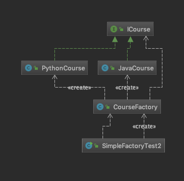
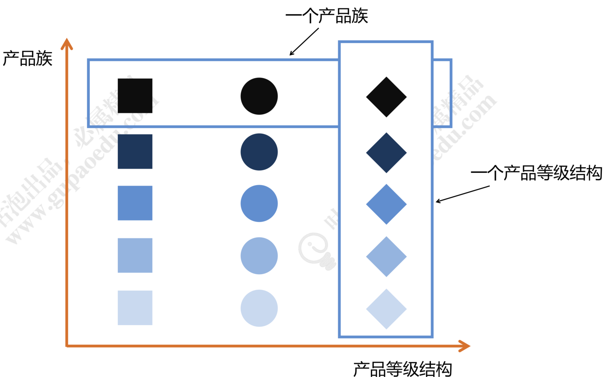
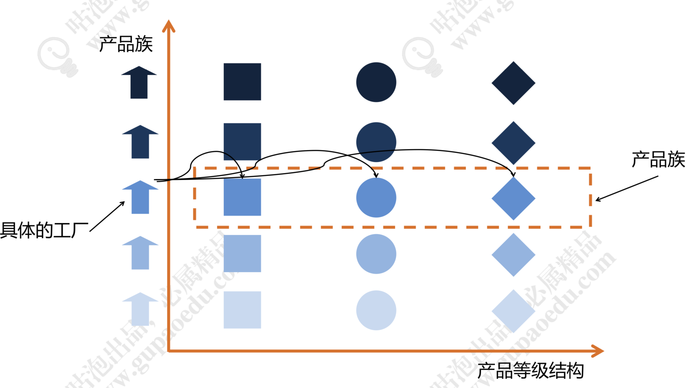

# 工厂模式

**工厂模式（Factory Pattern）是Java中最常用的设计模式之一。这种类型的设计模式属于创建型模式，它提供了一种创建对象的最佳方式。在工厂模式中，我们在创建对象时不会对客户端暴露创建逻辑，并且是通过使用一个共同的接口来指向新创建的对象。**

## 简单工厂模式

​	**简单工厂模式（Simple Factory Pattern）是指由一个工厂对象决定创建出哪一种产品类的实例，但它不属于GOF，23种设计模式。简单工厂适用于工厂类负责创建的对象较少的场景，且客户端只需要传入工厂类的参数，对于如何创建对象的逻辑不需要关心。**

​	还是以课程为例，我们可以学习java课程、大数据课程、Python课程。我们可以定义一个课程标准ICourse接口：

```java
package com.wenbin.design.pattern.factory.simple;

public interface ICourse {
    /**
     * 录制视频
     */
    void record();
}
```

创建一个java课程的实现JavaCourse类：

```java
package com.wenbin.design.pattern.factory.simple;

public class JavaCourse implements ICourse {
    public void record() {
        System.out.println("录制Java课程");
    }
}
```

客户端调用代码：

```java
package com.wenbin.design.pattern.factory.simple;

public class SimpleFactoryTest {
    public static void main(String[] args) {
        ICourse course = new JavaCourse();

        course.record();
    }
}
```

​	看上面的代码，父类ICourse指向子类JavaCourse的引用，应用层代码需要依赖JavaCourse，如果业务扩展，我们继续增加PythonCourse甚至更多，那么我们客户端的依赖会变得越来越臃肿。因此，我们要想办法把这种依赖减弱，把创建细节隐藏。虽然目前代码中，我们创建对象的过程并不复杂，但从代码设计角度来讲不易于扩展。现在，我们用简单工厂模式对代码进行优化。先增加PythonCourse类：

```java
package com.wenbin.design.pattern.factory.simple;

public class PythonCourse implements ICourse {
    public void record() {
        System.out.println("录制Python课程");
    }
}
```

创建CourseFactory工厂类：

```java
package com.wenbin.design.pattern.factory.simple;

public class CourseFactory {

    public ICourse create(String name) {
        if ("java".equals(name)) {
            return new JavaCourse();
        } else if ("python".equals(name)) {
            return new PythonCourse();
        } else {
            return null;
        }
    }
}
```

客户端调用代码：

```java
package com.wenbin.design.pattern.factory.simple;

public class SimpleFactoryTest2 {
    public static void main(String[] args) {
        CourseFactory factory = new CourseFactory();

        factory.create("java").record();
    }
}
```

​	为了调用方便也可以将factory的create()方法改为静态方法，我们看一下类图：



​	这样客户端调用是简单了，但如果我们业务继续扩展，要增加前端课程，那么工厂中的create()方法就要根据产品链的丰富每次都要修改代码逻辑。不符合开闭原则。因此，我们对简单工厂还可以继续优化，优化之后：

```java
package com.wenbin.design.pattern.factory.simple;

public class CourseFactory1 {
    public ICourse create(Class<? extends ICourse> clazz) {
        try {
            if (null != null) {
                return clazz.newInstance();
            }
        } catch (Exception e) {
            e.printStackTrace();
        }
        return null;
    }
}
```

优化后客户端代码：

```java
package com.wenbin.design.pattern.factory.simple;

public class SimpleFactoryTest3 {
    public static void main(String[] args) {
        CourseFactory1 courseFactory1 = new CourseFactory1();

        ICourse course = courseFactory1.create(JavaCourse.class);
        course.record();
    }
}
```

​	**简单工厂也有它的缺点：工厂类的职责相对过重，不易于扩展过于复杂的产品结构。**

## 工厂方法模式

​	**工厂方法模式（Factory Method Pattern）是指定义一个创建对象的接口，但让实现这个接口的类来决定实例化那个类，工厂方法让类的实例化推迟到子类中进行。在工厂方法模式中用户只需要关心产品对应的工厂，无需关系创建细节，而且加入新的产品符合开闭原则。**

​	工厂方法模式主要解决产品扩展的问题，在简单工厂中，随着产品链的丰富，如果每个课程的创建逻辑有区别的话，工厂的职责会变得越来越多，有点像万能工厂，并不便于维护。根据单一职责原则我们将只能继续拆分，专人干专事。Java课程由Java工厂创建，Python课程由Python工厂创建，对工厂本身也做一个抽象。来看代码，先创建ICourseFactory接口：

```java
package com.wenbin.design.pattern.factory.method;

import com.wenbin.design.principles.dip.ICourse;

public interface ICourseFactory {
    ICourse create();
}
```

在分别创建，JavaCourseFactory类：

```java
package com.wenbin.design.pattern.factory.method;

import com.wenbin.design.principles.dip.ICourse;
import com.wenbin.design.principles.dip.JavaCourse;

public class JavaCourseFactory implements ICourseFactory {
    public ICourse create() {
        return new JavaCourse();
    }
}
```

PythonCourseFactory类：

```java
package com.wenbin.design.pattern.factory.method;

import com.wenbin.design.principles.dip.ICourse;
import com.wenbin.design.principles.dip.PythonCourse;

public class PythonCourseFactory implements ICourseFactory {
    public ICourse create() {
        return new PythonCourse();
    }
}
```

测试代码：

```java
package com.wenbin.design.pattern.factory.method;

import com.wenbin.design.principles.dip.ICourse;

public class MethodFactoryTest {
    public static void main(String[] args) {
        ICourseFactory factory = new PythonCourseFactory();

        ICourse course = factory.create();
        course.study();

        factory = new JavaCourseFactory();
        course = factory.create();
        course.study();
    }
}
```

在看一下类图：


**工厂方法模式适用于以下场景：**

1. **创建对象需要大量重复的代码。**
2. **客户端（应用层）不依赖于产品类实例如何被创建、实现等细节。**
3. **一个类通过其子类来指定创建哪个对象。**

**工厂方法的缺点：**

1. **工厂类的个数容易过多，增加复杂度。**
2. **增加了系统的抽象性和理解难度。**

## 抽象工厂模式

​	**抽象工厂模式（Abstract Factory Pattern）是指提供一个创建一系列相关或者相互依赖对象的接口，无须执行他们具体的类。**客户端（应用层）不依赖于产品类实例如何被创建、实现等细节，强调的是一系列相关的产品对象（属于同一产品族）一起使用创建对象需要大量重复的代码。需要提供一个产品类的库，所有的产品以同样的接口出现，从而使客户端不依赖于具体实现。

​	讲解抽象工厂之前，我们要了解两个概念：产品等级结构和产品族，看下面图：



​	从上图中看出有正方形，圆形和菱形三种图形，相同颜色深浅的就代表同一个产品族，相同形状的代表同一个产品登记结构。同样可以从生活中来举例，比如，美的电器生产的多种家用电器。那么上图中，颜色最深的正方形就代表美的洗衣机、颜色最深的圆形代表美的空调、颜色最深的菱形代表美的热水器，颜色最深的一排都属于美的品牌，都是美的电器的产品族。在看最右侧的菱形，颜色最深的我们指定了代表美的热水器，那么第二排颜色稍浅一点的菱形，代表海信热水器。同理，同一产品结构下还有格力热水器，格力空调，格力洗衣机。

​	再看下面这张图，最左侧的小房子我们就认为具体的工厂，有美的工厂、海信工厂、格力工厂。每个品牌的工厂都生产洗衣机、热水器和空调。

		通过上面两张图的对比理解，相信大家对抽象工厂有了非常形象的理解。接下来我们来看一个具体的业务场景而且用代码来实现。还是以课程为例，课程由了新的标准，每个课程不仅要提供视频，而且还要提供课堂笔记。相当于现在的业务变更为同一个课程不单纯是一个课程信息，要同事包含录播视频、课堂笔记甚至还要提供源码才能构成一个完成的课程。在产品等级中增加两个产品IVideo录播视频和INode课堂笔记。

IVideo接口：

```java
package com.wenbin.design.pattern.factory.abstrac;

public interface IVideo {
    void record();
}
```

INote接口：

```java
package com.wenbin.design.pattern.factory.abstrac;

public interface INote {
    void edit();
}
```

创建一个抽象工厂CourseFactory类：

```java
package com.wenbin.design.pattern.factory.abstrac;

/**
 * 抽象工厂是用户的主入口
 * 在Spring中应用的最为广泛的一种设计模式
 * 易于扩展
 */
public interface CourseFactory {
    INote createNote();

    IVideo createVideo();
}
```

接下来，创建Java产品族，Java视频JavaVideo类：

```java
package com.wenbin.design.pattern.factory.abstrac.java;

import com.wenbin.design.pattern.factory.abstrac.IVideo;

public class JavaVideo implements IVideo {
    public void record() {
        System.out.println("录制Java视频");
    }
}
```

java课堂笔记JavaNote类：

```java
package com.wenbin.design.pattern.factory.abstrac.java;

import com.wenbin.design.pattern.factory.abstrac.INote;

public class JavaNote implements INote {
    public void edit() {
        System.out.println("编写Java笔记");
    }
}
```

创建Java产品族的具体工厂JavaCourseFactory:

```java
package com.wenbin.design.pattern.factory.abstrac.java;

import com.wenbin.design.pattern.factory.abstrac.INote;
import com.wenbin.design.pattern.factory.abstrac.IVideo;

/**
 * 创建Java产品族的具体工厂
 */
public class JavaCourseFactory {

    public INote createNote() {
        return new JavaNote();
    }

    public IVideo createVideo() {
        return new JavaVideo();
    }
}
```

创建Python产品，视频，工厂类：

```java
package com.wenbin.design.pattern.factory.abstrac.python;

import com.wenbin.design.pattern.factory.abstrac.IVideo;

public class PythonVideo implements IVideo {
    public void record() {
        System.out.println("录制Python视频");
    }
}
```

```java
package com.wenbin.design.pattern.factory.abstrac.python;

import com.wenbin.design.pattern.factory.abstrac.INote;

public class PythonNote implements INote {
    public void edit() {
        System.out.println("编写Python笔记");
    }
}
```

```java
package com.wenbin.design.pattern.factory.abstrac.python;

import com.wenbin.design.pattern.factory.abstrac.CourseFactory;
import com.wenbin.design.pattern.factory.abstrac.INote;
import com.wenbin.design.pattern.factory.abstrac.IVideo;

public class PythonCourseFactory implements CourseFactory {
    public INote createNote() {
        return new PythonNote();
    }

    public IVideo createVideo() {
        return new PythonVideo();
    }
}
```

客户端调用：

```java
package com.wenbin.design.pattern.factory.abstrac;

import com.wenbin.design.pattern.factory.abstrac.java.JavaCourseFactory;

public class AbsFactoryTest {
    public static void main(String[] args) {
        JavaCourseFactory factory = new JavaCourseFactory();

        factory.createNote().edit();
        factory.createVideo().record();

    }
}
```

​	上面的代码完整的描述了两个产品族Java课程和Python课程，也描述了两个产品等级：视频和笔记。抽象工厂非常完美清晰的描述这样一层复杂的关系。但是，不知道大家有没有发现，如果我们在继续扩展产品等级，将源码Source也加入的课程中，那么我们的代码抽象工厂，到具体工厂要全部调整，很显然不符合开闭原则。因此抽象工厂也是有缺点的：

1. 规定了所有可能被创建的产品集合，产品族中扩展新的产品困难，需要修改抽象工厂的接口。
2. 增加了系统的抽象性和理解难度。


​	在实际应用中，我们千万不能犯强迫症甚至有洁癖。在实际需求中产品等级结构升级是非常正常的一件事情。我们可以根据实际情况，只要不是频繁升级，可以不遵循开闭原则。代码每几个月或者半年升级一次又又何不可呢？