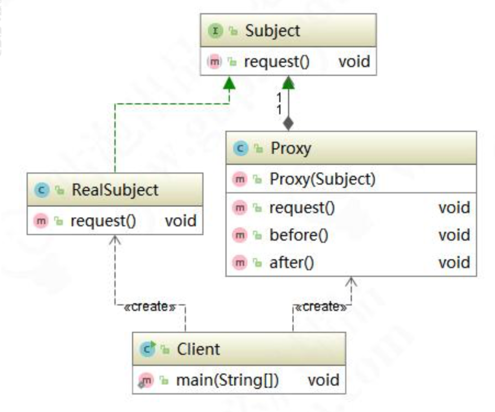
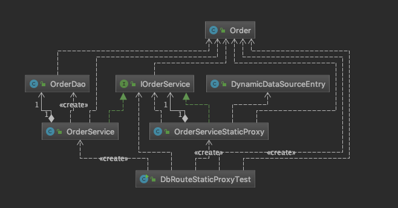
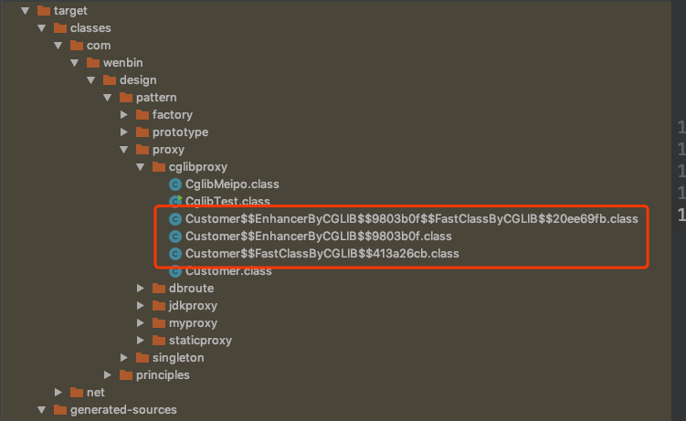

# 代理模式

## 代理模式的应用场景

​	在生活中，我们经常见到这样的场景，如：租房中介、售票黄牛、婚介、经纪人、快递、事务代理、非侵入式日志监听等，这些都是代理模式的实际体现。代理模式（Proxy Pattern）的定义也非常简单，是指为其他对象提供一种代理，以控制对这个对象的访问。代理对象在客户端和目标对象之间起到中介作用，代理模式属于结构型设计模式。使用代理模式主要有两个目的：

1. 保护目标对象
2. 增强目标对象

下面我们看一下代理模式的类结构图：



Subject是顶层接口，RealSubject是真实对象（被代理对象），Proxy是代理对象，代理对象持有被代理对象的引用，客户端调用代理对象方法，同时也调用被代理对象的方法，但是在代理对象前后增加一些处理。在代码中，我们想到代理，就会理解是代码增强，其实就是在原本逻辑前后增加一些逻辑，而调用者无感知。**代理模式有静态代理和动态**

## 静态代理

举个例子：人到了适婚年龄，父母总是迫不及待希望早点抱孙子。而现在社会的人在各种压力之下，都选择晚婚晚育。于是着急的父母就开始到处为自己的子女相亲，比子女自己还着急。这个相亲的过程，就是一种我们人人都有份的代理。来看看代码实现。

顶层接口Person:

```java
package com.wenbin.design.pattern.proxy.staticproxy;

public interface Person {
    void findLove();
}
```

儿子要找对象Son类：

```java
package com.wenbin.design.pattern.proxy.staticproxy;

public class Son implements Person {

    public void findLove() {
        System.out.println("儿子要求：肤白貌美大长腿");
    }
}
```

父亲要帮儿子相亲，实现Father类：

```java
package com.wenbin.design.pattern.proxy.staticproxy;

public class Father {
    private Son son;

    public Father(Son son) {
        this.son = son;
    }

    public void findLove() {
        System.out.println("物色对象");
        this.son.findLove();
        System.out.println("双方同意交往，确立关系");
    }
}
```

测试代码：

```java
package com.wenbin.design.pattern.proxy.staticproxy;

public class StaticProxyTest {
    public static void main(String[] args) {
        // 只能帮儿子找对象
        // 不能帮表妹、不能帮陌生人

        Father father = new Father(new Son());
        father.findLove();

    }
}
```

运行结果：

```
物色对象
儿子要求：肤白貌美大长腿
双方同意交往，确立关系

Process finished with exit code 0
```

这里大家可能觉得还是不知道如何将代理模式应用到业务场景中，那么我们在来举例一个实际业务常见。在分布式业务场景中，我们通常会对数据库进行分表，分库分表之后使用Java操作时，就可能需要配置多个数据源，我们通过设置数据源路由来动态切换数据源。先创建Order订单实体：

```java
package com.wenbin.design.pattern.proxy.dbroute;

public class Order {
    private Object orderInfo;
    private Long createTime;
    private String id;

    public Object getOrderInfo() {
        return orderInfo;
    }

    public void setOrderInfo(Object orderInfo) {
        this.orderInfo = orderInfo;
    }

    public Long getCreateTime() {
        return createTime;
    }

    public void setCreateTime(Long createTime) {
        this.createTime = createTime;
    }

    public String getId() {
        return id;
    }

    public void setId(String id) {
        this.id = id;
    }
}
```

创建OrderDao持久层操作类：

```java
package com.wenbin.design.pattern.proxy.dbroute;

public class OrderDao {
    public int insert(Order order) {
        System.out.println("OrderDao创建Order成功");
        return 1;
    }
}
```

创建IOrderService接口：

```java
package com.wenbin.design.pattern.proxy.dbroute;

public interface IOrderService {
    int createOrder(Order order);
}
```

创建OrderService实现类：

```java
package com.wenbin.design.pattern.proxy.dbroute;

public class OrderService implements IOrderService {

    private OrderDao orderDao;

    public OrderService() {
        this.orderDao = new OrderDao();
    }

    public int createOrder(Order order) {
        System.out.println("OrderService调用orderDao创建订单");

        return orderDao.insert(order);
    }
}
```

接线来使用静态代理，主要完成功能是，根据订单创建时间自动按年进行分库。根据开闭原则，原来写好的逻辑我们不去修改，通过代理对象来完成。先创建数据源路由对象，我们使用ThreadLoacal的单例实现，DynamicDateSourceEntry类：

```java
package com.wenbin.design.pattern.proxy.dbroute.db;

/**
 * 动态切换数据源
 */
public class DynamicDataSourceEntry {

    // 默认数据源
    public final static String DEFAULT_SOURCE = null;

    private final static ThreadLocal<String> local = new ThreadLocal<String>();

    private DynamicDataSourceEntry(){}

    /**
     * 清空数据源
     */
    public static void clear() {
        local.remove();
    }

    /**
     * 获取当前正在使用的数据源名字
     * @return
     */
    public static String get() {
        return local.get();
    }

    /**
     * 还原单签切面数据源
     */
    public static void restore() {
        local.set(DEFAULT_SOURCE);
    }

    /**
     * 设置已知名字的数据源
     * @param source
     */
    public static void set(String source) {
        local.set(source);
    }

    /**
     * 根据年份动态设置数据源
     * @param year
     */
    public static void set(int year) {
        local.set("DB_" + year);
    }
}
```

创建切换数据源的代理OrderServiceStaticProxy类：

```java
package com.wenbin.design.pattern.proxy.dbroute.proxy;

import com.wenbin.design.pattern.proxy.dbroute.IOrderService;
import com.wenbin.design.pattern.proxy.dbroute.Order;
import com.wenbin.design.pattern.proxy.dbroute.db.DynamicDataSourceEntry;

import java.text.SimpleDateFormat;
import java.util.Date;

public class OrderServiceStaticProxy implements IOrderService {

    private SimpleDateFormat yearFormat = new SimpleDateFormat("yyyy");

    private IOrderService orderService;

    public OrderServiceStaticProxy(IOrderService orderService) {
        this.orderService = orderService;
    }


    public int createOrder(Order order) {
        before();
        Long time = order.getCreateTime();
        Integer dbRouter = Integer.valueOf(yearFormat.format(new Date(time)));
        System.out.println("静态代理类自动分配到[DB_" + dbRouter + "]数据源处理数据。");
        DynamicDataSourceEntry.set(dbRouter);
        orderService.createOrder(order);
        after();

        return 0;
    }

    private void before() {
        System.out.println("Proxy before method");
    }

    private void after() {
        System.out.println("Proxy after method");
    }
}
```

测试代码：

```java
package com.wenbin.design.pattern.proxy.dbroute;

import com.wenbin.design.pattern.proxy.dbroute.proxy.OrderServiceStaticProxy;

import java.text.SimpleDateFormat;
import java.util.Date;

public class DbRouteStaticProxyTest {
    public static void main(String[] args) {
        try {
            Order order = new Order();

            SimpleDateFormat sdf = new SimpleDateFormat("yyyy/MM/dd");
            Date date = sdf.parse("2018/02/09");
            order.setCreateTime(date.getTime());

            IOrderService orderService = new OrderServiceStaticProxy(new OrderService());
            orderService.createOrder(order);
        } catch (Exception e) {
            e.printStackTrace();
        }
    }
}
```

运行结果：

```
Proxy before method
静态代理类自动分配到[DB_2018]数据源处理数据。
OrderService调用orderDao创建订单
OrderDao创建Order成功
Proxy after method

Process finished with exit code 0
```

符合我们的预期效果。现在我们再来回顾一下类图，看是不是和我们最先画的类结构一 致:



## 动态代理

​	动态代理和静态对比基本思路是一致的，只不过动态代理功能更加强大，随着业务的扩展适应性更强。如果还以找对象为例，使用动态代理相当于是能够适应复杂的业务场景。不仅仅是父亲给儿子找对象，如果找对象这项业务发展成了一个产业，进而出现媒婆、婚介所等这样的形式。那么，此时用静态代理成本就更大了，需要一个更加通用的解决方案，要满足任何单身人士找对象的需求。我们升级一下代码，先来看JDK实现方式：

### JDK实现方式

​	创建媒婆（婚介）JDKMeipo类：

```java
package com.wenbin.design.pattern.proxy.jdkproxy;

import java.lang.reflect.InvocationHandler;
import java.lang.reflect.Method;
import java.lang.reflect.Proxy;

public class JDKMeipo implements InvocationHandler {

    // 被代理对象，把引用给保存下来
    private Object target;

    public Object getInstance(Object target) {
        this.target = target;

        Class<?> clazz = target.getClass();

        return Proxy.newProxyInstance(clazz.getClassLoader(), clazz.getInterfaces(), this);
    }


    public Object invoke(Object proxy, Method method, Object[] args) throws Throwable {
        before();
        Object obj = method.invoke(this.target, args);
        after();

        return obj;
    }

    private void before() {
        System.out.println("我是媒婆：我要给你找对象，现在已经拿到你的需求");
        System.out.println("开始物色");
    }

    private void after() {
        System.out.println("如果合适的话，就准备办事");
    }
}
```

创建单身客户类Girl类：

```java
package com.wenbin.design.pattern.proxy.jdkproxy;

import com.wenbin.design.pattern.proxy.staticproxy.Person;

public class Girl implements Person {
    public void findLove() {
        System.out.println("高富帅");
        System.out.println("身高180cm");
        System.out.println("有6块腹肌");
    }
}
```

测试代码：

```java
package com.wenbin.design.pattern.proxy.jdkproxy;

import com.wenbin.design.pattern.proxy.staticproxy.Person;

public class JDKProxyTest {
    public static void main(String[] args) {
        try {
            Person obj = (Person) new JDKMeipo().getInstance(new Girl());
            obj.findLove();
        } catch (Exception e) {
            e.printStackTrace();
        }
    }
}
```

运行效果：

```
我是媒婆：我要给你找对象，现在已经拿到你的需求
开始物色
高富帅
身高180cm
有6块腹肌
如果合适的话，就准备办事

Process finished with exit code 0
```

​	我们在来看数据源动态路由业务，加深一下印象。

创建动态代理类OrderServiceDynamicProxy,代码如下：

```java
package com.wenbin.design.pattern.proxy.dbroute.proxy;

import com.wenbin.design.pattern.proxy.dbroute.db.DynamicDataSourceEntry;

import java.lang.reflect.InvocationHandler;
import java.lang.reflect.Method;
import java.lang.reflect.Proxy;
import java.text.SimpleDateFormat;
import java.util.Date;

public class OrderServiceDynamicProxy implements InvocationHandler {

    private SimpleDateFormat yearFormat = new SimpleDateFormat("yyyy");
    private Object target;

    public Object getInstance(Object target) {
        this.target = target;
        Class<?> clazz = target.getClass();

        return Proxy.newProxyInstance(clazz.getClassLoader(), clazz.getInterfaces(), this);
    }

    public Object invoke(Object proxy, Method method, Object[] args) throws Throwable {
        before(args[0]);
        Object object = method.invoke(target, args);
        after();

        return object;
    }

    private void before(Object object) {
        try {
            System.out.println("proxy before method.");
            Long time = (Long) object.getClass().getMethod("getCreateTime").invoke(object);
            Integer dbRouter = Integer.valueOf(yearFormat.format(new Date(time)));
            System.out.println("静态代理类自动分配到[DB_" + dbRouter +"]数据源处理数据。");
            DynamicDataSourceEntry.set(dbRouter);
        } catch (Exception e) {
            e.printStackTrace();
        }
    }

    private void after() {
        System.out.println("proxy after method.");
    }
}

```

测试代码如下：

```java
package com.wenbin.design.pattern.proxy.dbroute;

import com.wenbin.design.pattern.proxy.dbroute.proxy.OrderServiceDynamicProxy;

import java.text.ParseException;
import java.text.SimpleDateFormat;
import java.util.Date;

public class DbRouteDynamicProxyTest {
    public static void main(String[] args) {

        try {
            Order order = new Order();
            SimpleDateFormat sdf = new SimpleDateFormat("yyyy/MM/dd");
            Date date = sdf.parse("2019/01/03");
            order.setCreateTime(date.getTime());

            IOrderService orderService = (IOrderService) new OrderServiceDynamicProxy().getInstance(new OrderService());
            orderService.createOrder(order);
        } catch (ParseException e) {
            e.printStackTrace();
        }
    }
}

```

依然能够达到相同的运行效果:

```
proxy before method.
静态代理类自动分配到[DB_2019]数据源处理数据。
OrderService调用orderDao创建订单
OrderDao创建Order成功
proxy after method.

Process finished with exit code 0
```

但是，动态代理实现之后，我们不仅能实现Order的数据源动态路由，还可以实现其他任何类的数据源路由。当然，有比较重要的约定，必须要求实现getCreateTime方法，因为路由规则是根据时间来运算的。当然，可以通过接口规范来达到约束目的，在这里不在举例。

### 高仿真JDK Proxy手写实现

​	不仅知其然，还得知其所以然。既然JDK Proxy 功能如此强大，那么它是如何实现的呢？我们现在来探究一下原理，并模仿JDK Proxy自己动手写一个属于自己的动态代理。

​	我们都知道JDK Proxy 采用字节重组，重新生成的对象来替代原始的对象以达到动态代理的目的。JDK Proxy 生成对象的步骤如下：

1. 拿到被代理对象的引用，并且获取到它的所有的接口，反射获取。
2. JDK Proxy类重新生成一个新的类、同时新的类要实现被代理类所有实现的接口。
3. 动态生成Java代码，把新加的业务逻辑方法由一定的逻辑代码去调用（在代码中体现）。
4. 编译新生成的Java代码.class。
5. 在重新加载到JVM中运行。

以上这个过程就叫字节码重组。JDK中又一个规范，在ClassPath下只要$开头的class文件一般都是自动生成的。那么我们有没有办法看到代替后的对象的真容呢？做一个这样的测试，我们从内存中的对象字节码通过文件流输出到一个新的class文件，然后利用反编译工具查看class的源代码。

测试代码：

```java
package com.wenbin.design.pattern.proxy.jdkproxy;

import com.wenbin.design.pattern.proxy.staticproxy.Person;
import sun.misc.ProxyGenerator;

import java.io.FileOutputStream;
import java.io.IOException;

public class JDKProxyOutputTest {

    public static void main(String[] args) throws IOException {
        Person obj = (Person) new JDKMeipo().getInstance(new Girl());
        obj.findLove();

        byte[] bytes = ProxyGenerator.generateProxyClass("$Proxy0", new Class[]{Person.class});
        FileOutputStream os = new FileOutputStream("/Users/dongwenbin/github/design-pattern/$Proxy0.class");

        os.write(bytes);
        os.close();
    }
}
```

运行之后，在/Users/dongwenbin/github/design-pattern/下找到一个$Proxy0.class文件。反编译后如下：

```java
//
// Source code recreated from a .class file by IntelliJ IDEA
// (powered by Fernflower decompiler)
//

import com.wenbin.design.pattern.proxy.staticproxy.Person;
import java.lang.reflect.InvocationHandler;
import java.lang.reflect.Method;
import java.lang.reflect.Proxy;
import java.lang.reflect.UndeclaredThrowableException;

public final class $Proxy0 extends Proxy implements Person {
    private static Method m1;
    private static Method m3;
    private static Method m2;
    private static Method m0;

    public $Proxy0(InvocationHandler var1) throws  {
        super(var1);
    }

    public final boolean equals(Object var1) throws  {
        try {
            return (Boolean)super.h.invoke(this, m1, new Object[]{var1});
        } catch (RuntimeException | Error var3) {
            throw var3;
        } catch (Throwable var4) {
            throw new UndeclaredThrowableException(var4);
        }
    }

    public final void findLove() throws  {
        try {
            super.h.invoke(this, m3, (Object[])null);
        } catch (RuntimeException | Error var2) {
            throw var2;
        } catch (Throwable var3) {
            throw new UndeclaredThrowableException(var3);
        }
    }

    public final String toString() throws  {
        try {
            return (String)super.h.invoke(this, m2, (Object[])null);
        } catch (RuntimeException | Error var2) {
            throw var2;
        } catch (Throwable var3) {
            throw new UndeclaredThrowableException(var3);
        }
    }

    public final int hashCode() throws  {
        try {
            return (Integer)super.h.invoke(this, m0, (Object[])null);
        } catch (RuntimeException | Error var2) {
            throw var2;
        } catch (Throwable var3) {
            throw new UndeclaredThrowableException(var3);
        }
    }

    static {
        try {
            m1 = Class.forName("java.lang.Object").getMethod("equals", Class.forName("java.lang.Object"));
            m3 = Class.forName("com.wenbin.design.pattern.proxy.staticproxy.Person").getMethod("findLove");
            m2 = Class.forName("java.lang.Object").getMethod("toString");
            m0 = Class.forName("java.lang.Object").getMethod("hashCode");
        } catch (NoSuchMethodException var2) {
            throw new NoSuchMethodError(var2.getMessage());
        } catch (ClassNotFoundException var3) {
            throw new NoClassDefFoundError(var3.getMessage());
        }
    }
}
```

查看反编译代码发现$Proxy0.class继承了Proxy类，同时还实现了我们的Person接口，而且重写了findLove等方法。而且在静态块中用反射查找到了目标对象的所有方法，而且保存了所有方法的引用，在重写的方法用反射调用目标对象的方法。此时我很好奇，这些代码是哪里来的呢？其实是JDK帮我们自动生成的。现在，我们不依赖JDK自己来动态生成源代码、动态完成编译，然后，替代目标对象并执行。

创建MyInvocationHandler接口：

```java
package com.wenbin.design.pattern.proxy.myproxy;

import java.lang.reflect.Method;

public interface MyInvocationHandler {
    Object invoke(Object proxy, Method method, Object[] args) throws Throwable;
}
```

创建MyProxy类：

```java
package com.wenbin.design.pattern.proxy.myproxy;


import javax.tools.JavaCompiler;
import javax.tools.StandardJavaFileManager;
import javax.tools.ToolProvider;
import java.io.File;
import java.io.FileWriter;
import java.lang.reflect.Constructor;
import java.lang.reflect.Method;
import java.util.HashMap;
import java.util.Map;

public class MyProxy {

    public static final String ln = "\r\n";
    private static Map<Class, Class> mappings = new HashMap<Class, Class>();

    static {
        mappings.put(int.class, Integer.class);
    }

    public static Object newProxyInstance(MyClassLoader classLoader, Class<?>[] interfaces, MyInvocationHandler h) throws Exception {
        // 动态生成.java文件
        String src = generateSrc(interfaces);

        System.out.println(src);

        // Java文件输出磁盘
        String filePth = MyProxy.class.getResource("").getPath();
        System.out.println(filePth);

        File f = new File(filePth + "$Proxy0.java");
        FileWriter fw = new FileWriter(f);
        fw.write(src);
        fw.flush();
        fw.close();

        // 把生成的.java文件编译成.class文件
        JavaCompiler compiler = ToolProvider.getSystemJavaCompiler();
        StandardJavaFileManager manager = compiler.getStandardFileManager(null, null, null);
        Iterable iterable = manager.getJavaFileObjects(f);

        JavaCompiler.CompilationTask task = compiler.getTask(null, manager, null, null, null, iterable);
        task.call();
        manager.close();

        // 编译生成的.class文件加载到JVM中
        Class proxyClass = classLoader.findClass("$Proxy0");
        Constructor c = proxyClass.getConstructor(MyInvocationHandler.class);

        return c.newInstance(h);
    }

    private static String generateSrc(Class<?>[] interfaces) {
        StringBuffer sb = new StringBuffer();
        sb.append("package com.wenbin.design.pattern.proxy.myproxy;" + ln);
        sb.append("import com.wenbin.design.pattern.proxy.staticproxy.Person;" + ln);
        sb.append("import java.lang.reflect.*;" + ln);
        sb.append("public class $Proxy0 implements " + interfaces[0].getName() + "{" + ln);
        sb.append("MyInvocationHandler h;" + ln);
        sb.append("public $Proxy0(MyInvocationHandler h) { " + ln);
        sb.append("this.h = h;");
        sb.append("}" + ln);
        for (Method m : interfaces[0].getMethods()) {
            Class<?>[] params = m.getParameterTypes();

            StringBuffer paramNames = new StringBuffer();
            StringBuffer paramValues = new StringBuffer();
            StringBuffer paramClasses = new StringBuffer();

            for (int i = 0; i < params.length; i++) {
                Class clazz = params[i];
                String type = clazz.getName();
                String paramName = toLowerFirstCase(clazz.getSimpleName());
                paramNames.append(type + " " + paramName);
                paramValues.append(paramName);
                paramClasses.append(clazz.getName() + ".class");
                if (i > 0 && i < params.length - 1) {
                    paramNames.append(",");
                    paramClasses.append(",");
                    paramValues.append(",");
                }
            }

            sb.append("public " + m.getReturnType().getName() + " " + m.getName() + "(" + paramNames.toString() + ") {" + ln);
            sb.append("try{" + ln);
            sb.append("Method m = " + interfaces[0].getName() + ".class.getMethod(\"" + m.getName() + "\",new Class[]{" + paramClasses.toString() + "});" + ln);
            sb.append((hasReturnValue(m.getReturnType()) ? "return " : "") + getCaseCode("this.h.invoke(this,m,new Object[]{" + paramValues + "})", m.getReturnType()) + ";" + ln);
            sb.append("}catch(Error _ex) { }");
            sb.append("catch(Throwable e){" + ln);
            sb.append("throw new UndeclaredThrowableException(e);" + ln);
            sb.append("}");
            sb.append(getReturnEmptyCode(m.getReturnType()));
            sb.append("}");
        }
        sb.append("}" + ln);
        return sb.toString();
    }

    private static String getReturnEmptyCode(Class<?> returnClass) {
        if (mappings.containsKey(returnClass)) {
            return "return 0;";
        } else if (returnClass == void.class) {
            return "";
        } else {
            return "return null;";
        }
    }

    private static String getCaseCode(String code, Class<?> returnClass) {
        if (mappings.containsKey(returnClass)) {
            return "((" + mappings.get(returnClass).getName() + ")" + code + ")." + returnClass.getSimpleName() + "Value()";
        }
        return code;
    }

    private static boolean hasReturnValue(Class<?> clazz) {
        return clazz != void.class;
    }

    private static String toLowerFirstCase(String src) {
        char[] chars = src.toCharArray();
        chars[0] += 32;
        return String.valueOf(chars);
    }
}
```

创建MyClassLoader类：

```java
package com.wenbin.design.pattern.proxy.myproxy;

import java.io.ByteArrayOutputStream;
import java.io.File;
import java.io.FileInputStream;
import java.io.IOException;

public class MyClassLoader extends ClassLoader {
    private File classPathFile;

    public MyClassLoader() {
        String classPath = MyClassLoader.class.getResource("").getPath();
        this.classPathFile = new File(classPath);
    }

    protected Class<?> findClass(String name) throws ClassNotFoundException {
        String className = MyClassLoader.class.getPackage().getName() + "." + name;

        if (classPathFile != null) {
            File classFile = new File(classPathFile, name.replace("\\.", "/") + ".class");

            if (classFile.exists()) {
                FileInputStream in = null;
                ByteArrayOutputStream out = null;

                try {
                    in = new FileInputStream(classFile);
                    out = new ByteArrayOutputStream();

                    byte[] buff = new byte[1024];
                    int len;
                    while ((len = in.read(buff)) != -1) {
                        out.write(buff, 0, len);
                    }
                    return defineClass(className, out.toByteArray(), 0, out.size());
                } catch (Exception e) {
                    e.printStackTrace();
                } finally {
                    if (null != in) {
                        try {
                            in.close();
                        } catch (IOException e) {
                            e.printStackTrace();
                        }
                    }
                    if (out != null) {
                        try {
                            out.close();
                        } catch (IOException e) {
                            e.printStackTrace();
                        }
                    }
                }
            }
        }
        return null;
    }
}
```

创建MyMeipo类：

```java
package com.wenbin.design.pattern.proxy.myproxy;

import java.lang.reflect.Method;

public class MyMeipo implements MyInvocationHandler {

    // 被代理对象
    private Object target;

    public Object getInstance(Object target) throws  Exception {
        this.target = target;

        Class<?> clazz = target.getClass();
        return MyProxy.newProxyInstance(new MyClassLoader(), clazz.getInterfaces(), this);
    }

    @Override
    public Object invoke(Object proxy, Method method, Object[] args) throws Throwable {
        before();
        method.invoke(this.target, args);
        after();
        return null;
    }

    private void before() {
        System.out.println("我是媒婆：我要给你找对象，现在已经拿到你的需求");
        System.out.println("开始物色");
    }

    private void after() {
        System.out.println("如果合适的话，就准备办事");
    }
}
```

测试代码：

```java
package com.wenbin.design.pattern.proxy.myproxy;

import com.wenbin.design.pattern.proxy.staticproxy.Person;
import com.wenbin.design.pattern.proxy.staticproxy.Son;

public class MyProxyTest {
    public static void main(String[] args) throws Exception {
        Person obj = (Person) new MyMeipo().getInstance(new Son());

        System.out.println(obj.getClass());
        obj.findLove();
    }
}
```

手写JDK动态代理就完成了。

看一下执行结果：

```
Connected to the target VM, address: '127.0.0.1:55758', transport: 'socket'
package com.wenbin.design.pattern.proxy.myproxy;
import com.wenbin.design.pattern.proxy.staticproxy.Person;
import java.lang.reflect.*;
public class $Proxy0 implements com.wenbin.design.pattern.proxy.staticproxy.Person{
MyInvocationHandler h;
public $Proxy0(MyInvocationHandler h) { 
this.h = h;}
public void findLove() {
try{
Method m = com.wenbin.design.pattern.proxy.staticproxy.Person.class.getMethod("findLove",new Class[]{});
this.h.invoke(this,m,new Object[]{});
}catch(Error _ex) { }catch(Throwable e){
throw new UndeclaredThrowableException(e);
}}}

/Users/dongwenbin/github/design-pattern/target/classes/com/wenbin/design/pattern/proxy/myproxy/
class com.wenbin.design.pattern.proxy.myproxy.$Proxy0
我是媒婆：我要给你找对象，现在已经拿到你的需求
开始物色
儿子要求：肤白貌美大长腿
如果合适的话，就准备办事
Disconnected from the target VM, address: '127.0.0.1:55758', transport: 'socket'

Process finished with exit code 0
```

这里有比较多的调试输出。但是可以看出我们基本模仿实现了JDK 的动态代理。 

### CGLib调用API及原理分析

CGLib代理的使用，还是以媒婆为例，创建CglibMeipo类：

```java
package com.wenbin.design.pattern.proxy.cglibproxy;

import net.sf.cglib.proxy.Enhancer;
import net.sf.cglib.proxy.MethodInterceptor;
import net.sf.cglib.proxy.MethodProxy;

import java.lang.reflect.Method;

public class CglibMeipo implements MethodInterceptor {

    public Object getInstance(Class<?> clazz) throws Exception {
        Enhancer enhancer = new Enhancer();
        // 要把哪个设置为即将生成的新类的父类
        enhancer.setSuperclass(clazz);
        enhancer.setCallback(this);

        return enhancer.create();
    }

    @Override
    public Object intercept(Object o, Method method, Object[] objects, MethodProxy methodProxy) throws Throwable {
        before();
        Object obj = methodProxy.invokeSuper(o, objects);
        after();

        return obj;
    }

    private void before() {
        System.out.println("我是媒婆:我要给你找对象，现在已经拿到你的需求");
        System.out.println("开始物色");
    }

    private void after() {
        System.out.println("如果合适的话，就准备办事");
    }
}
```

创建单身客户Customer类：

```java
package com.wenbin.design.pattern.proxy.cglibproxy;

public class Customer {
    public void findLove() {
        System.out.println("肤白貌美大长腿");
    }
}
```

CGLib代理的目标对象不需要实现任何接口，它是通过动态继承目标对象实现动态代理。来看测试代码：

```java
package com.wenbin.design.pattern.proxy.cglibproxy;

public class CglibTest {
    public static void main(String[] args) throws Exception {
        Customer obj = (Customer) new CglibMeipo().getInstance(Customer.class);

        obj.findLove();
    }
}
```

CGLib的实现原理又是怎么样的呢？我们可以在测试代码上加上一句代码，将CGLib代理后的class写入到磁盘。然后，我们在反编译一探究竟，代码如下：

```java
package com.wenbin.design.pattern.proxy.cglibproxy;

import net.sf.cglib.core.DebuggingClassWriter;

public class CglibTest {
    public static void main(String[] args) throws Exception {
        //利用 cglib 的代理类可以将内存中的 class 文件写入本地磁盘
        System.setProperty(DebuggingClassWriter.DEBUG_LOCATION_PROPERTY, "/Users/dongwenbin/github/design-pattern/target/classes/");
        Customer obj = (Customer) new CglibMeipo().getInstance(Customer.class);

        obj.findLove();
    }
}
```

重新执行代码，我们会返现在/Users/dongwenbin/github/design-pattern/target/classes/目录下多了三个class文件，如图：




```Customer$$EnhancerByCGLIB$$9803b0f.class```就是CGLib生成的代理类，继承了Customer类。反编译后代码是这样的：

```java
//
// Source code recreated from a .class file by IntelliJ IDEA
// (powered by Fernflower decompiler)
//

package com.wenbin.design.pattern.proxy.cglibproxy;

import java.lang.reflect.Method;
import net.sf.cglib.core.ReflectUtils;
import net.sf.cglib.core.Signature;
import net.sf.cglib.proxy.Callback;
import net.sf.cglib.proxy.Factory;
import net.sf.cglib.proxy.MethodInterceptor;
import net.sf.cglib.proxy.MethodProxy;

public class Customer$$EnhancerByCGLIB$$9803b0f extends Customer implements Factory {
    private boolean CGLIB$BOUND;
    private static final ThreadLocal CGLIB$THREAD_CALLBACKS;
    private static final Callback[] CGLIB$STATIC_CALLBACKS;
    private MethodInterceptor CGLIB$CALLBACK_0;
    private static final Method CGLIB$findLove$0$Method;
    private static final MethodProxy CGLIB$findLove$0$Proxy;
    private static final Object[] CGLIB$emptyArgs;
    private static final Method CGLIB$finalize$1$Method;
    private static final MethodProxy CGLIB$finalize$1$Proxy;
    private static final Method CGLIB$equals$2$Method;
    private static final MethodProxy CGLIB$equals$2$Proxy;
    private static final Method CGLIB$toString$3$Method;
    private static final MethodProxy CGLIB$toString$3$Proxy;
    private static final Method CGLIB$hashCode$4$Method;
    private static final MethodProxy CGLIB$hashCode$4$Proxy;
    private static final Method CGLIB$clone$5$Method;
    private static final MethodProxy CGLIB$clone$5$Proxy;

    static void CGLIB$STATICHOOK1() {
        CGLIB$THREAD_CALLBACKS = new ThreadLocal();
        CGLIB$emptyArgs = new Object[0];
        Class var0 = Class.forName("com.wenbin.design.pattern.proxy.cglibproxy.Customer$$EnhancerByCGLIB$$9803b0f");
        Class var1;
        Method[] var10000 = ReflectUtils.findMethods(new String[]{"finalize", "()V", "equals", "(Ljava/lang/Object;)Z", "toString", "()Ljava/lang/String;", "hashCode", "()I", "clone", "()Ljava/lang/Object;"}, (var1 = Class.forName("java.lang.Object")).getDeclaredMethods());
        CGLIB$finalize$1$Method = var10000[0];
        CGLIB$finalize$1$Proxy = MethodProxy.create(var1, var0, "()V", "finalize", "CGLIB$finalize$1");
        CGLIB$equals$2$Method = var10000[1];
        CGLIB$equals$2$Proxy = MethodProxy.create(var1, var0, "(Ljava/lang/Object;)Z", "equals", "CGLIB$equals$2");
        CGLIB$toString$3$Method = var10000[2];
        CGLIB$toString$3$Proxy = MethodProxy.create(var1, var0, "()Ljava/lang/String;", "toString", "CGLIB$toString$3");
        CGLIB$hashCode$4$Method = var10000[3];
        CGLIB$hashCode$4$Proxy = MethodProxy.create(var1, var0, "()I", "hashCode", "CGLIB$hashCode$4");
        CGLIB$clone$5$Method = var10000[4];
        CGLIB$clone$5$Proxy = MethodProxy.create(var1, var0, "()Ljava/lang/Object;", "clone", "CGLIB$clone$5");
        CGLIB$findLove$0$Method = ReflectUtils.findMethods(new String[]{"findLove", "()V"}, (var1 = Class.forName("com.wenbin.design.pattern.proxy.cglibproxy.Customer")).getDeclaredMethods())[0];
        CGLIB$findLove$0$Proxy = MethodProxy.create(var1, var0, "()V", "findLove", "CGLIB$findLove$0");
    }

    final void CGLIB$findLove$0() {
        super.findLove();
    }

    public final void findLove() {
        MethodInterceptor var10000 = this.CGLIB$CALLBACK_0;
        if (var10000 == null) {
            CGLIB$BIND_CALLBACKS(this);
            var10000 = this.CGLIB$CALLBACK_0;
        }

        if (var10000 != null) {
            var10000.intercept(this, CGLIB$findLove$0$Method, CGLIB$emptyArgs, CGLIB$findLove$0$Proxy);
        } else {
            super.findLove();
        }
    }

    final void CGLIB$finalize$1() throws Throwable {
        super.finalize();
    }

    protected final void finalize() throws Throwable {
        MethodInterceptor var10000 = this.CGLIB$CALLBACK_0;
        if (var10000 == null) {
            CGLIB$BIND_CALLBACKS(this);
            var10000 = this.CGLIB$CALLBACK_0;
        }

        if (var10000 != null) {
            var10000.intercept(this, CGLIB$finalize$1$Method, CGLIB$emptyArgs, CGLIB$finalize$1$Proxy);
        } else {
            super.finalize();
        }
    }

    final boolean CGLIB$equals$2(Object var1) {
        return super.equals(var1);
    }

    public final boolean equals(Object var1) {
        MethodInterceptor var10000 = this.CGLIB$CALLBACK_0;
        if (var10000 == null) {
            CGLIB$BIND_CALLBACKS(this);
            var10000 = this.CGLIB$CALLBACK_0;
        }

        if (var10000 != null) {
            Object var2 = var10000.intercept(this, CGLIB$equals$2$Method, new Object[]{var1}, CGLIB$equals$2$Proxy);
            return var2 == null ? false : (Boolean)var2;
        } else {
            return super.equals(var1);
        }
    }

    final String CGLIB$toString$3() {
        return super.toString();
    }

    public final String toString() {
        MethodInterceptor var10000 = this.CGLIB$CALLBACK_0;
        if (var10000 == null) {
            CGLIB$BIND_CALLBACKS(this);
            var10000 = this.CGLIB$CALLBACK_0;
        }

        return var10000 != null ? (String)var10000.intercept(this, CGLIB$toString$3$Method, CGLIB$emptyArgs, CGLIB$toString$3$Proxy) : super.toString();
    }

    final int CGLIB$hashCode$4() {
        return super.hashCode();
    }

    public final int hashCode() {
        MethodInterceptor var10000 = this.CGLIB$CALLBACK_0;
        if (var10000 == null) {
            CGLIB$BIND_CALLBACKS(this);
            var10000 = this.CGLIB$CALLBACK_0;
        }

        if (var10000 != null) {
            Object var1 = var10000.intercept(this, CGLIB$hashCode$4$Method, CGLIB$emptyArgs, CGLIB$hashCode$4$Proxy);
            return var1 == null ? 0 : ((Number)var1).intValue();
        } else {
            return super.hashCode();
        }
    }

    final Object CGLIB$clone$5() throws CloneNotSupportedException {
        return super.clone();
    }

    protected final Object clone() throws CloneNotSupportedException {
        MethodInterceptor var10000 = this.CGLIB$CALLBACK_0;
        if (var10000 == null) {
            CGLIB$BIND_CALLBACKS(this);
            var10000 = this.CGLIB$CALLBACK_0;
        }

        return var10000 != null ? var10000.intercept(this, CGLIB$clone$5$Method, CGLIB$emptyArgs, CGLIB$clone$5$Proxy) : super.clone();
    }

    public static MethodProxy CGLIB$findMethodProxy(Signature var0) {
        String var10000 = var0.toString();
        switch(var10000.hashCode()) {
        case -1574182249:
            if (var10000.equals("finalize()V")) {
                return CGLIB$finalize$1$Proxy;
            }
            break;
        case -508378822:
            if (var10000.equals("clone()Ljava/lang/Object;")) {
                return CGLIB$clone$5$Proxy;
            }
            break;
        case 1192015562:
            if (var10000.equals("findLove()V")) {
                return CGLIB$findLove$0$Proxy;
            }
            break;
        case 1826985398:
            if (var10000.equals("equals(Ljava/lang/Object;)Z")) {
                return CGLIB$equals$2$Proxy;
            }
            break;
        case 1913648695:
            if (var10000.equals("toString()Ljava/lang/String;")) {
                return CGLIB$toString$3$Proxy;
            }
            break;
        case 1984935277:
            if (var10000.equals("hashCode()I")) {
                return CGLIB$hashCode$4$Proxy;
            }
        }

        return null;
    }

    public Customer$$EnhancerByCGLIB$$9803b0f() {
        CGLIB$BIND_CALLBACKS(this);
    }

    public static void CGLIB$SET_THREAD_CALLBACKS(Callback[] var0) {
        CGLIB$THREAD_CALLBACKS.set(var0);
    }

    public static void CGLIB$SET_STATIC_CALLBACKS(Callback[] var0) {
        CGLIB$STATIC_CALLBACKS = var0;
    }

    private static final void CGLIB$BIND_CALLBACKS(Object var0) {
        Customer$$EnhancerByCGLIB$$9803b0f var1 = (Customer$$EnhancerByCGLIB$$9803b0f)var0;
        if (!var1.CGLIB$BOUND) {
            var1.CGLIB$BOUND = true;
            Object var10000 = CGLIB$THREAD_CALLBACKS.get();
            if (var10000 == null) {
                var10000 = CGLIB$STATIC_CALLBACKS;
                if (var10000 == null) {
                    return;
                }
            }

            var1.CGLIB$CALLBACK_0 = (MethodInterceptor)((Callback[])var10000)[0];
        }

    }

    public Object newInstance(Callback[] var1) {
        CGLIB$SET_THREAD_CALLBACKS(var1);
        Customer$$EnhancerByCGLIB$$9803b0f var10000 = new Customer$$EnhancerByCGLIB$$9803b0f();
        CGLIB$SET_THREAD_CALLBACKS((Callback[])null);
        return var10000;
    }

    public Object newInstance(Callback var1) {
        CGLIB$SET_THREAD_CALLBACKS(new Callback[]{var1});
        Customer$$EnhancerByCGLIB$$9803b0f var10000 = new Customer$$EnhancerByCGLIB$$9803b0f();
        CGLIB$SET_THREAD_CALLBACKS((Callback[])null);
        return var10000;
    }

    public Object newInstance(Class[] var1, Object[] var2, Callback[] var3) {
        CGLIB$SET_THREAD_CALLBACKS(var3);
        Customer$$EnhancerByCGLIB$$9803b0f var10000 = new Customer$$EnhancerByCGLIB$$9803b0f;
        switch(var1.length) {
        case 0:
            var10000.<init>();
            CGLIB$SET_THREAD_CALLBACKS((Callback[])null);
            return var10000;
        default:
            throw new IllegalArgumentException("Constructor not found");
        }
    }

    public Callback getCallback(int var1) {
        CGLIB$BIND_CALLBACKS(this);
        MethodInterceptor var10000;
        switch(var1) {
        case 0:
            var10000 = this.CGLIB$CALLBACK_0;
            break;
        default:
            var10000 = null;
        }

        return var10000;
    }

    public void setCallback(int var1, Callback var2) {
        switch(var1) {
        case 0:
            this.CGLIB$CALLBACK_0 = (MethodInterceptor)var2;
        default:
        }
    }

    public Callback[] getCallbacks() {
        CGLIB$BIND_CALLBACKS(this);
        return new Callback[]{this.CGLIB$CALLBACK_0};
    }

    public void setCallbacks(Callback[] var1) {
        this.CGLIB$CALLBACK_0 = (MethodInterceptor)var1[0];
    }

    static {
        CGLIB$STATICHOOK1();
    }
}
```

通过反编译代理类代码可以看到生成的class里重写了Customer类的所有方法。代理类会获得所有父类继承来的方法。并且，会有MethodProxy与之对应，比如：

```java
private static final Method CGLIB$findLove$0$Method;
private static final MethodProxy CGLIB$findLove$0$Proxy;
```

反编译代码中的findLove()方法：

```java
public final void findLove() {
    MethodInterceptor var10000 = this.CGLIB$CALLBACK_0;
    if (var10000 == null) {
        CGLIB$BIND_CALLBACKS(this);
        var10000 = this.CGLIB$CALLBACK_0;
    }

    if (var10000 != null) {
        var10000.intercept(this, CGLIB$findLove$0$Method, CGLIB$emptyArgs, CGLIB$findLove$0$Proxy);
    } else {
        super.findLove();
    }
}
```

```var10000.intercept(this, CGLIB$findLove$0$Method, CGLIB$emptyArgs, CGLIB$findLove$0$Proxy);```这行代码调用了我们实现的代理列中的intercept()方法。此时我们发现，拦截器 MethodInterceptor 中就是由 MethodProxy 的 invokeSuper 方法调用代理方法的，MethodProxy 非常关键，我们分析一下它具体做了什么。

```java
public Object invokeSuper(Object obj, Object[] args) throws Throwable {
    try {
        init();
        FastClassInfo fci = fastClassInfo;
        return fci.f2.invoke(fci.i2, obj, args);
    } catch (InvocationTargetException e) {
        throw e.getTargetException();
    }
}
```

上面代码调用过程就是获取到代理类对应的FastClass，并执行了代理方法。还记得之前生成的三个class文件吗？```Customer$$EnhancerByCGLIB$$9803b0f$$FastClassByCGLIB$$20ee69fb.class```就是代理类的```FastClass,Customer$$FastClassByCGLIB$$413a26cb.class```就是被代理类的FastClass.

​	CGLib动态代理执行代理方法效率之所以比JDK的高是因为Cglib采用了FastClass机制，**它的原理简单来说就是：为代理类和被代理类各生成一个class,这个Class会为代理类或被代理类的方法分配一个index(int类型).这个index当做一个入参，FastClass就可以直接定位要调用的方法直接进行调用，这样省去了反射调用，所以调用效率比JDK动态代理通过反射调用高。**

下面我们看一下FastClass的反编译代码：

```java
//
// Source code recreated from a .class file by IntelliJ IDEA
// (powered by Fernflower decompiler)
//

package com.wenbin.design.pattern.proxy.cglibproxy;

import java.lang.reflect.InvocationTargetException;
import net.sf.cglib.core.Signature;
import net.sf.cglib.reflect.FastClass;

public class Customer$$FastClassByCGLIB$$413a26cb extends FastClass {
    public Customer$$FastClassByCGLIB$$413a26cb(Class var1) {
        super(var1);
    }

    public int getIndex(Signature var1) {
        String var10000 = var1.toString();
        switch(var10000.hashCode()) {
        case -1725733088:
            if (var10000.equals("getClass()Ljava/lang/Class;")) {
                return 7;
            }
            break;
        case -1026001249:
            if (var10000.equals("wait(JI)V")) {
                return 1;
            }
            break;
        case 243996900:
            if (var10000.equals("wait(J)V")) {
                return 2;
            }
            break;
        case 946854621:
            if (var10000.equals("notifyAll()V")) {
                return 9;
            }
            break;
        case 1116248544:
            if (var10000.equals("wait()V")) {
                return 3;
            }
            break;
        case 1192015562:
            if (var10000.equals("findLove()V")) {
                return 0;
            }
            break;
        case 1826985398:
            if (var10000.equals("equals(Ljava/lang/Object;)Z")) {
                return 4;
            }
            break;
        case 1902039948:
            if (var10000.equals("notify()V")) {
                return 8;
            }
            break;
        case 1913648695:
            if (var10000.equals("toString()Ljava/lang/String;")) {
                return 5;
            }
            break;
        case 1984935277:
            if (var10000.equals("hashCode()I")) {
                return 6;
            }
        }

        return -1;
    }

    public int getIndex(String var1, Class[] var2) {
        switch(var1.hashCode()) {
        case -1776922004:
            if (var1.equals("toString")) {
                switch(var2.length) {
                case 0:
                    return 5;
                }
            }
            break;
        case -1295482945:
            if (var1.equals("equals")) {
                switch(var2.length) {
                case 1:
                    if (var2[0].getName().equals("java.lang.Object")) {
                        return 4;
                    }
                }
            }
            break;
        case -1039689911:
            if (var1.equals("notify")) {
                switch(var2.length) {
                case 0:
                    return 8;
                }
            }
            break;
        case -679433013:
            if (var1.equals("findLove")) {
                switch(var2.length) {
                case 0:
                    return 0;
                }
            }
            break;
        case 3641717:
            if (var1.equals("wait")) {
                switch(var2.length) {
                case 0:
                    return 3;
                case 1:
                    if (var2[0].getName().equals("long")) {
                        return 2;
                    }
                    break;
                case 2:
                    if (var2[0].getName().equals("long") && var2[1].getName().equals("int")) {
                        return 1;
                    }
                }
            }
            break;
        case 147696667:
            if (var1.equals("hashCode")) {
                switch(var2.length) {
                case 0:
                    return 6;
                }
            }
            break;
        case 1902066072:
            if (var1.equals("notifyAll")) {
                switch(var2.length) {
                case 0:
                    return 9;
                }
            }
            break;
        case 1950568386:
            if (var1.equals("getClass")) {
                switch(var2.length) {
                case 0:
                    return 7;
                }
            }
        }

        return -1;
    }

    public int getIndex(Class[] var1) {
        switch(var1.length) {
        case 0:
            return 0;
        default:
            return -1;
        }
    }

    public Object invoke(int var1, Object var2, Object[] var3) throws InvocationTargetException {
        Customer var10000 = (Customer)var2;
        int var10001 = var1;

        try {
            switch(var10001) {
            case 0:
                var10000.findLove();
                return null;
            case 1:
                var10000.wait(((Number)var3[0]).longValue(), ((Number)var3[1]).intValue());
                return null;
            case 2:
                var10000.wait(((Number)var3[0]).longValue());
                return null;
            case 3:
                var10000.wait();
                return null;
            case 4:
                return new Boolean(var10000.equals(var3[0]));
            case 5:
                return var10000.toString();
            case 6:
                return new Integer(var10000.hashCode());
            case 7:
                return var10000.getClass();
            case 8:
                var10000.notify();
                return null;
            case 9:
                var10000.notifyAll();
                return null;
            }
        } catch (Throwable var4) {
            throw new InvocationTargetException(var4);
        }

        throw new IllegalArgumentException("Cannot find matching method/constructor");
    }

    public Object newInstance(int var1, Object[] var2) throws InvocationTargetException {
        Customer var10000 = new Customer;
        Customer var10001 = var10000;
        int var10002 = var1;

        try {
            switch(var10002) {
            case 0:
                var10001.<init>();
                return var10000;
            }
        } catch (Throwable var3) {
            throw new InvocationTargetException(var3);
        }

        throw new IllegalArgumentException("Cannot find matching method/constructor");
    }

    public int getMaxIndex() {
        return 9;
    }
}
```

至此，Cglib动态代理的原理就基本搞清楚了，如果对代码细节有兴趣可以自行深入研究。

### CGLib和JDK动态代理对比

1. JDK动态代理是实现了被代理对象的接口，CGLib是继承了被代理对象。
2. JDK和CGLib都是在运行期生成字节码，JDK是直接写Class字节码，CGLib使用ASM框架写Class字节码，Cglib代理实现更复杂，生成代理类比JDK效率低。
3. JDK调用代理方法，是通过反射机制调用，CGLib是通过FastClass机制直接调用方法。Cglib执行效率更高。

## 代理模式与Spring

### 代理模式在Spring源码中的应用

先看ProxyFactoryBean核心的方法getObject()，源码：

```java
public Object getObject() throws BeansException {
   initializeAdvisorChain();
   if (isSingleton()) {
      return getSingletonInstance();
   }
   else {
      if (this.targetName == null) {
         logger.warn("Using non-singleton proxies with singleton targets is often undesirable. " +
               "Enable prototype proxies by setting the 'targetName' property.");
      }
      return newPrototypeInstance();
   }
}
```

在getObjcet()方法中，主要调用getSingletonInstance()和newPrototypeInstance()，在Spring配置中，如果不做任何设置，那么Spring代理生成Bean都是单例对象。如果修改scope则每次创建一个原型对象。newPrototypeInstance()里面的逻辑比较复杂，在分析Spring源码时再深入研究，这里先简单了解。

Spring利用动态代理实现AOP有两个非常重要的类：

1. JdkDynamicAopProxy
2. CglibAopProxy

来看一下类图：


### Spring中代理选择原则

1. 当Bean有实现接口时，Spring就会用JDK动态代理。
2. 当Bean没有实现接口时，Spring选择CGLib。
3. Spring可以通过配置强制使用CGLib，只需要在Spring配置文件中加入如下代码：

```xml
<aop:aspectj-autoproxy proxy-target-class="true"/>
```

## 静态代理与动态代理的区别

1. 静态代理只能通过手动完成代理操作，如果被代理类增加新的方法，代理类需要同步更新，违背开闭原则。
2. 动态代理采用在运行时动态生成代码的方式，取消了对被代理类扩展的限制，遵循开闭原则。
3. 若动态代理要对目标类的增强逻辑扩展，结合策略模式，只需新增策略类便可以完成，无需修改代理类代码。

## 代理模式的优缺点

使用代理模式有一下几个优点：

1. 代理模式能将代理对象与真实被调用的目标对象分离。
2. 一定程度上降低了系统的耦合度，扩展性好。
3. 可以起到保护目标对象的作用
4. 可以对目标对象功能增强。

代理模式的缺点：

1. 代理模式会造成系统设计中类数量的增加。
2. 在客户端和目标对象增加一个代理对象，会造成请求处理速度变慢。
3. 增加了系统的复杂度。


