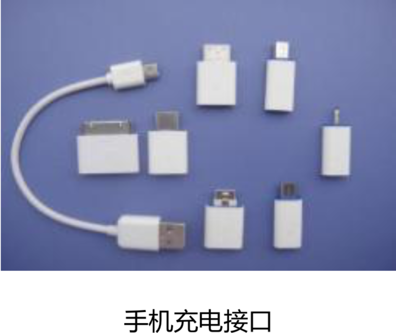
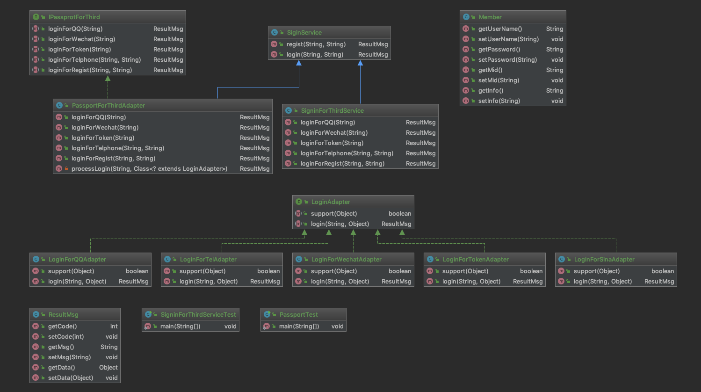

# 适配器模式

## 适配器模式的应用场景

​	适配器模式（Adapter Pattern）是指将一个类的接口转换成客户端期望的另一个接口，使原本的接口不兼容的类可以一起工作，属于结构性设计模式。

适配器适用于以下几种业务场景：

1. 已经存在的类，它的方法和需求不匹配（方法结果相同或相似）的情况。
2. 适配器模式不是软件设计阶段考虑的设计模式，是随着软件的维护，由于不同产品、不同厂家造成功能类似而接口不相同情况下的解决方案。有点亡羊补牢的感觉。

生活中也有应用场景，例如：电源转换头、手机充电转换头、显示器转接头。




两脚插转三角插 手机充电接口 显示器转接头在中国民用电都是 220V 交流电，但我们手机使用的锂电池使用的 5V 直流电。因此，我 们给手机充电时就需要使用电源适配器来进行转换。下面我们有代码来还原这个生活场 景，创建 AC220 类，表示 220V 交流电:

```java
package com.wenbin.design.pattern.adapter;

public class AC220 {
    public int outputAC220V() {
        int output = 220;
        System.out.println("输出交流电：" + output + "V");
        return output;
    }
}
```

创建 DC5 接口，表示 5V 直流电的标准:

```java
package com.wenbin.design.pattern.adapter;

public interface DC5 {
    int outpuDC5V();
}
```

创建电源适配器 PowerAdapter 类:

```java
package com.wenbin.design.pattern.adapter;

public class PowerAdapter implements DC5 {
    private AC220 ac220;

    public PowerAdapter(AC220 ac220) {
        this.ac220 = ac220;
    }

    @Override
    public int outpuDC5V() {
        int adapterInput = ac220.outputAC220V();
        // 变压转换
        int adapterOutput = adapterInput / 44;
        System.out.println("使用PowerAdapter输入AC：" + adapterInput + "V,输出DC:" + adapterOutput + "V");
        return adapterOutput;
    }
}
```

测试代码：

```java
package com.wenbin.design.pattern.adapter;

public class PowerAdapterTest {
    public static void main(String[] args) {
        DC5 dc5 = new PowerAdapter(new AC220());

        dc5.outpuDC5V();
    }
}
```

上面的案例中，通过增加 PowerAdapter 电源适配器，实现了二者的兼容。

## 重构第三方登录自由适配的业务场景

​	我们很早以前开发的老系统应该都有登录接口，但是随着业务的发展和社会的进步，单纯的依赖用户名密码登录显然不能满足用户需求了。现在，我们大部分系统都已经支持多种登录方式，如QQ登录、微信登录、手机登录、微博登录等等，同时保留用户名密码登录方式。虽然登录形式丰富了，但是登录后的处理逻辑可以不必改，同样是将登录状态保存到Session,遵循开闭原则。首先创建统一的返回结果ResultMsg类：

```java
package com.wenbin.design.pattern.adapter.login;

public class ResultMsg {
    private int code;
    private String msg;
    private Object data;

    public ResultMsg(int code, String msg, Object data) {
        this.code = code;
        this.msg = msg;
        this.data = data;
    }

    public int getCode() {
        return code;
    }

    public void setCode(int code) {
        this.code = code;
    }

    public String getMsg() {
        return msg;
    }

    public void setMsg(String msg) {
        this.msg = msg;
    }

    public Object getData() {
        return data;
    }

    public void setData(Object data) {
        this.data = data;
    }
}
```

假设老系统的登录逻辑 SiginService:

```java
package com.wenbin.design.pattern.adapter.login;

public class SiginService {
    public ResultMsg regist(String userName, String password) {
        return new ResultMsg(200, "注册成功", new Member());
    }

    public ResultMsg login(String userName, String password) {
        return null;
    }
}
```

为了遵循开闭原则，老系统的代码我们不会去修改。那么下面开启代码重构之路，先创建 Member 类:

```java
package com.wenbin.design.pattern.adapter.login;

public class Member {
    private String userName;
    private String password;
    private String mid;
    private String info;

    public String getUserName() {
        return userName;
    }

    public void setUserName(String userName) {
        this.userName = userName;
    }

    public String getPassword() {
        return password;
    }

    public void setPassword(String password) {
        this.password = password;
    }

    public String getMid() {
        return mid;
    }

    public void setMid(String mid) {
        this.mid = mid;
    }

    public String getInfo() {
        return info;
    }

    public void setInfo(String info) {
        this.info = info;
    }
}
```

创建一个新的类继承原来的逻辑，运行非常稳定的代码我们不去改动:

```java
package com.wenbin.design.pattern.adapter.login;

/**
 * 稳定的方法不去动，直接继承下来
 */
public class SigninForThirdService extends SiginService {
    public ResultMsg loginForQQ(String openId) {
        // 1,openId是全局唯一，我们可以把它当做是一个用户名（加长）
        // 2,密码默认为QQ_EMPTY
        // 3,注册（在原有系统里面创建一个用户）
        // 4,调用原来的登录方法
        return loginForRegist(openId, null);
    }

    public ResultMsg loginForWechat(String openId){
        return null;
    }

    public ResultMsg loginForToken(String token) {
        //通过token拿到用户信息，然后在重新登录了一次
        return null;
    }

    public ResultMsg loginForTelphone(String telphone, String code) {
        return null;
    }

    public ResultMsg loginForRegist(String userName, String password) {
        super.regist(userName, null);
        return super.login(userName, null);
    }

}
```

测试代码:

```java
package com.wenbin.design.pattern.adapter.login;

public class SigninForThirdServiceTest {
    public static void main(String[] args) {
        SigninForThirdService service = new SigninForThirdService();

        // 不改变原来的代码，也要能够兼容新的需求 
        // 还可以再加一层策略模式
        service.loginForQQ("Asdfasdf");
    }
}
```

通过这么一个简单的适配，完成了代码兼容。

当然，我们代码还可以更加优雅，根据不同的登录方式，创建不同的 Adapter。首先，创建 LoginAdapter 接口:

```java
package com.wenbin.design.pattern.adapter.login.adapter;

import com.wenbin.design.pattern.adapter.login.ResultMsg;

public interface LoginAdapter {
    boolean support(Object adapter);

    ResultMsg login(String id, Object adapter);
}
```

分别实现不同的登录适配，QQ 登录 LoginForQQAdapter:

```java
package com.wenbin.design.pattern.adapter.login.adapter;

import com.wenbin.design.pattern.adapter.login.ResultMsg;

public class LoginForQQAdapter implements LoginAdapter {
    @Override
    public boolean support(Object adapter) {
        return adapter instanceof LoginForQQAdapter;
    }

    @Override
    public ResultMsg login(String id, Object adapter) {
        System.out.println(this);
        return null;
    }
}
```

新浪微博登录 LoginForSinaAdapter:

```java
package com.wenbin.design.pattern.adapter.login.adapter;

import com.wenbin.design.pattern.adapter.login.ResultMsg;

public class LoginForSinaAdapter implements LoginAdapter {
    @Override
    public boolean support(Object adapter) {
        return adapter instanceof LoginForSinaAdapter;
    }

    @Override
    public ResultMsg login(String id, Object adapter) {
        System.out.println(this);
        return null;
    }
}
```

手机号登录 LoginForTelAdapter:

```java
package com.wenbin.design.pattern.adapter.login.adapter;

import com.wenbin.design.pattern.adapter.login.ResultMsg;

public class LoginForTelAdapter implements LoginAdapter {
    @Override
    public boolean support(Object adapter) {
        return adapter instanceof LoginForTelAdapter;
    }

    @Override
    public ResultMsg login(String id, Object adapter) {
        System.out.println(this);
        return null;
    }
}
```

Token 自动登录 LoginForTokenAdapter:

```java
package com.wenbin.design.pattern.adapter.login.adapter;

import com.wenbin.design.pattern.adapter.login.ResultMsg;

public class LoginForTokenAdapter implements LoginAdapter {
    @Override
    public boolean support(Object adapter) {
        return adapter instanceof LoginForTokenAdapter;
    }

    @Override
    public ResultMsg login(String id, Object adapter) {
        System.out.println(this);
        return null;
    }
}
```

微信登录 LoginForWechatAdapter:

```java
package com.wenbin.design.pattern.adapter.login.adapter;

import com.wenbin.design.pattern.adapter.login.ResultMsg;

public class LoginForWechatAdapter implements LoginAdapter {
    @Override
    public boolean support(Object adapter) {
        return adapter instanceof LoginForWechatAdapter;
    }

    @Override
    public ResultMsg login(String id, Object adapter) {
        System.out.println(this);
        return null;
    }
}
```

然后，创建第三方登录兼容接口 IPassportForThird:

```java
package com.wenbin.design.pattern.adapter.login.adapter;

import com.wenbin.design.pattern.adapter.login.ResultMsg;

public interface IPassprotForThird {

    /**
     * QQ登录
     * @param id
     * @return
     */
    ResultMsg loginForQQ(String id);

    /**
     * 微信登录
     * @param id
     * @return
     */
    ResultMsg loginForWechat(String id);

    /**
     * token登录
     *
     * @param token
     * @return
     */
    ResultMsg loginForToken(String token);

    /**
     * 电话登录
     * @param telphone
     * @param code
     * @return
     */
    ResultMsg loginForTelphone(String telphone, String code);

    /**
     * 注册后登录
     * @param username
     * @param passport
     * @return
     */
    ResultMsg loginForRegist(String username, String passport);
}
```

实现兼容 PassportForThirdAdapter:

```java
package com.wenbin.design.pattern.adapter.login.adapter;

import com.wenbin.design.pattern.adapter.login.ResultMsg;
import com.wenbin.design.pattern.adapter.login.SiginService;

public class PassportForThirdAdapter extends SiginService implements IPassprotForThird {

    @Override
    public ResultMsg loginForQQ(String id) {
        return processLogin(id, LoginForQQAdapter.class);
    }

    @Override
    public ResultMsg loginForWechat(String id) {
        return processLogin(id, LoginForWechatAdapter.class);
    }

    @Override
    public ResultMsg loginForToken(String token) {
        return processLogin(token, LoginForTokenAdapter.class);
    }

    @Override
    public ResultMsg loginForTelphone(String telphone, String code) {
        return processLogin(telphone, LoginForTelAdapter.class);
    }

    @Override
    public ResultMsg loginForRegist(String username, String passport) {
        super.regist(username, null);

        return super.login(username, null);
    }

    private ResultMsg processLogin(String key, Class<? extends LoginAdapter> clazz) {
        try {
            LoginAdapter adapter = clazz.newInstance();
            if (adapter.support(adapter)) {
                return adapter.login(key, adapter);
            } else {
                return null;
            }
        } catch (Exception e) {
            e.printStackTrace();
        }

        return null;
    }
}
```

客户端测试代码:

```java
package com.wenbin.design.pattern.adapter.login.adapter;

public class PassportTest {
    public static void main(String[] args) {
        IPassprotForThird passprotForThird = new PassportForThirdAdapter();
        passprotForThird.loginForQQ("");
        passprotForThird.loginForToken("");
        passprotForThird.loginForTelphone("11", "cvc");
    }
}
```

最后，来看一下类图:



至此，我们在遵循开闭原则的前提下，完整的实现了一个兼容多平台登录的业务场景。当然，目前的这个设计也并不完美，仅供参考。目前看来适配器模式跟策略模式好像区别不大。适配器模式主要解决的是功能兼容问题，单场景适配大家可能不会和策略模式有对比。但多场景适配就很容易混淆了。 在上面的代码里每个适配器都加上了一个support()方法，用来判断是否兼容，support()方法的参数也是Object的，而suport()来自于接口。适配器的实现逻辑并不依赖于接口，完全可以将LoginAdapter接口去掉。而加上接口，只是为了代码规范。上面代码可以说是策略模式、简单工厂、和适配器模式的综合运用。

## 适配器模式的优缺点

优点：

1. 能提高类的透明性和复用性，现有的类复用但不需要改变。
2. 目标类和适配器来解耦，提高程序的扩展性。
3. 在很多业务场景中符合开闭原则。

缺点：

1. 适配器编写过程需要全面考虑，可能会增加系统复杂性。
2. 增加代码阅读难度，降低代码可读性，过多使用适配器会使系统代码变得凌乱。